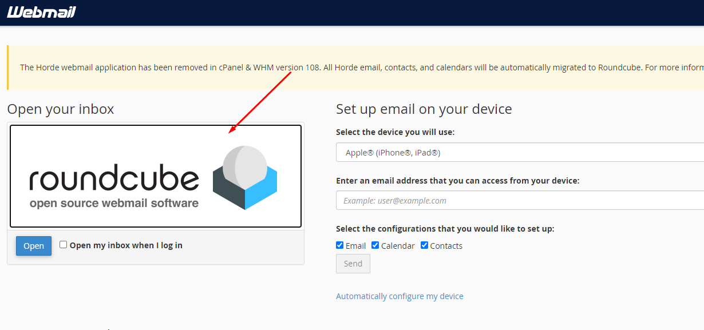
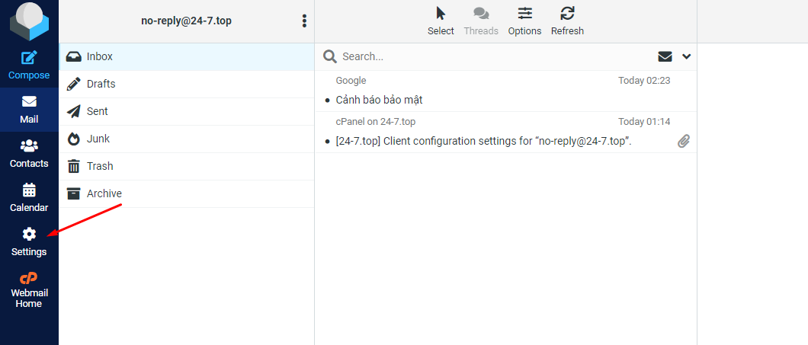
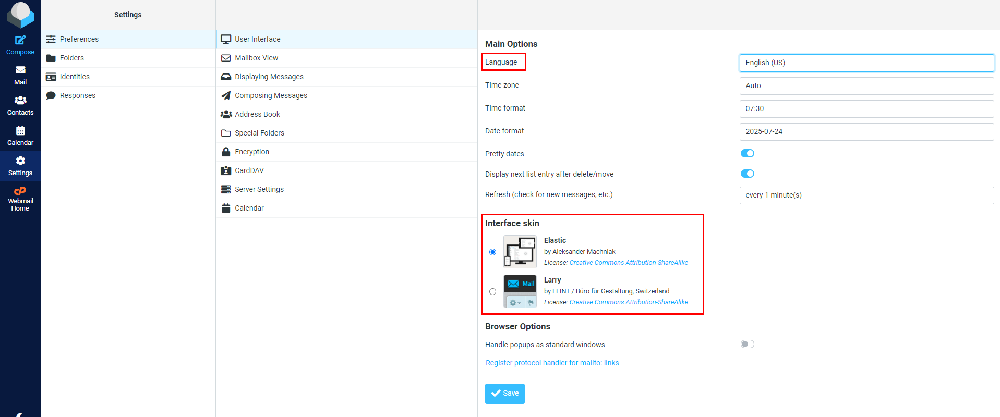
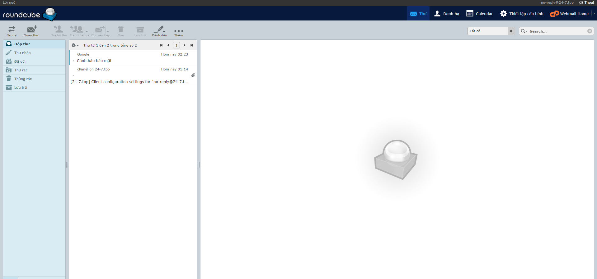
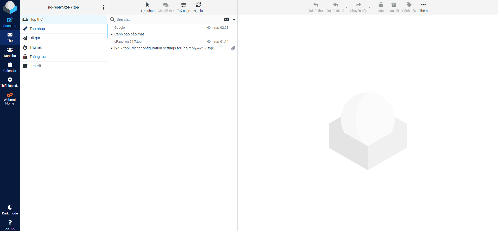

# Hướng dẫn đổi giao diện webmail và chỉnh ngôn ngữ sang tiếng Việt

Bài viết này sẽ giới thiệu về **Hướng dẫn đổi giao diện webmail và chỉnh ngôn ngữ sang tiếng Việt** và lợi ích của nó. Nếu bạn cần hỗ trợ, xin vui lòng liên hệ VinaHost qua **Hotline 1900 6046 ext. 3**, email về [support@vinahost.vn](mailto:support@vinahost.vn) hoặc chat với VinaHost qua livechat <https://livechat.vinahost.vn/chat.php>

Truy cập webmail và chọn **Settings**

 

 

Lựa chọn ngôn ngữ ở **Language** và giao diện ở phần **Interface skin** sau đó nhấn **Save**

 

Thành quả

 

Nếu không thích giao diện trên, có thể đổi về mặc định bằng các thao tác lại như ban đầu (**Interface skin**)

 

**Chúc bạn thực hiện thành công!**

> **THAM KHẢO CÁC DỊCH VỤ TẠI [VINAHOST](https://vinahost.vn/)**
>
> **>>** **[SERVER](https://vinahost.vn/thue-may-chu-rieng/)** **–** **[COLOCATION](https://vinahost.vn/colocation.html)** – **[CDN](https://vinahost.vn/dich-vu-cdn-chuyen-nghiep)**
>
> **>> [CLOUD](https://vinahost.vn/cloud-server-gia-re/) – [VPS](https://vinahost.vn/vps-ssd-chuyen-nghiep/)**
>
> **>> [HOSTING](https://vinahost.vn/wordpress-hosting)**
>
> **>> [EMAIL](https://vinahost.vn/email-hosting)**
>
> **>> [WEBSITE](http://vinawebsite.vn/)**
>
> **>> [TÊN MIỀN](https://vinahost.vn/ten-mien-gia-re/)**

\