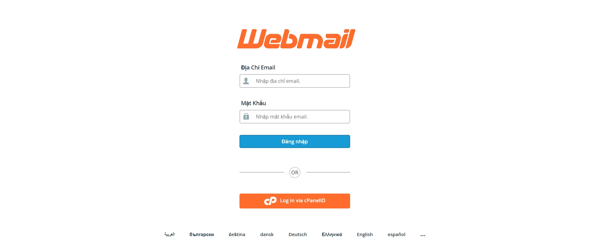
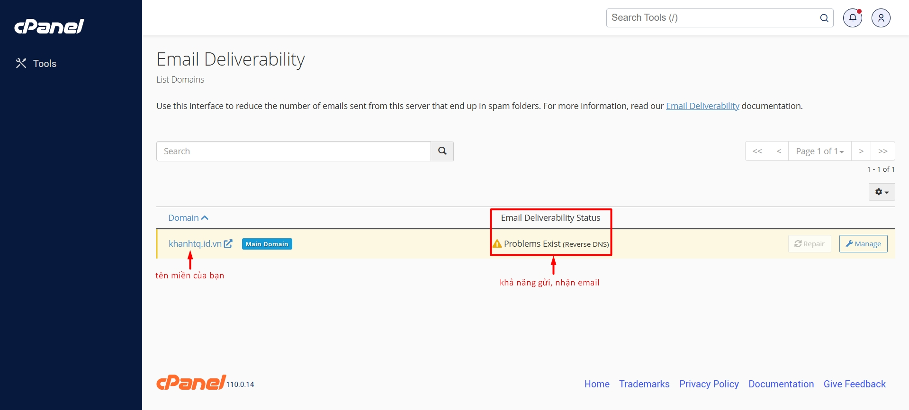
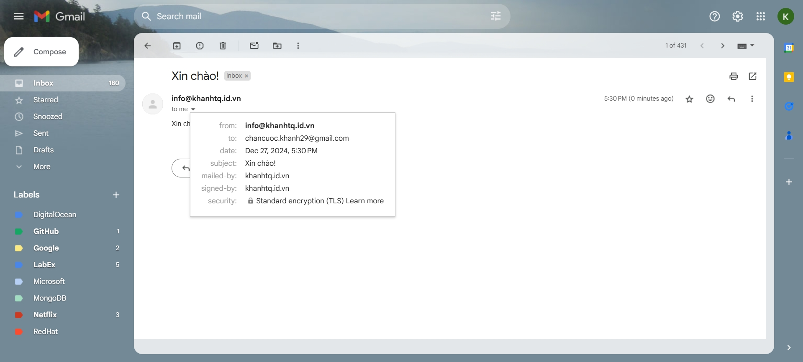
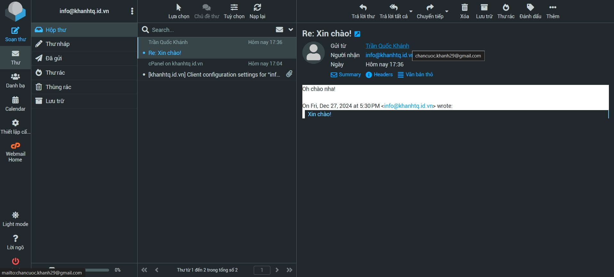

> Bài viết này sẽ hướng dẫn bạn cách **gỡ lỗi không gửi/nhận được email** khi sử dụng dịch vụ Email Hosting. Nếu bạn cần hỗ trợ, xin vui lòng:
>
> - Liên hệ qua **hotline 1900 6046 ext. 3**
> - Gửi email về địa chỉ [**support@vinahost.vn**](mailto:support@vinahost.vn)
> - Hoặc chat trực tiếp với chúng tôi tại [**đây**](https://livechat.vinahost.vn/chat.php)

**Trước khi vào nội dung chính, mong bạn lưu ý rằng:**

- Nếu không thể đăng nhập WebMail thành công, bạn cũng không thể cấu hình Outlook được.
- VinaHost chỉ đảm bảo hoạt động của WebMail. Việc gửi và nhận thành công trên WebMail có nghĩa là hệ thống đang hoạt động đúng.
- Outlook hay bất kỳ phần mềm email nào khác đều là phần mềm bên thứ ba. _VinaHost không có trách nhiệm đối với các phần mềm này. Vui lòng chủ động kiểm tra lại cấu hình Outlook theo hướng dẫn tại [đây](https://kb.vinahost.vn/Email/huong-dan-cau-hinh-email-tren-outlook/)._

## 1. Bạn đang gửi/nhận email bằng công cụ gì?

Nếu đang sử dụng **Outlook** (hoặc các phần mềm bên thứ ba tương tự Outlook), vui lòng đọc tiếp **[mục 2](#2-kiem-tra-ang-nhap)**.

Nếu đã **đăng nhập WebMail thành công**, vui lòng chuyển thẳng đến **[mục 3](#3-kiem-tra-kha-nang-gui-nhan)**.

## 2. Kiểm tra đăng nhập

**Đăng nhập thành công là điều kiện tiên quyết để có thể gửi và nhận email.** 
Vui lòng kiểm tra lần lượt theo các bước dưới đây.

### 2.1. Địa chỉ IP đang bị chặn?

Bạn cần chắc chắn rằng địa chỉ IP mà bạn/công ty đang sử dụng không bị chặn bởi hệ thống. Cách đơn giản nhất là **truy cập WebMail** của bạn trên trình duyệt.

_**Tại sao địa chỉ IP của bạn lại bị chặn?** 
Hệ thống mặc định chặn các địa chỉ IP có hành vi liên tục truy cập thất bại để tăng cường bảo mật. Cấu hình Outlook chưa chính xác cũng là một nguyên nhân. 
Mặt khác, phần lớn địa chỉ IP được cấp cho các hộ gia đình, công ty, v.v sẽ được thay đổi sau một khoảng thời gian nhất định. Có khả năng địa chỉ IP được cấp cho bạn đã bị chặn trước đó._

Cụ thể, địa chỉ email của tôi là info@khanhtq.id.vn, nên liên kết dẫn đến **WebMail** của tôi là https://mail.khanhtq.id.vn:2096/ theo mặc định.

Nếu truy cập liên kết trên không hiển thị trang đăng nhập WebMail như ảnh dưới đây, địa chỉ IP đã bị chặn.

**Vui lòng truy cập https://ip.vinahost.vn/ và gửi lại địa chỉ IP cho phòng Kỹ thuật tại [support@vinahost.vn](mailto:support@vinahost.vn).**

### 2.2. Mật khẩu đã chính xác?

Nếu địa chỉ IP của bạn không bị chặn, bạn có thể truy cập trang đăng nhập WebMail. Tuy nhiên, khi đăng nhập bạn gặp lỗi "The login is invalid" hoặc "Đăng nhập không hợp lệ", vui lòng kiểm tra lại **Địa chỉ Email** và **Mật khẩu**.

Để thay đổi mật khẩu cho các địa chỉ email, vui lòng **đăng nhập cPanel** và thực hiện theo hướng dẫn tại [**đây**](https://kb.vinahost.vn/Email/huong-dan-nhan-thong-tin-dang-nhap-cpanel-va-tao-tai-khoan-email-tai-vinahost/#huong-dan-tao-xoa-sua-thong-tin-tren-tai-khoan-email).

Cụ thể, địa chỉ email của tôi là info@khanhtq.id.vn, nên liên kết dẫn đến **cPanel** của tôi là https://mail.khanhtq.id.vn:2083/ theo mặc định.
 
_**Lưu ý:** Tên đăng nhập KHÔNG có dạng địa chỉ email!_

## 3. Kiểm tra khả năng gửi, nhận

Qua các bước trên, bạn đã đăng nhập WebMail thành công. 
Bạn gần như đã sẵn sàng để gửi/nhận email rồi! 🎉

Truy cập cPanel và kiểm tra khả năng gửi nhận như sau:

- Nhập cụm từ "email deli" vào ô tìm kiếm
- Chọn **Email Deliverability** 
- Đảm bảo tại phần **Email Deliverability Status** chỉ có duy nhất một vấn đề tồn tại: 
  _**Problems Exist (Reverse DNS)** - Điều này có nghĩa là tên miền của bạn chưa có bản ghi Reverse DNS cho email hosting. Tuy nhiên, xin đừng bận tâm vì nó không ảnh hưởng đến việc gửi, nhận email trong hosting của bạn._

Trong trường hợp có các vấn đề khác cùng tồn tại: 
_**Problems Exist (SPF, DKIM, Reverse DNS)** - SPF và DKIM là hai bản ghi bắt buộc cần có để gửi, nhận email. Vui lòng tạo/chỉnh sửa bản ghi SPF và DKIM theo hướng dẫn tại [đây](https://blog.vinahost.vn/cai-dat-record-dkim-va-spf/). Việc cập nhật bản ghi có thể mất từ vài phút đến vài tiếng, vui lòng kiên nhẫn._

Xin chúc mừng. Bạn đã có thể gửi, nhận email sau tất cả các bước trên! 🥳 
Hãy thử gửi và nhận email:

- Gửi email đến Gmail cá nhân của bạn 
  
- Nhận email từ Gmail cá nhân của bạn 
  

Chúc bạn thực hiện **gỡ lỗi không gửi/nhận được email** thành công! 🍻

> **THAM KHẢO CÁC DỊCH VỤ TẠI [VINAHOST](https://vinahost.vn/)**   **\>>** [**SERVER**](https://vinahost.vn/thue-may-chu-rieng/) **–** [**COLOCATION**](https://vinahost.vn/colocation.html) **–** [**CDN**](https://vinahost.vn/dich-vu-cdn-chuyen-nghiep)   **\>> [CLOUD](https://vinahost.vn/cloud-server-gia-re/) – [VPS](https://vinahost.vn/vps-ssd-chuyen-nghiep/)**  **\>> [HOSTING](https://vinahost.vn/wordpress-hosting)**   **\>> [EMAIL](https://vinahost.vn/email-hosting)**   **\>> [WEBSITE](http://vinawebsite.vn/)**   **\>> [TÊN MIỀN](https://vinahost.vn/ten-mien-gia-re/)**
