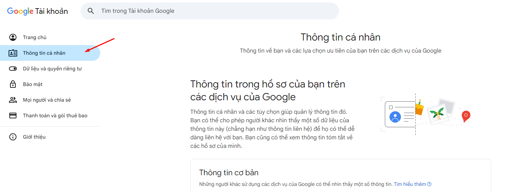
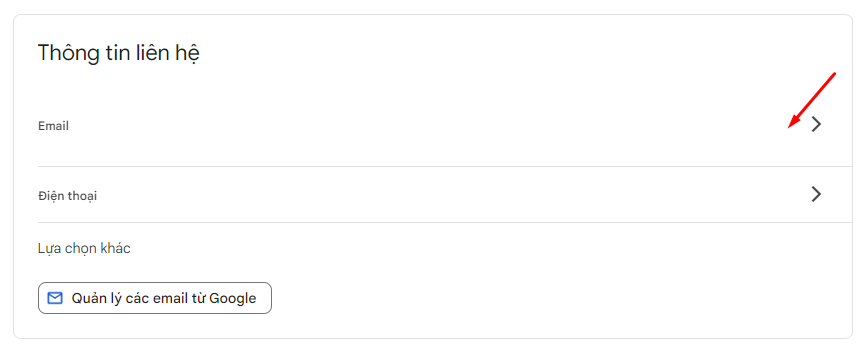
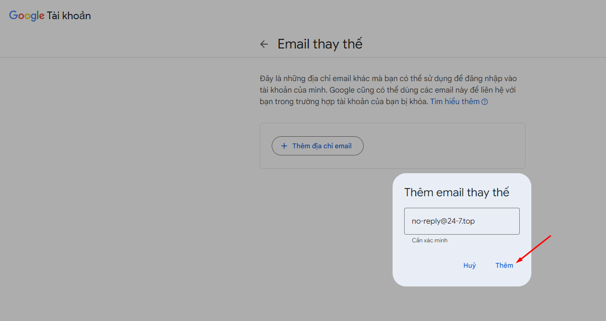
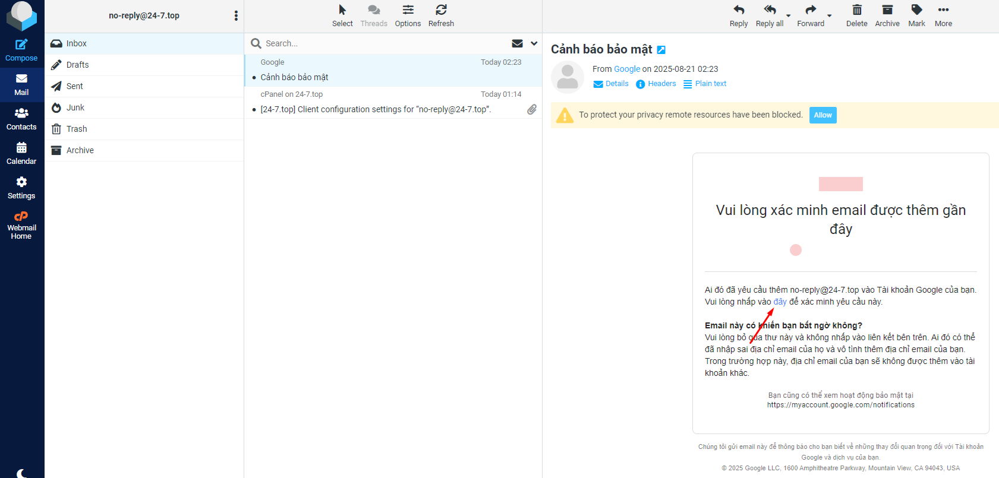
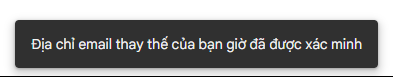
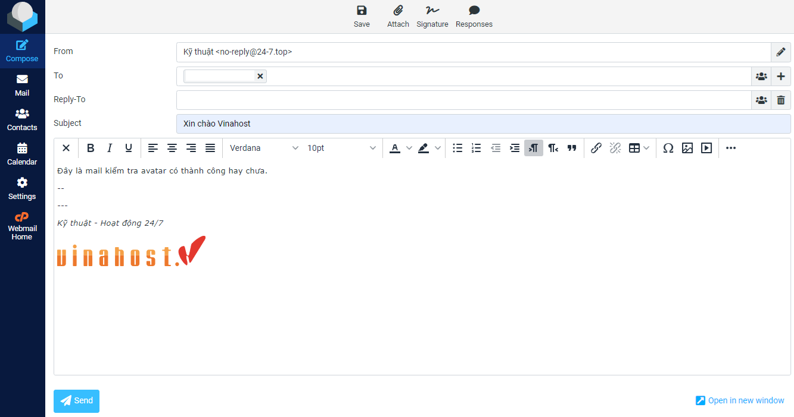
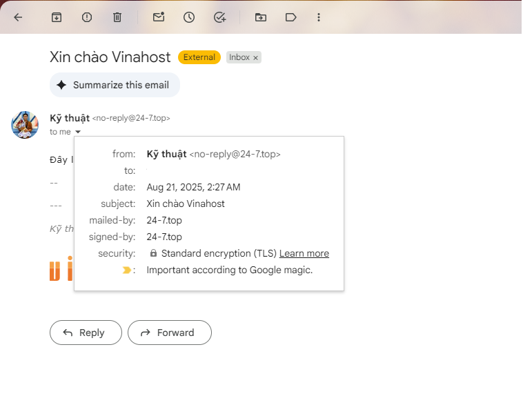

# Hướng dẫn tạo Avatar cho email

Bài viết này sẽ giới thiệu về **Hướng dẫn tạo Avatar cho email** và lợi ích của nó. Nếu bạn cần hỗ trợ, xin vui lòng liên hệ VinaHost qua **Hotline 1900 6046 ext. 3**, email về [support@vinahost.vn](mailto:support@vinahost.vn) hoặc chat với VinaHost qua livechat <https://livechat.vinahost.vn/chat.php>

Chuẩn bị: 1 tài khoản gmail có sẵn avatar

Truy cập <https://myaccount.google.com/> bằng tài khoản gmail và vào phần **Thông tin cá nhân**

 

Tìm phần **Thông tin liên hệ** và nhấn vào **Email**

 

Ở phần **Email thay thế** chọn **Thêm email thay thế** và nhập email domain

 

Lúc này, Google sẽ gửi về email cần gắn avatar 1 email xác minh. Nhấn vào đường link để xác nhận

 

Thông báo hoàn tất từ google

 

Quay về email trên cpanel để gửi mail

 

Thành quả

 

**Chúc bạn thực hiện thành công!**

> **THAM KHẢO CÁC DỊCH VỤ TẠI [VINAHOST](https://vinahost.vn/)**
>
> **>>** **[SERVER](https://vinahost.vn/thue-may-chu-rieng/)** **–** **[COLOCATION](https://vinahost.vn/colocation.html)** – **[CDN](https://vinahost.vn/dich-vu-cdn-chuyen-nghiep)**
>
> **>> [CLOUD](https://vinahost.vn/cloud-server-gia-re/) – [VPS](https://vinahost.vn/vps-ssd-chuyen-nghiep/)**
>
> **>> [HOSTING](https://vinahost.vn/wordpress-hosting)**
>
> **>> [EMAIL](https://vinahost.vn/email-hosting)**
>
> **>> [WEBSITE](http://vinawebsite.vn/)**
>
> **>> [TÊN MIỀN](https://vinahost.vn/ten-mien-gia-re/)**

\