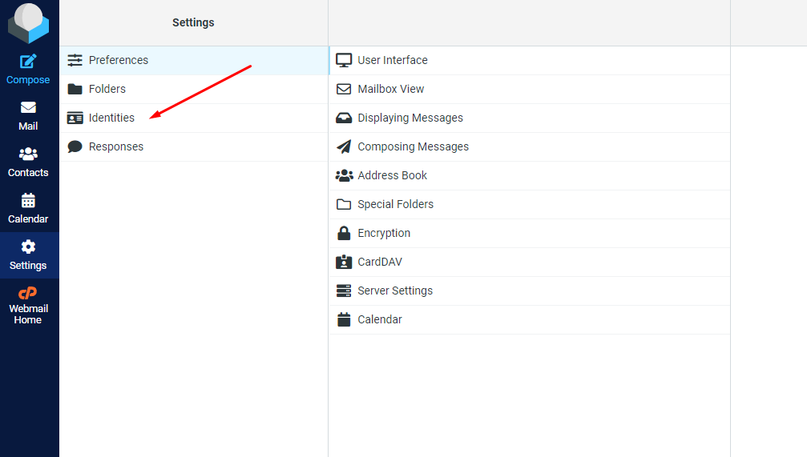
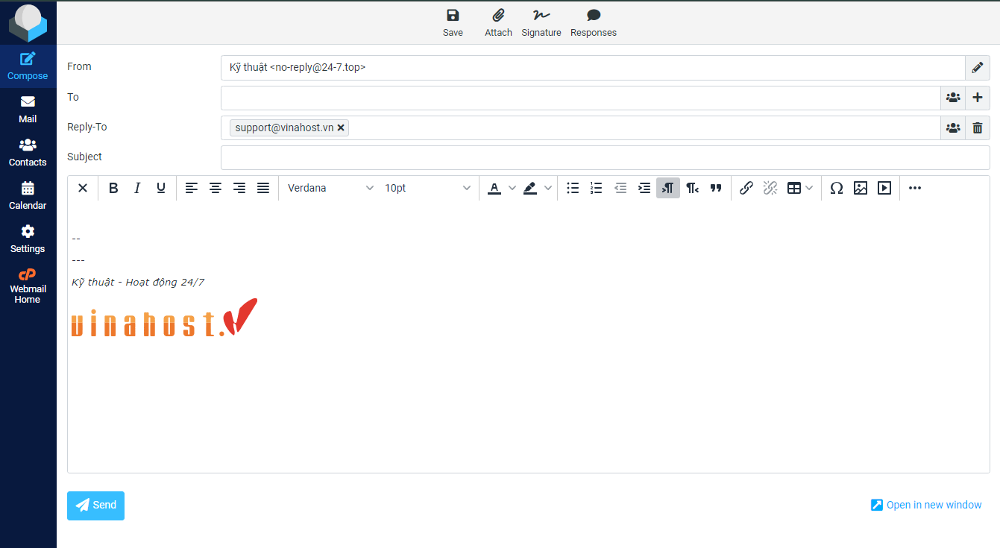

# Hướng dẫn tạo chữ ký email có chèn logo công ty

Bài viết này sẽ giới thiệu về **Hướng dẫn tạo chữ ký email có chèn logo công ty** và lợi ích của nó. Nếu bạn cần hỗ trợ, xin vui lòng liên hệ VinaHost qua **Hotline 1900 6046 ext. 3**, email về [support@vinahost.vn](mailto:support@vinahost.vn) hoặc chat với VinaHost qua livechat <https://livechat.vinahost.vn/chat.php>

Đầu tiên, truy cập webmail dạng *mail.domain:2096*

 

Vào phần **Settings**

 

Vào phần **Identities**

 

Tại đây có thể tạo mới hoặc chỉnh sửa có sẵn

 

Điền cách thông tin liên quan nếu cần thiết (mục tùy chọn là có thể bỏ trống)

 

* **Display Name**: Tên hiển thị, dùng để quản lý giữa nhiều chữ ký
* **Email**: Để mặc định
* **Organization**: Tên tổ chức (tùy chọn)
* **Reply-To**: Điền email sẵn sàng để phản hồi (CC)
* **Bcc**: Tương tự như trên nhưng là BCC
* **Set default**: Đặt chữ ký này làm mặc định

Tích vào biểu tượng bức ảnh để format chữ ký và thêm ảnh

 

Đối với logo công ty trong chữ ký, có nhiều cách bao gồm kéo thả ảnh trực tiếp vào khung, upload từ máy hoặc copy ảnh, lấy từ URL

 

Phần **Source** có thể điền URL (link) của logo hoặc upload từ mày thông qua biểu tượng này

 

Tại đây, ta có thể kéo thả ảnh từ máy vào khung này hoặc chọn **Add image** để upload

 

Thành quả

 

 

**Chúc bạn thực hiện thành công!**

> **THAM KHẢO CÁC DỊCH VỤ TẠI [VINAHOST](https://vinahost.vn/)**
>
> **>>** **[SERVER](https://vinahost.vn/thue-may-chu-rieng/)** **–** **[COLOCATION](https://vinahost.vn/colocation.html)** – **[CDN](https://vinahost.vn/dich-vu-cdn-chuyen-nghiep)**
>
> **>> [CLOUD](https://vinahost.vn/cloud-server-gia-re/) – [VPS](https://vinahost.vn/vps-ssd-chuyen-nghiep/)**
>
> **>> [HOSTING](https://vinahost.vn/wordpress-hosting)**
>
> **>> [EMAIL](https://vinahost.vn/email-hosting)**
>
> **>> [WEBSITE](http://vinawebsite.vn/)**
>
> **>> [TÊN MIỀN](https://vinahost.vn/ten-mien-gia-re/)**

\

\