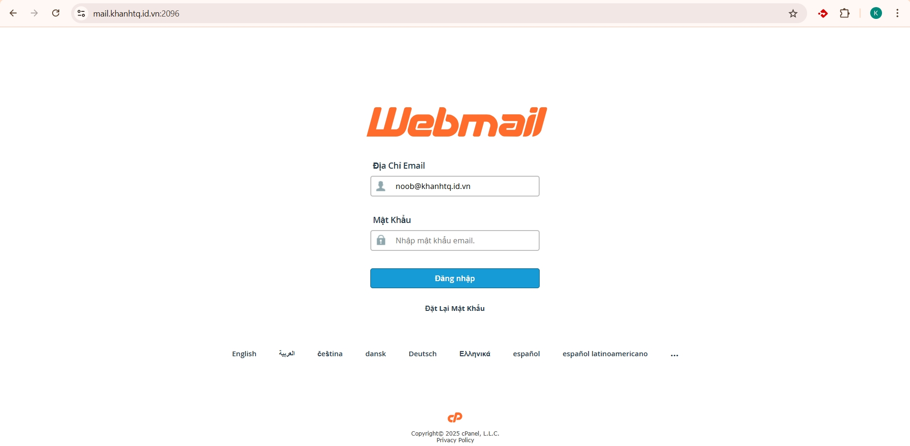
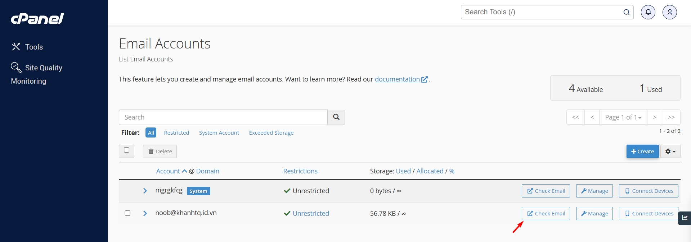
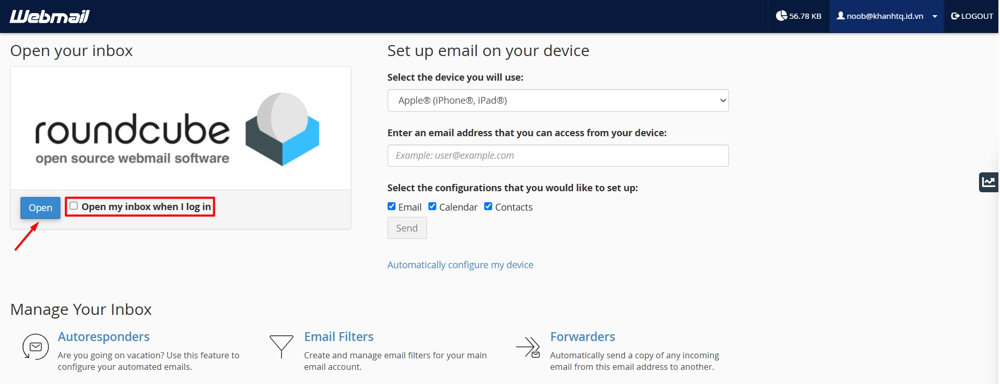
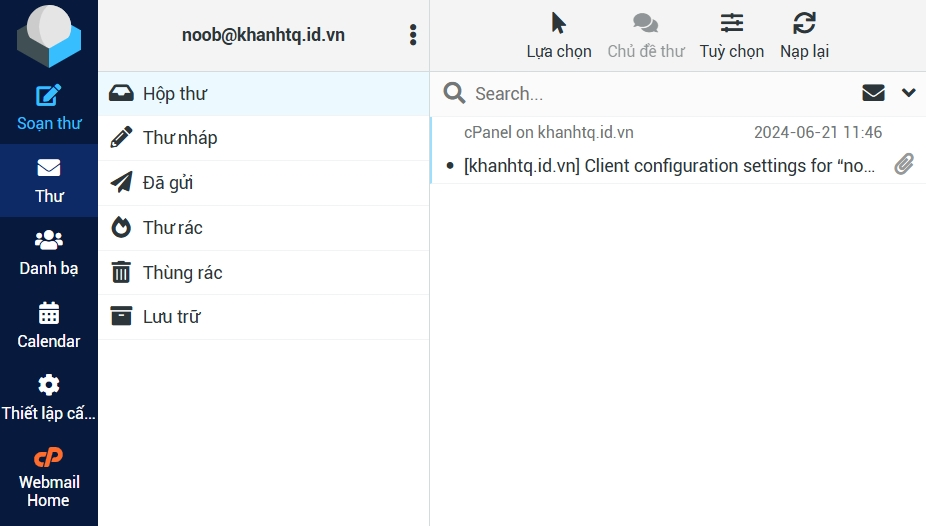
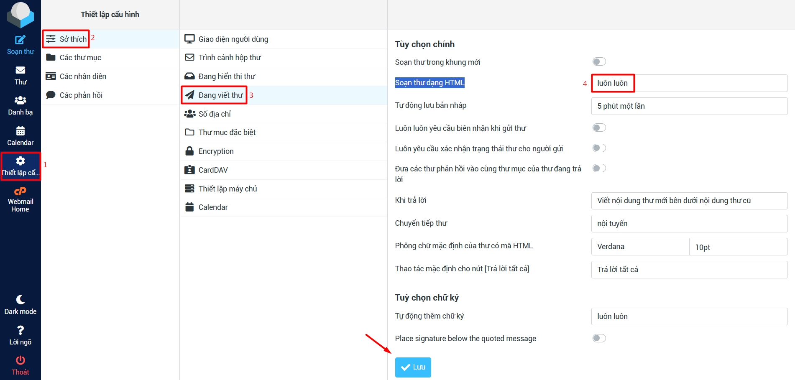
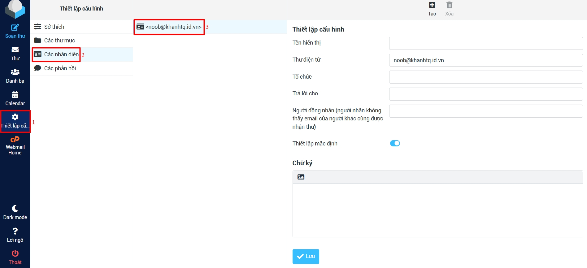
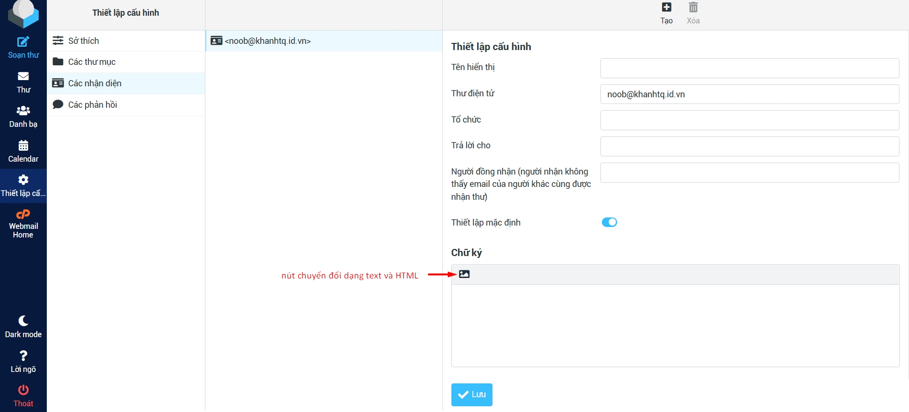
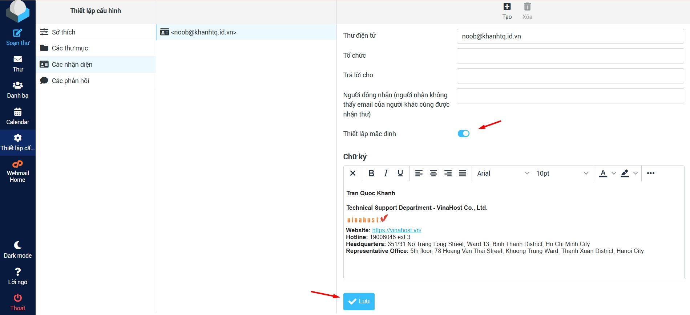
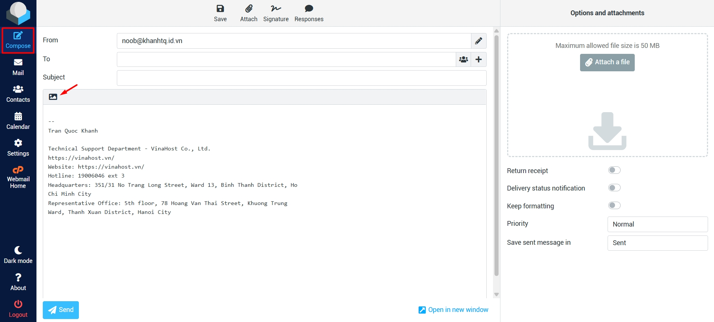
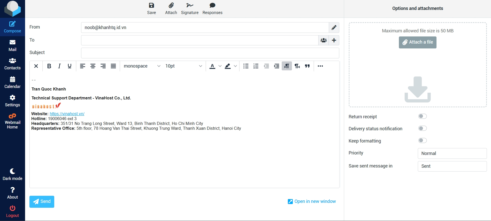

> Bài viết này hướng dẫn các bạn tạo chữ ký trên Webmail cPanel của dịch vụ Email Hosting tại VinaHost. Nếu bạn cần hỗ trợ, xin vui lòng:
>
> - Liên hệ qua **hotline 1900 6046 ext. 3**
> - Gửi email về địa chỉ [**support@vinahost.vn**](mailto:support@vinahost.vn)
> - Hoặc chat trực tiếp với chúng tôi tại [**đây**](https://livechat.vinahost.vn/chat.php)

## 1. Đăng nhập vào webmail

Giả sử tên miền mà bạn sử dụng để đăng ký dịch vụ Email Hosting tại VinaHost là **khanhtq.id.vn**, URL đăng nhập webmail của bạn thường sẽ là **https://mail.khanhtq.id.vn:2096** hoặc **https://webmail.khanhtq.id.vn:2096**.

!!! info "Thông tin"
    Bạn cũng có thể đăng nhập webmail thông qua cPanel bằng cách: **Đăng nhập cPanel** > **Email Accounts** > **Check Email**

    

Chọn **Open** để mở phần giao diện chính của webmail.

!!! tip "Mẹo"
    Bạn cũng có thể tích vào ô ***Open my inbox when I login*** để đăng nhập trực tiếp vào giao diện chính của webmail vào những lần tới, bỏ qua bước chọn **Open**.

## 2. Cài đặt soạn email dưới dạng HTML

Bước này là bắt buộc nếu bạn muốn chữ ký có hình ảnh, màu sắc, v.v. Bỏ qua bước này nếu bạn chỉ cần chữ ký dạng văn bản thuần.

Chọn **Cài đặt (Settings)** > **Sở thích (Preferences)** > **Đang viết thư (Composing Messages)** > đặt giá trị **Soạn thư dạng HTML (Compose HTML messages)** thành "luôn luôn (always)" > **Lưu (Save)**.

## 3. Tạo chữ ký

Chọn lần lượt **Cài đặt (Settings)** > **Các nhận diện (Identities)** > chọn nhận diện mặc định (có tên trùng với tài khoản email của bạn).

Nếu bạn muốn chữ ký có chứa ảnh, màu sắc, đảm bảo rằng bạn đã bấm vào nút chuyển đổi giữa định dạng văn bản và HTML.

Tạo chữ ký mong muốn, tích vào **Thiết lập mặc định (Set default)** để luôn áp dụng chữ ký này cho các email mới rồi nhấn **Lưu (Save)**.

## 4. Thử soạn email mới

Sau các bước trên, bạn đã có thể soạn email mới được tự động áp dụng chữ ký vừa tạo. Đảm bảo rằng trong phần soạn email, bạn đã chọn nút chuyển đổi giữa định dạng văn bản và HTML.

Chúc bạn **bạn tạo chữ ký trên Webmail cPanel** thành công! 🍻

> **THAM KHẢO CÁC DỊCH VỤ TẠI [VINAHOST](https://vinahost.vn/)**   **\>>** [**SERVER**](https://vinahost.vn/thue-may-chu-rieng/) **–** [**COLOCATION**](https://vinahost.vn/colocation.html) **–** [**CDN**](https://vinahost.vn/dich-vu-cdn-chuyen-nghiep)   **\>> [CLOUD](https://vinahost.vn/cloud-server-gia-re/) – [VPS](https://vinahost.vn/vps-ssd-chuyen-nghiep/)**  **\>> [HOSTING](https://vinahost.vn/wordpress-hosting)**   **\>> [EMAIL](https://vinahost.vn/email-hosting)**   **\>> [WEBSITE](http://vinawebsite.vn/)**   **\>> [TÊN MIỀN](https://vinahost.vn/ten-mien-gia-re/)**
