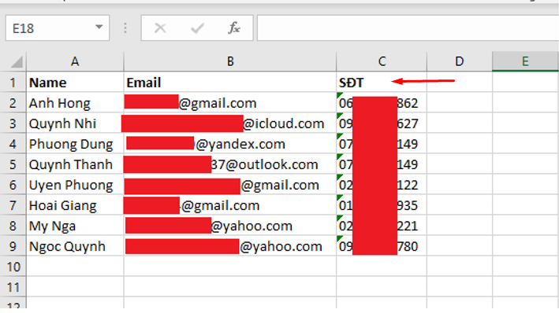

**HƯỚNG DẪN SỬ DỤNG DỊCH VỤ EMAIL MARKING TẠI VINAHOST 2024**

**A. NHẬP, THÊM MỘT DANH SÁCH EMAIL VÀO DỊCH VỤ**

Sau khi đăng nhập vào trang web dịch vụ, Quý khách chọn vào **View all lists**

Tiếp theo, chọn **Add a new list** để tạo 1 danh sách liên hệ email mới

Quý khách nhập vào tên của danh sách email liên hệ mà mình muốn tạo và chọn loại hình thức mail Marketing (có thể thay đổi bằng cấu hình) mà mình mình muốn gửi đến cho khách hàng thuộc danh sách này

**Single Opt-in**: Đây là loại opt-in mà người dùng thể hiện sự đồng ý của họ chỉ 1 lần qua việc đăng ký tại trang web. Sau hành động này, những bản tin sẽ bắt đầu được gửi vào email của họ.

**Double Opt-in**: được hiểu đơn giản là hành động người dùng thực hiện 2 lần đồng thuận. Sau khi đăng ký nhận tin từ doanh nghiệp tại website, người dùng sẽ nhận một email xác thực hoặc một thao tác thể hiện sự đồng thuận thêm một lần nữa. Nếu tiếp tục chấp nhận, người dùng được đưa vào danh sách email Double Opt-in.

Ví dụ:

Sau khi tạo xong danh sách, để thêm liên hệ, Quý khách tích vào **Add subscribers**

**1. Nhập Email tự động bằng file .CSV**

Quý khách nhấn vào **Choose File** để tải lên file danh sách email liên hệ của mình

Chọn file danh sách email liên hệ muốn tải lên

Sau đó chọn **Import**

Sau đó, quý khách vui lòng đợi hệ thống nhập dữ liệu

Kết quả

Quý khách lưu ý: các email không tồn tại (không thể kiểm tra được),email định dạng không chính xác,email đã đánh dấu không nhận mail nữa hoặc email trùng sẽ bị lọc ra, không thêm vào danh sách.

Chọn **export the CSV** để xem những email nào hệ thống không thêm vào được

Các email không được thêm vào sẽ được khai báo nguyên nhân.

**2. Nhập email thủ công**

Quý khách nhập vào tên và địa chỉ email, cách nhau bằng dấu phẩy và xuống dòng cho mỗi 1 liên hệ. Nếu quý khách sử dụng Excel để lập bảng danh sách có thể chọn Save As và chọn định dạng là csv. Sau khi Save xong mở file vừa được save bằng notepad hoặc trình text editor của máy sau đó copy thông tin từ file csv đó vào khung Import.

Sau đó chọn **Add** để lưu dữ liệu

Kết quả nhập dữ liệu thành công

**Cách chuyển đổi các định dạng file excel sang định dạng .CSV**

Quý khách mở file excel của mình, sau đó chọn File để lưu

Chọn **Save As** để đổi sang định dạng khác

Chọn **CSV (Comma delimited)** ở phần **Save as type** và sau đó ấn Save

**Tạo trường tùy chỉnh cho danh sách**

Quý khách chọn vào **Add subscribers**

Nhấn vào **create custom fields first** để tạo trường tùy chỉnh

Sau đó, nhập vào trường mà mình muốn, ví dụ quý khách muốn thêm dữ liệu SĐT của khách hàng

Kết quả

Lúc này, Quý khách có thể thêm trường tùy chỉnh vào file CSV của mình, sau đó **Import** vào danh sách liên hệ email

Quý khách bấm vào tên khách hàng để xem hồ sơ, trường tùy chỉnh đã được thêm thành công

**B. TẠO MỘT CHIẾN DỊCH GỬI MAIL**

**1. Tạo 1 chiến dịch email mới bằng HTML code**

Quý khách chọn vào **Create & send new campaign**

Chọn **Import HTML file** để đưa Template vào chiến dịch

Ở trang kế tiếp, Quý khách nhập vào tiêu đề của email và tên người gửi, các thông số khác để mặc định.

Quý khách có thể lựa chọn các cấu hình cho email hoặc Save và qua bước tiếp theo

- **Attachments:** Đính kèm file.
- **Track opens:** Kiểm tra khách đã đọc thư hay chưa.
- **Track clicks:** Kiểm tra nếu khách nhấn vào link (đường dẫn).
- **Save this email as a template:** Lưu email thành template của bạn để sử dụng sau.
- **Check for broken links:** Kiểm tra nếu có link bị hỏng.

Quý khách có thể chọn xem định dạng mail ở dạng Desktop ( máy tính ) và Mobile ( điện thoại) để xem định dạng mail đã như ý chưa.

Tiếp theo, Quý khách có thể chọn **Test send this newsletter** để kiểm tra nội dụng email ở phía khách hàng. Nếu không cần, chọn vào danh sách liên hệ tạo ở bước I và gửi hàng loạt bằng nút **Send newsletter now!**

Kết quả phía người nhận

**2. Tạo 1 chiến dịch email mới bằng template có sẵn**

Quý khách chọn **Import from Own template** để chọn các mẫu template mà mình muốn sau đó chọn **Import**

Các bước còn lại để gửi mail, Quý khách xem lại mục 1.

**C. LÊN LỊCH GỬI MAIL CHO CHIẾN DỊCH EMAIL MARKETING**

Quý khách chọn vào **Edit** để chỉnh sửa chiến dịch email

Kéo xuống dưới cùng, chọn **Save & next**

Ở dưới nút **Send newsletter now!** , chọn vào **Schedule this campaign** để lên lịch gửi mail

Chọn ngày, tháng năm và thời điểm gửi trong ngày (**am, pm**) cũng như múi giờ. Quý khách chọn **Schedule campaign now** để lưu cài đặt

Kết quả

Như vậy là khi đến thời điểm đã cấu hình, mail sẽ được gửi đến cho toàn bộ khách hàng có trong danh sách của Quý khách

_Chúc quý khách thao tác thành công!_
