!!! info 
	Bài viết này sẽ hướng dẫn bạn **Tạo và chỉnh sửa một template mail marketing cơ bản** trên hệ thống của Vinahost.  
	Nếu bạn cần hỗ trợ, xin vui lòng liên hệ VinaHost qua **Hotline 1900 6046 ext. 3**, email về [support@vinahost.vn](mailto:support@vinahost.vn) hoặc chat với VinaHost qua livechat [https://livechat.vinahost.vn](https://livechat.vinahost.vn).

## Tổng quan

Bài viết hôm nay mình sẽ hướng dẫn các bạn cách sử tạo và chỉnh sửa cơ bản cũng như tải lên một Template email Marketing đã có sẵn lên hệ thống Email Marketing của Vinahost. Đồng thời sẽ nói về một số lưu ý nội dung của Template email Marketing để hạn chế vào Spam. 

## Hướng dẫn tạo, chỉnh sửa một Template Email Marketing mới

#### Bước 1:  Đầu tiền các bạn cần đăng nhập vào hệ thống Email Marketing với thông tin đã được Vinahsot cung cấp

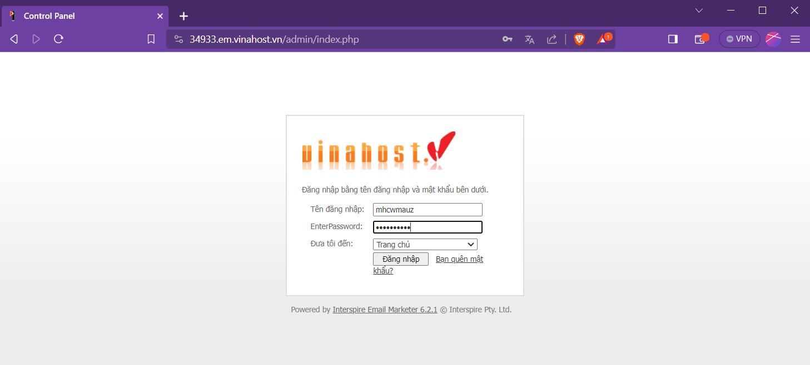

Giao diện trang chủ khi đăng nhập thành công!
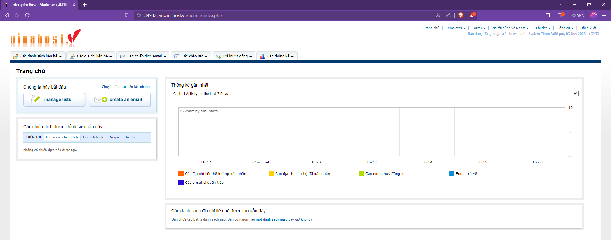
#### Bước 2:  Tạo một chiến dịch Email Marketing mới

Đầu tiên các bạn hãy tích chọn vào ô **`Các chiến dịch mail`** sau đó nhấn **`Xem các chiến dịch email`** để xem tất cả các chiến dịch email hiện có hoặc nhấn **`Tạo một chiến dịch email`** để tạo ngay một chiến dịch email mới.

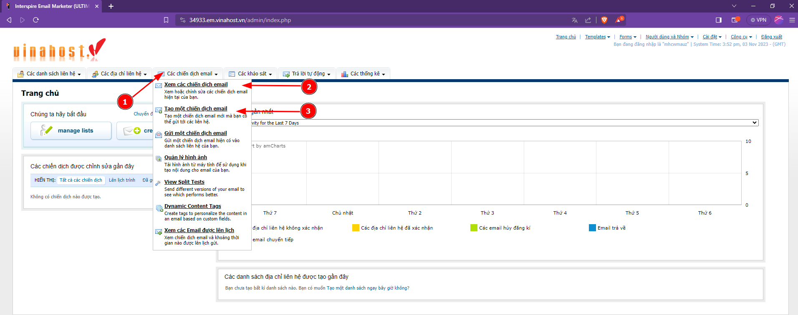

Ở đây mình đã chọn **`Xem các chiến dịch email`** để xem thử xem đã có chiến dịch email nào hay chưa. Có thể thấy mình chưa tạo. Bây giờ nhấn **`Tạo một chiến dịch email`** nhé!

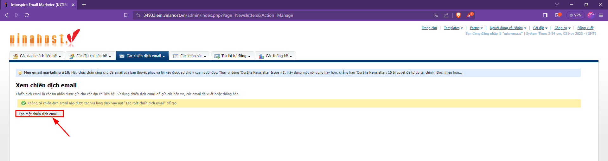

Hệ thống sẽ hiện ra trang bên dưới. Tại đây các bạn thực hiện tương tự như sau:
1. Tên chiến dịch email: Đây là tên dùng để phân biệt các chiến dịch email trên hệ thống.  
2. Định dạng chiến dịch: Để mặc định là HTML và Text.  
3. Email Template: Chọn `Không có Template` để tạo một chiến dịch email trống, hoặc có thể chọn các mẫu Template email có sẵn. Các bạn có thể nhấn vào `Hiển thị bản xem trước lớn hơn` để xem đầy đủ nội dung của Template mẫu.  
4. Cuối cùng hãy nhấn `Kế tiếp` để tiến hành chỉnh sửa/thiết kế Template email  

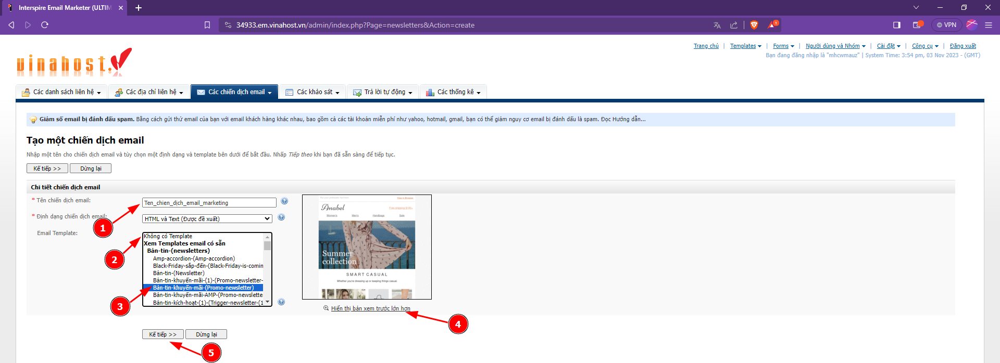

Tại bước này, các bạn hãy đặt tên chủ đề Email. Đây là Tiêu đề hiển thị của email khi gửi cho người khác. Các bạn đặt theo chiến dịch của mình nhé!

Mình chọn Template mẫu có sẵn nên sẽ chọn mục tích chọn đầu tiên.
Có thể thấy khung edit khá nhỏ nên các bạn hãy dùng chuột đặt vào gốc cuối ở dưới bên phải như trong hình và kéo xuống để mở rộng khung chỉnh sửa.

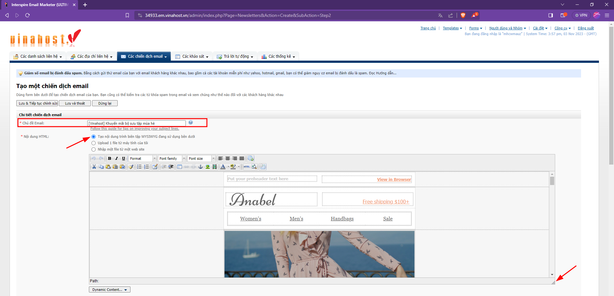

Các bạn hãy chú ý các khung được tạo sẵn trong Template Email như hình bên dưới. Các khung này chỉ thấy khi chỉnh sửa Template. Khi gửi cho người khác sẽ không thấy các khung này.

!!! danger
	Các bạn có thể chỉnh tuỳ ý nội dung nhưng không được xoá mất các khung này.
	Chỉ chỉnh lại nội dung bên trong khung cho phù hợp.  
	Nếu thấy nội dung không phù hợp, thì xoá toàn bộ nội dung trong khung đó thôi nhưng giữ lại khung.

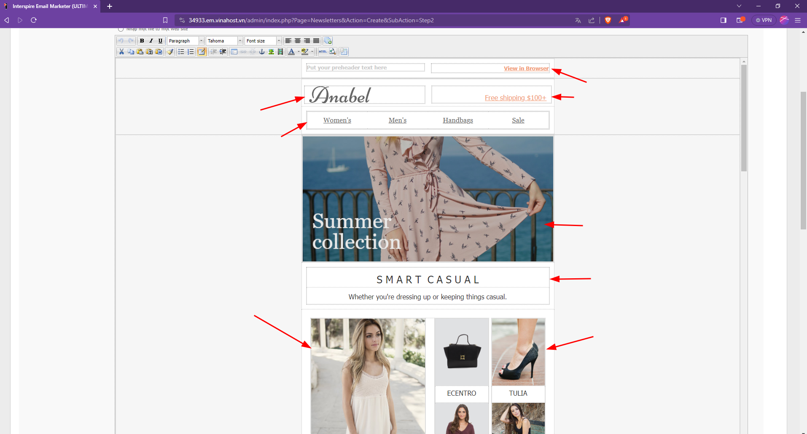

!!! danger
	Vì thực chất Template Email được viết bằng dạng code HTML.  
	Trình chỉnh sử mà chúng ta nhìn thấy thực chất là code HTML nhưng đã được hiển thị dưới dạng xem trước. Nên không thể chỉnh sửa theo cách mà chúng ta chỉnh sửa WORD được

Nếu các bạn có Template Email khác dạng code HTML, có thể dán nó vào đây
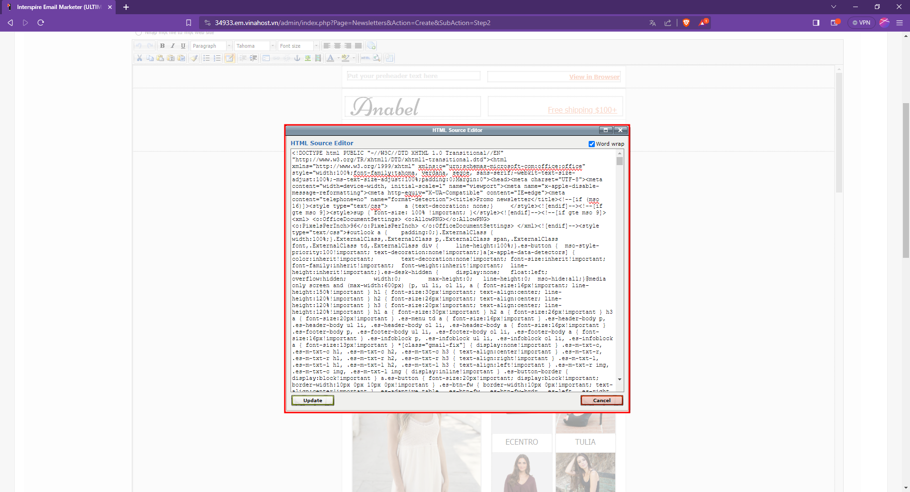

!!! tip
	Nếu như tôi muốn thay thế ảnh thì sẽ làm như thế nào?

Để thay thế ảnh, các bạn không nên xoá hình ảnh đó rồi dán ảnh mới vào. Điều này sẽ làm vỡ cấu trúc code HTML.

Thay vào đó các bạn nhấn **`chuột phải vào hình ảnh`** > chọn **`Insert/edit image`**

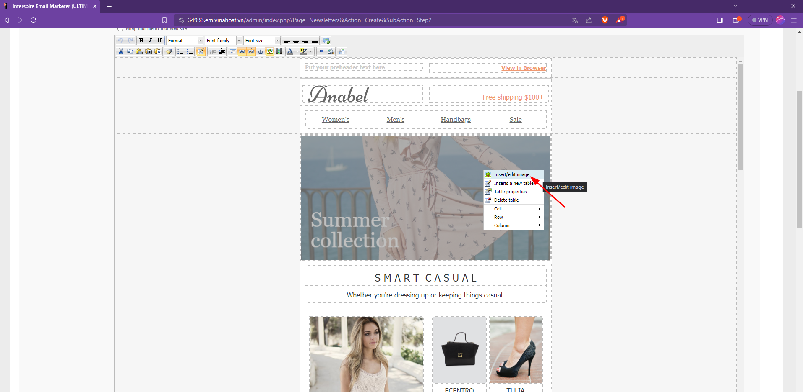

Một cửa sổ hiển thị lên. Tại đây bạn sẽ có 2 cách. Một là tải file hình ảnh mới lên hoặc dán địa chỉ URL của hình ảnh
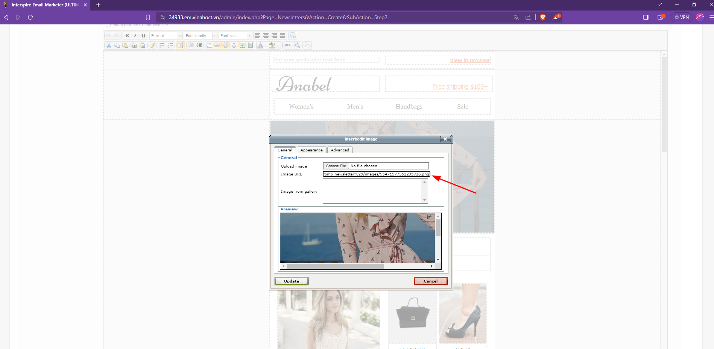

Kế đến, các bạn nhấn qua tab `Appearance` để thay đổi kích thước hình ảnh theo mong muốn.  
Ở đây mình để 100% nên hình sẽ hiển thị hết kích cỡ trong khung html
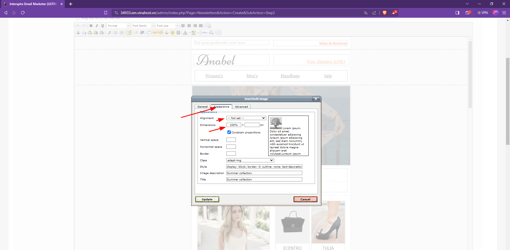

Kết quả sẽ như thế này
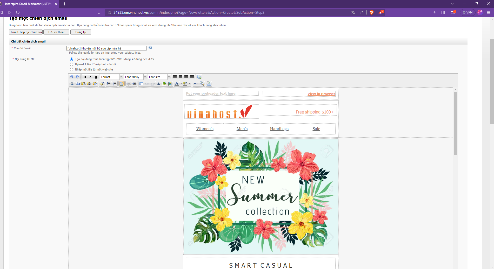

!!! tip
	Một điều đáng lưu ý của Email Marketing là các bạn phải để thêm nút Unsubscrie theo quy định. Đây là một yêu cầu pháp lý và cũng là một phần quan trọng để tôn trọng quyền riêng tư và lựa chọn của người nhận. 
	Nếu không có sẽ nút  Unsubscrie sẽ dễ bị chặn hoặc gửi vào spams

Để chèn nút Unsubscrie các bạn đặt trỏ chuột tại vị trí cần thêm, sau đó nhấn chọn `Dynamic Content` 
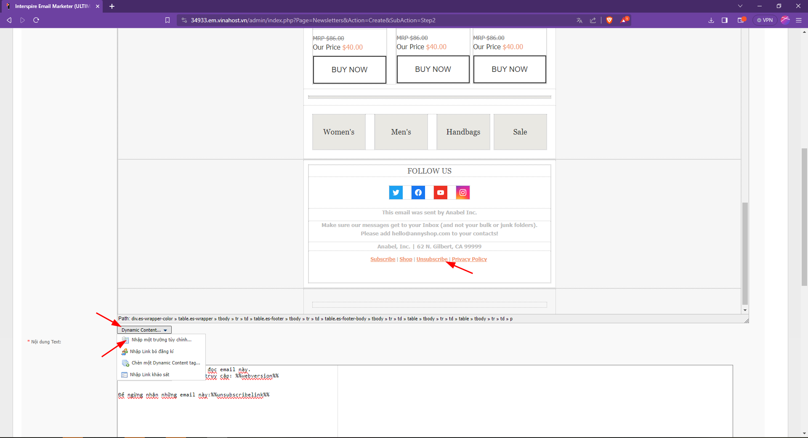

Sau đó chọn `Unsubscrie Link`
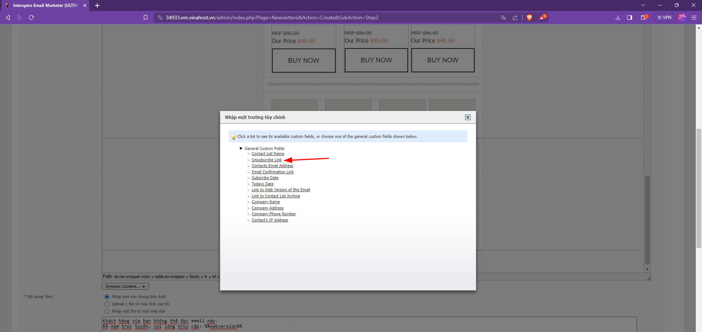

Kết quả sẽ được như thế này.
Ở bày hướng dẫn sau mình sẽ hướng dẫn các bạn sử dụng nâng cao tính năng của **`Dynamic Content`**

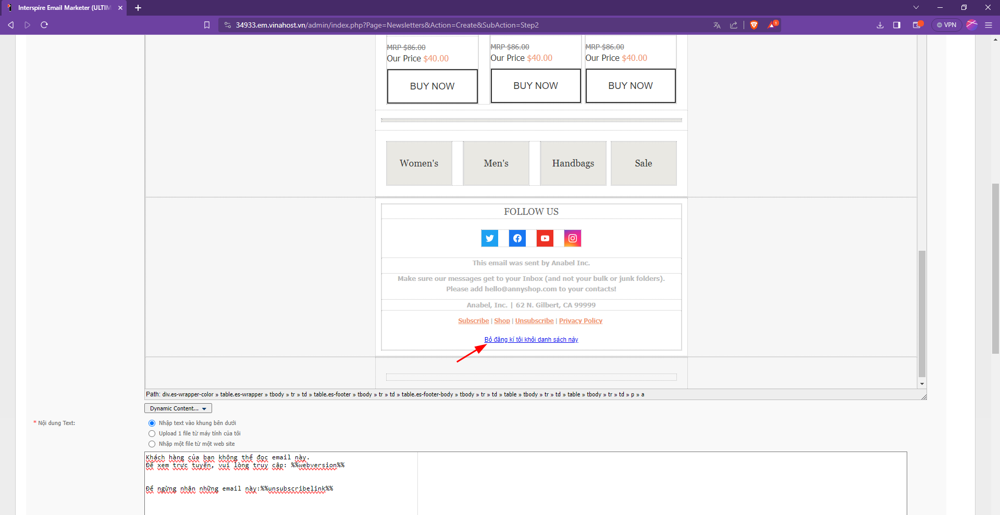

!!! tip
	Để giảm thiểu tình trạng email bị vào thư mục Spams, các bạn hãy tích vào nút `Kiểm tra spam cho email của bạn` Nó có chức năng sẽ kiểm tra những từ khoá nào bị cấm, không tối ưu.   
	Để biết thêm chi tiết cách gửi email marketing không bị vào Spam, các bạn vui lòng tìm hiểu chi tiết qua bài hướng dẫn [tại đây](https://vinahost.vn/luu-y-su-dung-email-marketing/)

Các bạn hãy chỉnh sửa lại các từ ngữ cho phù hợp, đến khi hệ thống không còn cảnh báo màu Đỏ là được nha
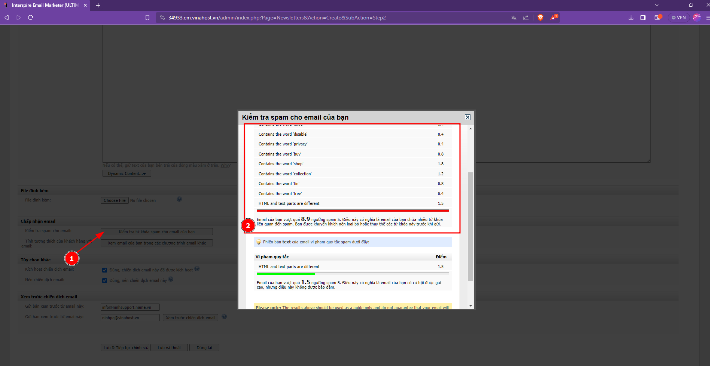

Sau khi đã hoàn tất, các bạn hãy nhấn **`Lưu và tiếp tục chỉnh sửa`**, sau đó điền email người nhận để kiểm tra thử nội dung Template Email của mình
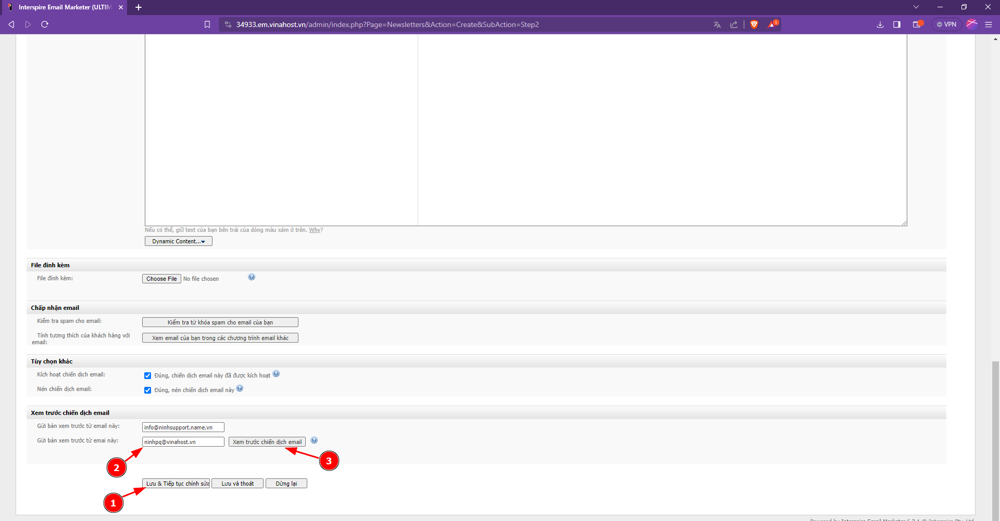

Kiểm tra trong hộp thư Gmail
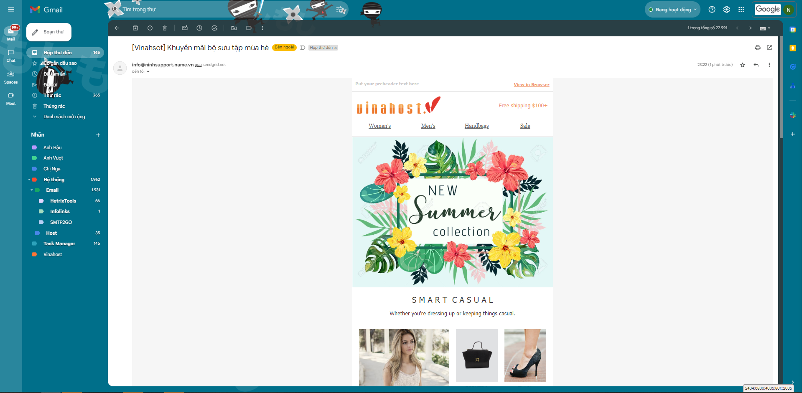

## Hướng dẫn tạo, chỉnh sửa một Template Email Marketing đã có sẵn

Nếu như các bạn đã có sẵn một Template Email Marketing chuyên biệt khác hoặc không thích sử dụng các Template Email có sẵn cua Vinahost thì có thể Upload lên hệ thống Email Marketing của Vinahost

!!! warning "Lưu ý"  
	Template Email Marketing tuy sử dụng bằng code HTML tuy nhiên định dạng sẽ có phần khác so với định dạng code HTML của trang web.
	Trong Template Email Marketing không có hỗ trợ CSS nằm rời như của trang web, mà nó được khai báo ngay trong thẻ. Nên không thể dùng code HTML của trang Web upload lên hệ thống.

Các bạn có thể truy cập các trang web hỗ trợ tạo Template Email Marketing miễn phí sau để tạo
[https://stripo.email/](https://stripo.email/)
[https://www.hubspot.com/resources/template/email-marketing  ](https://www.hubspot.com/resources/template/email-marketing  )  
[https://www.campaignmonitor.com/email-templates/](https://www.campaignmonitor.com/email-templates/)    

Sau khi tạo xong hãy tải template đó về dưới dạng code HTML. Và Upload lên hệ thống vào khung code HTML như phần mình đã hướng dẫn ở trên.

!!! tip
	Nếu các bạn đã có file Template Email dưới dạng Word thì phải làm sao?

Nếu các bạn upload file word lên hệ thống chắc chắn 100% sẽ bị vỡ định dạng mà các bạn đã tạo. Do đó các bạn cần chuyển đổi nó từ dạng Word sang dạng HTML

Các bạn truy cập vào một số trang web hỗ trợ việc này để chuyển đổi
[https://convertio.co/doc-html/  ](https://convertio.co/doc-html/  )  
[https://cloudconvert.com/doc-to-html](https://cloudconvert.com/doc-to-html)  
[https://www.zamzar.com/convert/doc-to-html/](https://www.zamzar.com/convert/doc-to-html/)  

Sau khi đã chuyển đổi thì có thể  thực hiện như phần mình đã hướng dẫn ở trên nha.

!!! warning "Lưu ý"  
	Hình ảnh trong File Word khi chuyển đổi sang html sau khi upload lên hệ thống dạng code HTML sẽ không thể thấy hình ảnh.
	Do đó cần upload hình ảnh lên hệ thống của Vinahost và chỉnh sửa lại link hình ảnh.

Mình đã hướng dẫn các bạn cách tạo, chỉnh sửa một Template Email Marketing cơ bản. Ở bài viết sau, mình sẽ hướng dẫn các bạn cách tạo, chỉnh sửa một Template Email Marketing nâng cao với Dynamic Content và cách gửi chiến dịch Email một cách tự động.

Chúc các bạn thực hiện thành công!

> **THAM KHẢO CÁC DỊCH VỤ TẠI [VINAHOST](https://vinahost.vn/)**
> 
> **\>>** [**SERVER**](https://vinahost.vn/thue-may-chu-rieng/) **–** [**COLOCATION**](https://vinahost.vn/colocation.html) – [**CDN**](https://vinahost.vn/dich-vu-cdn-chuyen-nghiep)
> 
> **\>> [CLOUD](https://vinahost.vn/cloud-server-gia-re/) – [VPS](https://vinahost.vn/vps-ssd-chuyen-nghiep/)**
> 
> **\>> [HOSTING](https://vinahost.vn/wordpress-hosting)**
> 
> **\>> [EMAIL](https://vinahost.vn/email-hosting)**
> 
> **\>> [WEBSITE](http://vinawebsite.vn/)**
> 
> **\>> [TÊN MIỀN](https://vinahost.vn/ten-mien-gia-re/)**
