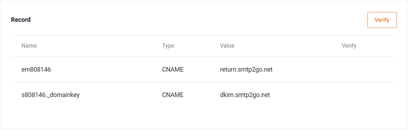

# Hướng Dẫn Xác Thực Domain Để Tăng Độ Uy Tín Cho Email

Bài viết này sẽ giới thiệu về **Hướng Dẫn Xác Thực Domain Để Tăng Độ Uy Tín Cho Email Marketing** và lợi ích của nó. Nếu bạn cần hỗ trợ, xin vui lòng liên hệ VinaHost qua **Hotline 1900 6046 ext. 3**, email về [support@vinahost.vn](mailto:support@vinahost.vn) hoặc chat với VinaHost qua livechat <https://livechat.vinahost.vn/chat.php>

## Bước 1. Truy cập vào dịch vụ

 

Dịch vụ ==> Dịch vụ của tôi

 

 

 

## Bước 2. Truy cập vào dịch vụ email marketing đã đăng kí

 

Chọn dấu … ==> Xem chi tiết

 

 

 

## Bước 3. Kéo xuống dưới cùng để xem các record yêu cầu.

 

 

## Bước 4. Truy cập trang quản trị domain hoặc nhờ nhà cung cấp domain trỏ các record theo yêu cầu ở bước 3.

 

 

 

## Bước 5. Sau khi đã trỏ, Ấn verify để kiểm tra

 

 

## Bước 6. Trạng thái true là đã verify thành công

  

\*\*\*\*\* Nếu chưa thành công, vui lòng kiểm tra lại record sau đó ấn Verify lại\*\*\*\*\*

**Chúc bạn thực hiện thành công!**

> **THAM KHẢO CÁC DỊCH VỤ TẠI [VINAHOST](https://vinahost.vn/)**
>
> **>>** **[SERVER](https://vinahost.vn/thue-may-chu-rieng/)** **–** **[COLOCATION](https://vinahost.vn/colocation.html)** – **[CDN](https://vinahost.vn/dich-vu-cdn-chuyen-nghiep)**
>
> **>> [CLOUD](https://vinahost.vn/cloud-server-gia-re/) – [VPS](https://vinahost.vn/vps-ssd-chuyen-nghiep/)**
>
> **>> [HOSTING](https://vinahost.vn/wordpress-hosting)**
>
> **>> [EMAIL](https://vinahost.vn/email-hosting)**
>
> **>> [WEBSITE](http://vinawebsite.vn/)**
>
> **>> [TÊN MIỀN](https://vinahost.vn/ten-mien-gia-re/)**