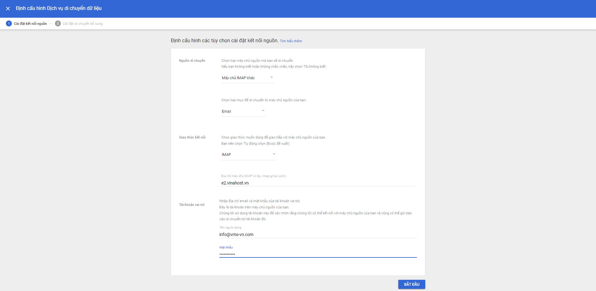

!!! info 
	Bài viết này sẽ hướng dẫn bạn cách **di chuyển dữ liệu email từ Email Hosting hoặc Email Server lên Tài khoản Google Workspace**  
	Nếu bạn cần hỗ trợ, xin vui lòng liên hệ VinaHost qua **Hotline 1900 6046 ext. 3**, email về [support@vinahost.vn](mailto:support@vinahost.vn) hoặc chat với VinaHost qua livechat [https://livechat.vinahost.vn](https://livechat.vinahost.vn)

## Tổng quan

Bài viết hôm nay mĩnh sẽ hướng dẫn các bạn các di chuyển dữ liệu email giành cho các Khách hàng đã và đang sử dụng **Email Hosting** hoặc **Email Server** và muốn nâng cấp lên **Google Workspace**.

Để có thể thực hiện được việc di chuyển dữ liệu các bạn cần phải có quyền truy cập vào tài khoản admin vào trang https://admin.google.com

Điều thứ 2 là cần có file danh sách chứa các địa chỉ email và mật khẩu tương ứng cần chuyển dữ liệu ở Email Hosting hoặc Email Server

## Các bước thực hiện

**Bước 1: Truy cập vào giao diện quản trị > Tài khoản > Di chuyển dữ liệu**

**Bước 2: Nhấn chọn THIẾT LẬP DỊCH VỤ DI CHUYỂN DỮ LIỆU**
- **Nguồn di chuyển**: Tại bước này, các bạn hãy chọn Nguồn di chuyển cho phù hợp, trường hợp này chúng ta nên chọn **Máy chủ IMAP khác**
- **Chọn loại mục di chuyển**: Email
- **Giao thức kết nối**: IMAP
- Địa chỉ máy chủ IMAP: Có thể nhập địa chỉ IP hoặc tên miền của Email Hosting hoặc Email Server
- Tên người dùng: Nhập địa chỉ email 
- Mật khẩu: Nhập mật khẩu của địa chỉ email

Địa chỉ này chỉ để kiểm tra em GG có thể truy cập vào Email Hosting hoặc Email Server hay không thôi. Nên có thể nhập 1 địa chỉ email bất kì

**Bước 3: Chọn thời gian dữ liệu cần di chuyển**
Nếu truy cập thàn công ở bước 2, các bạn sẽ thấy được giao diện này.  
Ở bước này các bạn cần chọn thời gian ngày bắt đầu di chuyển dữ liệu và tuỳ chọn dữ liệu theo nhu cầu của các bạn.

Bước 4: Nhập thông tin địa chỉ email và mật khẩu cần di chuyển dữ liệu

Tại bước này các bạn có thể nhập thông tin cho từng địa chỉ email thuộc Email Hosting hoặc Email server, và chọn địa chỉ Email trên Google Workspace ( Có thể chọn địa chỉ trên GG là một địa chỉ khác với trên Email hosting vẫn được)

Hoặc các bạn có thể upload file csv các thông tin địa chỉ email. 
!!! warning "Lưu ý" 
	Phải đúng định dạng mà Google đã hướng dẫn nha!

Chúc các bạn thực hiện thành công!

> **THAM KHẢO CÁC DỊCH VỤ TẠI [VINAHOST](https://vinahost.vn/)**
> 
> **\>>** [**SERVER**](https://vinahost.vn/thue-may-chu-rieng/) **–** [**COLOCATION**](https://vinahost.vn/colocation.html) – [**CDN**](https://vinahost.vn/dich-vu-cdn-chuyen-nghiep)
> 
> **\>> [CLOUD](https://vinahost.vn/cloud-server-gia-re/) – [VPS](https://vinahost.vn/vps-ssd-chuyen-nghiep/)**
> 
> **\>> [HOSTING](https://vinahost.vn/wordpress-hosting)**
> 
> **\>> [EMAIL](https://vinahost.vn/email-hosting)**
> 
> **\>> [WEBSITE](http://vinawebsite.vn/)**
> 
> **\>> [TÊN MIỀN](https://vinahost.vn/ten-mien-gia-re/)**

