# Hướng dẫn thay đổi incoming/outgoing server email tại Vinahost

Bài viết này sẽ giới thiệu về **Hướng dẫn thay đổi incoming/outgoing server email tại Vinahost** và lợi ích của nó. Nếu bạn cần hỗ trợ, xin vui lòng liên hệ VinaHost qua **Hotline 1900 6046 ext. 3**, email về [support@vinahost.vn](mailto:support@vinahost.vn) hoặc chat với VinaHost qua livechat <https://livechat.vinahost.vn/chat.php>

## I. Outlook thường (2019 trở về trước)

Đầu tiên, truy cập settings của Outlook

 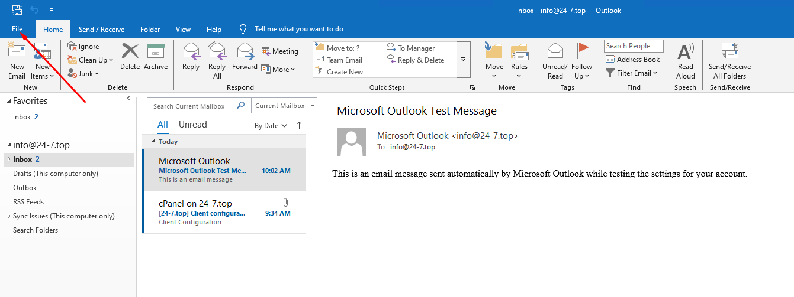

 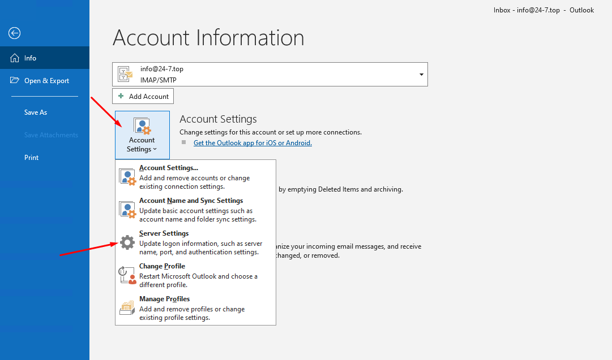

Phần cấu hình sẽ hiện lên, ta thay đổi domain phần server từ e.vinahost.vn hoặc tương tự thành mail.domain

### **1. Incoming mail**

 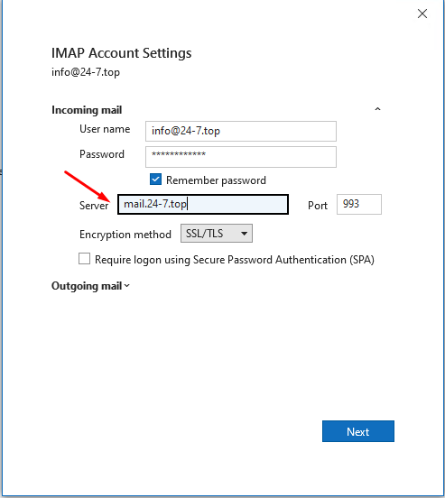

Giữ nguyên port nếu không có thay đổi gì

### 2. Outgoing mail

 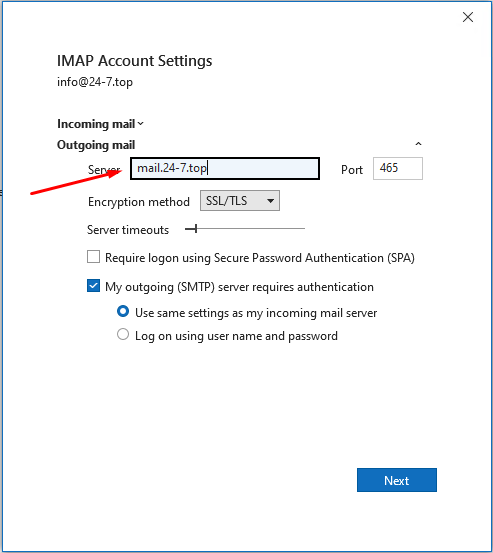

Khi hoàn tất, chọn **Next**

 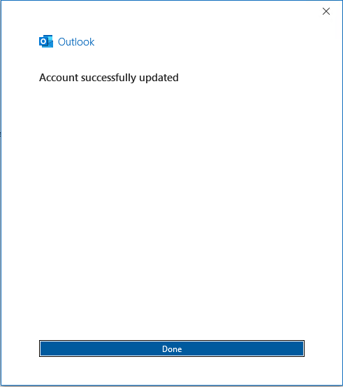

## II. Outlook (new)

***Lưu ý***: đối với Outlook new thì ta cần lưu lại thông tin quan trọng như port, mật khẩu vì ta sẽ tiến hành xóa tài khoản cũ và tạo lại

Đầu tiên, chuột phải vào tài khoản cần đổi trong Outlook, chọn **Manage Account**

 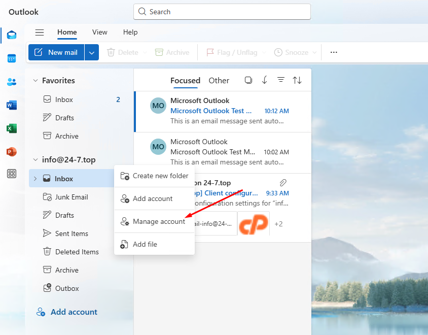

Sau đó chọn **Manage**

 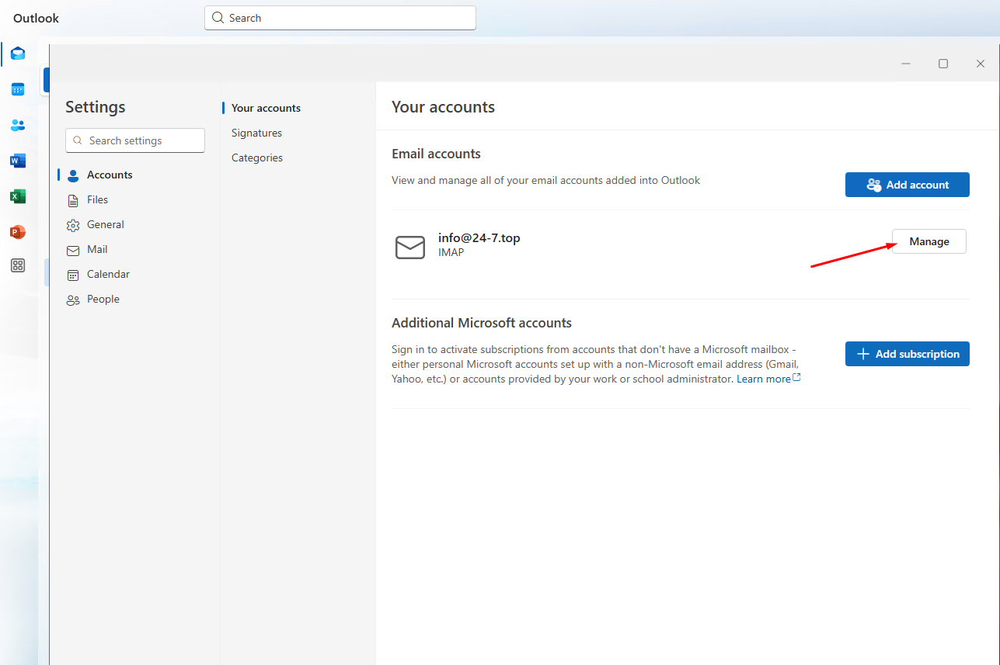

Các thông tin cần lưu lại sẽ bao gồm **Port**, giao thức (**IMAP** hoặc **POP/POP3**), loại giao thức kết nối.

 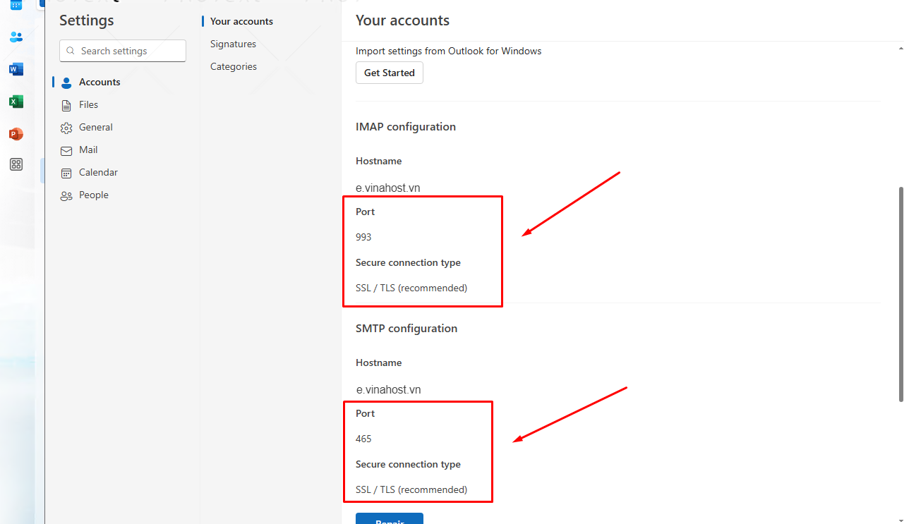

Sau khi hoàn tất lưu lại thông tin, ta tiến hành **Remove** để xóa tài khoản

 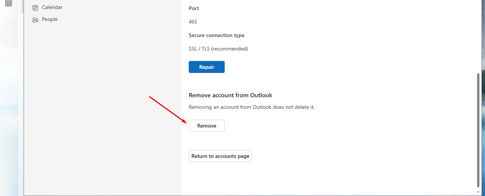

 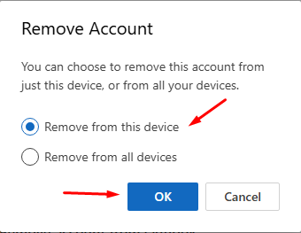

Lúc này, Outlook sẽ đẩy ta ra màn hình chính, tiến hành nhập email

 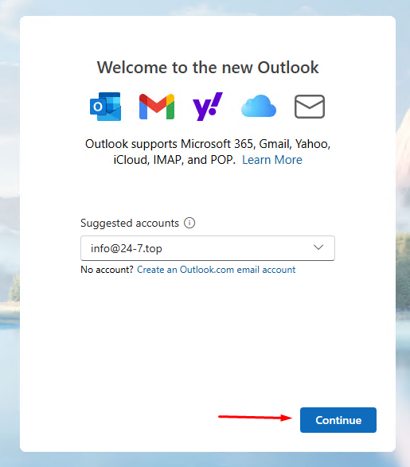

Tiếp theo nhập password của tài khoản email (nếu quên có thể liên hệ người quản trị email để hỗ trợ reset)

 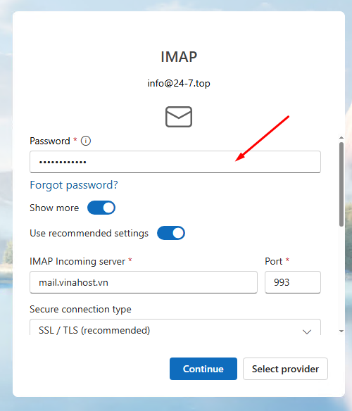

> *LƯU Ý*: nếu dùng **POP/POP3**, chọn **Select Provider**  để tiến hành thay đổi
>
>  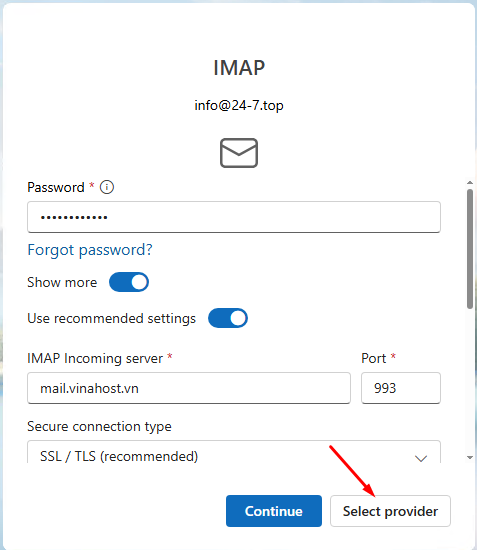
>
>  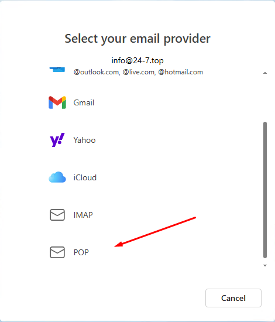

Kế đến, điền mail.domain + port và giao thức kết nối vào phần Incoming Server

 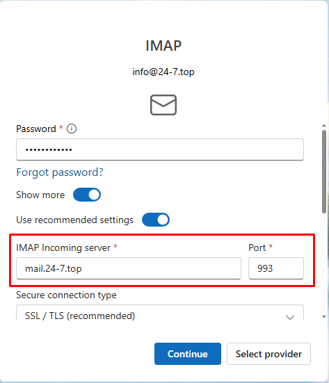

Kéo xuống dưới, thực hiện tương tự. Khi hoàn tất, chọn **Continue** để tiếp tục

 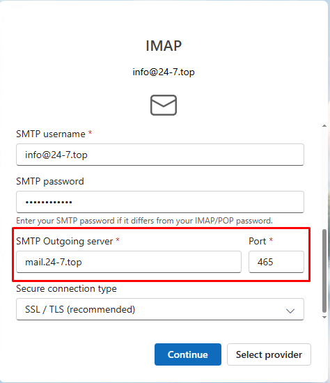

Hoàn tất

 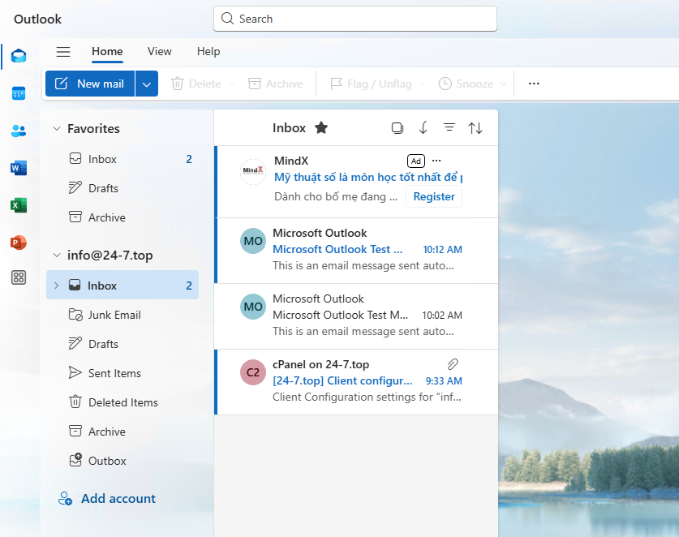

**Chúc bạn thực hiện thành công!**

> **THAM KHẢO CÁC DỊCH VỤ TẠI [VINAHOST](https://vinahost.vn/)**
>
> **>>** **[SERVER](https://vinahost.vn/thue-may-chu-rieng/)** **–** **[COLOCATION](https://vinahost.vn/colocation.html)** – **[CDN](https://vinahost.vn/dich-vu-cdn-chuyen-nghiep)**
>
> **>> [CLOUD](https://vinahost.vn/cloud-server-gia-re/) – [VPS](https://vinahost.vn/vps-ssd-chuyen-nghiep/)**
>
> **>> [HOSTING](https://vinahost.vn/wordpress-hosting)**
>
> **>> [EMAIL](https://vinahost.vn/email-hosting)**
>
> **>> [WEBSITE](http://vinawebsite.vn/)**
>
> **>> [TÊN MIỀN](https://vinahost.vn/ten-mien-gia-re/)**