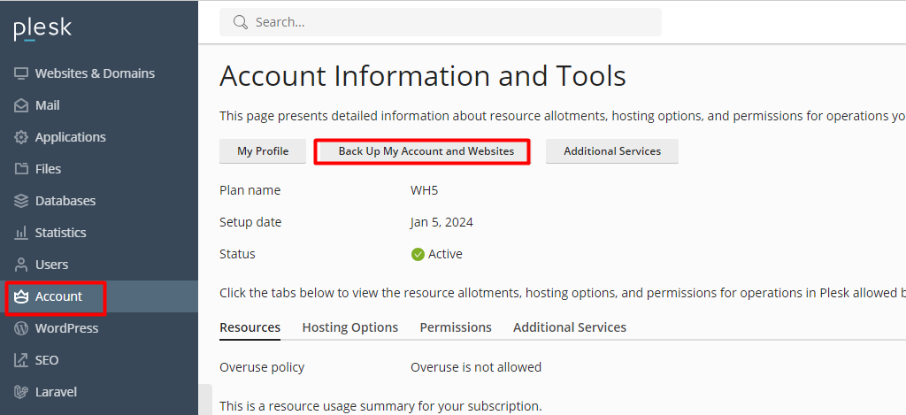
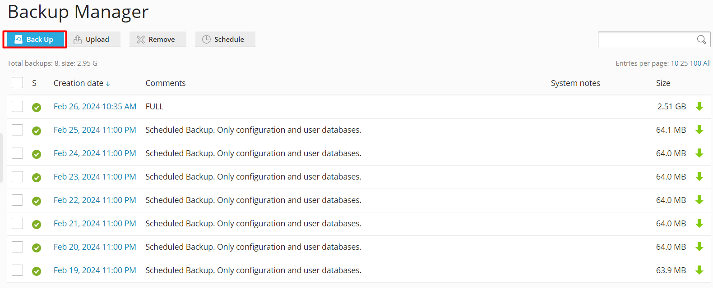
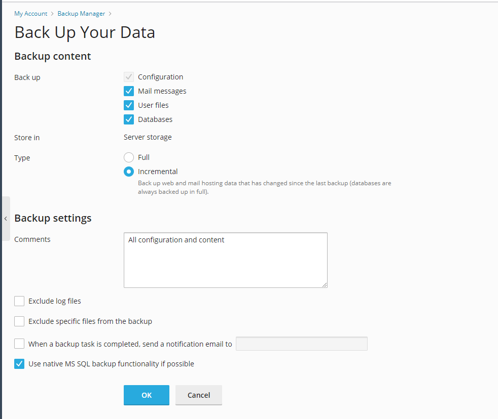
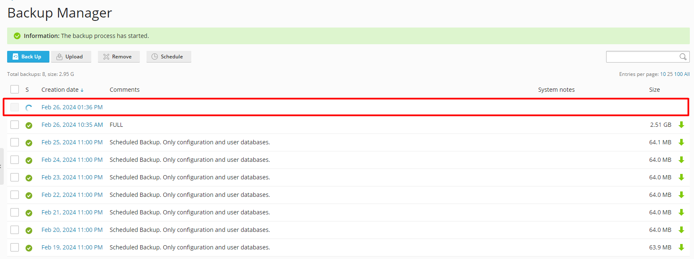

Bài viết này sẽ hướng dẫn cách **Hướng dẫn Backup dữ liệu trên Plesk**. Nếu bạn cần hỗ trợ, xin vui lòng liên hệ [**VinaHost**](https://blog.vinahost.vn/) qua Hotline **1900 6046 ext.3**, email về **support@vinahost.vn** hoặc chat với VinaHost qua livechat **[https://livechat.vinahost.vn/chat.php](https://livechat.vinahost.vn/chat.php)**.

Bài viết sau sẽ hướng dẫn bạn cách backup dữ liệu trên Plesk Panel.

# 1. Backup

Bước 1: Login vào Plesk Panel chọn mục Account ==> Chọn Back up My Account and Website

Bước 2: Chọn **Back Up** để tạo backup trên hosting

Bước 3: Chọn nội dung mà bạn muốn backup.

Sau đó chọn **OK** để tạo backup.

Bước 4: Quay lại giao diện **Backup Manager** để theo dõi tiến trình backup.

Chúc bạn thực hiện thành công!

> **THAM KHẢO CÁC DỊCH VỤ TẠI [VINAHOST](https://vinahost.vn/)**
> 
> **\>>** [**SERVER**](https://vinahost.vn/thue-may-chu-rieng/) **–** [**COLOCATION**](https://vinahost.vn/colocation.html) – [**CDN**](https://vinahost.vn/dich-vu-cdn-chuyen-nghiep)
> 
> **\>> [CLOUD](https://vinahost.vn/cloud-server-gia-re/) – [VPS](https://vinahost.vn/vps-ssd-chuyen-nghiep/)**
> 
> **\>> [HOSTING](https://vinahost.vn/wordpress-hosting)**
> 
> **\>> [EMAIL](https://vinahost.vn/email-hosting)**
> 
> **\>> [WEBSITE](http://vinawebsite.vn/)**
> 
> **\>> [TÊN MIỀN](https://vinahost.vn/ten-mien-gia-re/)**
