Bài viết này sẽ hướng dẫn cách **Hướng dẫn cách cấu hình chi tiết VestaCP**. Nếu bạn cần hỗ trợ, xin vui lòng liên hệ [**VinaHost**](https://blog.vinahost.vn/) qua Hotline **1900 6046 ext.3**, email về **support@vinahost.vn** hoặc chat với VinaHost qua livechat **[https://livechat.vinahost.vn/chat.php](https://livechat.vinahost.vn/chat.php)**.

Bài viết này sẽ hướng dẫn bạn cấu hình VestaCP một cách chi tiết nhất.

# Hướng dẫn cách cấu hình VestaCP chi tiết

Sau khi tiến trình cài đặt VestaCP lên VPS của bạn. Thì bạn sẽ nhận một thông tin như sau:

<pre>
URL Login: https://[IP]:8083
Username: admin
Password: ********
</pre>

Sau đó ta sẽ dùng thông tin này để login vào VestaCP

# 1. Đăng nhập vào VestaCP.

Chúng ta sẽ mở một trình duyệt web bất kì và truy cập vào địa chỉ https://[your_server_ip]:8083.  Tiếp theo chúng ta sẽ nhập thông tin username và password để đăng nhập vào trình quản trị VestaCP.

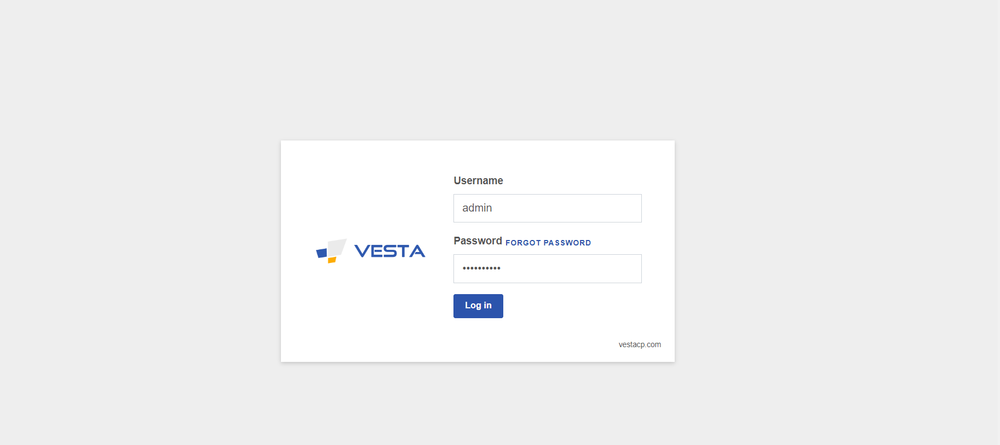

# 2. Cấu hình DNS.

Ở giao diện chính, chúng ta chọn mục DNS để cấu hình các bản ghi DNS cho tên miền của bạn. 

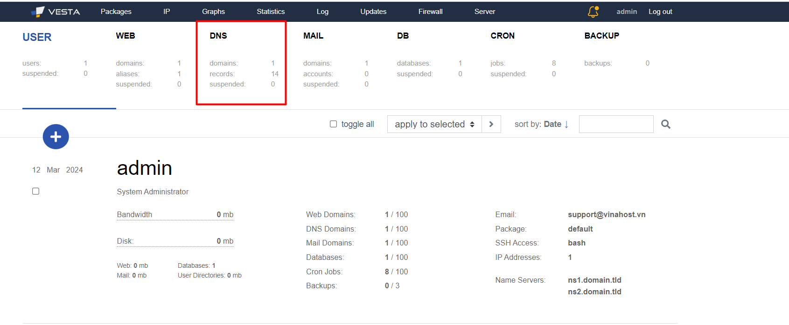

Ví dụ tiêu biểu là các bản ghi A, MX, TXT, NS, ...

# 3. Tạo hoặc xóa tài khoản người dùng.

Ờ giao diện chính của VestaCP, chúng ta chọn mục User để quản lý tắt cả các tài khoản người dùng. Đồng thời, chúng ta có thể tạo hoặc óa tài khoản người dùng. Thay đổi mật khẩu và đặt giới hạn lưu lượng cho các tài khoản.

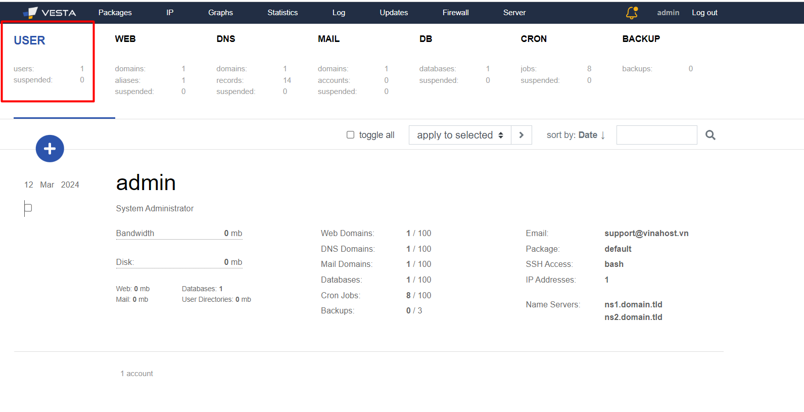

# 4. Cài đặt SSL/TLS.

Bạn chọn mục web để cấu hình đồng bộ các cài đặt SSL/TLS cho tên miền của bạn. Bạn cũng có thể cài đặt chứng chỉ SSL/TLS miễn phí từ Let’s encrypt hoặc nhập chứng chỉ SSL/TLS từ một nhà cung cấp bên ngoài. 

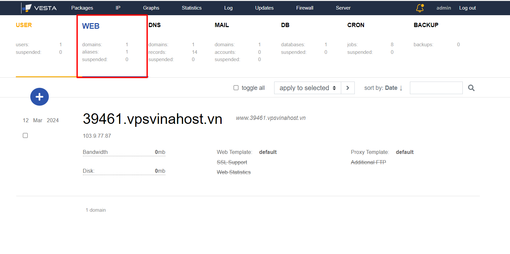

# 5. Cấu hình máy chủ Web.

Chọn mục web để cấu hình các tính năng và tùy chọn cho máy chủ. Kế tiếp, bạn có thể thay đổi máy chủ web như Apache hoặc Nginx. Sau đó, bạn cài đặt các tùy chọn bảo mật, tạo hoặc xóa các trang web.

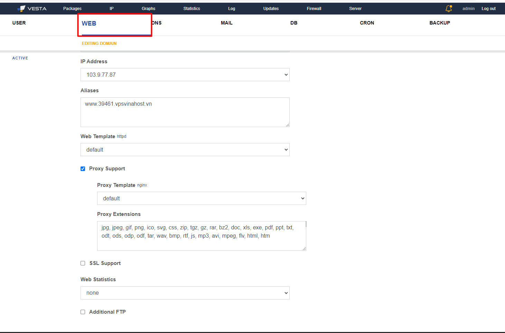

# 6. Cấu hình Email.

Tại mục Mail, bạn có thể cấu hình các tính năng, tùy chỉnh email, tạo, xóa một tài khoản email, hoặc cài đặt bộ lọc thư rác và quản lý hộp thư. 

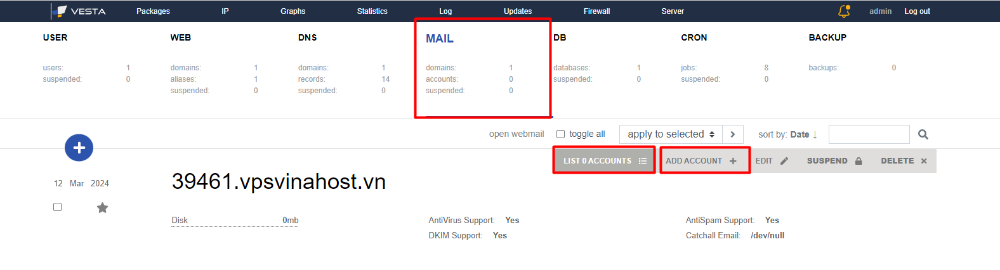

# 7. Cấu hình cơ sở dữ liệu.

Bạn chọn mục Database để quản lý các cơ sở dữ liệu MySQL hoặc PostgreSQL và toàn bộ cơ sở dữ liệu người dùng.

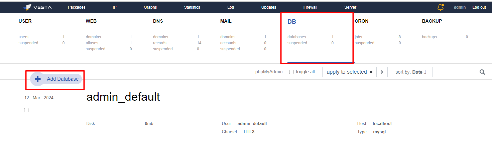

# 8. Cấu hình Firewall.

Tại mục Firewall, để cấu hình các tính năng tường lửa cho máy chủ, bạn có thể tạo hoặc xóa các quy tắc. Ngoài ra, bạn cũng có thể từ chối hoặc cho phép truy cập một địa chỉ IP cụ thể nào đó.

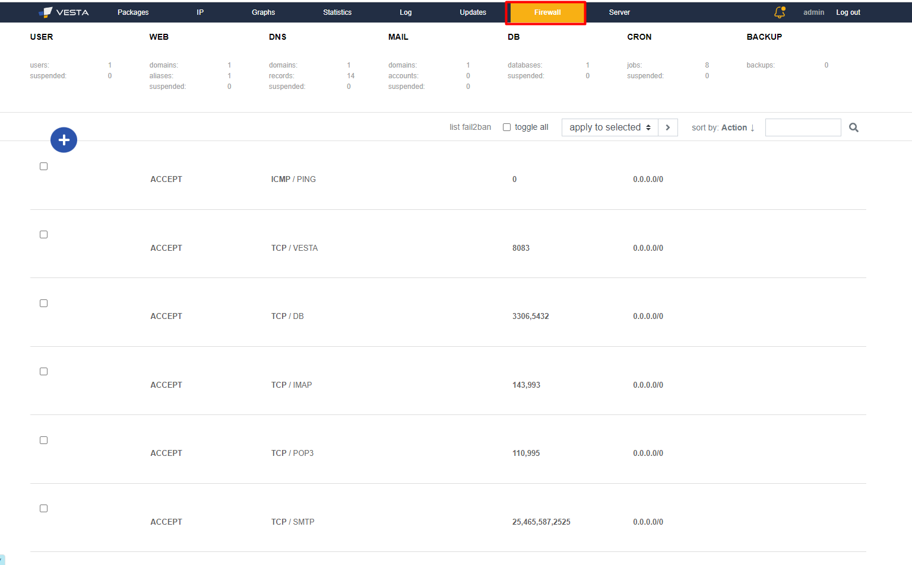

# 9. Cấu hình backup.

Tại mục Backup, bạn có thể cấu hình các tính năng sao lưu cho máy chủ, ví dụ như tạo, xóa các tập tin sao lưu và cấu hình lịch trình sao lưu tự động.

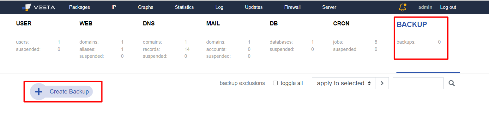

# 10. Cấu hình FTP.

Ở giao diện chính của VestaCP, bạn chọn mục User ==> Chọn Edit ==> Để có thể thay đổi password tài khoản FTP nhé. Lưu ý tài khoản FTP tương ứng với User trên VestaCP.

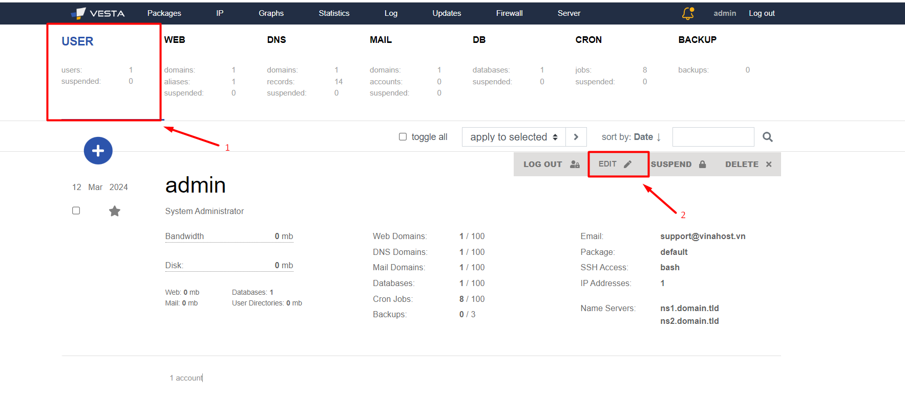

# 11. Cấu Hình SSH.

Ở đây chúng ta thực hiện các bước tương tự như bước cấu hình FTP. Tương tự ở đây password và username tương ứng với tài khoản trên VestaCP của bạn.

Bạn có thể cấp quyền SSH và bằng  user này hoặc có thể không. Có thể thay đổi password SSH của user này nếu muốn.

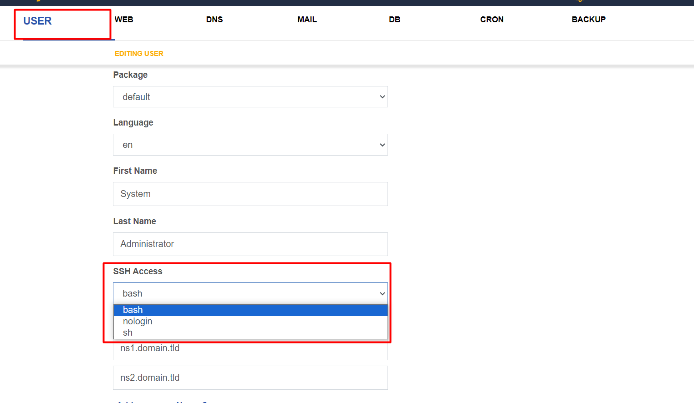

Chúc bạn thực hiện thành công!

> **THAM KHẢO CÁC DỊCH VỤ TẠI [VINAHOST](https://vinahost.vn/)**
> 
> **\>>** [**SERVER**](https://vinahost.vn/thue-may-chu-rieng/) **–** [**COLOCATION**](https://vinahost.vn/colocation.html) – [**CDN**](https://vinahost.vn/dich-vu-cdn-chuyen-nghiep)
> 
> **\>> [CLOUD](https://vinahost.vn/cloud-server-gia-re/) – [VPS](https://vinahost.vn/vps-ssd-chuyen-nghiep/)**
> 
> **\>> [HOSTING](https://vinahost.vn/wordpress-hosting)**
> 
> **\>> [EMAIL](https://vinahost.vn/email-hosting)**
> 
> **\>> [WEBSITE](http://vinawebsite.vn/)**
> 
> **\>> [TÊN MIỀN](https://vinahost.vn/ten-mien-gia-re/)**

