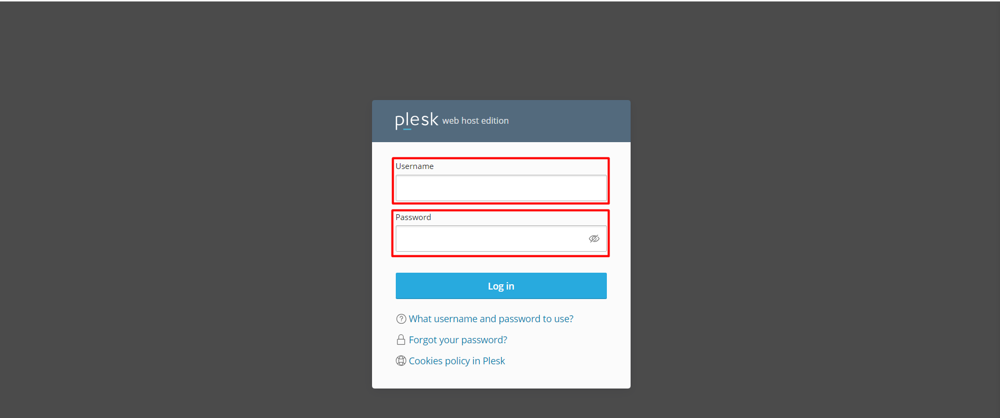
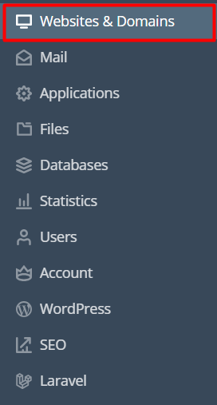
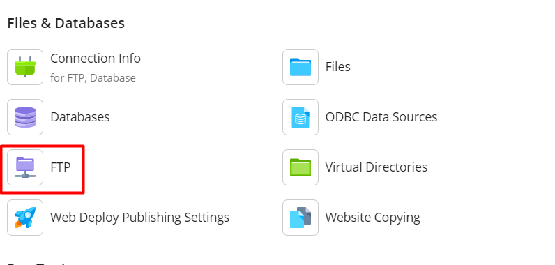
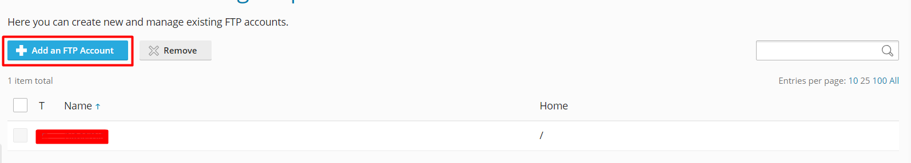
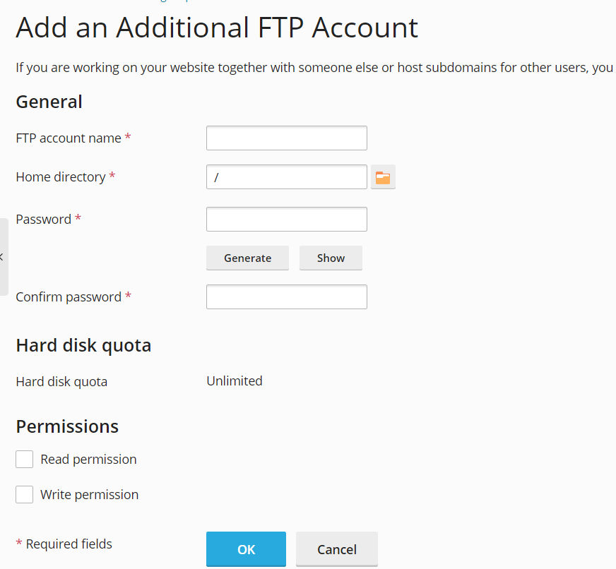
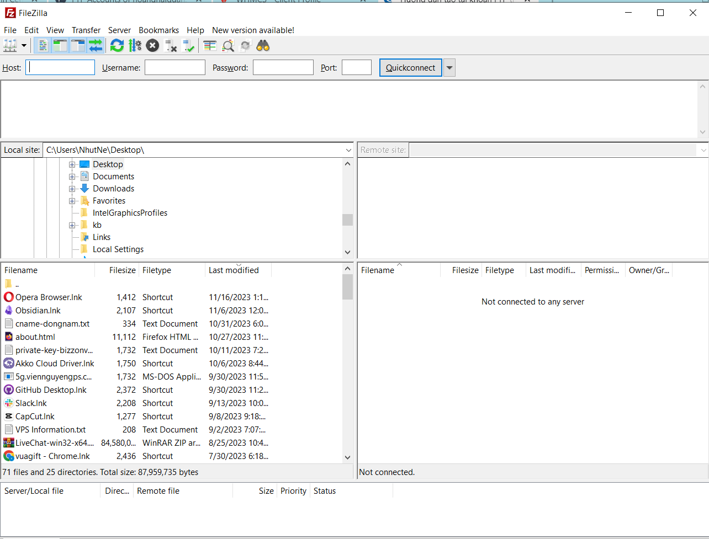

Bài viết này sẽ hướng dẫn cách **Hướng dẫn kết nối FTP trên Plesk**. Nếu bạn cần hỗ trợ, xin vui lòng liên hệ [**VinaHost**](https://blog.vinahost.vn/) qua Hotline **1900 6046 ext.3**, email về **support@vinahost.vn** hoặc chat với VinaHost qua livechat **[https://livechat.vinahost.vn/chat.php](https://livechat.vinahost.vn/chat.php)**.

Bài viết sau sẽ hướng dẫn bạn cách tạo tài khoản và kết nối FTP trên Plesk tại Vinahost.

# 1. Đăng nhập vào Plesk Panel

Thông tin đăng nhập sẽ được gửi về mail của quý khách khi đăng kí dịch vụ tại Vinahost.

# 2. Các bước tạo tài khoản và cách kết nối FTP

Sau khi login vào trình quản trị Plesk Panel ta thực hiện các bước sau:

Bước 1: Chọn vào mục **Website & Domain** ==> Sau đó chọn **FTP**

Bước 2: Chọn **Add an FTP Account** để tạo tài khoản FTP

Bước 4: Điền các thông tin sau để tạo tài khoản FTP

Ở mục **General** ta điền các thông tin sau:

- FTP Account name: tên user FTP
- Home directory: thư mục gốc muốn FTP truy cập đến ==> thường sẽ là thư mục httpsdocs
- New password: nhập password mới 
- Confirm password: xác nhận password vừa tạo ở trên
- Read permission: cấp quyền đọc hay không
- Write permission: cấp quyền ghi hay không

**Thường sẽ cho phép cả đọc và ghi để có thể thao tác FTP**

Sau đó chọn OK để hoàn thành việc tạo tài khoản FTP.

Bước 5: Sau khi hoàn thành tiến trình tạo tài khoản ta sử dụng phần mềm **File Zilla** để kết nối FTP:

Chúng ta sẽ điền các thông tin sau:

- Host: là đường link mà mình dùng để truy cập vào Plesk Panel (Lưu ý: Chỉ sử dụng win-hosting-03.vinahost.vn)

- Username: Là tài khoản FTP mà mình vừa tạo
- Password: Là mật khẩu của tài khoản mà mình dùng để kết nối tới FTP
- Port: sẽ là 21

Chúc bạn thực hiện thành công!

> **THAM KHẢO CÁC DỊCH VỤ TẠI [VINAHOST](https://vinahost.vn/)**
> 
> **\>>** [**SERVER**](https://vinahost.vn/thue-may-chu-rieng/) **–** [**COLOCATION**](https://vinahost.vn/colocation.html) – [**CDN**](https://vinahost.vn/dich-vu-cdn-chuyen-nghiep)
> 
> **\>> [CLOUD](https://vinahost.vn/cloud-server-gia-re/) – [VPS](https://vinahost.vn/vps-ssd-chuyen-nghiep/)**
> 
> **\>> [HOSTING](https://vinahost.vn/wordpress-hosting)**
> 
> **\>> [EMAIL](https://vinahost.vn/email-hosting)**
> 
> **\>> [WEBSITE](http://vinawebsite.vn/)**
> 
> **\>> [TÊN MIỀN](https://vinahost.vn/ten-mien-gia-re/)**
