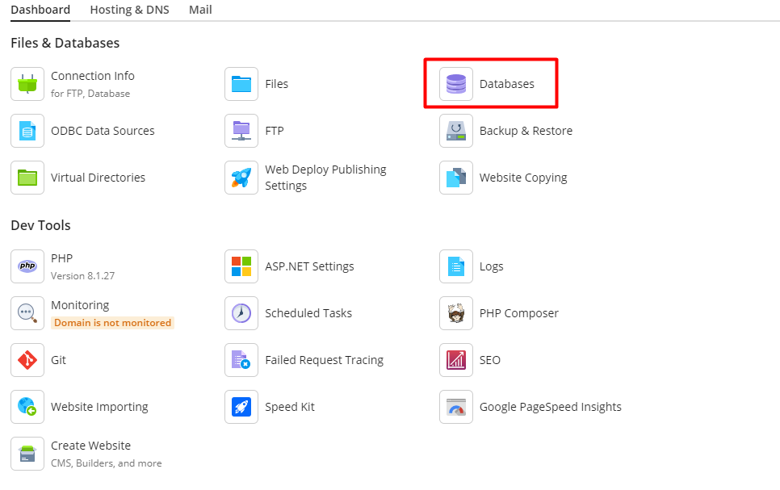
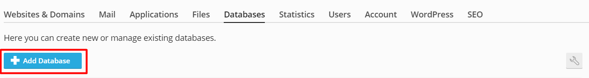
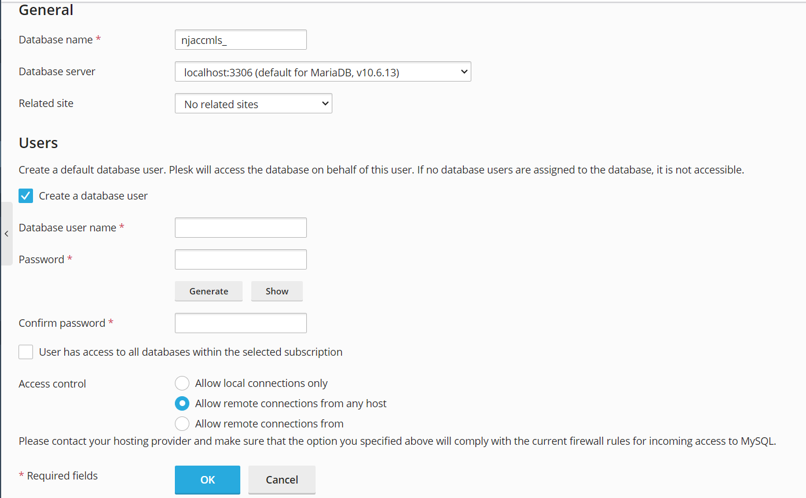

Bài viết này sẽ hướng dẫn cách **Hướng dẫn tạo database trên Plesk**. Nếu bạn cần hỗ trợ, xin vui lòng liên hệ [**VinaHost**](https://blog.vinahost.vn/) qua Hotline **1900 6046 ext.3**, email về **support@vinahost.vn** hoặc chat với VinaHost qua livechat **[https://livechat.vinahost.vn/chat.php](https://livechat.vinahost.vn/chat.php)**.

Bài viết này sẽ hướng dẫn bạn tạo 1 bảng database trên Plesk.

# 1. Login vào trang quản trị Plesk

Khi đăng kí dịch vụ Windows hosting ở Vinahost sẽ gửi đến bạn một mail bao gồm thông tin dịch vụ bên trong. Trong mail sẽ có các thông tin như sau:
    - Link login vào trình quản trị Plesk: Địa chỉ sẽ là https://win-hosting-03.vinahost.vn:8443/ 
    - Username và Password để login vào trang quản trị dịch vụ.

# 2. Truy cập vào chức năng quản lý Database trên Plesk

Sau khi login thành công vào giao diện Plesk Panel, bạn thực hiện theo các bước sau:

Bước 1: Chọn vào mục Database như ảnh bên dưới:

Trên Plesk Vinahsot đang hỗ trợ **MYSQL SERVER từ version 2012 đến version 2019**

Bước 2: Chọn **Add Database**

Bước 3: Điền các thông tin sau để tạo database:

Ở Mục **General** ta điền các thông tin sau

- Tạo **Database name**
- Chọn **Database Server**
- Chọn **Related Site** (Nhằm chỉ định database tới 1 site liên quan)

Ở Mục **Users** ta điền các thông tin sau:

- Điền ***database user name**
- Tạo Password
- Xác nhận lại Password vừa tạo

Sau đó click OK để hoàn thành tiến trình tạo database

Chúc bạn thực hiện thành công!

> **THAM KHẢO CÁC DỊCH VỤ TẠI [VINAHOST](https://vinahost.vn/)**
> 
> **\>>** [**SERVER**](https://vinahost.vn/thue-may-chu-rieng/) **–** [**COLOCATION**](https://vinahost.vn/colocation.html) – [**CDN**](https://vinahost.vn/dich-vu-cdn-chuyen-nghiep)
> 
> **\>> [CLOUD](https://vinahost.vn/cloud-server-gia-re/) – [VPS](https://vinahost.vn/vps-ssd-chuyen-nghiep/)**
> 
> **\>> [HOSTING](https://vinahost.vn/wordpress-hosting)**
> 
> **\>> [EMAIL](https://vinahost.vn/email-hosting)**
> 
> **\>> [WEBSITE](http://vinawebsite.vn/)**
> 
> **\>> [TÊN MIỀN](https://vinahost.vn/ten-mien-gia-re/)**

