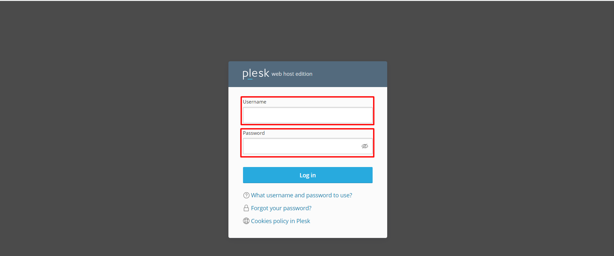
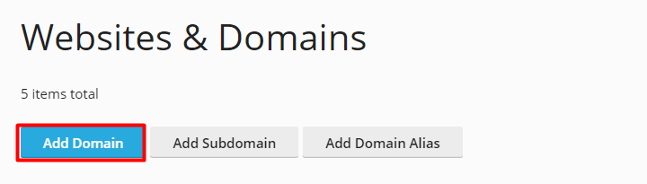
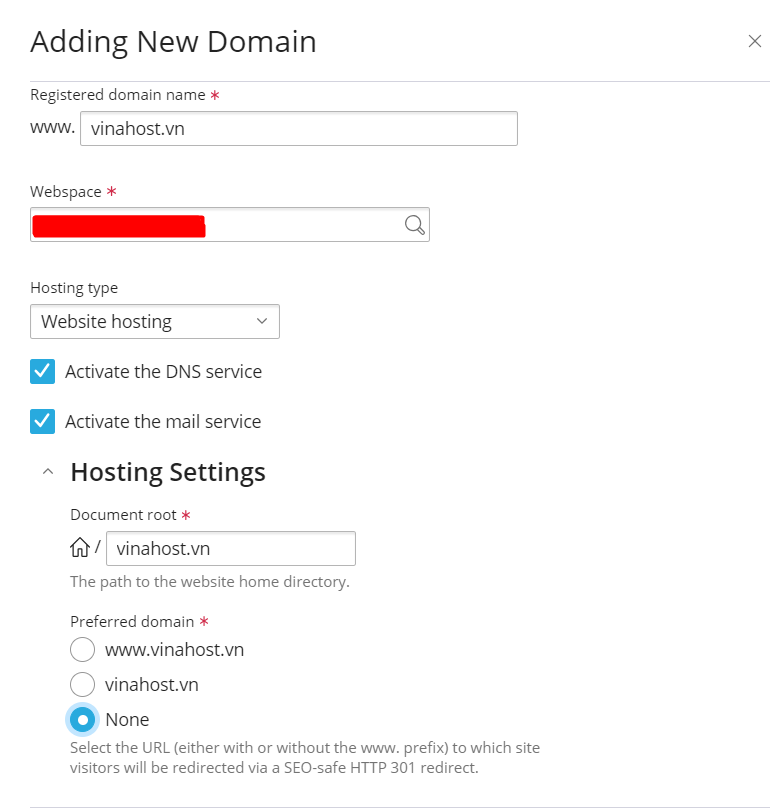
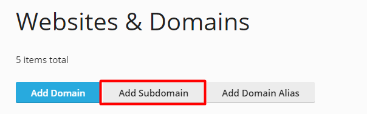
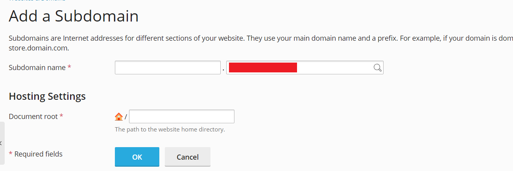
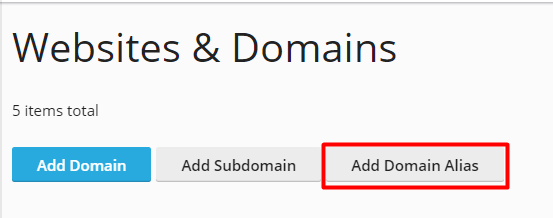
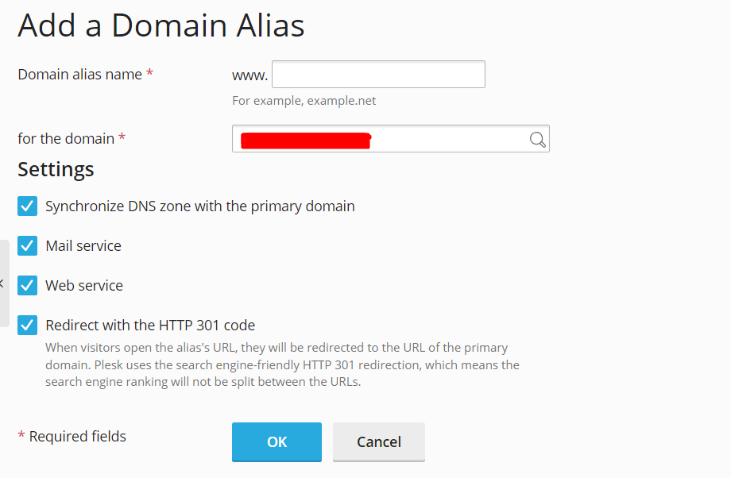

Bài viết này sẽ hướng dẫn cách **Hướng dẫn thêm Addon domain, Sudomain, Parked Domain**. Nếu bạn cần hỗ trợ, xin vui lòng liên hệ [**VinaHost**](https://blog.vinahost.vn/) qua Hotline **1900 6046 ext.3**, email về **support@vinahost.vn** hoặc chat với VinaHost qua livechat **[https://livechat.vinahost.vn/chat.php](https://livechat.vinahost.vn/chat.php)**.

Bài viết sau đây sẽ hướng dẫn bạn các thao tác tạo Addon Domain, Sub Domain và Parked Domain trên Windows Hosting sử dụng Plesk Panel.

Dưới đây là một số định nghĩa cơ bản về: Addon Domain, Subdomain và Parked Domain.

- Addon domain: là định nghĩa cho phép một hosting có thể chạy được nhiều domain với nhiều mã nguồn khác nhau. Số lượng addon domain tùy thuộc vào gói dịch vụ mà các bạn đăng ký sử dụng.
- Subdomain: là định nghĩa tạo thêm các tên miền phụ có định dạng “abc.domain.com”.
- Alias: hay còn gọi là parked domain cho phép gắn thêm tên miền khác vào hosting để chạy cùng một mã nguồn giống với tên miền chính đã có trên hosting.

# 1. Tạo Addon Domain

Bước 1: Đăng nhập vào giao diện Plesk Panel:

Bước 2: Chọn mục **Add Domain**

Bước 3: Tiến hành khai báo domain cần thêm như ảnh bên dưới:

Trong đó:

- Registered domain name: Là domain mà bạn muốn thêm
- Webspace: Bạn để mặc định và không cần thay đổi gì cả
- Hosting Type: Bạn có thể chọn 1 trong 3 lựa chọn sau: Website Hosting, Forwarding và No Hosting

Sau đó chọn Add Domain để hoàn thành tiến trình add Domain.

# 2. Tạo Subdomain

Bước 1: Chọn Mục **Add Subdomain**

Bước 2: Tiến hành khai báo thông tin subdomain cần tạo

- Subdomain name: Là tên subdomain mà bạn muốn tạo
- Document root: Sẽ điền đường dẫn chính đến thư mục của website thường là httpsdocs
- Chọn OK để khởi tạo

# 3. Tạo Alias Domain hoặc Parked Domain

Bước 1: Chọn mục **Alias Domain**

Bước 2: Tại mục Alias Domain khai báo domain muốn tạo

Điền **Domain Alias Name** và sau đó chọn OK để hoàn thành tiến trình trên. Alias Domain cũng tương tự như Parked Domain.

Chúc bạn thực hiện thành công!

> **THAM KHẢO CÁC DỊCH VỤ TẠI [VINAHOST](https://vinahost.vn/)**
> 
> **\>>** [**SERVER**](https://vinahost.vn/thue-may-chu-rieng/) **–** [**COLOCATION**](https://vinahost.vn/colocation.html) – [**CDN**](https://vinahost.vn/dich-vu-cdn-chuyen-nghiep)
> 
> **\>> [CLOUD](https://vinahost.vn/cloud-server-gia-re/) – [VPS](https://vinahost.vn/vps-ssd-chuyen-nghiep/)**
> 
> **\>> [HOSTING](https://vinahost.vn/wordpress-hosting)**
> 
> **\>> [EMAIL](https://vinahost.vn/email-hosting)**
> 
> **\>> [WEBSITE](http://vinawebsite.vn/)**
> 
> **\>> [TÊN MIỀN](https://vinahost.vn/ten-mien-gia-re/)**