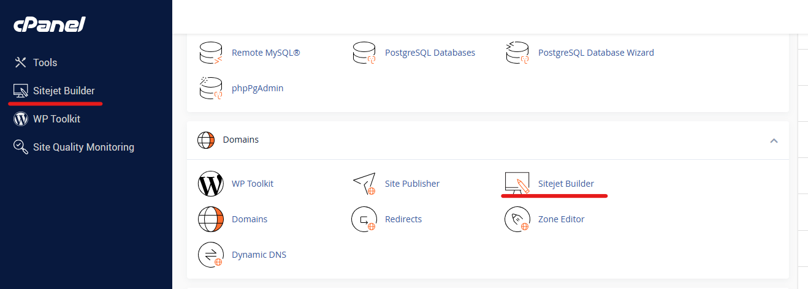
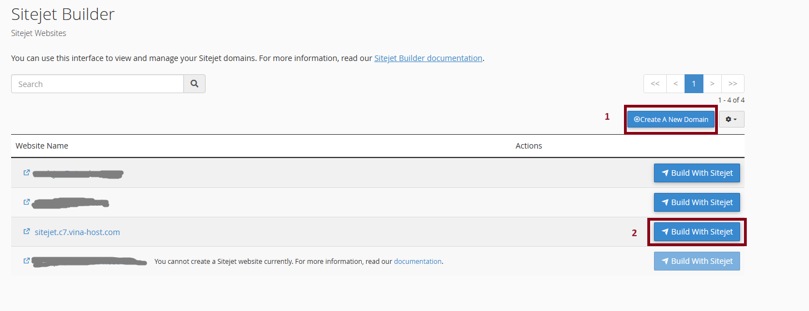
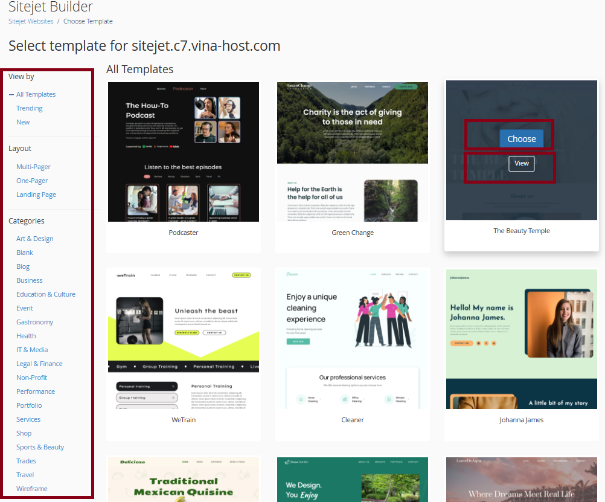
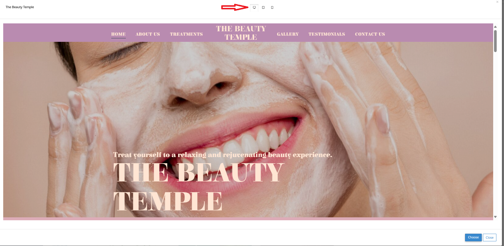
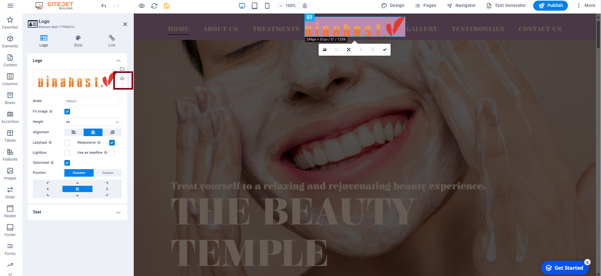
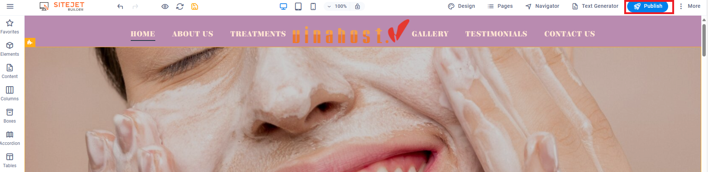
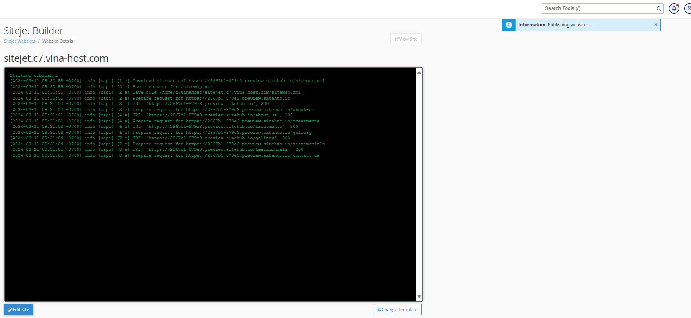
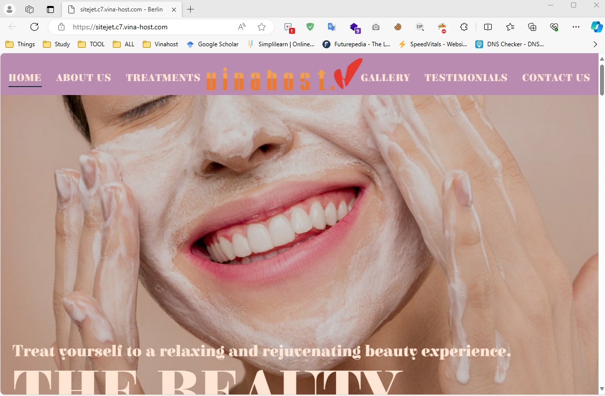
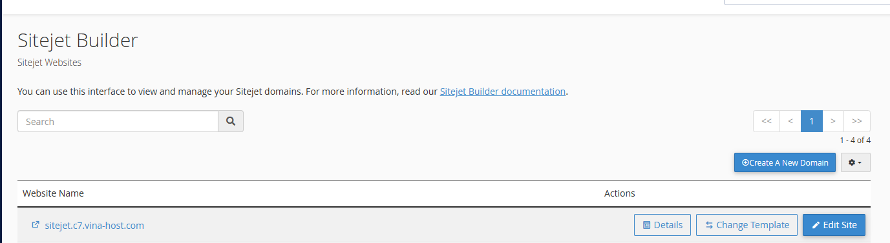

Bài viết này sẽ hướng dẫn bạn **tạo trang web với Sitejet Builder trên cPanel**. Nếu bạn cần hỗ trợ, xin vui lòng liên hệ VinaHost qua **Hotline 1900 6046 ext.3**, email về [support@vinahost.vn](mailto:support@vinahost.vn) hoặc chat với VinaHost qua livechat [https://livechat.vinahost.vn/chat.php](https://livechat.vinahost.vn/chat.php).

[Sitejet Builder](https://cpanel.net/sitejet-builder) là một công cụ tạo website trực tuyến, giúp bạn có thể tạo một website đẹp, nhiều chức năng mà không cần có nhiều kiến thức về thiết kế hay lập trình.

### Truy cập vào Sitejet Builder trong cPanel
Để bắt đầu, hãy đăng nhập vào cpanel của bạn và chọn Sitejet Builder.
Bạn sẽ tìm thấy tính năng này ở cột menu bên trái hoặc trong mục Domains

Lưu ý:
Khi bạn xuất bản một trang web Sitejet, hệ thống sẽ xóa tất cả các tệp và thư mục con khỏi thư mục gốc của tên miền đã chọn bao gồm tệp .htaccess và bất kỳ thư mục con nào.

Bạn có thể xem và quản lý thư mục gốc của têm miền trong giao diện Domains của cPanel (cPanel » Home » Domains).

### Thêm tên miền để sử dụng Sitejet Builder

Nếu bạn chỉ có duy nhất 1 domain và chưa cài đặt trang web nào thì Sitejet Builder sẽ chuyển hướng đến Sitejet Websites/Choose Template.Giả sử bạn đã có một tên miền với một trang web trên đó, bạn sẽ cần phải tạo một tên miền mới cho trang web sitejet. Chọn Create A New Domain(1) để tạo domain mới

Sau khi chọn **Build With Sitejet** bạn sẽ được đưa vào trang chọn mẫu. Ở đây có rất nhiều mẫu theo chủ đề và lĩnh vực. Bạn có thể tìm kiếm mẫu ở **Cột bên trái**, sau đó chọn **View** để xem trước. Nếu mẫu phù hợp bạn hãy chọn **Choose** để cài đặt vào tên miền.

Khi click vào chế độ View sẽ chuyển sang giao diện xem trước nếu thấu phù hợp bạn có thể click vào choose để chọn mẫu này.  Trong phần view phía trên sẽ có các chế độ xem: Desktop, Table và Mobile.

### Thiết kế lại giao diện
Khi bạn lựa chọn giao diện thì sẽ chuyển hướng sang trang cms.sitehub.io của Sitejet  để thao tác chỉnh sửa. Việc chỉnh sữa thì thao tác trực tiếp . Ví dụ muốn đổi lại logo của trang web thì bạn click và upload logo mới lên website. Bài viết này chỉ demo qua 1 vài thao tác thiết kế, điều chỉnh lại giao diện bạn chọn.

Sau khi thiết kế xong bạn click vào Publish để đẩy web lên hosting của bạn.

Tiếp theo là bạn đợi Sitejet cài đặt website lên hosting

Và bây giờ truy cập vào website để xem kết quả

### Các tuỳ chỉnh sau thiết kế

Nếu bạn muốn thay đổi lại Page trên bạn hãy truy cập vào lại Sitejet Builder. Tại đây sẽ có 3 hành đồng cho bạn lựa chọn.

- Details: Xem chi tiết website
- Change Template: Thay đổi một mẫu mới
- Edit Site: Chỉnh sửa lại website

Sitejet Builder là một công cụ tạo website trực tuyến giúp bạn dễ dàng tạo một website đẹp và chuyên nghiệp mà không cần có kiến thức về thiết kế hay lập trình. Sitejet Builder cung cấp một loạt các tính năng và công cụ, bao gồm:

- Mẫu thiết kế đẹp mắt và chuyên nghiệp
- Trình chỉnh sửa kéo và thả dễ sử dụng
- Hệ thống quản lý nội dung mạnh mẽ
- Tính năng tối ưu hóa công cụ tìm kiếm

### "Bạn không thể tạo một trang web Sitejet": Làm thế nào để giải quyết vấn đề này

Bạn có thể thấy một tên miền được liệt kê trong giao diện Sitejet Builder không cho phép bạn tạo một trang web, hiển thị thông báo này bên dưới "Bạn không thể tạo trang web Sitejet hiện tại". Nó có thể là một trong những lý do sau đây:

- Thư mục gốc đang được chia sẻ(dùng chung) với tên miền khác

    Bạn không thể sử dụng thư mục gốc được chia sẻ với Sitejet. Để khắc phục sự cố này, hãy thực hiện một trong các thao tác sau:

    - Sử dụng Tên miền chính.
    - Tạo một tên miền mới.
    - Xóa tên miền phụ đang dùng chung thư mục gốc hoặc đổi vị trí thư mục gốc của tên miền phụ.
    
- Trang web chuyển hướng
    Tương tự, bạn không thể sử dụng một trang web được chuyển hướng với Sitejet. Để giải quyết vấn đề này, hãy thực hiện các bước sau:

    - Điều hướng đến giao diện Chuyển hướng (cPanel » Home » Domains » Redirects).
    - Điều hướng đến Chuyển hướng hiện tại. Tìm miền được chuyển hướng mong muốn và nhấp vào Xóa. Một hộp xác nhận sẽ xuất hiện.
    - Nhấp vào Xóa chuyển hướng. Một thông báo thành công sẽ xuất hiện.
- Thư mục gốc của chứa các tệp hoặc đang cài đặt cms khác ví dụ như wordpress
    Nếu thư mục gốc của bạn chứa các tệp hoặc đang cài đặt cms khác, thật không may, bạn không thể xuất bản một trang web với Sitejet. Để giải quyết vấn đề này, bạn phải xoá các tệp trong thư mục này hoặc xoá wordpress.

    Tuy nhiên, trước khi bạn xóa nó, nó được khuyến khích. Bạn tạo một bản sao lưu các tập tin của bạn. Để tạo bản sao lưu, hãy thực hiện các bước sau:

    - Điều hướng đến giao diện Domains (cPanel » Home » Domains » Domains).
    - Nhấp vào Document Root được liệt kê bên cạnh tên miền mong muốn. Giao diện File Manager (cPanel » Home » Files » File Manager) sẽ xuất hiện.
    - Nhấp vào **Select All** trong menu.
    - Sau đó, nhấp ***Compress*** trên thanh công cụ. Chọn Zip Archive.
    - Hệ thống sẽ sử dụng tên của tệp đầu tiên trong thư mục theo mặc định. Bạn có thể sử dụng tên này hoặc thay đổi nó thành một cái gì đó khác. Ví dụ: /public_html/backup.zip.
    - Sau đó, nhấp vào Compress Files. Thao tác này sẽ nén tất cả các tệp trong thư mục gốc của của bạn.
    - Tìm tệp nén và tải xuống.

    Bản sao lưu sẽ được tải xuống từ thư mục gốc về máy tính của bạn, sau đó bạn có thể xóa các tệp khỏi thư mục này.

    Bây giờ bạn có thể tạo một trang web Sitejet cho tên miền.

> **THAM KHẢO CÁC DỊCH VỤ TẠI [VINAHOST](https://vinahost.vn/)**
> 
> **\>>** [**SERVER**](https://vinahost.vn/thue-may-chu-rieng/) **–** [**COLOCATION**](https://vinahost.vn/colocation.html) – [**CDN**](https://vinahost.vn/dich-vu-cdn-chuyen-nghiep)
> 
> **\>> [CLOUD](https://vinahost.vn/cloud-server-gia-re/) – [VPS](https://vinahost.vn/vps-ssd-chuyen-nghiep/)**
> 
> **\>> [HOSTING](https://vinahost.vn/wordpress-hosting)**
> 
> **\>> [EMAIL](https://vinahost.vn/email-hosting)**
> 
> **\>> [WEBSITE](http://vinawebsite.vn/)**
> 
> **\>> [TÊN MIỀN](https://vinahost.vn/ten-mien-gia-re/)**