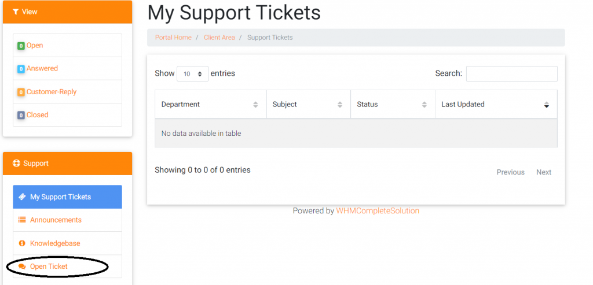

Bài viết này nhằm hướng dẫn Quý Khách hàng phải làm gì để **thanh toán ngoài giờ hành chính** và sau khi thanh toán ngoài giờ hành chính nên làm gì để được **mở lại dịch vụ** hoặc **Kích hoạt mới dịch vụ** khi Phòng kế toán chưa kịp xác nhận thanh toán.

Vì ngoài giờ hành chính nên VinaHost **không tiếp nhận hình thức thanh toán trực tiếp tại văn phòng công ty**, rất mong Quý khách hàng thông cảm.

Ngoài giờ hành chính, Quý khách hàng có thể xem xét việc thanh toán qua hình thức sau: **Paypal, Internet Banking, QR Payment, Momo hoặc qua ATM**.

**Lưu ý:** Quý khách hàng có thể tham khảo cách thức [**thanh toán**](https://vinahost.vn/thanh-toan)

## Để được add tiền tự động/kích hoạt tự động/gia hạn tự động

Để được add tiền tự động và kích hoạt, gia hạn dịch vụ tự động quý khách lưu ý chọn các hình thức thanh toán sau:

### **Thanh toán qua** **Credit Card VNĐ (Visa, Master, American, JCB)** _(Khuyến khích thực hiện thanh toán)_

Xem hướng dẫn tại [**Hướng Dẫn Thanh Toán Qua CREDIT CARD (VND)**](huong-dan-thanh-toan-qua-credit-card-vnd.md)

### **Thanh toán qua** **QR Payment (ZaloPay, VNPay, mPay, QR Bank…), Ví điện tử MoMo, và Online Banking (ATM, Bank)**  _(Khuyến khích thực hiện thanh toán)_

Xem hướng dẫn tại [**Thanh Toán Trực Tuyến (Online Banking/QR Payment/Momo)**](thanh-toan-truc-tuyen-online-payment.md)

### **Thanh toán qua Paypal và CREDIT CARD USD** _(Khuyến khích thực hiện thanh toán)_

Xem hướng dẫn tại [**Hướng Dẫn Thanh Toán Qua PAYPAL Và Credit Card USD**](huong-dan-thanh-toan-qua-paypal.md)

### **Thanh toán qua chuyển khoản ngân hàng (Transfer banking)**

Xem hướng dẫn tại [**Hướng Dẫn Thanh Toán Trực Tiếp và Chuyển Khoản**](huong-dan-thanh-toan-truc-tiep.md)

_Lưu ý: ghi rõ **số hóa đơn điện tử** trong nội dung thanh toán để được add tiền tự động._

## Các hình thức không add tiền tự động/không kích hoạt tự động và cách xử lý

### **Hình thức không add tiền tự động**

Thanh toán qua chuyển khoản ngân hàng (Transfer banking) **không có ghi nội dung là số hóa đơn điện tử** mà ghi nội dung khác như email, tên miền đi kèm, không có nội dung hoặc chỉ có số tài khoản người chuyển do chuyển khoản từ cây ATM.

### **Cách xử lý**

#### **_Trường hợp đã thanh toán hóa đơn của dịch vụ nhưng không được add tiền tự động_**

Quý khách hàng vui lòng chụp hình hoặc scan **_Ủy nhiêm chi ngân hàng_** (Quý khách hàng lưu ý tên người chuyển, số tài khoản đi và đến, nội dung, số tiền,ngày ủy nhiệm chi phải rõ ràng).

Sau đó, quý Khách hàng vui lòng đăng nhập vào hệ thống tài khoản tại VinaHost, tại hệ thống hỗ trợ khách hàng, chọn gửi yêu cầu hỗ trợ, sau đó chọn hỗ trợ 24/7 và gửi ticket yêu cầu hỗ trợ.

#### **_Trường hợp đã thanh toán hóa đơn được add tiền tự động nhưng dịch vụ không được kích hoạt tự động_**

Các dịch vụ không được kích hoạt tự động bao gồm kích hoạt và gia hạn tên miền, SSL, cho thuê chỗ đặt và máy chủ. Trong trường hợp này, Quý khách vui lòng đăng nhập vào hệ thống tài khoản tại VinaHost, tại hệ thống hỗ trợ khách hàng, chọn gửi yêu cầu hỗ trợ, sau đó chọn **hỗ trợ 24/7 và gửi ticket yêu cầu hỗ trợ**.

#### _Trường hợp Quý khách hàng không thể thực hiện thanh toán qua các hình thức trên, tuy nhiên, dịch vụ của Quý khách đã bị khóa hoặc dịch vụ mới cần kích hoạt ngay._

- **Cách 1:** Quý khách hàng vui lòng liên hệ với nhân viên Phòng kinh doanh hoặc Phòng chăm sóc khách hàng để được hỗ trợ bảo lãnh gia hạn, nâng cấp hoặc kích hoạt dịch vụ.
- **Cách 2:** Nếu trong trường hợp Quý khách hàng không thể liên hệ với nhân viên phòng kinh doanh hoặc Phòng chăm sóc khách hàng vui lòng đăng nhập vào hệ thống tài khoản tại VinaHost, tại hệ thống hỗ trợ khách hàng, chọn gửi yêu cầu hỗ trợ, sau đó chọn [hỗ trợ 24/7](https://vinahost.vn/ho-tro/) và gửi ticket yêu cầu hỗ trợ.

_**\*\*\*Lưu ý:** Trường hợp này không áp dụng đối với gia hạn, đăng ký tên miền hoặc kích hoạt bản quyền. Mong Quý khách thông cảm._ 

Đến giờ hành chính, đối với các khách hàng đã thanh toán, Phòng kế toán sẽ tiến hành xác nhận thanh toán. Đối với các khách hàng chưa thanh toán, vui lòng liên hệ Phòng kế toán để được hướng dẫn thanh toán. Xin chân thành cảm ơn.

> **THAM KHẢO CÁC DỊCH VỤ TẠI [VINAHOST](https://vinahost.vn/)**
> 
> **\>>** [**SERVER**](https://vinahost.vn/thue-may-chu-rieng/) **–** [**COLOCATION**](https://vinahost.vn/colocation.html) – [**CDN**](https://vinahost.vn/dich-vu-cdn-chuyen-nghiep)
> 
> **\>> [CLOUD](https://vinahost.vn/cloud-server-gia-re/) – [VPS](https://vinahost.vn/vps-ssd-chuyen-nghiep/)**
> 
> **\>> [HOSTING](https://vinahost.vn/wordpress-hosting)**
> 
> **\>> [EMAIL](https://vinahost.vn/email-hosting)**
> 
> **\>> [WEBSITE](http://vinawebsite.vn/)**
> 
> **\>> [TÊN MIỀN](https://vinahost.vn/ten-mien-gia-re/)**