Bài viết này sẽ hướng dẫn bạn cách **add địa chỉ [IPv4 và IPv6](https://blog.vinahost.vn/ipv4-ipv6-la-gi/) trên Windows Server**. Nếu bạn cần hỗ trợ, xin vui lòng liên hệ [VinaHost](https://vinahost.vn/) qua **Hotline 1900 6046 ext.3, email về support@vinahost.vn hoặc chat với VinaHost qua livechat https://livechat.vinahost.vn/chat.php.**

## Mục tiêu:

- Thêm địa chỉ IPv4 và IPv6 trên Windows Server (nhiều IP).

## Chuẩn bị:

- Một server hoặc máy ảo đã được cài đặt **Window Server** (Trong hướng dẫn này dùng **Window Server 2012R2**).

## Tiến hành:

Nhấn tổ hợp phím **Win + R**, sau đó nhập **ncpa.cpl** và nhấn **Enter**.

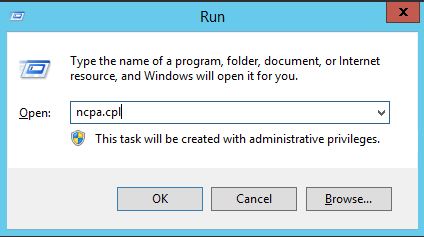

Cửa sổ **Network Connections** sẽ hiện ra. Chọn **Ethernet Adapter** phù hợp để thay đổi địa chỉ IP.

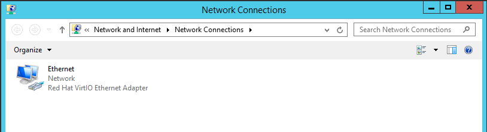

Nhấn chuột phải vào **Ethernet Adapter**, chọn **Properties**.

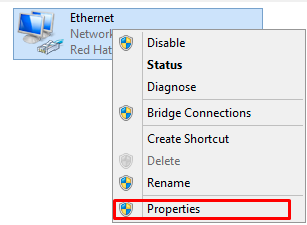

### Thêm địa chỉ IPv4:

Thông tin **IPv4** được cấp từ nhà cung cấp tương tự như sau:

        IPv4 = 103.9.79.250
        Netmask = 255.255.255.0
        Gateway = 103.9.79.254
        DNS 8.8.8.8, 8.8.4.4

Tại cửa sổ **Ethernet Properties**, chọn **Internet Protocol Version 4 (TCP/IPv4)** và chọn **Properties**.

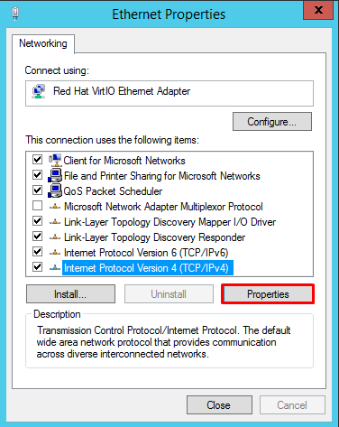

Chọn **Use the following IP address**, điền thông tin **IPv4** được cấp từ nhà cung cấp. Nhấn **OK** để đóng cửa sổ.

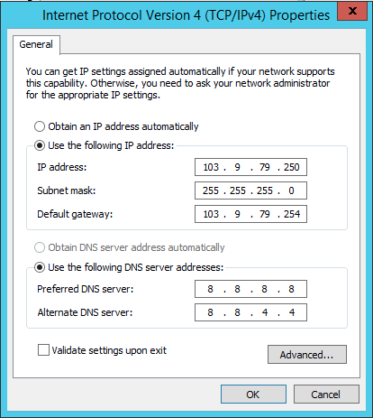

Nhấn **OK** tại cửa sổ **Ethernet Properties**.

Nhấn **Close** tại cửa sổ **Ethernet Status**.

Kiểm tra thông tin **IPv4** đã đặt bằng CMD (**Command Promt**).

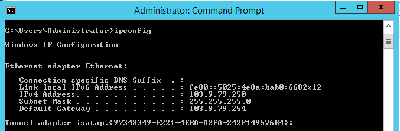

### Thêm nhiều địa chỉ IPv4:

Thông tin **IPv4** được cấp từ nhà cung cấp tương tự như sau:

    IPv4 = 103.9.79.251, 103.9.79.252
    Netmask = 255.255.255.0
    Gateway = 103.9.79.254

Tại cửa sổ **Ethernet Properties**, chọn **Internet Protocol Version 4 (TCP/IPv4)** và chọn **Properties**.

Chọn **Advanced…**

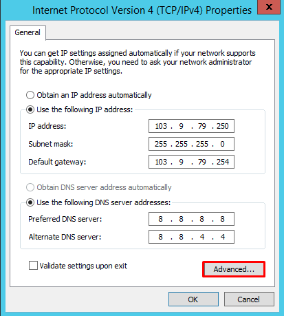

Nhấn **Add**, sau đó điền thông tin **IPv4** thêm. Chọn **Add** để đóng cửa sổ **Advanced TCP/IP Settings**.

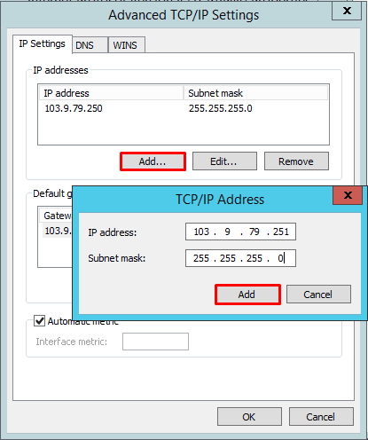

Nhấn **Add** một lần nữa để thêm **IP** tiếp theo.

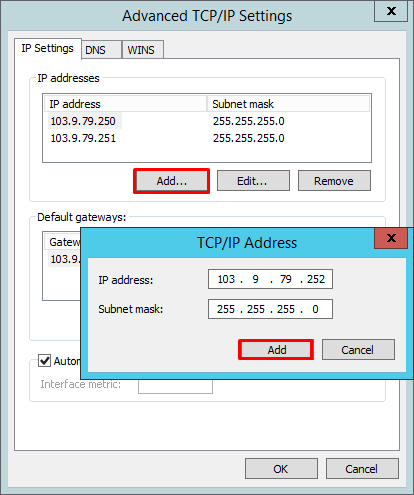

Chọn **OK** ở cửa sổ **Advanced TCP/IP Settings**.

Chọn **OK** ở cửa sổ **Internet Protocol Version 4 (TCP/IPv4) Properties**.

Chọn **Close** ở cửa sổ **Ethernet Properties**.

Chọn **Close** ở cửa sổ **Ethernet Status**.

Kiểm tra thông tin **IPv4** đã được thêm bằng CMD (**Command Promt**).

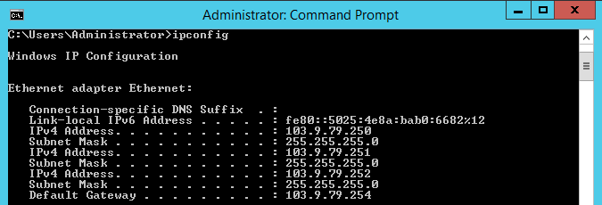

### Thêm địa chỉ IPv6:

Thông tin **IPv6** được nhận từ nhà cung cấp tương tự như sau:

        IPv6 = 2401:5F80:5001:3:2000::101
        Netmask = /69
        Gateway = 2401:5F80:5001:3:2000::1
        DNS= 2001:4860:4860::8888, 2001:4860:4860::8844

Tại cửa sổ **Ethernet Properties**, chọn **Internet Protocol Version 6 (TCP/IPv6)** và chọn **Properties**.

Chọn **Use the following IPv6 address**, điền thông tin **IPv6** được cấp từ nhà cung cấp.

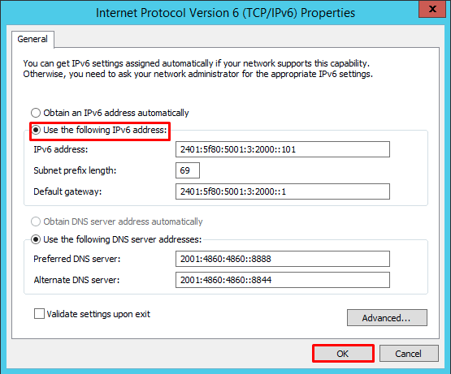

Chọn **OK** ở cửa sổ **Internet Protocol Version 6 (TCP/IPv6) Properties**.

Chọn **Close** ở cửa sổ **Ethernet Properties**.

Chọn **Close** ở cửa sổ **Ethernet Status**.

Kiểm tra thông tin **IPv6** đã được đặt bằng CMD (**Command Promt**).

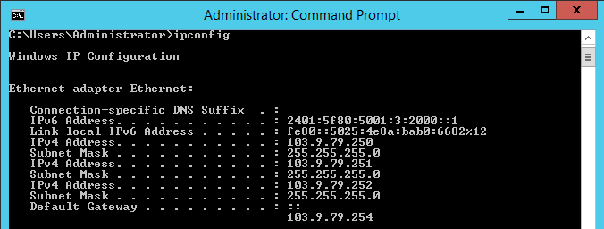

### Thêm nhiều địa chỉ IPv6:

Thông tin IPv6 được cấp từ nhà cung cấp tương tự như sau:

        IPv4 = 2401:5F80:5001:3:2000::102, 2401:5F80:5001:3:2000::103
        Netmask = /69
        Gateway = 2401:5F80:5001:3:2000::1
        DNS= 2001:4860:4860::8888, 2001:4860:4860::8844

Tại cửa sổ **Ethernet Properties**, chọn **Internet Protocol Version 6 (TCP/IPv6)** và chọn **Properties**.

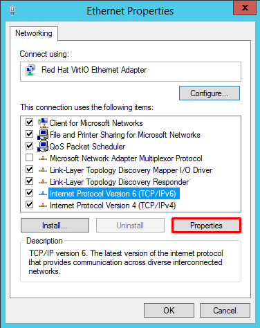

Chọn **Advanced…**

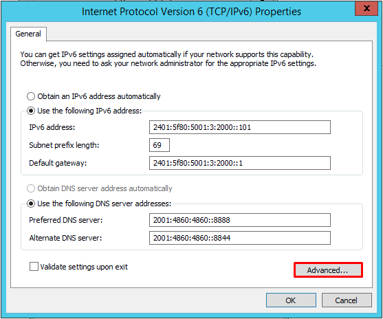

Nhấn **Add**, điền thông tin **IPv6** thêm, nhấn **Add** lần nữa để đóng cửa sổ điền.

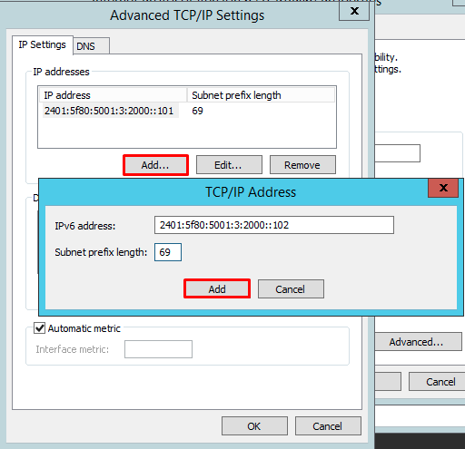

Thực hiện thêm **IP** tiếp theo tương tự.

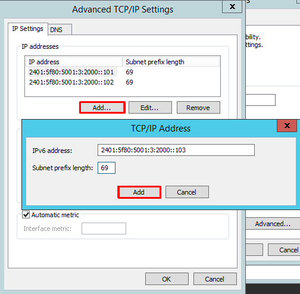

Chọn **OK** ở cửa sổ **Advanced TCP/IP Settings**.

Chọn **OK** ở cửa sổ **Internet Protocol Version 6 (TCP/IPv6) Properties**.

Chọn **Close** ở cửa sổ **Ethernet Properties**.

Chọn **Close** ở cửa sổ **Ethernet Status**.

Kiểm tra thông tin **IPv6** đã được đặt bằng CMD (**Command Promt**).

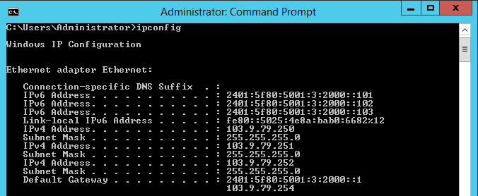

Vậy là chúng tôi đã hướng dẫn xong cách add địa chỉ **IPv4** và **IPv6** trên **Windows Server**. Chúc bạn thành công!

> **THAM KHẢO CÁC DỊCH VỤ TẠI VINAHOST:**
> 
> **\>>** [**SERVER**](https://vinahost.vn/server.php) **-** [**COLOCATION**](https://vinahost.vn/colocation.html) - [**CDN**](https://vinahost.vn/dich-vu-cdn-chuyen-nghiep)
> 
> **\>> [CLOUD](https://vinahost.vn/cloud-server.html) - [VPS](https://vinahost.vn/vps.html)**
> 
> **\>> [HOSTING](https://vinahost.vn/wordpress-hosting)**
> 
> **\>> [EMAIL](https://vinahost.vn/email-hosting.html)**
> 
> **\>> [WEBSITE](http://vinawebsite.vn/)**
> 
> **\>> [TÊN MIỀN](https://vinahost.vn/bang-gia-ten-mien.html)**
> 
> **\>>** [**SSL**](https://vinahost.vn/geotrust-ssl.html)