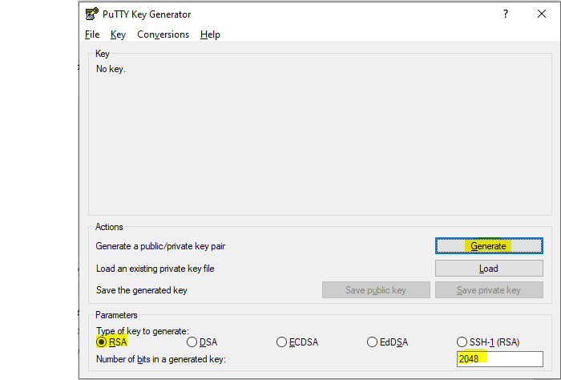
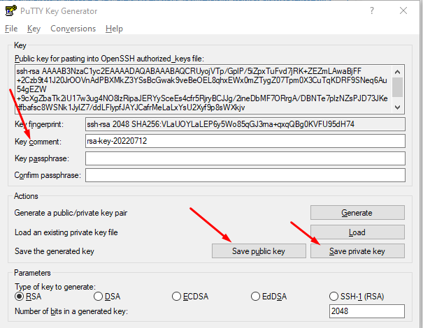
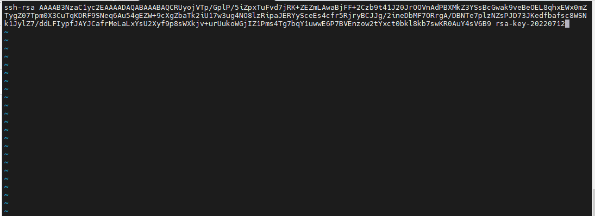
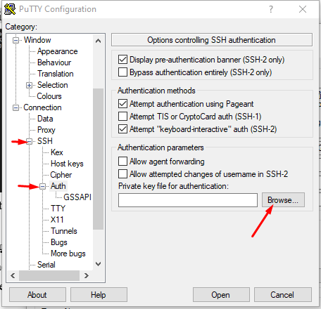
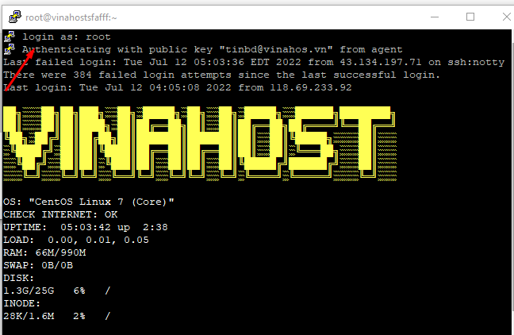

Bài viết này sẽ hướng dẫn bạn cách **Tạo SSH KEY Và Thêm SSH Key Vào Trong VPS**. Nếu bạn cần hỗ trợ, xin vui lòng liên hệ VinaHost qua Hotline 1900 6046 ext.3, email về support@vinahost.vn hoặc chat với VinaHost qua livechat https://livechat.vinahost.vn/chat.php.

## **1\. Hướng dẫn tạo SSH KEY trên máy Windows**

Đầu tiên chúng ta cần cài đặt phần mềm **PuTTYgen**, sau khi cài đặt xong bạn mở và chọn theo các tuỳ chọn bên dưới rồi ấn **Generate:** 

Bạn đợi chạy xong tùy chọn, trong quá trình chạy phải rê chuột thường xuyên đến khi chạy xong. Sau khi chạy xong bạn sẽ thấy như sau:

**Key passphrase** bạn có thể điền vào hoặc không. Sau đó, bạn save **public key** lại vào thư mục, đồng thời save **private key** và đặt dịnh dạng là `.ppk` (không đưa file này cho người khác tránh trường hợp họ có thể **login** vào **VPS** của bạn)

## **2\. Thêm SSH KEY vào trong VPS**

Bây giờ, bạn hãy đăng nhập vào **VPS** với **user** mà bạn cần thêm **key** (thường thì là **root**, nhưng nếu **VPS** bạn có nhiều **user** thì sẽ cần thêm **key** cho tất cả **user** đó).

Sau đó gõ các lệnh dưới đây để tạo thư mục `.ssh/` và file `authorized\_keys` trong thư mục đó.

#mkdir ~/.ssh
#chmod 700 ~/.ssh
#touch ~/.ssh/authorized\_keys
#chmod 600 ~/.ssh/authorized\_keys

Sau đó, bạn mở file `authorized\_keys` trong thư mục `.ssh` ở thư mục gốc của **user** và copy toàn bộ ký tự của **public key** vào.

#cd .ssh
#vi authorized\_keys

Cuối cùng bạn lưu lại và thoát khỏi file.

## **3\. Cách sử dụng SSH KEY để login vào VPS**

Đầu tiên các bạn mở `PuTTY` lên vài làm theo như trong hình. Hãy chọn đường dẫn của file **SSH Key** vừa mới tạo ra ở trên để xác thực khi **login** vào VPS.

Để đảm bảo không ai có thể đăng nhập vào **VPS** của bạn bằng mật khẩu **root** và **user**, bạn cần vào file **sshd\_config**

#   vi /etc/ssh/sshd\_config

Tìm dòng -> `PasswordAuthentication yes`

Sau đó sửa `yes` -> `no`

Hãy lưu lại và **restart sshd**

\# systemctl restart sshd

Kết nối **SSH** bằng `PuTTy` như thế này là thành công.

Chúc quý khách thực hiện thành công!

> **THAM KHẢO CÁC DỊCH VỤ TẠI [VINAHOST](https://vinahost.vn/)**
> 
> **\>>** [**SERVER**](https://vinahost.vn/thue-may-chu-rieng/) **–** [**COLOCATION**](https://vinahost.vn/colocation.html) – [**CDN**](https://vinahost.vn/dich-vu-cdn-chuyen-nghiep)
> 
> **\>> [CLOUD](https://vinahost.vn/cloud-server-gia-re/) – [VPS](https://vinahost.vn/vps-ssd-chuyen-nghiep/)**
> 
> **\>> [HOSTING](https://vinahost.vn/wordpress-hosting)**
> 
> **\>> [EMAIL](https://vinahost.vn/email-hosting)**
> 
> **\>> [WEBSITE](http://vinawebsite.vn/)**
> 
> **\>> [TÊN MIỀN](https://vinahost.vn/ten-mien-gia-re/)**
