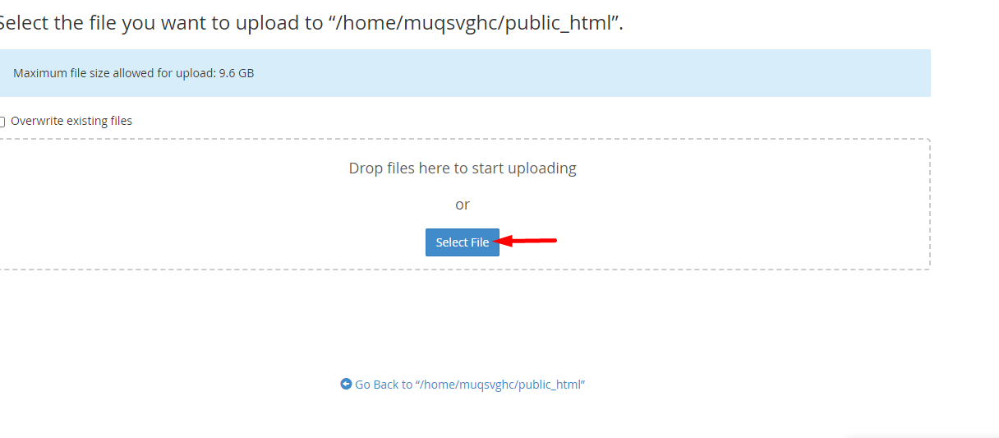

Bài viết này sẽ hướng dẫn bạn cách **Cài Đặt WordPress Lên Hosting cPanel**. Nếu bạn cần hỗ trợ, xin vui lòng liên hệ VinaHost qua Hotline 1900 6046 ext.3, email về support@vinahost.vn hoặc chat với VinaHost qua livechat https://livechat.vinahost.vn/chat.php.

### Bước 1: Download mã nguồn WordPress

\- Bạn cần lên [trang chủ](https://wordpress.org/download/) và tải về với phiên bản mới nhất, hiện tại là phiên bản 5.0.

\- Bạn cần thêu domain và hosting cpanel.

\- Đăng kí một domain (phải trỏ về host).

\- Mã nguồn Wourdpress (có thể download ở link này [https://vi.wordpress.org/](https://vi.wordpress.org/)).

**Bước 2:** Chúng ta cần phải đăng nhập vào trang quản trị cpanel:

Tiếp đó, bạn cần upload mã nguồn Wordpress lên hosting:

- Các bạn kéo xuống chỗ file => file manager

- Vào thư mục **puclic\_html** xóa hết cái file và folder đang có sẵn ở đó (là những file tự động tạo ra và không cần thiết) sau khi đã xóa hết file vào phần **Upload** để up mã nguồn Wordpress lên:

- Chọn **select file** để upload file

- Sau khi upload xong bạn click chuột phải và chọn **Extract** (để giải nén).
- Lưu ý: Vì file ZIP bạn tải về năm trong một folder tên là wordpress, bạn phải di chuyển tất cả thư mục trong đó ra ngoài thư mục gốc. Tại thư mục wordpress vừa giải nén, chọn tất cả **(Select All)** các file và folder, chọn **Move**, bạn hãy xóa dòng wordpress và nhấn vào **Move Files**, sau khi làm xong bạn hãy xóa thư mục Wordpress đi:

**Bước 3:** Tạo database trên Cpanel

- Sau khi đã upload mã nguồn WordPress lên Hosting thì bạn cần tạo một database, chọn vào phần **Databases** => **MySQL® Databases**.

- Bạn hãy nhập tên database và nhấn vào nút Create Database, như ở hình dưới mình tạo database tên là diemmy

- Tại vị trí **MySQL® Databases** tiến hành tạo user, bạn hãy nhập hai thông tin gôm: **Username** và **Password** để tạo user, mục đích là sẽ gán user này vào database ở trên.

- Sau đó chúng ta tiến hành gán user vào database, Cũng tại vị trí này bạn kéo xuống, tại mục **Add User To Database**, bạn hãy chọn database và user vừa tạo nhấn nút **Add** nhé:

- Sau đó các bạn truy cập vào tên miền đã đăng kí trước đó sẽ được một giao diện như này ấn “thực hiện ngay” để tiến hành tạo trang website, nhập tên database và user đã tạo trước đó vào:

- Sau khi đã nhập xong các bước trên các bạn tiến hành tạo tài khoản quản trị website:

- Sau khi tạo xong tiến hành đăng nhập vào trang quản trị website:

- Vậy là đã hoàn thành việc cài đặt wordpress lên hosting cpanel:

Chúc quý khách thực hiện thành công!

> **THAM KHẢO CÁC DỊCH VỤ TẠI [VINAHOST](https://vinahost.vn/)**
> 
> **\>>** [**SERVER**](https://vinahost.vn/thue-may-chu-rieng/) **–** [**COLOCATION**](https://vinahost.vn/colocation.html) – [**CDN**](https://vinahost.vn/dich-vu-cdn-chuyen-nghiep)
> 
> **\>> [CLOUD](https://vinahost.vn/cloud-server-gia-re/) – [VPS](https://vinahost.vn/vps-ssd-chuyen-nghiep/)**
> 
> **\>> [HOSTING](https://vinahost.vn/wordpress-hosting)**
> 
> **\>> [EMAIL](https://vinahost.vn/email-hosting)**
> 
> **\>> [WEBSITE](http://vinawebsite.vn/)**
> 
> **\>> [TÊN MIỀN](https://vinahost.vn/ten-mien-gia-re/)**
