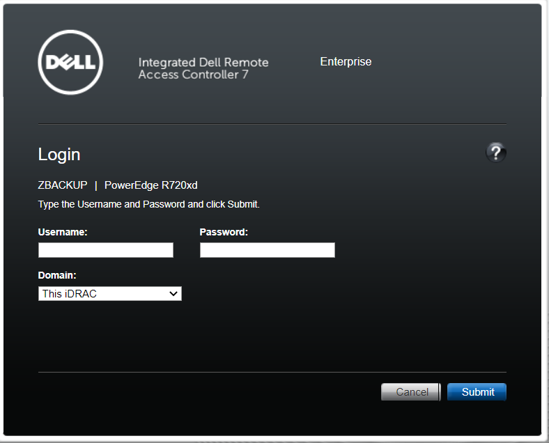
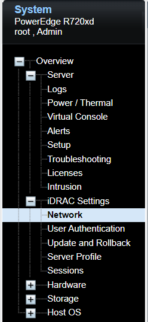
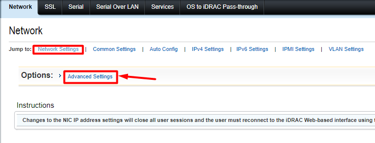
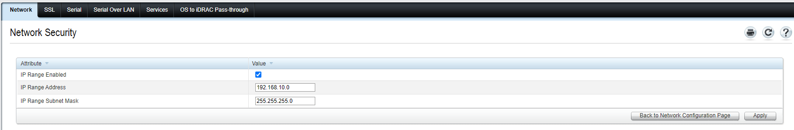

Bài viết này sẽ hướng dẫn bạn **Cấu Hình Lọc IP Truy Cập iDRAC**. Nếu bạn cần hỗ trợ, xin vui lòng liên hệ VinaHost qua **Hotline 1900 6046 ext. 3**, email về [support@vinahost.vn](mailto:support@vinahost.vn) hoặc chat với VinaHost qua livechat [https://livechat.vinahost.vn/chat.php](https://livechat.vinahost.vn/chat.php).

## Hướng Dẫn Cấu Hình Lọc IP Truy Cập iDRAC

Truy cập **IDrac**.

Nhập thông tin đăng nhập.

Thông tin truy cập mặc định:

- User: root
- Password: calvin

Sau khi đăng nhập thành công, menu quản trị sẽ được hiển thị.

Truy cập **iDRAC Settings** và chọn tùy chọn **Network**.

Ở phía trên màn hình, truy cập tab **Network** và chọn tùy chọn **Advanced Settings**.

Nhập địa chỉ **IP** kèm **Subnet Mask** hoặc **Range IP** cho phép truy cập -**\> Apply.**

Chúc bạn thực hiện thành công!

> **THAM KHẢO CÁC DỊCH VỤ TẠI [VINAHOST](https://vinahost.vn/)**
> 
> **\>>** [**SERVER**](https://vinahost.vn/thue-may-chu-rieng/) **–** [**COLOCATION**](https://vinahost.vn/colocation.html) – [**CDN**](https://vinahost.vn/dich-vu-cdn-chuyen-nghiep)
> 
> **\>> [CLOUD](https://vinahost.vn/cloud-server-gia-re/) – [VPS](https://vinahost.vn/vps-ssd-chuyen-nghiep/)**
> 
> **\>> [HOSTING](https://vinahost.vn/wordpress-hosting)**
> 
> **\>> [EMAIL](https://vinahost.vn/email-hosting)**
> 
> **\>> [WEBSITE](http://vinawebsite.vn/)**
> 
> **\>> [TÊN MIỀN](https://vinahost.vn/ten-mien-gia-re/)**