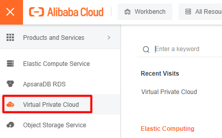
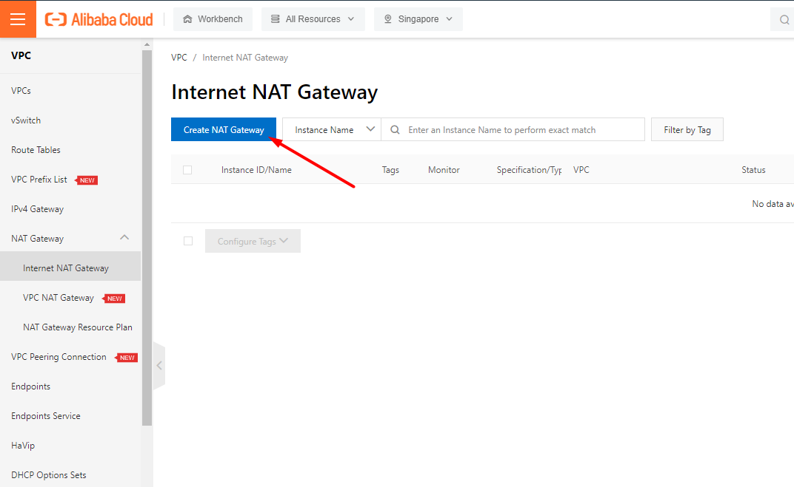
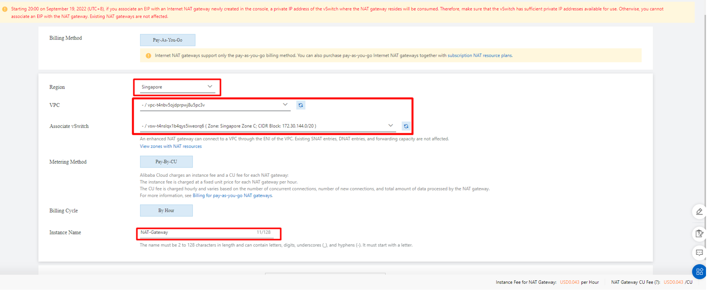
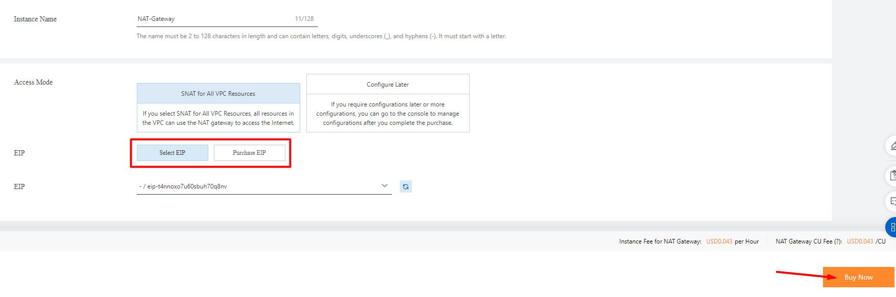
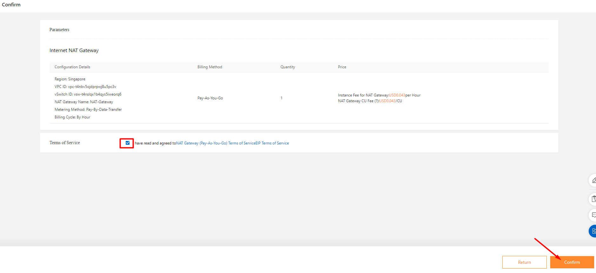
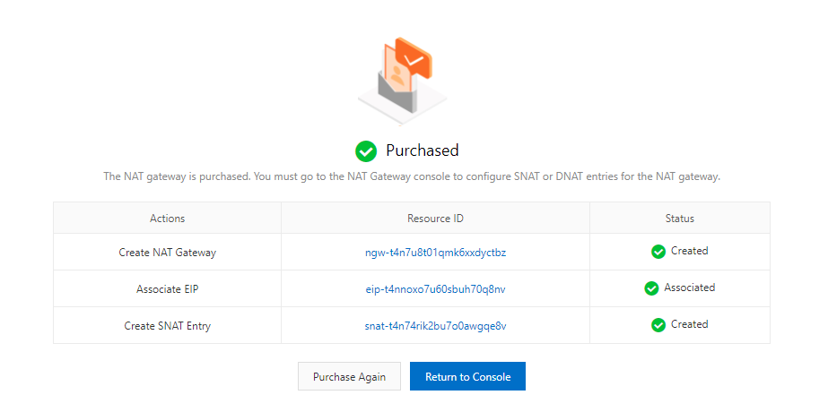
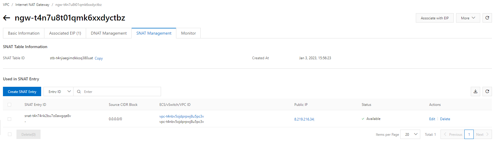
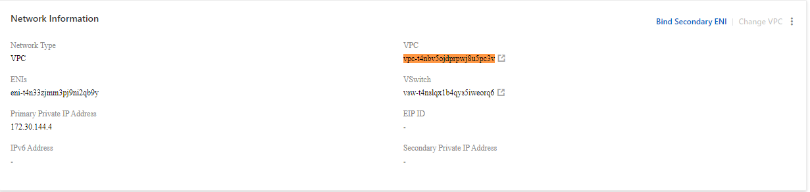
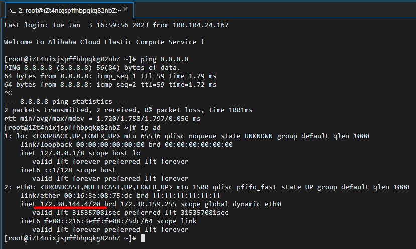

Bài viết này sẽ hướng dẫn bạn **Cấu Hình SNAT Cho ECS Instance Không Có IP Public Truy Cập Internet**. Nếu bạn cần hỗ trợ, xin vui lòng liên hệ VinaHost qua **Hotline 1900 6046 ext.3**, email về [support@vinahost.vn](mailto:support@vinahost.vn) hoặc chat với VinaHost qua livechat [https://livechat.vinahost.vn/chat.php](https://livechat.vinahost.vn/chat.php).

## Cấu Hình SNAT Cho ECS Instance Không Có IP Public Truy Cập Internet

Truy cập VPC:

Vào mục NAT Gateway > Internet NAT Gateway > Create NAT Gateway:

Chọn các Options sau:

- Region: trùng với ECS cần ra Internet
- VPC: trùng với VPC đang gán cho ECS
- Instance Name: đặt tên cho Instance

- EIP: chọn IP dùng để public ra ngoài. Nếu chưa có EIP, chọn Purchase EIP để thuê IP mới.

Confirm

Hệ thống sẽ tự tạo 1 SNAT public ra Internet với EIP và VPC đã chọn ở trên.

ECS local có vpc tương ứng.

ECS local sẽ có thể kết nối Internet.

Chúc bạn thực hiện Cấu Hình SNAT Cho ECS Instance Không Có IP Public Truy Cập Internet thành công!

> **THAM KHẢO CÁC DỊCH VỤ TẠI [VINAHOST](https://vinahost.vn/)**
> 
> **\>>** [**SERVER**](https://vinahost.vn/thue-may-chu-rieng/) **–** [**COLOCATION**](https://vinahost.vn/colocation.html) – [**CDN**](https://vinahost.vn/dich-vu-cdn-chuyen-nghiep)
> 
> **\>> [CLOUD](https://vinahost.vn/cloud-server-gia-re/) – [VPS](https://vinahost.vn/vps-ssd-chuyen-nghiep/)**
> 
> **\>> [HOSTING](https://vinahost.vn/wordpress-hosting)**
> 
> **\>> [EMAIL](https://vinahost.vn/email-hosting)**
> 
> **\>> [WEBSITE](http://vinawebsite.vn/)**
> 
> **\>> [TÊN MIỀN](https://vinahost.vn/ten-mien-gia-re/)**
