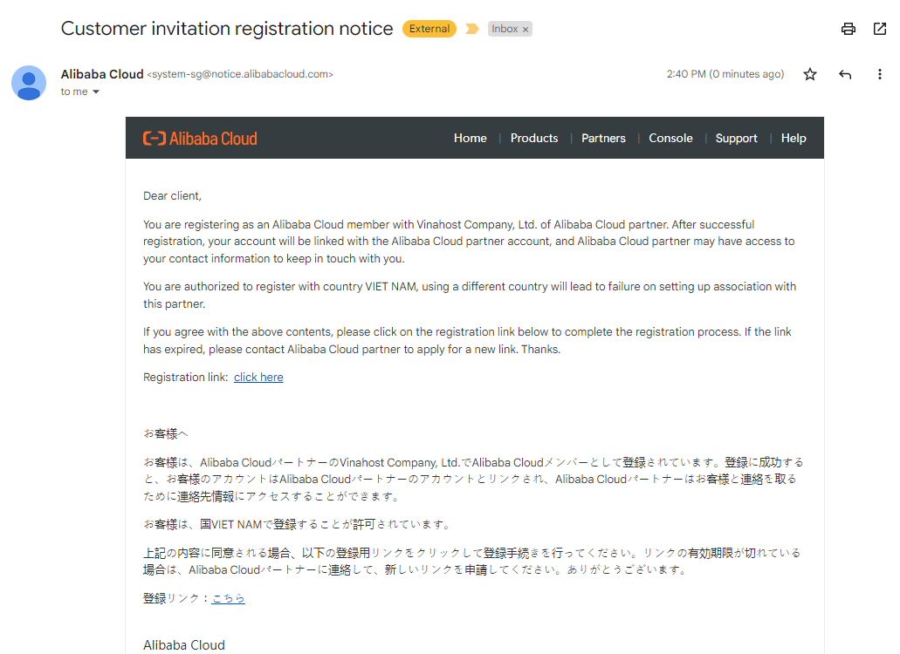
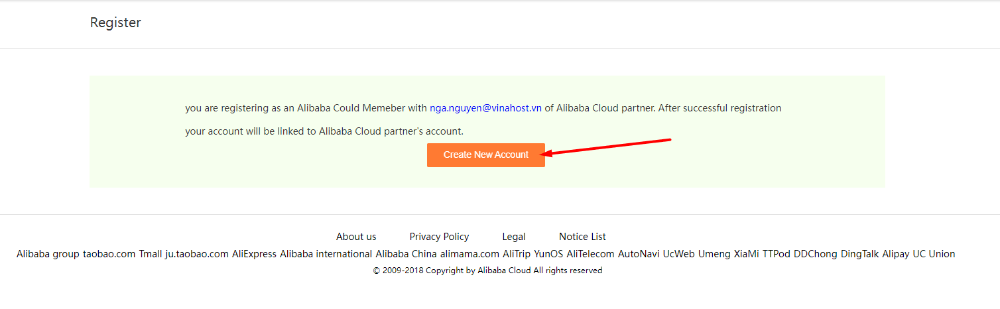
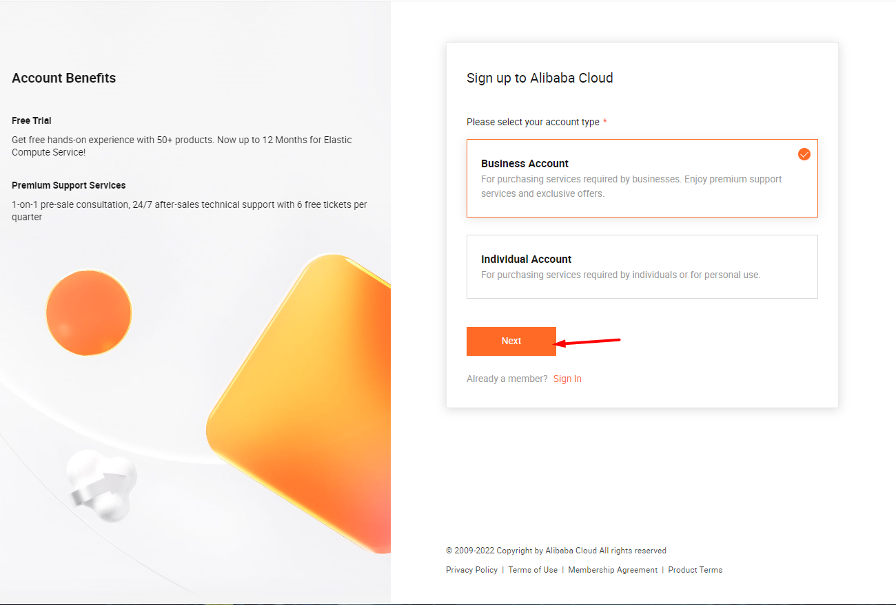
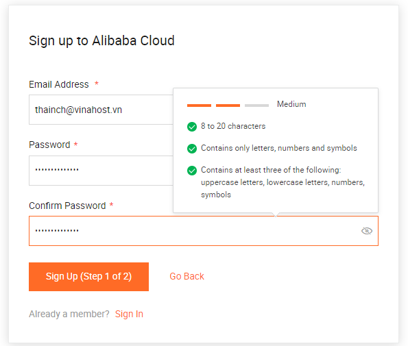
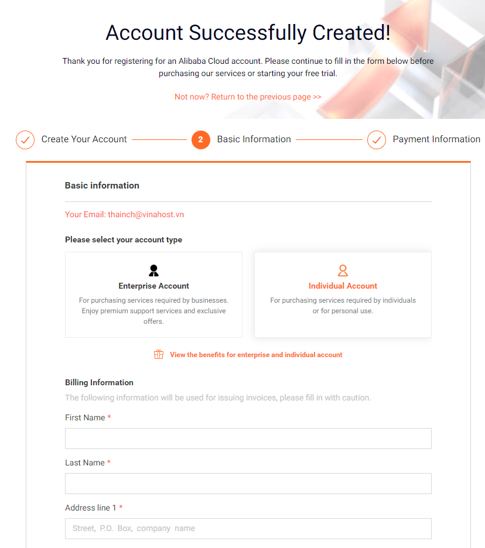

Bài viết này sẽ hướng dẫn bạn cách **Đăng Kí Tài Khoản Alibaba Cloud Thông Qua Partner VinaHost**. Nếu bạn cần hỗ trợ, xin vui lòng liên hệ VinaHost qua **Hotline 1900 6046 ext.3, email về support@vinahost.vn hoặc chat với VinaHost qua livechat https://livechat.vinahost.vn/chat.php**.

<iframe title="YouTube video player" src="https://www.youtube.com/embed/dA-vCTCLtn0" width="560" height="315" frameborder="0" allowfullscreen="allowfullscreen"></iframe>

**Hướng Dẫn Đăng Kí Tài Khoản Alibaba Cloud Thông Qua Partner VinaHost**

## Nhận email đăng kí

Sau khi đăng kí sử dụng dịch vụ, bạn sẽ nhận được **email** với nội dung như bên dưới để **Đăng Kí Tài Khoản Alibaba Cloud** thông qua **partner** **VinaHost**.

## Tạo tài khoản

Chọn **Click here** như trong ảnh để tiến hành đăng ký.

Chọn **Create New Account**

## Chọn loại tài khoản

Chọn **Account type** là *Doanh nghiệp* hoặc là *Cá nhân* rồi **Next**

## Xác thực thông tin

Điền thông tin mail đã đăng ký và mật khẩu

Xác thực số điện thoại

## Hoàn tất đăng kí

**Account** đã được tạo hoàn tất. Bạn tiếp tục điền thêm các thông tin cá nhân để hoàn tất đăng kí tài khoản.

Chúc bạn thực hiện **Đăng Kí Tài Khoản Alibaba Cloud** Thông Qua **Partner VinaHost** thành công!

> **THAM KHẢO CÁC DỊCH VỤ TẠI [VINAHOST](https://vinahost.vn/)**
> 
> **\>>** [**SERVER**](https://vinahost.vn/thue-may-chu-rieng/) **–** [**COLOCATION**](https://vinahost.vn/colocation.html) – [**CDN**](https://vinahost.vn/dich-vu-cdn-chuyen-nghiep)
> 
> **\>> [CLOUD](https://vinahost.vn/cloud-server-gia-re/) – [VPS](https://vinahost.vn/vps-ssd-chuyen-nghiep/)**
> 
> **\>> [HOSTING](https://vinahost.vn/wordpress-hosting)**
> 
> **\>> [EMAIL](https://vinahost.vn/email-hosting)**
> 
> **\>> [WEBSITE](http://vinawebsite.vn/)**
> 
> **\>> [TÊN MIỀN](https://vinahost.vn/ten-mien-gia-re/)**
