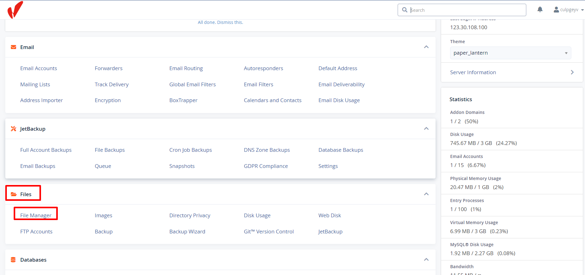
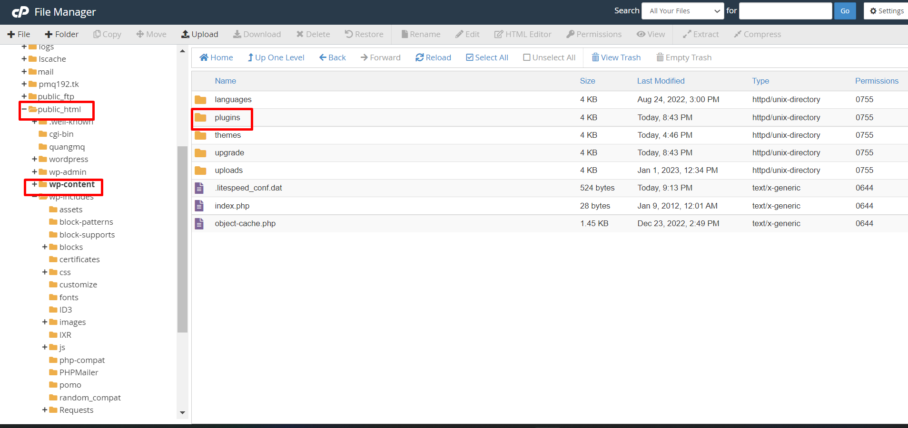
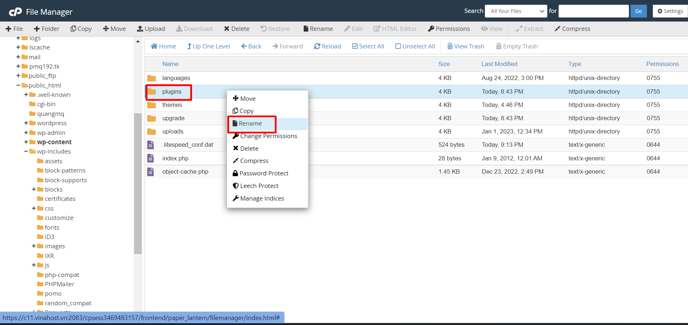
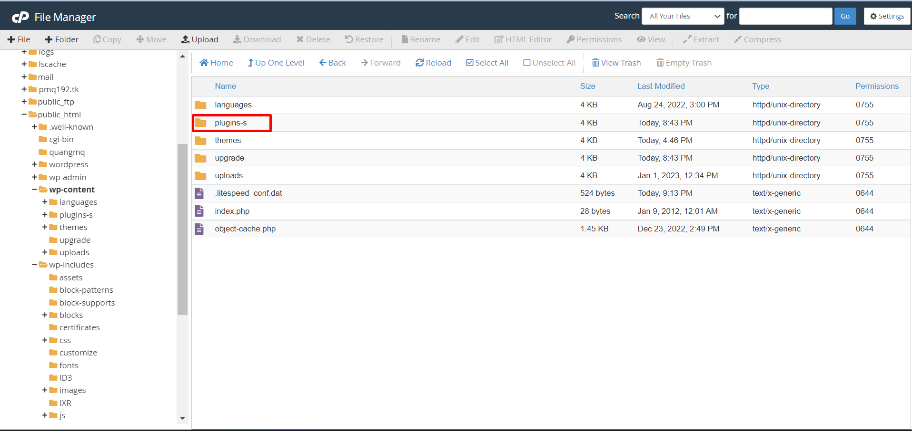
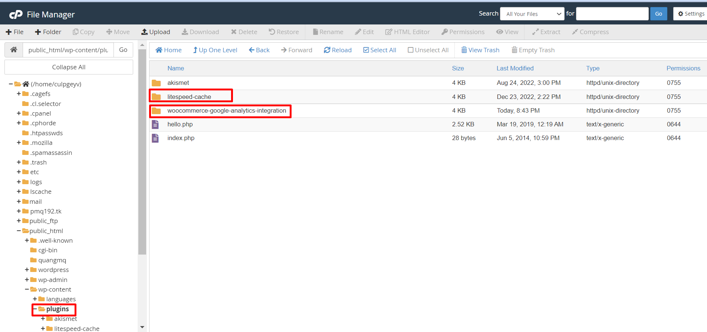

Bài viết này sẽ hướng dẫn bạn thực hiện **Disable Plugin WordPress Bằng File Manager Trên cPanel**. Nếu bạn cần hỗ trợ, xin vui lòng liên hệ VinaHost qua **Hotline 1900 6046 ext.3**, email về [support@vinahost.vn](mailto:support@vinahost.vn) hoặc chat với VinaHost qua livechat [https://livechat.vinahost.vn/chat.php](https://livechat.vinahost.vn/chat.php).

Trường hợp một ngày chúng ta không thể truy cập vào trang quản trị website wp-admin hoặc website không truy cập được, chúng ta có thể kiểm tra bằng cách Disable Plugin WordPress - tắt hết các plugin đang hoạt động (Disable Plugin WordPressvà kiểm tra thử.

## Sau đây VinaHost sẽ hướng dẫn các bạn disable các plugin Wordpress bằng File Manager trên Cpanel.

Đầu tiên chúng ta truy cập vào **Cpanel** chúng ta kéo xuống phần **Files** và chọn vào phần **File Manager**.

Chúng ta chọn vào thư mục chứa source code web cần tắt **plugin**, ở đây đang chọn vào thư mục **public-html** và chọn vào thư mục **wp-content** và tìm đến thư mục **plugins.**

Chúng ta chọn vào thư mục **plugins** và nhấp chuột phải và chọn **Rename** để tiến hành đổi tên thư mục.

Sau khi  đổi tên thư mục **plugins** xong thì toàn bộ **plugin**  đã bị tắt và truy cập vào được trang quản trị website chúng ta bật và tắt thử từng **plugin** xem **plugin** nào là nguyên nhân gây ra sự cố trên nhé.

Chúng ta cũng có thể tắt từng **plugin** thay vì tắt toàn bộ, bằng cách nhấp chuột vào thư mục **plugins** sau đó sẽ hiện ra danh sách plugin trên từng thư mục, nếu chúng ta muốn tắt **plugin** nào thì chỉ cần đổi tên thư mục **plugin** tương ứng.

Chúc bạn thực hiện Disable Plugin WordPress Bằng File Manager Trên cPanel thành công!

> **THAM KHẢO CÁC DỊCH VỤ TẠI [VINAHOST](https://vinahost.vn/)**
> 
> **\>>** [**SERVER**](https://vinahost.vn/thue-may-chu-rieng/) **–** [**COLOCATION**](https://vinahost.vn/colocation.html) – [**CDN**](https://vinahost.vn/dich-vu-cdn-chuyen-nghiep)
> 
> **\>> [CLOUD](https://vinahost.vn/cloud-server-gia-re/) – [VPS](https://vinahost.vn/vps-ssd-chuyen-nghiep/)**
> 
> **\>> [HOSTING](https://vinahost.vn/wordpress-hosting)**
> 
> **\>> [EMAIL](https://vinahost.vn/email-hosting)**
> 
> **\>> [WEBSITE](http://vinawebsite.vn/)**
> 
> **\>> [TÊN MIỀN](https://vinahost.vn/ten-mien-gia-re/)**
