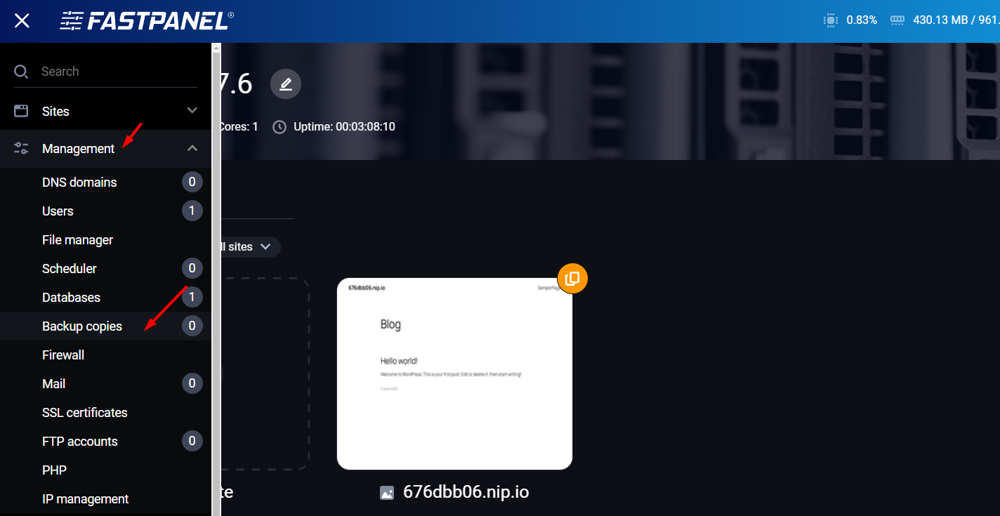
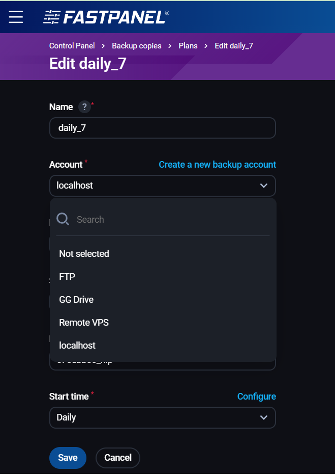

# Hướng dẫn backup và restore website trên FastPanel

Bài viết này sẽ giới thiệu về **Hướng dẫn backup và restore website trên FastPanel** và lợi ích của nó. Nếu bạn cần hỗ trợ, xin vui lòng liên hệ VinaHost qua **Hotline 1900 6046 ext. 3**, email về [support@vinahost.vn](mailto:support@vinahost.vn) hoặc chat với VinaHost qua livechat <https://livechat.vinahost.vn/chat.php>

# 1. Khởi tạo tài khoản (vị trí) backup local và phương pháp backup full

 

Đầu tiên, truy cập Management => Backup copies

 

Chọn New account

 

Có nhiều tùy chọn để lưu trữ các file backup, ta sẽ bắt đầu với ví dụ local trước. Nhập thông tin => Save

 

Sau khi hoàn tất tạo tài khoản backup, ta sẽ di chuyển quan tab Plans

 

Chọn New plan

 

Ta tiến hành cấu hình với các thông số cần lưu ý như sau:

**Account:** tài khoản backup đã tạo ở trên

**Backup copies limit:** Số lượng backup lưu trữ\n**Sites**: Website cần backup

**Databases:** Database cần backup

**Start time:** Thời điểm chạy backup, chọn template cấu hình sẵn hoặc có thể tự tinh chỉnh, tham khảo thêm tại [đây](https://vinahost.vn/crontab-la-gi/)

 

Hoàn tất, có thể bấm Run now để kiểm tra khả năng backup

 

Thành quả

 

# 2. Restore website/database từ backup

Đầu tiên, truy cập danh sách các bản copy hiện có

 

Chọn vào bản copy muốn restore

 

Xác nhận (lưu ý và kiểm tra kỹ lưỡng trước khi thực hiện)

 

Hoàn tất

 

LƯU Ý:

* Website khi backup sẽ có định dạng \*.tar.gz
* Database sẽ có dạng \*.sql.gz

# 3. Cấu hình tài khoản (vị trí) backup bằng SCP/FTP và Google Drive

## a. SCP

Giao thức sao chép an toàn (SCP) là phương tiện truyền tệp máy tính an toàn giữa máy chủ cục bộ và máy chủ từ xa hoặc giữa hai máy chủ từ xa. Có thể hiểu cách thức này sẽ lưu trữ backup vào một VPS/server khác phòng VPS/server hiện tại down mà không thể phục hồi

Cần chuẩn bị một VPS mở port 22 (hoặc port dùng cho việc SSH) gồm user/password, tham khảo ngay VPS giá rẻ, toàn quyền quản trị tại VPS: <https://vinahost.vn/thue-vps-gia-re/>

Chọn New account Nhập các thông tin của VPS đã được cấp gồm username, password và địa chỉ IP

 

 

Hoàn tất quá trình kết nối VPS khác làm nơi lưu trữ backup

 

Sau đó ta có thể chỉnh sửa lại plan cũ hoặc tạo mới để sử dụng vị trí lưu trữ backup (xem lại bước 1)

 

## b. FTP

Ta cũng có thể sử dụng tài khoản FTP để làm nơi lưu trữ dữ liệu

 

 

Hoàn tất cấu hình

 

## c. Google Drive

Ta cũng thể tận dụng 15GB của mỗi tài khoản Google làm nơi lưu trữ backup, sao chép lại đoạn mã và nhấn Link to enter the confirmation code để tiến hành

 

Dán mã vào và chọn Tiếp tục

 

Chọn tài khoản Google muốn kết nối

 

Kiểm tra quyền và chọn tiếp tục

 

Hoàn tất, quay về FastPanel và chọn Save

 

 

 

Lúc này, ta đã có thể nắm được cách tạo các vị trí lưu trữ backup khác nhau tùy thuộc vào nhu cầu.

 

# 4. Phương pháp backup khác biệt (differential)

Backup khác biệt chỉ sao lưu dữ liệu đã thay đổi kể từ lần sao lưu đầy đủ cuối cùng. Điều này có nghĩa là mỗi bản sao lưu khác biệt sẽ lớn hơn so với bản sao lưu trước đó, vì nó sẽ bao gồm tất cả các thay đổi đã được thực hiện kể từ lần sao lưu đầy đủ gần nhất.

 

Ở tab Differential plan, chọn New plan

 

Chế độ backup này cho phép ta chỉ định user hoặc toàn bộ (có loại trừ). Ở bài hướng dẫn này ta sẽ tập trung vào một user chỉ định

Nhập thông số cần thiết, chú ý:

* **Full:**  Bản backup đầy đủ
* **Partial:** Các bản backup chỉ lưu lại những gì thay đổi so với bản backup đầy đủ
* **Schedule**: Lịch backup, tham khảo lại mục 1

 

Tiếp theo là chọn user, database cũng như các file cần loại trừ

* Exclude mail: Loại trừ các tệp liên quan đến mail

* Exclude logs: Loại trừ các tệp liên quan đến logs

 

Tiếp theo là phương thức nén backup gồm

#### Công nghệ:

* **Gzip**: Phổ biến, nén tốt, ít tốn tài nguyên – phù hợp dùng chung.
* **ZSTD**: Nén nhanh hơn, file nhỏ hơn Gzip nhưng tốn tài nguyên hơn.

#### Cấp độ:

* **Best Speed**: Nén nhanh nhưng khiến file lớn hơn.
* **Best Compression**: Nén tối đa, tiết kiệm dung lượng nhưng tốn CPU/RAM.

Sau đó là Mã hóa, dùng để bảo vệ các bản backup. Có thể bỏ qua nếu không cần thiết

 

Hoàn tất, chạy Run now để thử nghiệm

 

Kiểm tra có thể thấy dung lượng của các bản backup là khác nhau ở phương pháp backup này

 

Tham khảo thêm về các phương pháp backup tại: <https://vinahost.vn/backup-la-gi/>

**Chúc bạn thực hiện thành công!**

> **THAM KHẢO CÁC DỊCH VỤ TẠI [VINAHOST](https://vinahost.vn/)**
>
> **>>** **[SERVER](https://vinahost.vn/thue-may-chu-rieng/)** **–** **[COLOCATION](https://vinahost.vn/colocation.html)** – **[CDN](https://vinahost.vn/dich-vu-cdn-chuyen-nghiep)**
>
> **>> [CLOUD](https://vinahost.vn/cloud-server-gia-re/) – [VPS](https://vinahost.vn/vps-ssd-chuyen-nghiep/)**
>
> **>> [HOSTING](https://vinahost.vn/wordpress-hosting)**
>
> **>> [EMAIL](https://vinahost.vn/email-hosting)**
>
> **>> [WEBSITE](http://vinawebsite.vn/)**
>
> **>> [TÊN MIỀN](https://vinahost.vn/ten-mien-gia-re/)**