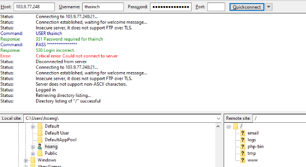

# Hướng dẫn cài dặt và cấu hình FTP trên FastPanel

Bài viết này sẽ giới thiệu về **Hướng dẫn cài dặt và cấu hình FTP trên FastPanel** và lợi ích của nó. Nếu bạn cần hỗ trợ, xin vui lòng liên hệ VinaHost qua **Hotline 1900 6046 ext. 3**, email về [support@vinahost.vn](mailto:support@vinahost.vn) hoặc chat với VinaHost qua livechat <https://livechat.vinahost.vn/chat.php>

FastPanel hỗ trợ tạo tài khoản FTP để người dùng có thể quản lý file website thông qua các công cụ như FileZilla, WinSCP,...

1. **Đăng nhập vào FastPanel**
- Truy cập địa chỉ: https://<IP-hoặc-domain>:8888
- Đăng nhập bằng tài khoản quản trị
1. **Truy cập Management > FTP Accounts >  Tạo tài khoản**

Tại đây chúng ta sẽ cần nhập những thông tin cần thiết.

Để mình giải thích một chút ở đây nhé:

- **Login:** Bạn sẽ cần nhập username sẽ sử dụng. Không được viết dấu và không được có khoảng trắng.
- **Password:** Bạn cần nhập mật khẩu tối thiểu 8 ký tự, có ít nhất một chữ viết hoa, một chữ viết thường và một ký tự đặc biệt. Ví dụ một mật khẩu hợp lệ sẽ là: Azd!giNo1. Hoặc đơn giản hơn chúng ta có thể chọn nút **generate** để FASPANEL tự tạo mật khẩu.
- **Owner:** Tài khoản FPT sắp tạo sẽ được quản lý/sở hữu bởi người dùng nào, nếu bạn cần tạo cho bạn sử dụng thì có thể bỏ qua phần này.
- **Site:** Nếu bạn cần tạo tài khoản FTP này cho website nào thì hãy chọn một website ở ô này.
- **Home directory:** Tại đây bạn sẽ cấp quyền nơi tài khoản FTP này có thể truy cập đến. Còn nếu bạn đã chọn một website ở Site thì có thể bỏ qua mục này.
- **Permissions:** Tại đây sẽ có hai tùy chọn **Allow all**(Cho phép tất cả các quyền) hoặc **Read only**(Chỉ cho xem mà không được xóa hay chỉnh sửa gì cả) tùy theo nhu cầu của bạn mà bạn chọn, tuy nhiên hầu hết chúng ta sẽ cần **Allow All**.
- **Website**: Chọn website nào thì Home Directory sẽ tự động nhảy đường dẫn tới chứa source website đó.

Sau khi đã chọn theo đúng ý bạn cần và lưu lại thông tin **Login** & **Password** chúng ta chọn **Save** để tạo tài khoản FTP. Chờ một vài giây sẽ nhận được thông báo tài khoản FTP đã được khởi tạo thành công. Nếu có lỗi bạn sẽ nhận được thông báo chi tiết.

1. **Truy vập với tài khoản FTP vừa khởi tạo trên giao diện FASTPANEL**

Sau khi đã tạo tài khoản FTP trên FASTPANEL chúng ta cần thử truy cập để biết tài khoản có hoạt động không. Tại đây mình sẽ sử dụng phần mềm FTP Client phổ biến nhất là FileZilla để kết nối FTP với tài khoản vừa tạo thành công ở bước 2.

Bạn chỉ cần nhập địa chỉ IP máy chủ FASTPANEL của bạn ở ô Host, thông tin Login tại ô Username và cuối cùng là mật khẩu vào ô Password. Sao đó chọn Quickconnect là được.

Dưới đây là hình ảnh kết nối FTP thành công của mình.

**Chúc bạn thực hiện thành công!**

> **THAM KHẢO CÁC DỊCH VỤ TẠI [VINAHOST](https://vinahost.vn/)**
>
> **>>** **[SERVER](https://vinahost.vn/thue-may-chu-rieng/)** **–** **[COLOCATION](https://vinahost.vn/colocation.html)** – **[CDN](https://vinahost.vn/dich-vu-cdn-chuyen-nghiep)**
>
> **>> [CLOUD](https://vinahost.vn/cloud-server-gia-re/) – [VPS](https://vinahost.vn/vps-ssd-chuyen-nghiep/)**
>
> **>> [HOSTING](https://vinahost.vn/wordpress-hosting)**
>
> **>> [EMAIL](https://vinahost.vn/email-hosting)**
>
> **>> [WEBSITE](http://vinawebsite.vn/)**
>
> **>> [TÊN MIỀN](https://vinahost.vn/ten-mien-gia-re/)**
