# Hướng dẫn cài đặt website wordpress trên FastPanel

Bài viết này sẽ giới thiệu về **Hướng dẫn cài đặt website wordpress trên FastPanel** và lợi ích của nó. Nếu bạn cần hỗ trợ, xin vui lòng liên hệ VinaHost qua **Hotline 1900 6046 ext. 3**, email về [support@vinahost.vn](mailto:support@vinahost.vn) hoặc chat với VinaHost qua livechat <https://livechat.vinahost.vn/chat.php>

# 1. Tạo website Wordpress tự động (bản mới nhất)

Chọn Create Site để bắt đầu

 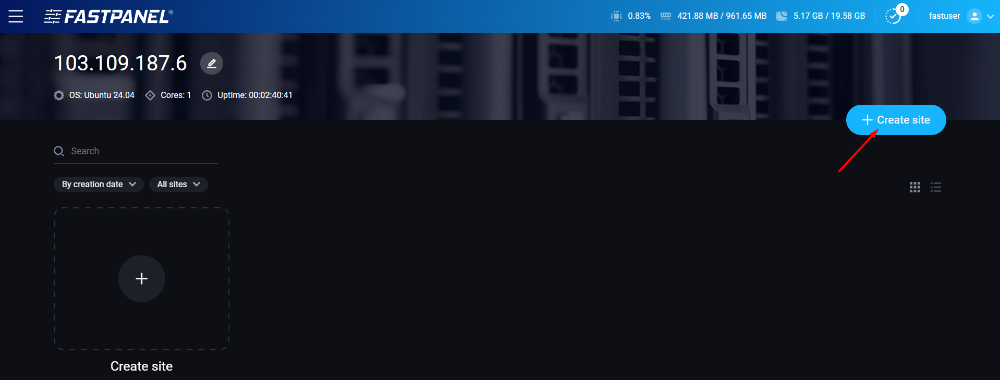

Tiếp theo là **Creating a CMS based site**

 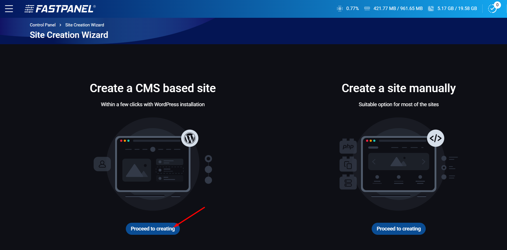

Nhập domain => Next Step

 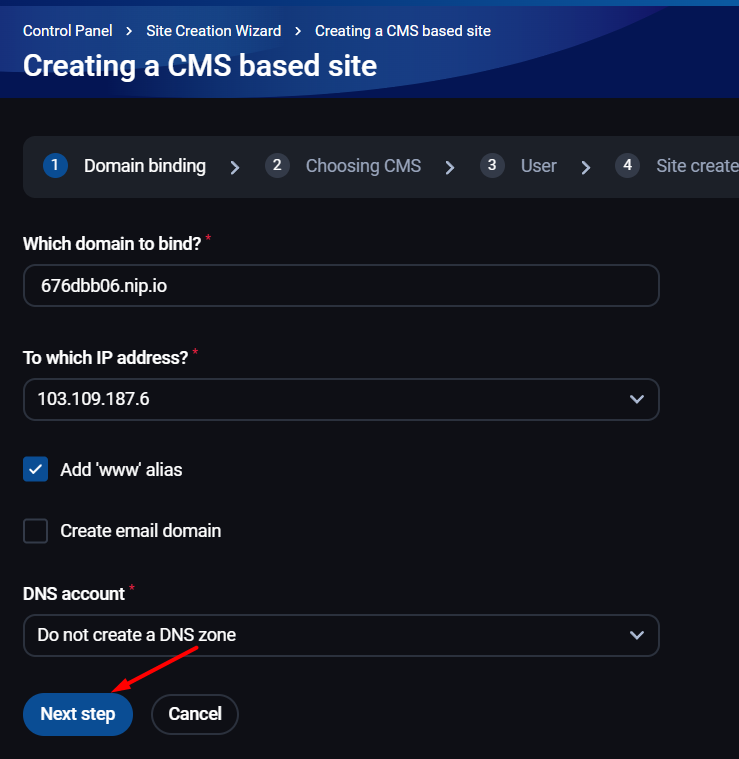

Nhập các thông tin gồm (đây là thông tin đăng nhập trang quản trị của Wordpress):

* Login: User đăng nhập
* Password: Mật khẩu
* Email

 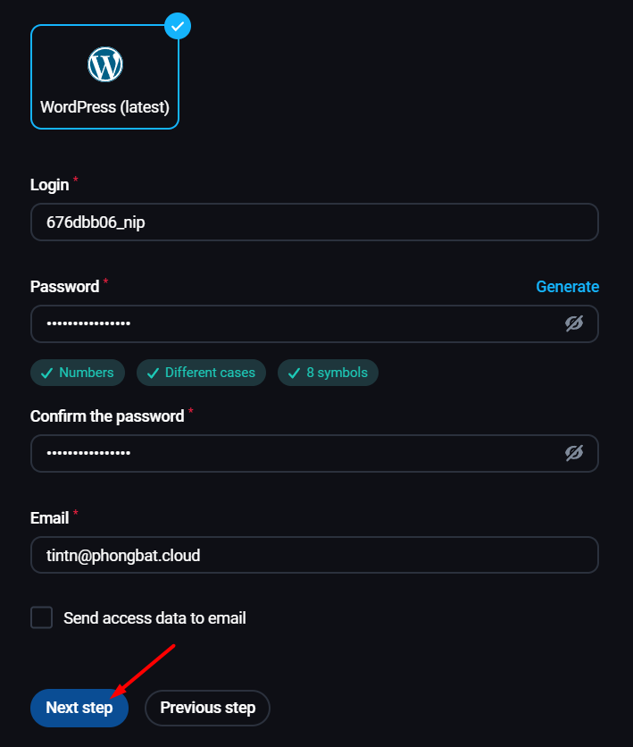

Tiếp theo là user quản lý website, có thể chọn tạo mới hoặc gán vào user hiện có

 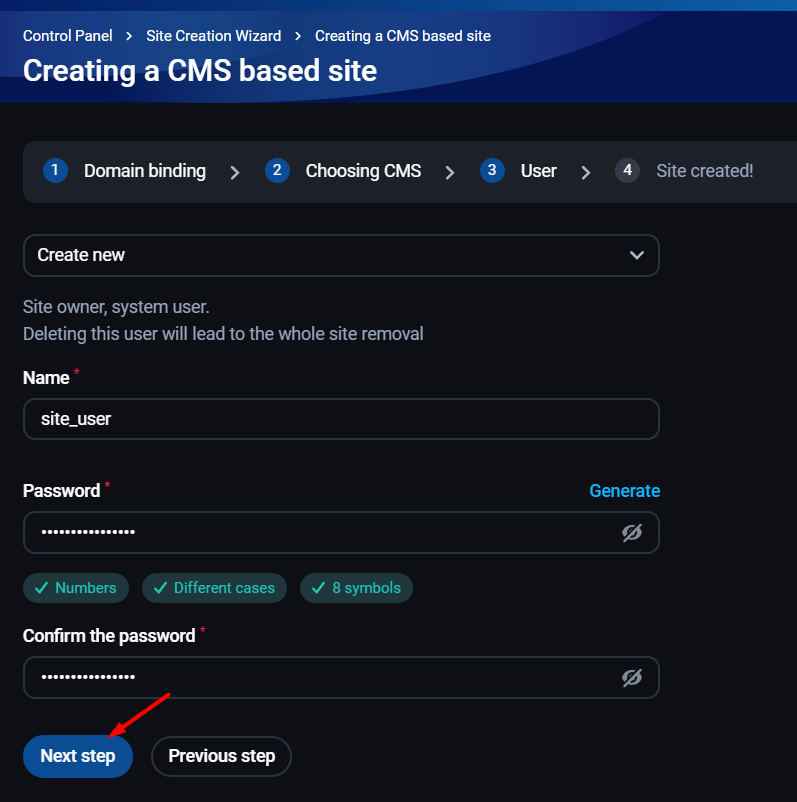

Đợi FastPanel khởi tạo website

 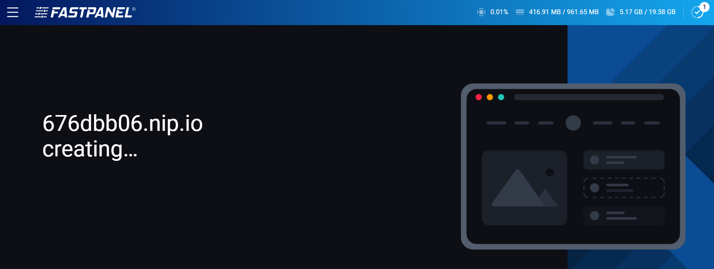

Sau khi thành công, ta có thể chọn View để xem lại các thông tin vừa tạo

 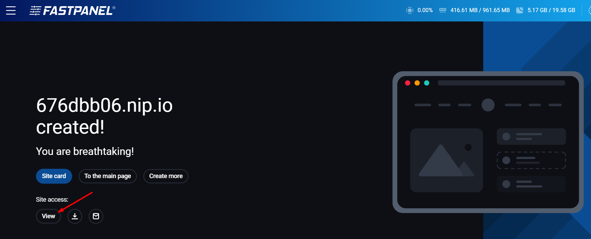

 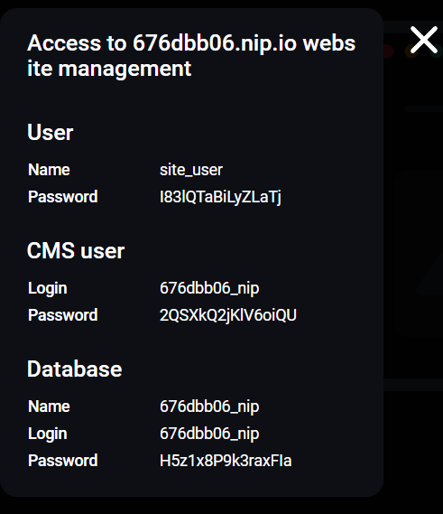

Kiểm tra đăng nhập trang quản trị Wordpress

 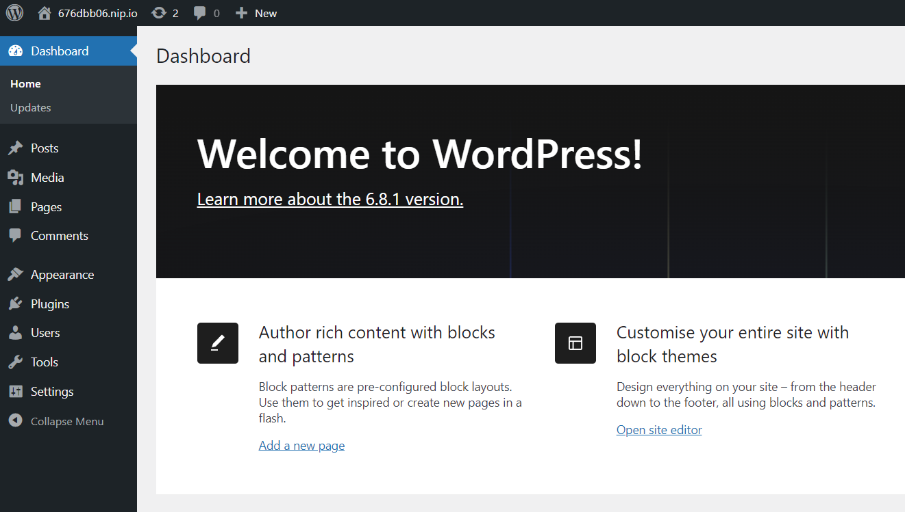

# 2 Thao tác cơ bản

## a. Quản lý

Rê chuột vào trang Wordpress vừa tạo và chọn Options

 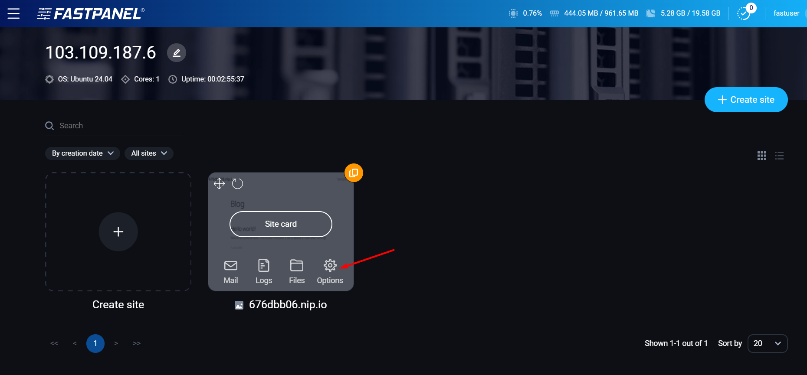

Tại đây, ta có thể thay đổi các thông số cơ bản như Aliases**,** Admin email,…

 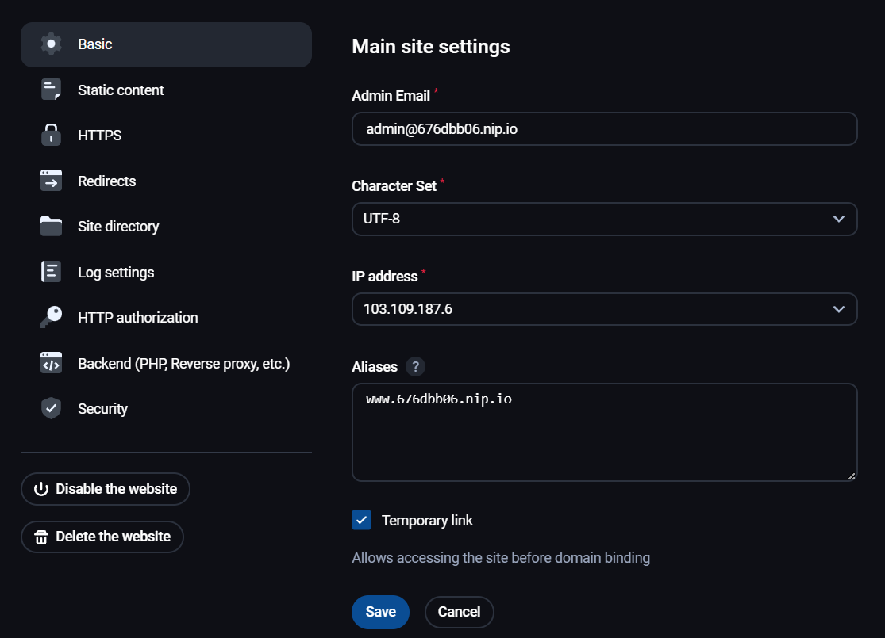

Các mục khác nếu không chắc chắn có thể bỏ qua để tránh các lỗi không cần thiết.

## b. Tổng quan

Chuyên sâu hơn, truy cập Site card của website

 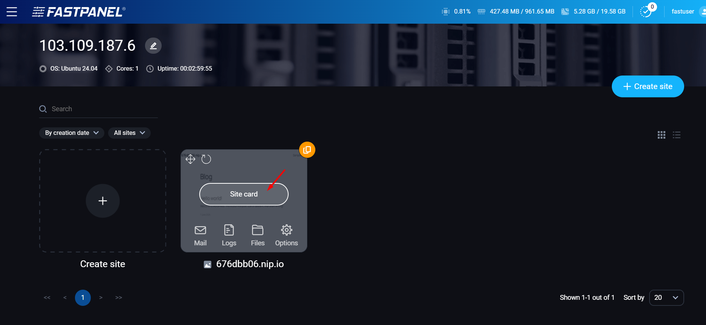

 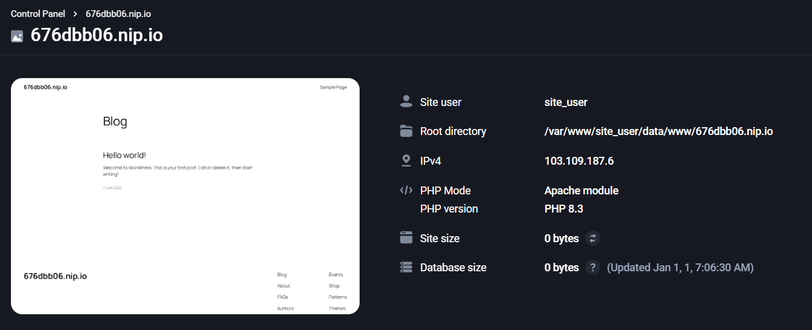

Ta sẽ có rất nhiều lựa chọn để cấu hình/tinh chỉnh cho website

 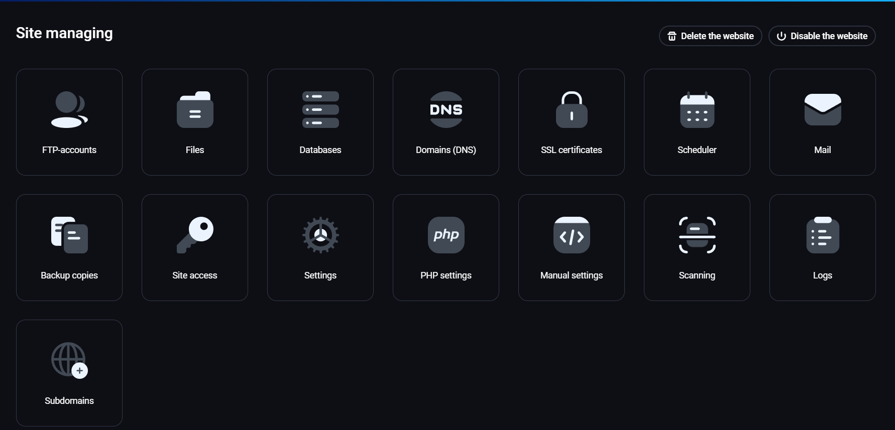

Xuống dưới một chút, ta sẽ thấy được lịch sử thao tác đối với website

 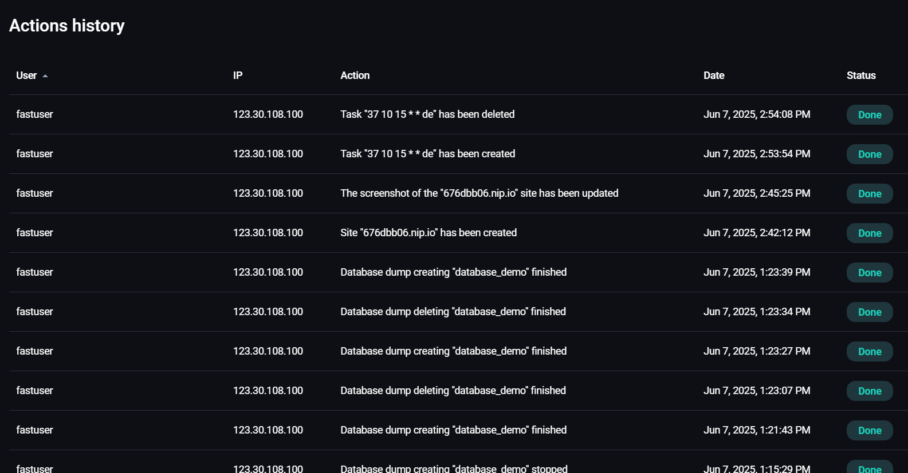

**Chúc bạn thực hiện thành công!**

> **THAM KHẢO CÁC DỊCH VỤ TẠI [VINAHOST](https://vinahost.vn/)**
>
> **>>** **[SERVER](https://vinahost.vn/thue-may-chu-rieng/)** **–** **[COLOCATION](https://vinahost.vn/colocation.html)** – **[CDN](https://vinahost.vn/dich-vu-cdn-chuyen-nghiep)**
>
> **>> [CLOUD](https://vinahost.vn/cloud-server-gia-re/) – [VPS](https://vinahost.vn/vps-ssd-chuyen-nghiep/)**
>
> **>> [HOSTING](https://vinahost.vn/wordpress-hosting)**
>
> **>> [EMAIL](https://vinahost.vn/email-hosting)**
>
> **>> [WEBSITE](http://vinawebsite.vn/)**
>
> **>> [TÊN MIỀN](https://vinahost.vn/ten-mien-gia-re/)**