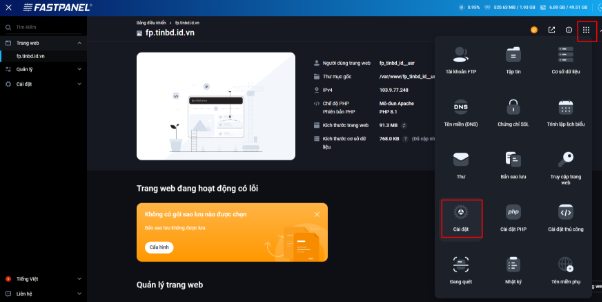

# Hướng dẫn cấu hình PHP trên FastPanel

Bài viết này sẽ giới thiệu về **Hướng dẫn cấu hình PHP trên FastPanel** và lợi ích của nó. Nếu bạn cần hỗ trợ, xin vui lòng liên hệ VinaHost qua **Hotline 1900 6046 ext. 3**, email về [support@vinahost.vn](mailto:support@vinahost.vn) hoặc chat với VinaHost qua livechat <https://livechat.vinahost.vn/chat.php>

FastPanel là control panel miễn phí mạnh mẽ, cho phép bạn cấu hình chi tiết các thông số PHP theo từng website, bao gồm:

- Chọn phiên bản PHP phù hợp
- Cấu hình chế độ chạy PHP (PHP Mode)
- Tùy chỉnh các thông số php.ini
- Bật/tắt các PHP Extension
1. **Đăng nhập vào FastPanel**

Truy cập theo đường dẫn: https://<IP-hoặc-domain>:8888

Đăng nhập bằng tài khoản quản trị

1. **Mặc định FastPanel sẽ không có sẵn các phiên bản PHP mà cần cài đặt thêm.**

Để cài đặt thêm phiên bản PHP. Truy cập Cài đặt > Ứng dụng > tìm từ khóa ‘php’ > Cài đặt phiên bản PHP mong muốn

Sau khi cài đặt xong kiểm tra lại tại Quản lý > PHP

1. **FastPanel hỗ trợ nhiều chế độ xử lý PHP (PHP Mode), gồm:**
- **PHP-FPM**: hiệu suất cao, quản lý tiến trình tốt. Khuyến nghị sử dụng.
- **CGI**: đơn giản, nhưng hiệu năng thấp hơn.
- **Apache Module (mod\_php)**: tích hợp sẵn trong Apache, không tương thích tốt với Nginx + Apache hybrid.

Để chuyển đổi PHP Mode. Truy cập Web > Cài đặt > Backend

Chọn PHP Mode ở Backend và Lưu

Sau khi Lưu thì kiểm tra PHP Mode đã chuyển sang PHP-FPM

FastPanel cho phép bạn cấu hình các phần mở rộng (extensions) và các thông số quan trọng của PHP cho từng website. Việc này rất hữu ích để tối ưu website hoặc xử lý lỗi khi chạy mã nguồn như WordPress, Laravel, v.v.

1. **Để cài đặt extensions cho PHP. Truy cập Quản lý > PHP > Mô đun PHP**

Search extensions cần cài đặt

Tương tự ở thiết lập PHP có thể tinh chính các chỉ số như (memory\_limit, post\_max\_size, …)

**Chúc bạn thực hiện thành công!**

> **THAM KHẢO CÁC DỊCH VỤ TẠI [VINAHOST](https://vinahost.vn/)**
>
> **>>** **[SERVER](https://vinahost.vn/thue-may-chu-rieng/)** **–** **[COLOCATION](https://vinahost.vn/colocation.html)** – **[CDN](https://vinahost.vn/dich-vu-cdn-chuyen-nghiep)**
>
> **>> [CLOUD](https://vinahost.vn/cloud-server-gia-re/) – [VPS](https://vinahost.vn/vps-ssd-chuyen-nghiep/)**
>
> **>> [HOSTING](https://vinahost.vn/wordpress-hosting)**
>
> **>> [EMAIL](https://vinahost.vn/email-hosting)**
>
> **>> [WEBSITE](http://vinawebsite.vn/)**
>
> **>> [TÊN MIỀN](https://vinahost.vn/ten-mien-gia-re/)**
