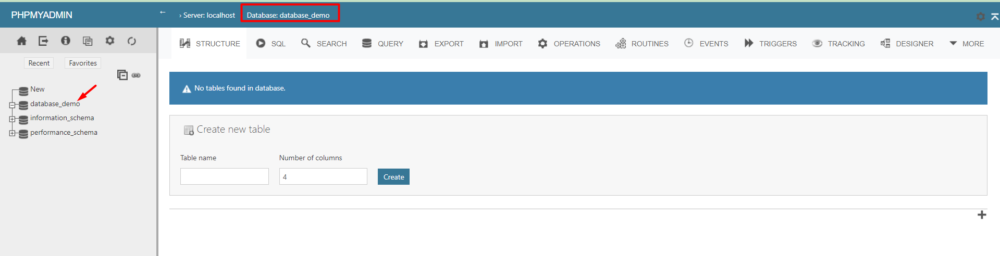
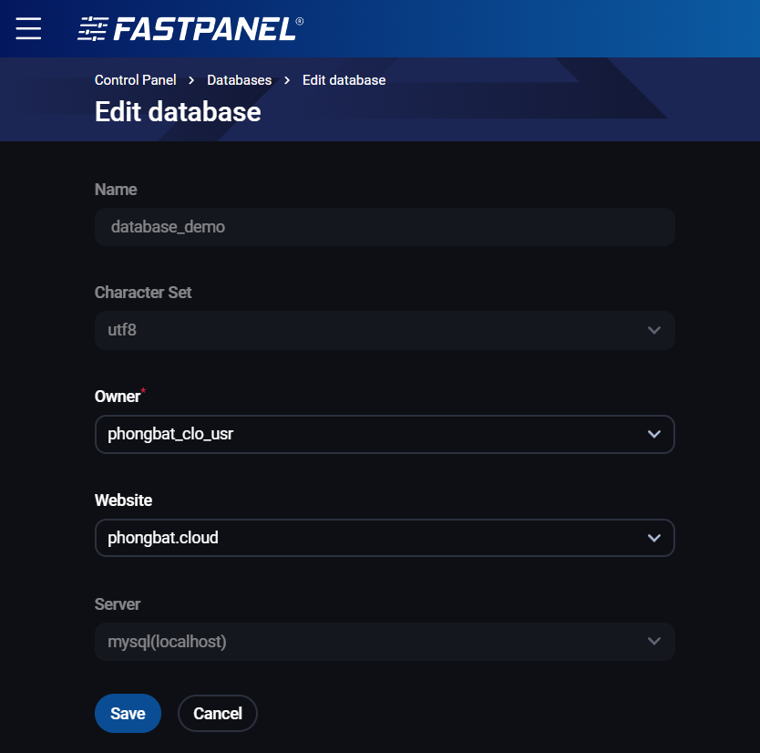

# Hướng dẫn tạo database trên FastPanel

Bài viết này sẽ giới thiệu về **Hướng dẫn tạo database trên FastPanel** và lợi ích của nó. Nếu bạn cần hỗ trợ, xin vui lòng liên hệ VinaHost qua **Hotline 1900 6046 ext. 3**, email về [support@vinahost.vn](mailto:support@vinahost.vn) hoặc chat với VinaHost qua livechat <https://livechat.vinahost.vn/chat.php>

# 1. Khởi tạo

Đầu tiên, ta truy cập FastPanel và chọn Management => Databases

 

Chọn New database để tiến hành tạo database

 

Ta sẽ điền các thông tin liên quan gồm:

**Name:** Tên Database

**Character Set:** Bộ ký tự (nên để mặc định)

**Owner:** User sở hữu database (hay còn gọi là user database, có thể thay đổi sau)

**Website:** Website cần gán database

**User:** Lựa chọn tạo mới

**Login:** Database user

**Password:** Mật khẩu của Database user

**Confirm the password:** Xác nhận lại mật khẩu

 

Note lại các thông tin đặc biệt quan trọng gồm **Name, Login** và **Password**, sau đó chọn Save để tiến hành tạo

 

# 2. Quản lý và các thao tác cơ bản

## a. Import/Export bằng giao diện phpMyAdmin

Chọn Open phpMyAdmin hoặc nút mũi tên chéo để mở thẳng trang quản lý cho database chỉ định

 

Chọn đúng database cần thao tác

 

Chọn Import nếu ta cần nhập dataabse

 

Các định dạng cơ bản hỗ trợ gồm:

* \*.sql
* \*.sql.zip
* \*.sql.gzip

 

Kéo xuống dưới cùng => Import

 

Hoàn tất import, thời gian thực thi sẽ dựa theo kích thước của file database

 

Đối với Export, ta chọn database và qua tab Export

 

Chọn định dạng mong muốn => Export

 

Trình duyệt sẽ tiến hành tải file về máy tính đang sử dụng

 

## b. Import/Export bằng giao diện FastPanel

Chọn vào nút 3 chấm của database cần thao tác => Upload SQL-dump

 

 

Hoàn tất import

 

Đối với Export, ta sẽ chọn Create SQL dump via dump để tạo file trước nếu chưa có tùy chọn Download SQL dump

 

Sau đó chọn Download SQL dump để tải file .sql về máy

 

Hoàn tất

 

# 3. Chỉnh sửa thông tin cơ bản database

**LƯU Ý**: 1 số bước không thể hoàn tác, cần hết sức cẩn thận khi thực hiện

Chọn Edit database nếu ta cần gán lại user sở hữu database và website

 

 

Các thao tác liên quan đến user database, ta chọn User Management

 

Có 3 thao tác cơ bản gồm:

* Edit: Thay đổi mật khẩu hoặc cho phép user kết nối từ xa vào database

 

 

* Unbind: Gỡ liên kết user khỏi 1 database (vui lòng cẩn thận khi thao tác nếu không nắm rõ)

 

 

* Delete user: Xóa user

 

# 4. Kết nối từ xa vào database

Đầu tiên, cần đảm bảo user của database có quyền kết nối từ xa (xem lại mục 3)

 

Tiếp theo, ta sẽ cần cho phép MySQL lắng nghe kết nối từ mọi nguồn (0.0.0.0). Truy cập Database servers

 

Chọn Config Variables

 

Nhập bind ở thanh tìm kiếm và Enter, ta sẽ thấy MySQL đang lắng nghe localhost (127.0.0.1). Cần chỉnh thành 0.0.0.0 để kết nối từ xa

 

 

Chọn Save để lưu thông số

 

Thông tin kết nối sẽ bao gồm:

* Tên database
* User database:
* Password:
* Host: Địa chỉ IP của VPS

 

 

**Chúc bạn thực hiện thành công!**

> **THAM KHẢO CÁC DỊCH VỤ TẠI [VINAHOST](https://vinahost.vn/)**
>
> **>>** **[SERVER](https://vinahost.vn/thue-may-chu-rieng/)** **–** **[COLOCATION](https://vinahost.vn/colocation.html)** – **[CDN](https://vinahost.vn/dich-vu-cdn-chuyen-nghiep)**
>
> **>> [CLOUD](https://vinahost.vn/cloud-server-gia-re/) – [VPS](https://vinahost.vn/vps-ssd-chuyen-nghiep/)**
>
> **>> [HOSTING](https://vinahost.vn/wordpress-hosting)**
>
> **>> [EMAIL](https://vinahost.vn/email-hosting)**
>
> **>> [WEBSITE](http://vinawebsite.vn/)**
>
> **>> [TÊN MIỀN](https://vinahost.vn/ten-mien-gia-re/)**