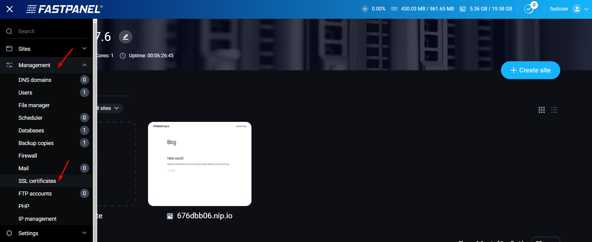
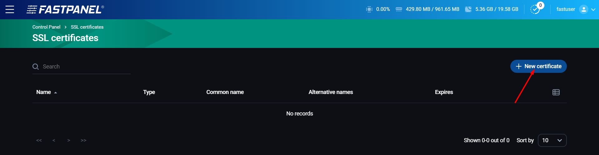
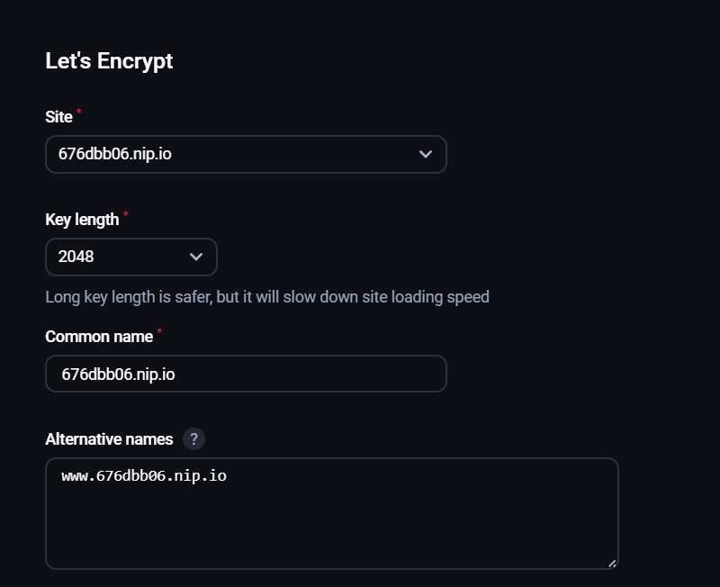
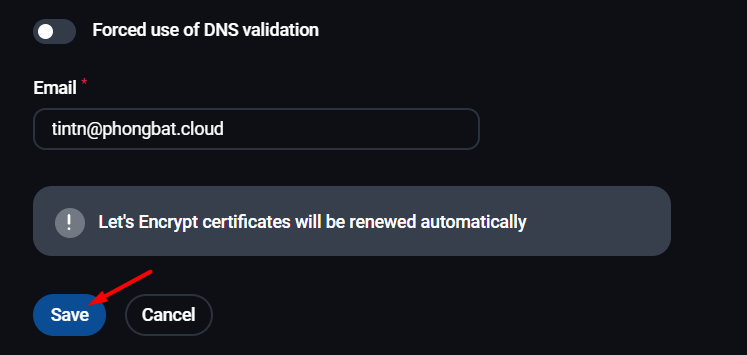
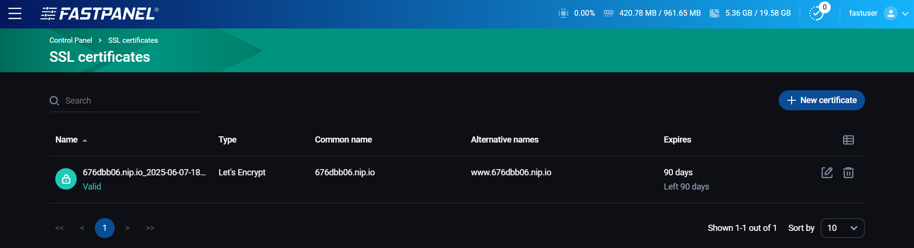
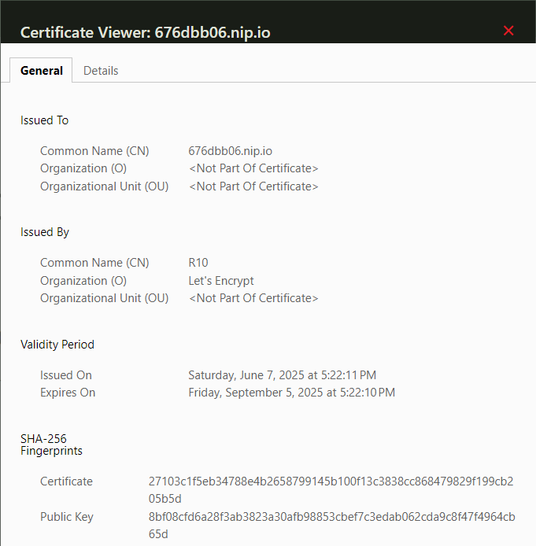
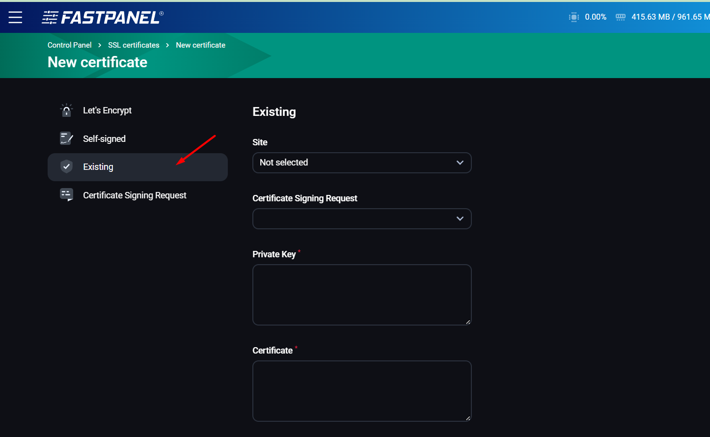
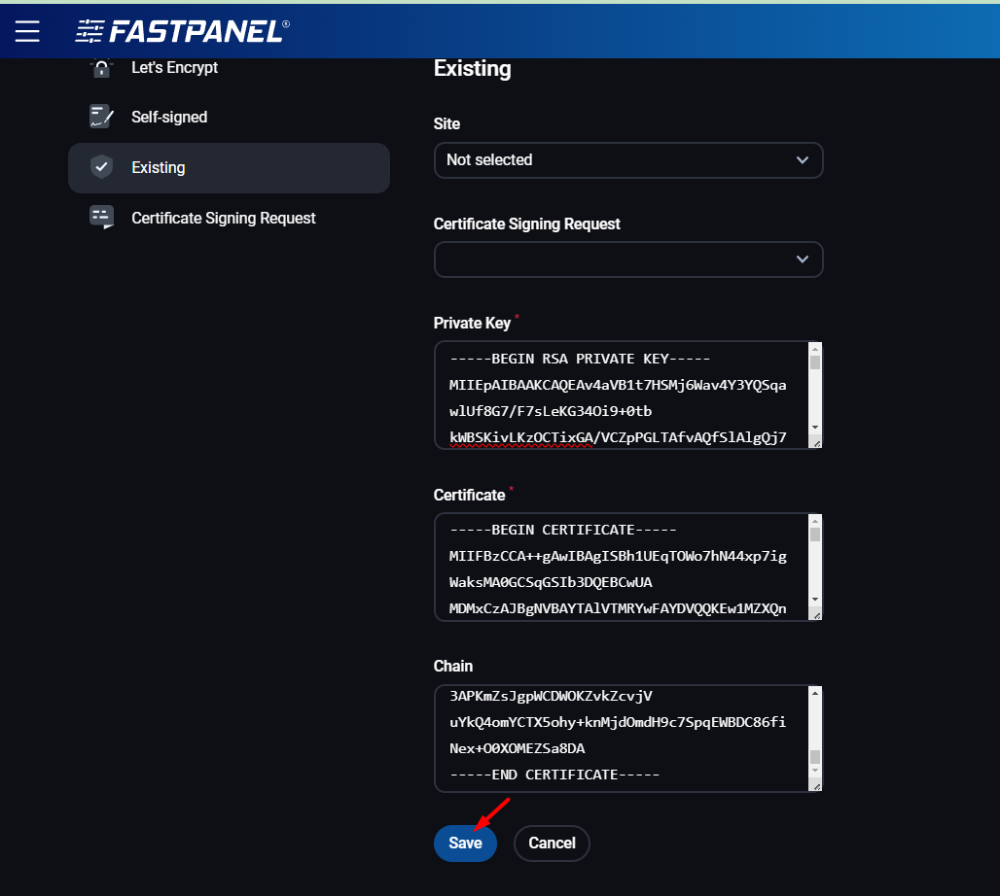
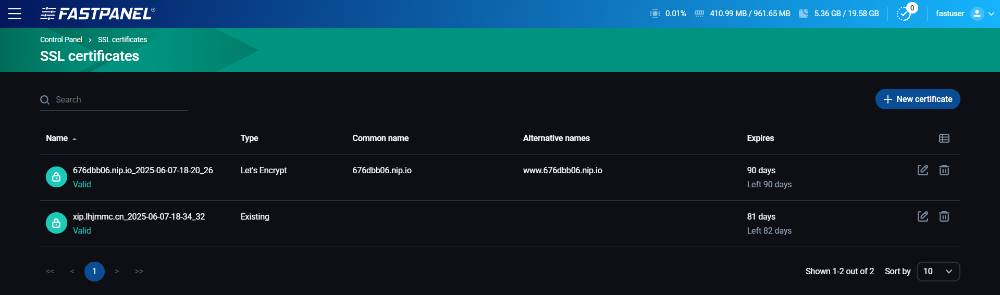

# Hướng dẫn thiết lập https (SSL) cho website trên FastPanel

# 1. Cài đặt **https (SSL) miễn phí bằng Let's Encrypt (90 ngày)**

Truy cập Management => SSL certificates

 

Chọn **New certificate**

 

Chọn website cần cài đặt, các thông số khác nên để mặc định. Lưu ý: Key length càng dài sẽ càng bảo mật cao, nhưng thời gian xác thực sẽ dài hơn

 

Nhập email xác thực và Save

 

Hoàn tất, truy cập trang web để kiểm tra

 

 

# 2. Cài đặt **https (SSL) có phí (1 năm)**

Nếu cần các chứng chỉ SSL dài hơn, có thể tham khảo ngay dịch vụ SSL tại Vinahost:

* <https://vinahost.vn/geotrust-ssl/>

* <https://vinahost.vn/sectigo-ssl/>

Sau khi hoàn tất thanh toán và kích hoạt (có thể nhờ đội ngũ kỹ thuật của Vinahost hỗ trợ kích hoạt), tiến hành import chứng chỉ vào FastPanel. Chọn New certificate => Existing

 

Ta mở các file mà kỹ thuật Vinahost gửi kèm qua mail bằng Notepad hoặc Notepad++, sau đó dán các phần cần thiết vào:

* File .key – Private Key

* File .crt - Certificate

* Đối với Chain sẽ có hoặc không tùy theo nhà cung cấp SSL, nhưng nếu không rõ có thể liên hệ kỹ thuật Vinahost để được tư vấn và giải đáp.

 

Hoàn tất, lúc này đã có thể gán cho website chỉ định theo nhu cầu.

 

Tham khảo thêm về các phương pháp backup tại: <https://vinahost.vn/backup-la-gi/>

**Chúc bạn thực hiện thành công!**

> **THAM KHẢO CÁC DỊCH VỤ TẠI [VINAHOST](https://vinahost.vn/)**
>
> **>>** **[SERVER](https://vinahost.vn/thue-may-chu-rieng/)** **–** **[COLOCATION](https://vinahost.vn/colocation.html)** – **[CDN](https://vinahost.vn/dich-vu-cdn-chuyen-nghiep)**
>
> **>> [CLOUD](https://vinahost.vn/cloud-server-gia-re/) – [VPS](https://vinahost.vn/vps-ssd-chuyen-nghiep/)**
>
> **>> [HOSTING](https://vinahost.vn/wordpress-hosting)**
>
> **>> [EMAIL](https://vinahost.vn/email-hosting)**
>
> **>> [WEBSITE](http://vinawebsite.vn/)**
>
> **>> [TÊN MIỀN](https://vinahost.vn/ten-mien-gia-re/)**