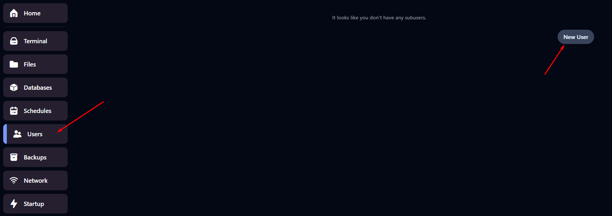

# Hướng dẫn phân quyền quản lý server cho tài khoản phụ (sub-user)

Bài viết này sẽ giới thiệu về **Hướng dẫn phân quyền quản lý server cho tài khoản phụ (sub-user)** và lợi ích của nó. Nếu bạn cần hỗ trợ, xin vui lòng liên hệ VinaHost qua **Hotline 1900 6046 ext. 3**, email về [support@vinahost.vn](mailto:support@vinahost.vn) hoặc chat với VinaHost qua livechat <https://livechat.vinahost.vn/chat.php>

### 1. Thao tác với Panel

Truy cập Panel và chuyển qua tab **User**, chọn **New User** để tạo tài khoản phụ.

 

Ta nhập email của tài khoản phụ cần chia sẽ quyền quản lý

 

Chọn các quyền cần gán cho tài khoản phụ => **Invite User**

 

* *CONTROL* : Các thao tác liên quan đến khởi động Server
* *USER* : Các quyền quản lý user
* *FILE* : Tương tác với hệ thống tệp của Server
* *BACKUP*: Quản lý hệ thống backup
* *ALLOCATION*: Khả năng điều chỉnh Port cho Server
* *STARTUP*: Liên quan đến khả năng khởi động Server
* *DATABASE*: Cơ sở dữ liệu
* *SCHEDULE*: Lịch trình tự động hóa
* *SETTINGS*: Cấu hình của Server
* *ACTIVITY*: Khả năng xem các hoạt động thao tác trên Server

### 2. Tạo mật khẩu cho tài khoản phụ (sub-user)

Kiểm tra mail, user phụ sẽ thấy đường dẫn vào server

 

User phụ sẽ cần đặt mật khẩu mới, chọn `Forgot password?`

 

 

Kiểm tra mail mới nhất, chọn `Reset Password` để tiến hành đặt mật khẩu mới

 

 

**Chúc bạn thực hiện thành công!**

> **THAM KHẢO CÁC DỊCH VỤ TẠI [VINAHOST](https://vinahost.vn/)**
>
> **>>** **[SERVER](https://vinahost.vn/thue-may-chu-rieng/)** **–** **[COLOCATION](https://vinahost.vn/colocation.html)** – **[CDN](https://vinahost.vn/dich-vu-cdn-chuyen-nghiep)**
>
> **>> [CLOUD](https://vinahost.vn/cloud-server-gia-re/) – [VPS](https://vinahost.vn/vps-ssd-chuyen-nghiep/)**
>
> **>> [HOSTING](https://vinahost.vn/wordpress-hosting)**
>
> **>> [EMAIL](https://vinahost.vn/email-hosting)**
>
> **>> [WEBSITE](http://vinawebsite.vn/)**
>
> **>> [TÊN MIỀN](https://vinahost.vn/ten-mien-gia-re/)**