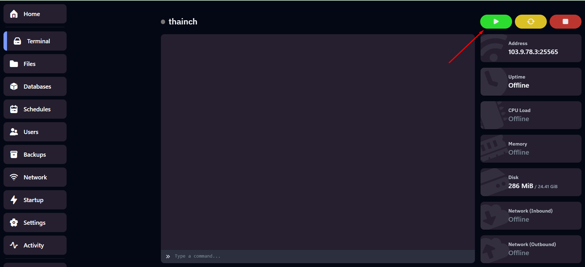

# Hướng dẫn tạo và restore backup cho Server Game tại Vinahost

Bài viết này sẽ giới thiệu về **Hướng dẫn tạo và restore backup cho Server Game tại Vinahost** và lợi ích của nó. Nếu bạn cần hỗ trợ, xin vui lòng liên hệ VinaHost qua **Hotline 1900 6046 ext. 3**, email về [support@vinahost.vn](mailto:support@vinahost.vn) hoặc chat với VinaHost qua livechat <https://livechat.vinahost.vn/chat.php>

### 1. Tạo backup

Sau khi đăng nhập vào panel quản lý server tại Vinahost, chọn mục **Backups**

 

Ta đặt tên cho file backup này. Ở phần **Ignored Files & Directories**, nhập những file muốn bỏ qua, không lưu vào file backup. Để trống nếu muốn backup toàn bộ

 

Quá trình backup đã diễn ra

 

### 2. Restore backup

Để tiến hành restore backup ta quay lại tab **Backups** và chọn vào file backup cần restore

 

Tích vào `Delete all files before restoring backup` nếu muốn xóa hết các file rồi mới restore (chỉ áp dụng nếu file backup ở mục một không loại trừ bất kỳ file/thư mục nào)

 

Quá trình restore đã được bắt đầu, trong khoảng thời gian này server sẽ bị tạm dừng và bạn sẽ không thể bắt đầu các thao tác khác cho đến khi nó hoàn tất.

 

Sau khi hoàn tất restore, chúng ta sẽ tiến hành khởi động server lên

 

 

**Chúc bạn thực hiện thành công!**

> **THAM KHẢO CÁC DỊCH VỤ TẠI [VINAHOST](https://vinahost.vn/)**
>
> **>>** **[SERVER](https://vinahost.vn/thue-may-chu-rieng/)** **–** **[COLOCATION](https://vinahost.vn/colocation.html)** – **[CDN](https://vinahost.vn/dich-vu-cdn-chuyen-nghiep)**
>
> **>> [CLOUD](https://vinahost.vn/cloud-server-gia-re/) – [VPS](https://vinahost.vn/vps-ssd-chuyen-nghiep/)**
>
> **>> [HOSTING](https://vinahost.vn/wordpress-hosting)**
>
> **>> [EMAIL](https://vinahost.vn/email-hosting)**
>
> **>> [WEBSITE](http://vinawebsite.vn/)**
>
> **>> [TÊN MIỀN](https://vinahost.vn/ten-mien-gia-re/)**