# Hướng dẫn cài đặt modpack tự động cho server Minecraft tại Vinahost

Bài viết này sẽ giới thiệu về **Hướng dẫn cài đặt modpack tự động cho server Minecraft tại Vinahost** và lợi ích của nó. Nếu bạn cần hỗ trợ, xin vui lòng liên hệ VinaHost qua **Hotline 1900 6046 ext. 3**, email về [support@vinahost.vn](mailto:support@vinahost.vn) hoặc chat với VinaHost qua livechat <https://livechat.vinahost.vn/chat.php>

### 1. Cài đặt modpack tự động từ Modrinth

Sau khi liên hệ với kỹ thuật viên (email về [support@vinahost.vn](mailto:support@vinahost.vn) hoặc chat thông qua livechat [VinaHost-LiveChat](https://livechat.vinahost.vn/chat.php)) để chuyển đổi server (**Modrinth**), đăng nhập vào Panel quản lý **Server Minecraft**, chọn vào mục **Startup**

Ta để ý 2 thông số là **Modpack Project ID** và **Modpack Version ID**, 2 thông số này đều được lấy từ modpack trên [Modrinth](https://modrinth.com/modpacks?e=server)

***Lưu ý***: Nên kiểm tra xem modpack có hỗ trợ bản cài đặt cho server hay không để tránh xảy ra lỗi trong quá trình cài đặt.

 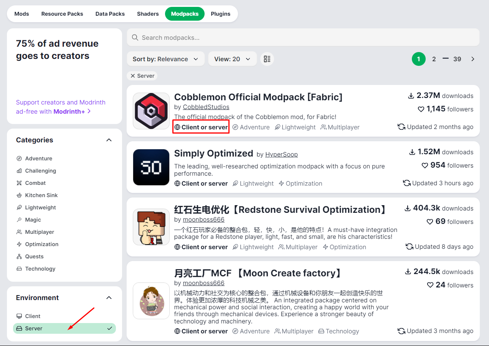

Đối với **Modpack Project ID**, ta sẽ thao tác như sau:

 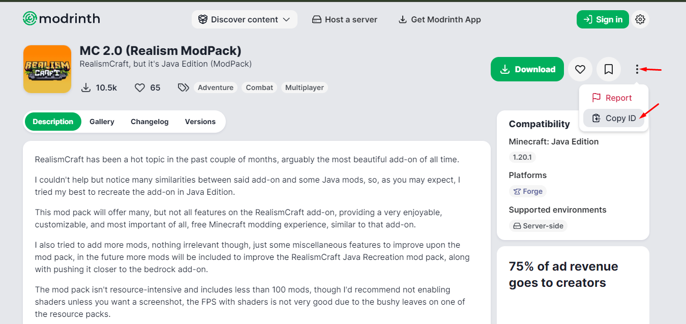

Đối với **Modpack Version ID**, mặc định sẽ tự động tải phiên bản mới nhất của modpack nếu khả dụng. Nếu muốn phiên bản nhất định, cần copy ID ở phần **Versions**

 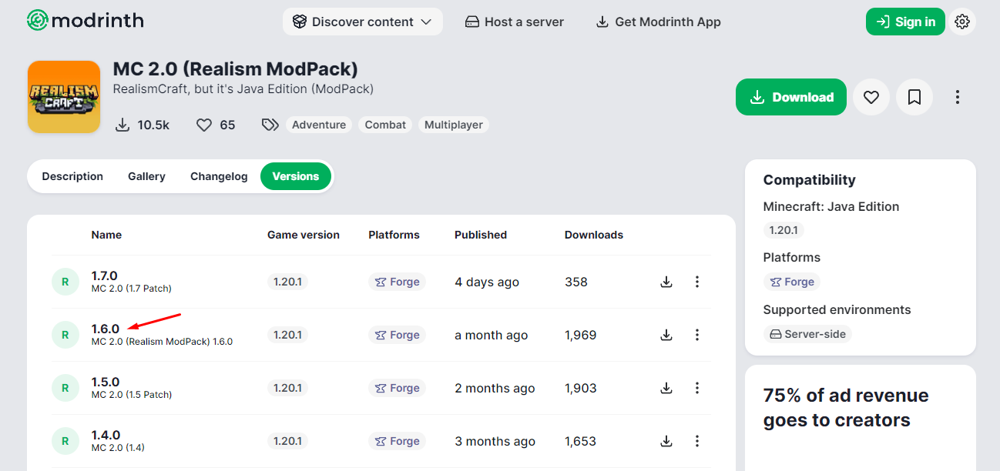

Kéo xuống dưới và copy phần **Version ID**

 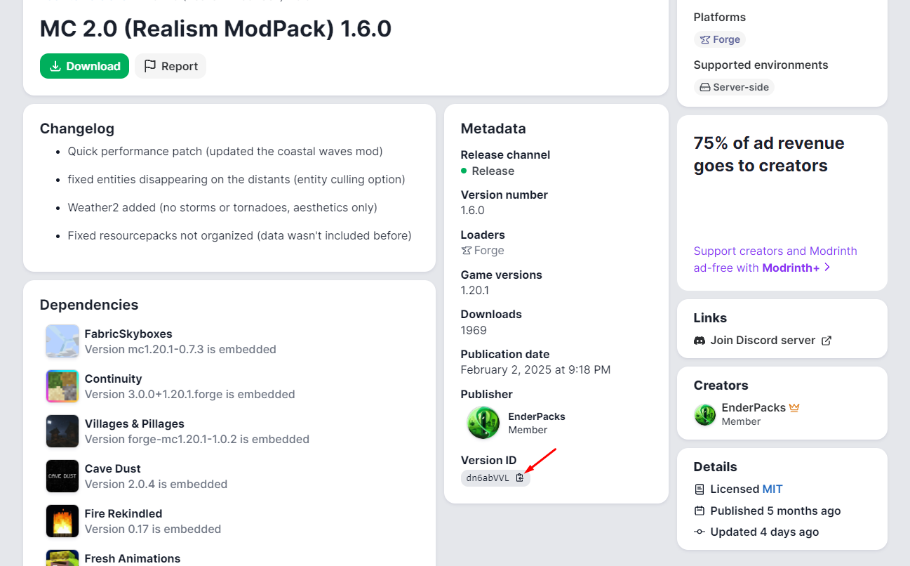

Quay lại Panel và nhập các thông số cần thiết ở tab **Startup**, sau đó nhấn **Reinstall Server** ở phần **Settings**, đợi cho quá trình cài đặt hoàn tất rồi khởi động server

 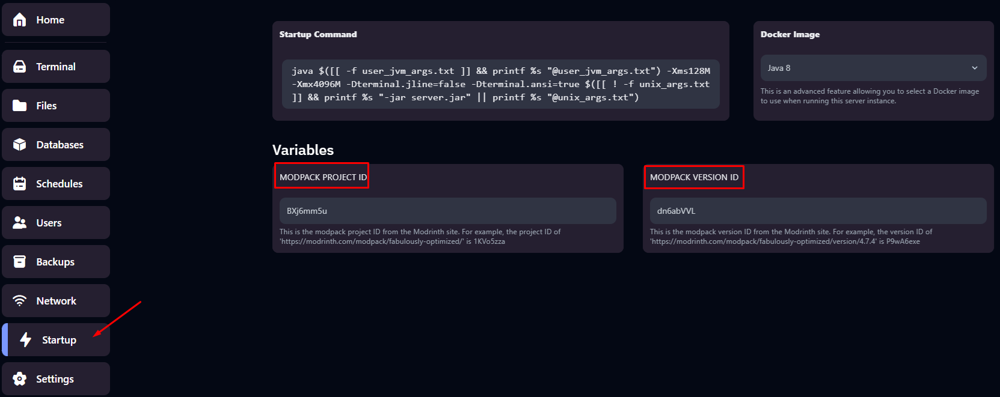

 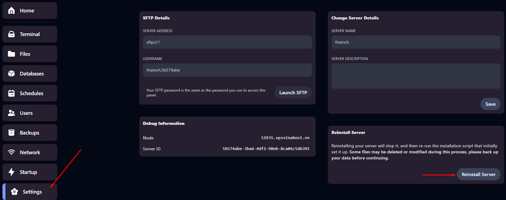

### 2. Cài đặt modpack tự động từ CurseForge

Tương tự với mục *1.* , sau khi liên hệ kỹ thuật viên nhằm chuyển đổi server qua kênh email hoặc livechat (**CurseForge**), ta truy cập phần modpack của [CurseForge](https://www.curseforge.com/minecraft/search?class=modpacks) và tìm kiếm modpack cần cài đặt.

 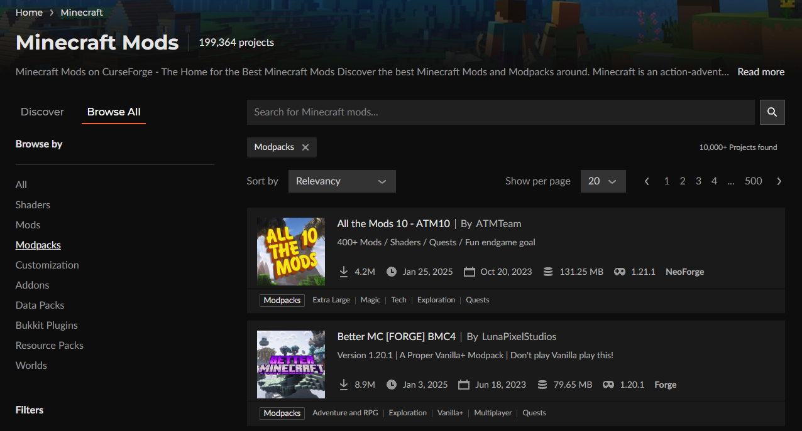

Đối với thông số **Modpack Project ID**:

 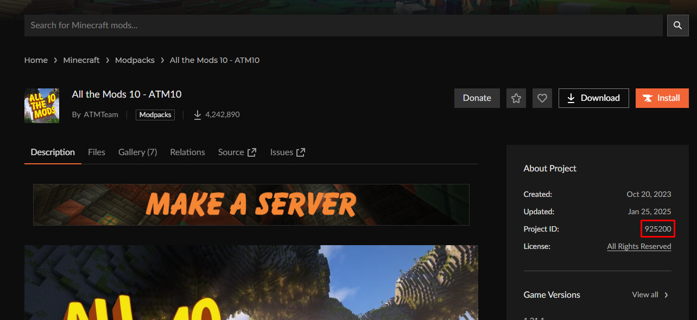

Mặc định sẽ tải phiên bản mới nhất của modpack, nếu cần chỉ định phiên bản thì ta sẽ điền thông số của phiên bản vào **Modpack File ID**

***Lưu ý***: Nên kiểm tra xem phiên bản của modpack có hỗ trợ phiên bản cho server hay không trước khi cài đặt. (Thường là có chữ +1 ở các phiên bản)

 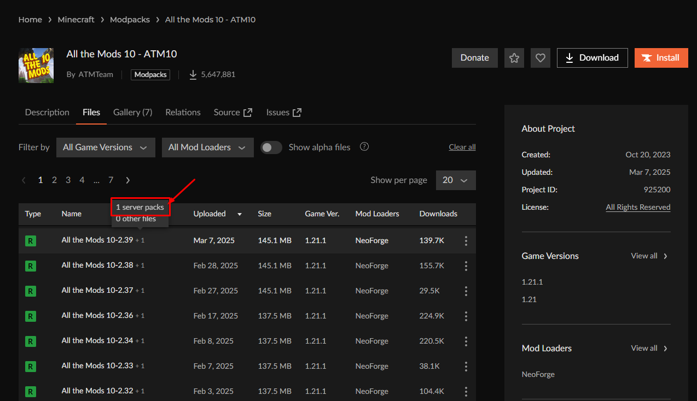

 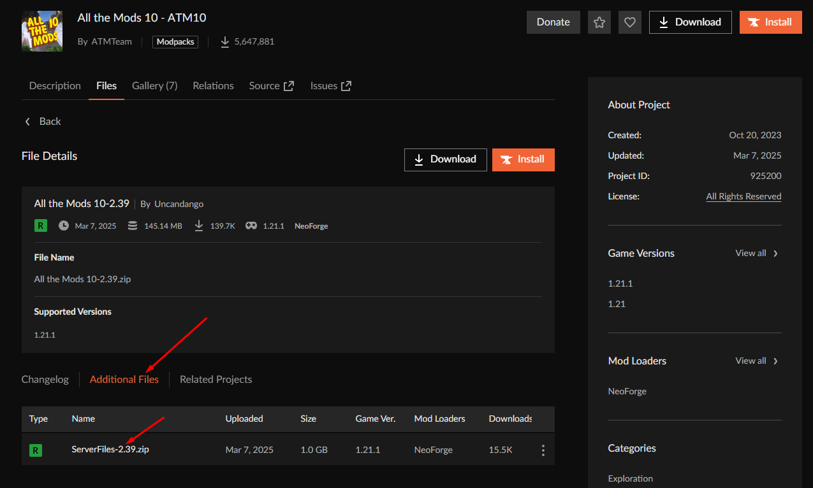 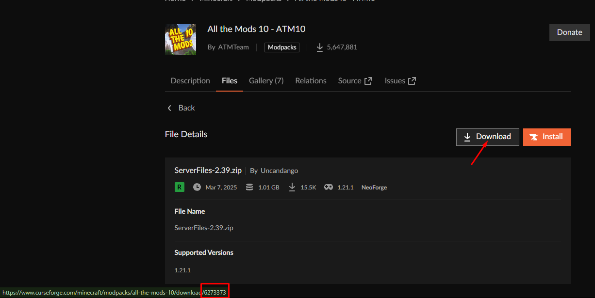

Quay lại Panel và nhập các thông số cần thiết ở tab **Startup**, sau đó nhấn **Reinstall Server** ở phần **Settings**

 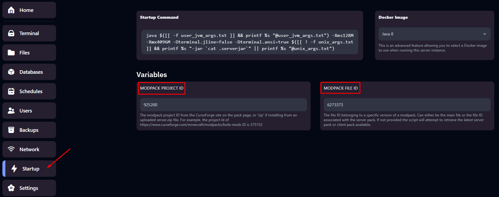

 

**Chúc bạn thực hiện thành công!**

> **THAM KHẢO CÁC DỊCH VỤ TẠI [VINAHOST](https://vinahost.vn/)**
>
> **>>** **[SERVER](https://vinahost.vn/thue-may-chu-rieng/)** **–** **[COLOCATION](https://vinahost.vn/colocation.html)** – **[CDN](https://vinahost.vn/dich-vu-cdn-chuyen-nghiep)**
>
> **>> [CLOUD](https://vinahost.vn/cloud-server-gia-re/) – [VPS](https://vinahost.vn/vps-ssd-chuyen-nghiep/)**
>
> **>> [HOSTING](https://vinahost.vn/wordpress-hosting)**
>
> **>> [EMAIL](https://vinahost.vn/email-hosting)**
>
> **>> [WEBSITE](http://vinawebsite.vn/)**
>
> **>> [TÊN MIỀN](https://vinahost.vn/ten-mien-gia-re/)**