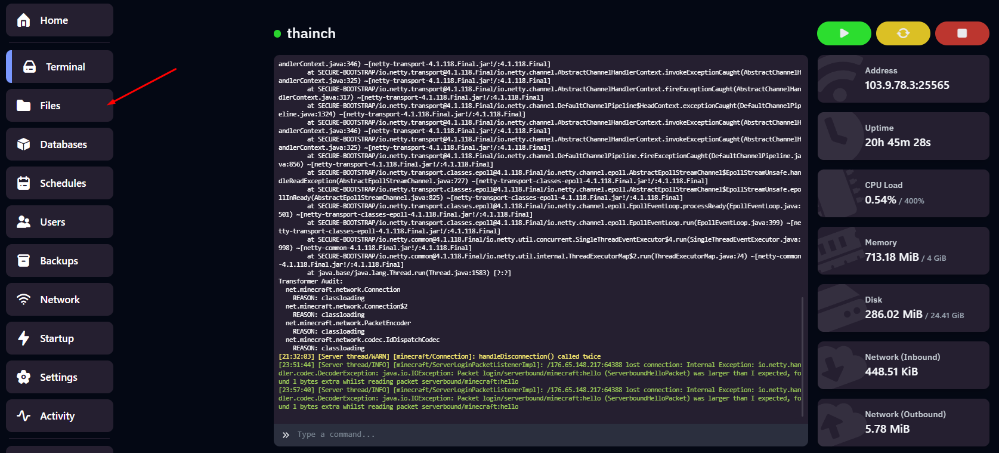
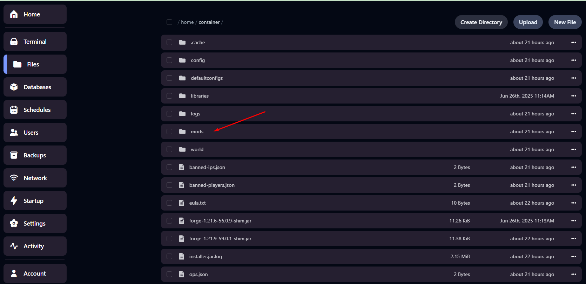
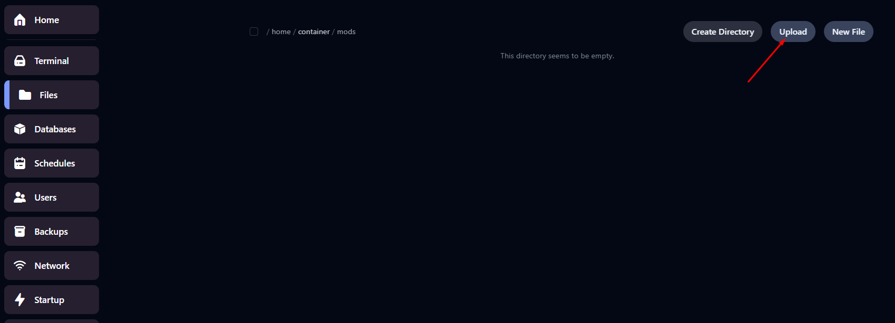
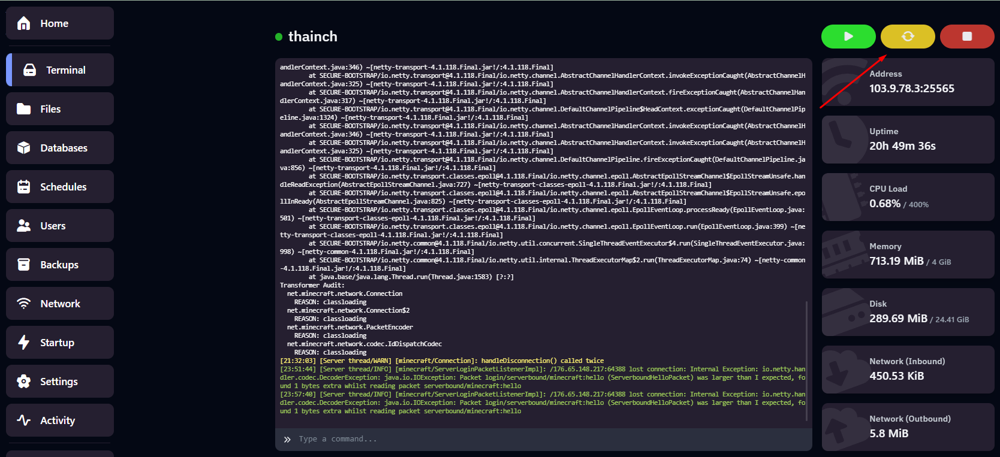
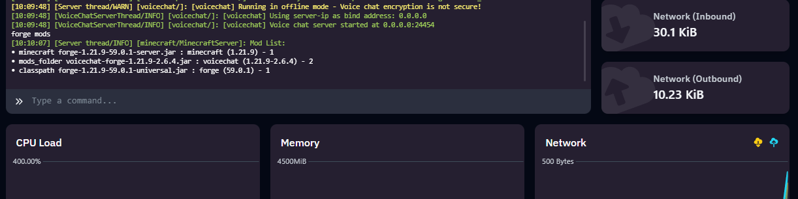

# Hướng dẫn tải và cài đặt mod - plugin cho server Minecraft tại Vinahost

Bài viết này sẽ giới thiệu về **Hướng dẫn tải và cài đặt mod - plugin cho server Minecraft tại Vinahost** và lợi ích của nó. Nếu bạn cần hỗ trợ, xin vui lòng liên hệ VinaHost qua **Hotline 1900 6046 ext. 3**, email về [support@vinahost.vn](mailto:support@vinahost.vn) hoặc chat với VinaHost qua livechat <https://livechat.vinahost.vn/chat.php>

### 1. Thao tác với Panel quản lý

Sau khi đăng nhập vào Panel quản lý **Server Minecraft**, ta chọn vào mục **Files**

 

Di chuyển đến thư mục **plugins**, đây là thư mục sẽ chứa các plugin của **Server Minecraft**

*(Chúng ta chọn thư mục* ***mods*** *đối với các phiên bản Minecraft như* ***Forge****,* ***Farbic****,…)*

 

### 2. Upload mod/plugin lên Panel

Ta chọn vào **Upload** để tải các file plugin lên **Server Minecraft**

 

Sau khi hoàn tất upload, ta quay lại tab **Console** và chọn **Restart** Server

 

Ta có thể dùng lệnh **forge** **mods** để kiểm tra các mod đã được cài đặt vào Server

*(lệnh* ***plugins*** *đối với Paper, Spigot,..)* 

Một số trang web tải **plugin/mod** phổ biến :

\[1\] <https://modrinth.com/>

\[2\] <https://www.curseforge.com/minecraft>

\[3\] <https://www.9minecraft.net/>

**Chúc bạn thực hiện thành công!**

> **THAM KHẢO CÁC DỊCH VỤ TẠI [VINAHOST](https://vinahost.vn/)**
>
> **>>** **[SERVER](https://vinahost.vn/thue-may-chu-rieng/)** **–** **[COLOCATION](https://vinahost.vn/colocation.html)** – **[CDN](https://vinahost.vn/dich-vu-cdn-chuyen-nghiep)**
>
> **>> [CLOUD](https://vinahost.vn/cloud-server-gia-re/) – [VPS](https://vinahost.vn/vps-ssd-chuyen-nghiep/)**
>
> **>> [HOSTING](https://vinahost.vn/wordpress-hosting)**
>
> **>> [EMAIL](https://vinahost.vn/email-hosting)**
>
> **>> [WEBSITE](http://vinawebsite.vn/)**
>
> **>> [TÊN MIỀN](https://vinahost.vn/ten-mien-gia-re/)**