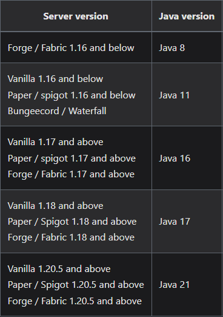
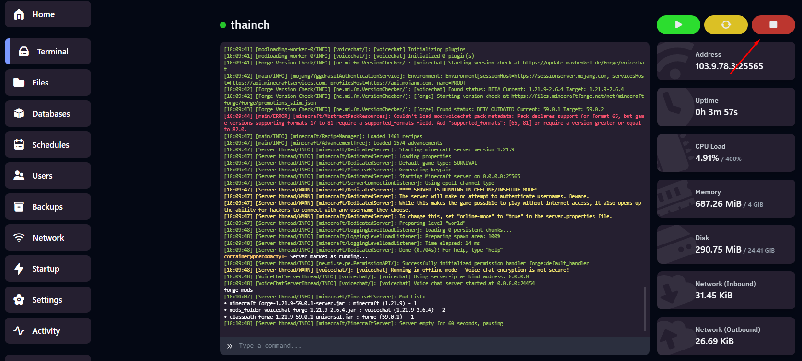
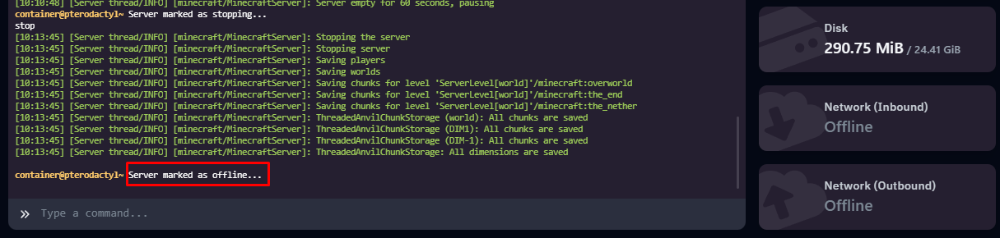
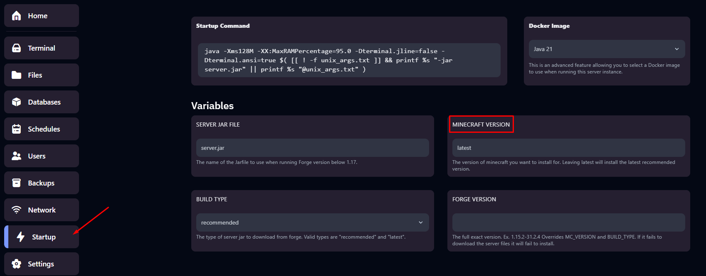
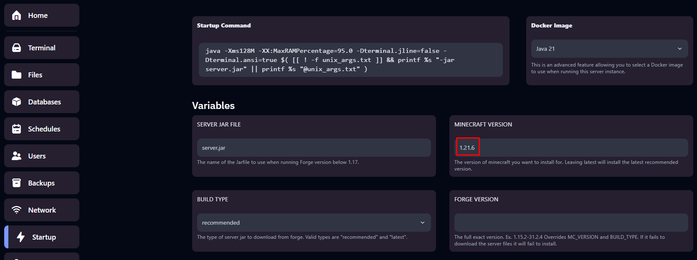
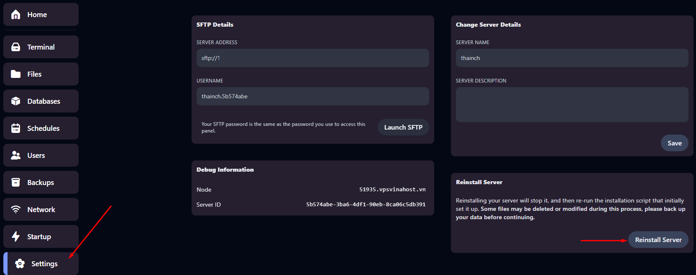
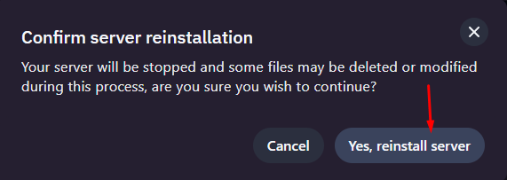
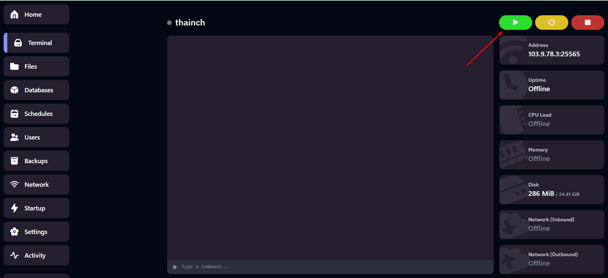
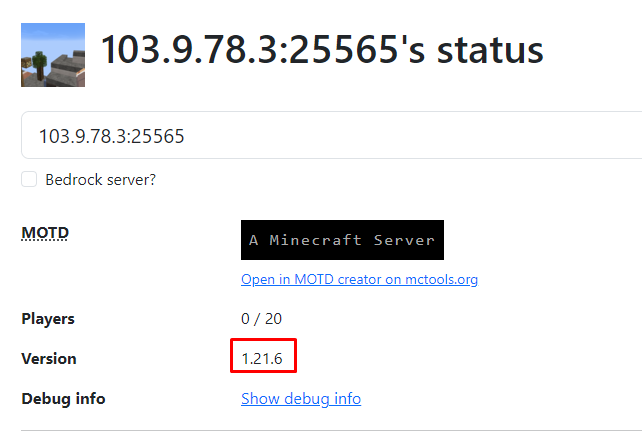

# Hướng dẫn thay đổi phiên bản cho server Minecraft tại Vinahost

Bài viết này sẽ giới thiệu về **Hướng dẫn thay đổi phiên bản cho server Minecraft tại Vinahost (Minecraft Forge)** và lợi ích của nó. Nếu bạn cần hỗ trợ, xin vui lòng liên hệ VinaHost qua **Hotline 1900 6046 ext. 3**, email về [support@vinahost.vn](mailto:support@vinahost.vn) hoặc chat với VinaHost qua livechat <https://livechat.vinahost.vn/chat.php>

Đầu tiên Quý khách liên hệ với phòng kỹ thuật để được hỗ trợ chuyển đổi phiên bản server sang phiên bản theo nhu cầu trước (Quý khách lưu ý các phiên bản Java mà các phiên bản Minecraft yêu cầu để đảm bảo quá trình chuyển đổi phiên bản diễn ra suôn sẻ nhé)

 

## 1. Tắt Server

Ta truy cập panel và chọn **Stop** để tắt server

 

 

## 2. Thay đổi phiên bản

### a. Forge/Fabric

Di chuyển qua tab **Startup**, ta chú ý phần **MINECRAFT VERSION.** Mặc định thông số này là latest, tức là sẽ luôn tải phiên bản mới nhất hiện có.

 

Ví dụ ta cần cài đặt Forge cho phiên bản **Minecraft 1.21.6** thì ta cần điền `1.21.6` vào thông số **MINECRAFT VERSION**:

 

* Các phiên bản Minecraft Forge xem tại: \[ĐÂY\](<https://files.minecraftforge.net/net/minecraftforge/forge/>)
* Các phiên bản Minecraft Fabric xem tại: \[ĐÂY\](<https://fabricmc.net/use/server/>)

### b. Vanilla/Paper/Spigot/Purpur

* Các phiên bản Minecraft Paper xem tại: \[ĐÂY\](<https://papermc.io/downloads/all?project=paper>)
* Các phiên bản Minecraft Spigot xem tại: \[ĐÂY\](<https://www.spigotmc.org/>)
* Các phiên bản Minecraft Spigot xem tại: \[ĐÂY\](<https://api.purpurmc.org/v2/purpur>)
* Các phiên bản Minecraft Vanilla xem tại: \[ĐÂY\](<https://minecraft.fandom.com/wiki/Java_Edition_version_history>)
* \

### c. Bedrock

Các phiên bản Minecraft Bedorck xem tại: \[ĐÂY\](<https://minecraft.wiki/w/Bedrock_Edition_version_history>)

## 3. Tiến hành cài đặt lại server để áp dụng thay đổi

Sau khi hoàn tất nhập, ta di chuyển qua tab **Settings** và chọn **Reinstall Server** để tiến hành nâng cấp/hạ cấp phiên bản (tùy theo **version** hiện tại)

 

 

Lúc này server sẽ tiến hành quá trình cài đặt, sau khi hoàn tất, ta quay lại tab **Console** và chọn **Start** để khởi động server

 

Thành quả

 

**Chúc bạn thực hiện thành công!**

> **THAM KHẢO CÁC DỊCH VỤ TẠI [VINAHOST](https://vinahost.vn/)**
>
> **>>** **[SERVER](https://vinahost.vn/thue-may-chu-rieng/)** **–** **[COLOCATION](https://vinahost.vn/colocation.html)** – **[CDN](https://vinahost.vn/dich-vu-cdn-chuyen-nghiep)**
>
> **>> [CLOUD](https://vinahost.vn/cloud-server-gia-re/) – [VPS](https://vinahost.vn/vps-ssd-chuyen-nghiep/)**
>
> **>> [HOSTING](https://vinahost.vn/wordpress-hosting)**
>
> **>> [EMAIL](https://vinahost.vn/email-hosting)**
>
> **>> [WEBSITE](http://vinawebsite.vn/)**
>
> **>> [TÊN MIỀN](https://vinahost.vn/ten-mien-gia-re/)**