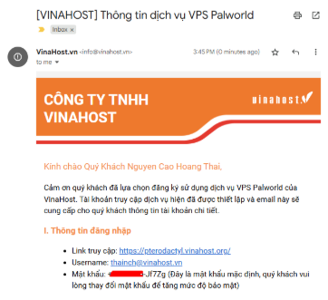
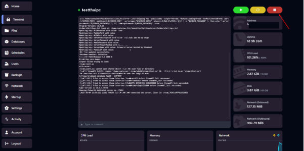

# Hướng dẫn Custom cấu hình Palworld chi tiết tại VinaHost

Bài viết này sẽ giới thiệu về **Hướng dẫn Custom cấu hình Palworld chi tiết tại VinaHost** và lợi ích của nó. Nếu bạn cần hỗ trợ, xin vui lòng liên hệ VinaHost qua **Hotline 1900 6046 ext. 3**, email về [support@vinahost.vn](mailto:support@vinahost.vn) hoặc chat với VinaHost qua livechat <https://livechat.vinahost.vn/chat.php>

Sau khi kích hoạt thành công dịch vụ VPS Palworld tại VinaHost bạn sẽ nhận được mail sau: 

## 1. Truy cập vào Panel Quản lý

Chọn Server vừa được tạo

 

Sau khi tạo thành công server sẽ tự động Start.

**Lưu ý: Cần Stop Server trước khi cấu hình và Lưu lại cấu hình mặc định trường hợp gặp lỗi.**

**Lưu ý: Cần Stop Server trước khi cấu hình và Lưu lại cấu hình mặc định trường hợp gặp lỗi.**

**Lưu ý: Cần Stop Server trước khi cấu hình và Lưu lại cấu hình mặc định trường hợp gặp lỗi.**

 

## 2. Truy cập File cấu hình

## 3. Chi tiết các tham số và ý nghĩa

Tham số cần lưu ý đầu tiên:**bUseAuth=True** (chơi bản quyền)

**bUseAuth=False** (chơi "thuốc")

| **Tham số** | **Mô tả / Ý nghĩa** |
|:---|:---|
| **AdminPassword** | Mật khẩu để lấy quyền quản trị trên máy chủ. |
| **AllowConnectPlatform** | Không áp dụng với phiên bản hiện tại — hãy dùng CrossplayPlatforms. |
| **BaseCampMaxNumInGuild** | Số lượng BaseCamp tối đa trong một bang hội (mặc định 4; tối đa 10). Nếu đặt cao hơn sẽ tăng tải hệ thống. |
| **BaseCampWorkerMaxNum** | Số lượng Pal tối đa trong một BaseCamp (tối đa 50). Càng cao → tải hệ thống càng lớn. |
| **bAllowGlobalPalboxExport** | Nếu = True, cho phép xuất ra "palbox toàn cục". |
| **bAllowGlobalPalboxImport** | Nếu = True, cho phép nhập từ "palbox toàn cục". |
| **bBuildAreaLimit** | Cấm xây dựng gần các công trình như điểm di chuyển nhanh (fast travel). |
| **bCharacterRecreateInHardcore** | Cho phép tạo lại nhân vật nếu bạn chết trong chế độ Hardcore. |
| **bEnableFastTravel** | Bật tính năng di chuyển nhanh (Fast Travel). |
| **bEnableInvaderEnemy** | Bật chế độ kẻ xâm lược (Invader). |
| **bHardcore** | Bật chế độ Hardcore — không thể hồi sinh khi chết. |
| **bInvisibleOtherGuildBaseCampAreaFX** | Hiển thị vùng BaseCamp của bang hội khác (hiệu ứng vùng bất khả kiến). |
| **bIsRandomizerPalLevelRandom** | Nếu = True, cấp độ Pal hoang dã sẽ hoàn toàn ngẫu nhiên; nếu = False, sẽ ngẫu nhiên nhưng được tối ưu theo khu vực. |
| **bIsUseBackupSaveData** | Bật tính năng sao lưu dữ liệu thế giới (backup). Khi bật sẽ gia tăng tải đĩa. |
| **bPalLost** | Khi chết, bạn sẽ mất Pal vĩnh viễn (tùy chọn này bật/tắt). |
| **bShowPlayerList** | Hiển thị danh sách người chơi khi nhấn phím ESC. |
| **BuildObjectDamageRate** | Hệ số tổn hại cấu trúc (công trình). |
| **BuildObjectDeteriorationDamageRate** | Tốc độ hao mòn hư hại của cấu trúc. |
| **ChatPostLimitPerMinute** | Số tin nhắn tối đa có thể gửi trong 1 phút. |
| **CollectionDropRate** | Hệ số tỉ lệ rơi vật phẩm thu thập được. |
| **CollectionObjectHpRate** | Hệ số máu (HP) của các đối tượng thu thập được. |
| **CollectionObjectRespawnSpeedRate** | Tốc độ hồi sinh các đối tượng thu thập được. |
| **CrossplayPlatforms** | Các nền tảng được phép kết nối với máy chủ. Mặc định: (Steam, Xbox, PS5, Mac) |
| **DayTimeSpeedRate** | Tốc độ thời gian ban ngày. |
| **DeathPenalty** | Hình phạt khi chết: |
| • None | Không rơi (drop) gì cả. |
| • Item | Rơi tất cả vật phẩm ngoại trừ trang bị (equipment). |
| • ItemAndEquipment | Rơi tất cả vật phẩm và trang bị. |
| • All | Rơi tất cả vật phẩm và tất cả Pal trong đội. |
| **EnemyDropItemRate** | Hệ số nhân lượng rơi vật phẩm từ kẻ địch. |
| **EquipmentDurabilityDamageRate** | Hệ số mất độ bền của trang bị. |
| **ExpRate** | Tốc độ nhân điểm kinh nghiệm (EXP). |
| **GuildPlayerMaxNum** | Số lượng thành viên tối đa trong mỗi bang hội. |
| **ItemContainerForceMarkDirtyInterval** | Khoảng thời gian (giây) để đồng bộ bắt buộc khi mở container. |
| **ItemWeightRate** | Hệ số trọng lượng của vật phẩm. |
| **LogFormatType** | Định dạng nhật ký (log): Text hoặc Json. |
| **MaxBuildingLimitNum** | Số lượng công trình tối đa mỗi người chơi (0 = không giới hạn). |
| **NightTimeSpeedRate** | Tốc độ thời gian ban đêm. |
| **PalAutoHPRegeneRate** | Tốc độ tự hồi máu của Pal. |
| **PalAutoHpRegeneRateInSleep** | Tốc độ hồi máu khi Pal đang trong Palbox (nghỉ ngơi). |
| **PalCaptureRate** | Tốc độ bắt Pal. |
| **PalDamageRateAttack** | Hệ số sát thương do Pal gây ra (nhân số). |
| **PalDamageRateDefense** | Hệ số sát thương mà Pal phải chịu (nhân số). |
| **PalEggDefaultHatchingTime** | Thời gian (giờ) để ấp trứng lớn (Massive Egg). Các loại trứng khác cũng cần thời gian ấp riêng. |
| **PalSpawnNumRate** | Tỉ lệ xuất hiện Pal. (Lưu ý: ảnh hưởng hiệu năng trò chơi). |
| **PalStaminaDecreaceRate** | Tốc độ giảm năng lượng của Pal. |
| **PalStomachDecreaceRate** | Tốc độ giảm đói của Pal. |
| **PlayerAutoHPRegeneRate** | Tốc độ tự hồi máu của người chơi. |
| **PlayerAutoHpRegeneRateInSleep** | Tốc độ hồi máu khi người chơi trong trạng thái ngủ. |
| **PlayerDamageRateAttack** | Hệ số sát thương người chơi gây ra (nhân số). |
| **PlayerDamageRateDefense** | Hệ số sát thương người chơi phải chịu (nhân số). |
| **PlayerStaminaDecreaceRate** | Tốc độ giảm năng lượng của người chơi. |
| **PlayerStomachDecreaceRate** | Tốc độ giảm đói của người chơi. |
| **PublicIP** | Chỉ định riêng IP công cộng bên ngoài cho máy chủ cộng đồng. |
| **PublicPort** | Chỉ định riêng port công cộng bên ngoài cho máy chủ (không thay đổi port lắng nghe). |
| **RandomizerSeed** | Hạt giống (seed) để tạo ngẫu nhiên. |
| **RandomizerType** | Kiểu ngẫu nhiên Pal: |
| • None | Không ngẫu nhiên. |
| • Region | Ngẫu nhiên theo vùng. |
| • All | Ngẫu nhiên hoàn toàn. |
| **RCONEnabled** | Bật tính năng RCON (quản trị từ xa). |
| **RCONPort** | Cổng (port) dùng cho RCON. |
| **RESTAPIEnabled** | Bật API REST. |
| **RESTAPIPort** | Port để REST API lắng nghe. |
| **ServerDescription** | Mô tả về máy chủ (server). |
| **ServerName** | Tên máy chủ. |
| **ServerPassword** | Mật khẩu để đăng nhập máy chủ (nếu có). |
| **ServerPlayerMaxNum** | Số người chơi tối đa có thể kết nối vào máy chủ. |
| **ServerReplicatePawnCullDistance** | Khoảng cách đồng bộ Pal từ người chơi (tính bằng cm). Phạm vi từ 5000 đến 15000. |
| **SupplyDropSpan** | Khoảng cách thời gian (phút) giữa các lần thả hàng cung cấp (supply drop). |

Sau khi cấu hình hoàn tất **Start** lại Server và tiến vào Palworld tận hưởng.

**Chúc các bạn chơi game vui vẻ!!**

> **THAM KHẢO CÁC DỊCH VỤ TẠI [VINAHOST](https://vinahost.vn/)**
>
> **>>** **[SERVER](https://vinahost.vn/thue-may-chu-rieng/)** **–** **[COLOCATION](https://vinahost.vn/colocation.html)** – **[CDN](https://vinahost.vn/dich-vu-cdn-chuyen-nghiep)**
>
> **>> [CLOUD](https://vinahost.vn/cloud-server-gia-re/) – [VPS](https://vinahost.vn/vps-ssd-chuyen-nghiep/)**
>
> **>> [HOSTING](https://vinahost.vn/wordpress-hosting)**
>
> **>> [EMAIL](https://vinahost.vn/email-hosting)**
>
> **>> [WEBSITE](http://vinawebsite.vn/)**
>
> **>> [TÊN MIỀN](https://vinahost.vn/ten-mien-gia-re/)**
