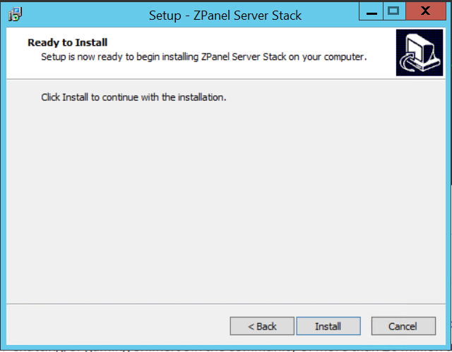

Bài viết này sẽ hướng dẫn bạn cách **Cài đặt Zpanel trên Hệ Điều Hành Windows** Nếu bạn cần hỗ trợ, xin vui lòng liên hệ VinaHost qua **Hotline 1900 6046 ext. 3**, email về [support@vinahost.vn](mailto:support@vinahost.vn) hoặc chat với VinaHost qua livechat [https://livechat.vinahost.vn/chat.php](https://livechat.vinahost.vn/chat.php).

Bài viết này sẽ hướng dẫn bạn cài đặt Zpanel trên Windows một cách chi tiết nhất.

# Hướng dẫn cách cài đặt và thiết lập Zpanel

# 1. Yêu cầu đối với hệ thống

- Tối thiếu 256 MB RAM 
- Tối thiểu 2GB ổ đĩa trống 
- MySQL 5.5.29 
- Apache 2.4.3 
- PHP 5.3.20 
- Bind 9.9.2-P1 
- Phpmyadmin 3.5.8.1 
- Roundcube 0.9.2 

# 2. Hướng dẫn cài đặt zPanel đối với hệ điều hành Windows

Đầu tiên, bạn cần tải xuống và chạy file .exe từ trang web chính thức của Control panel này.

Bộ cài đặt tự động sẽ không chỉ cài đặt và cấu hình Control panel này mà còn các phần mềm quan trọng khác như Apache, PHP, MySQL, BIND, ProFTPd, và nhiều ứng dụng khác.

Chúng ta tiến hành Download Zpanel stack về và cài đặt.

Tiến hành khởi chạy file zpanel stack .exe màn hình sẽ hiển thị bảng setup của Zpanel Stack.

Chọn Next để tiếp tục bước cài đặt

Sau đó chọn "Install" để cài đặt.

Sau bước này thì hệ thống sẽ tự động cài các phần mềm mà chúng ta đã đề cập ở đầu bài viết.

Click chuột phải vào file .exe sau đó chọn "Run as administrator" màn hình sẽ hiển thị bảng Setup của Zpanel

Chọn Next để tiếp tục.

Chọn Install để tiếp tục.

Sau đó hệ thống sẽ tự cài các Version Visual 2005, 2008 và 2010 Runtimes.

Chọn Finish để hoàn thành tiến trình trên.

Khi cài đặt hoàn tất, bạn có thể truy cập giao diện quản trị ZPanel tại http://your_server_ip/zpanel

Lưu ý: Thay thế your_server_ip bằng địa chỉ IP thực tế của máy chủ.

Chúc bạn thực hiện thành công!

> **THAM KHẢO CÁC DỊCH VỤ TẠI [VINAHOST](https://vinahost.vn/)**
> 
> **\>>** [**SERVER**](https://vinahost.vn/thue-may-chu-rieng/) **–** [**COLOCATION**](https://vinahost.vn/colocation.html) – [**CDN**](https://vinahost.vn/dich-vu-cdn-chuyen-nghiep)
> 
> **\>> [CLOUD](https://vinahost.vn/cloud-server-gia-re/) – [VPS](https://vinahost.vn/vps-ssd-chuyen-nghiep/)**
> 
> **\>> [HOSTING](https://vinahost.vn/wordpress-hosting)**
> 
> **\>> [EMAIL](https://vinahost.vn/email-hosting)**
> 
> **\>> [WEBSITE](http://vinawebsite.vn/)**
> 
> **\>> [TÊN MIỀN](https://vinahost.vn/ten-mien-gia-re/)**

