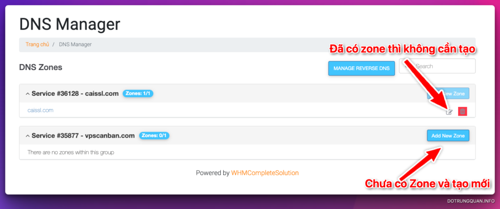

# Hướng dẫn cấu hình DNS domain tại VinaHost

DNS (Domain Name System) là một phần không thể thiếu của một trang web, giúp kết nối tên miền (domain name) với địa chỉ IP của máy chủ (server) để người dùng có thể truy cập vào trang web. Tuy nhiên, không phải ai cũng biết cách quản lý DNS domain để đảm bảo trang web hoạt động tốt. Trong bài viết này, chúng ta sẽ cùng tìm hiểu về cách quản lý DNS domain tại VinaHost – một nhà cung cấp dịch vụ tên miền uy tín và được nhiều người tin tưởng. Các bước hướng dẫn đơn giản và dễ hiểu, giúp bạn có thể tự tin quản lý DNS domain cho trang web của mình một cách chuyên nghiệp.

Bước 1: Truy cập vào trang login
--------------------------------

*   Link đăng nhập: [https://secure.vinahost.vn/ac/clientarea.php](https://secure.vinahost.vn/ac/clientarea.php)

Tại đây bạn nhập vào Email và Password để đăng nhập.

Sau đó bạn chọn **Tên miền** => **Tên miền của tôi**

Bạn sẽ thấy danh sách tên miền hiện đang sử dụng

Bước 2: Quản lý DNS
-------------------

Ở trong bài này tôi sẽ hướng dẫn bạn quản lý và thay đổi cặp Name Server(NS) và các bản ghi DNS như sau:

### 1\. Quản lý Name Server(NS)

Name Server (NS) là một loại máy chủ được sử dụng trong hệ thống DNS (Domain Name System) để quản lý các tên miền và chuyển đổi các tên miền thành địa chỉ IP tương ứng.

Lưu ý: Nếu sử dụng Name Server(NS) bên thứ 3 thì các bản ghi DNS ở đây sẽ không còn hiệu lực

Để thay đổi Name Server(NS) bạn chọn vào nút mũi tên xuống => **Quản lý Name Server**

Sau đó bạn chọn **Sử dụng nameserver tùy chỉnh (nhập bên dưới)**, nhập vào cặp Name Server(NS) cần đổi và chọn **Đổi Nameserver**

### 2\. Cấu hình bản ghi DNS record

Để cấu hình DNS bạn truy cập vào mũi tên => **Quản lý DNS**

Sau đó hệ thống chuyển bạn để trang DNS Manager, ở đây bạn cần xem domain đã có Zone hay chưa. Nếu đã có zone rồi bạn chỉ cần click vào nút Edit sau đó vào quản lý bản ghi DNS. Nếu domain chưa có Zone thì bạn cần tạo bằng cách click vào **Add New Zone**

**Các loại bản ghi VinaHost hỗ trợ**. **Tuy nhiên trong bài viết này tôi chỉ hướng dẫn cấu hình một số bản ghi thường sử dụng nhất.**

*   A
*   AAAA
*   CNAME
*   MX
*   NS
*   SRV
*   TXT

#### 2.1. Trỏ bản ghi A

Bản ghi A (Address): Bản ghi A liên kết tên miền với địa chỉ IP tương ứng của máy chủ web. Nó là bản ghi quan trọng nhất và được sử dụng để xác định địa chỉ IP của một trang web.

*   Name: nhập @ (đối với tên miền chính), sub (đối với tên miền phụ)
*   Type: A
*   TTL: Mặc định
*   RDATA: Nhập vào IP đích cần trỏ về

#### 2.2. CNAME

Bản ghi CNAME (Canonical Name): Bản ghi CNAME liên kết một tên miền phụ với một tên miền chính (canonical name). Bản ghi này thường được sử dụng để tạo ra các bản ghi DNS trỏ từ một tên miền con đến một tên miền chính.

*   Name: nhập giá trị cần trỏ
*   Type: CNAME
*   TTL: Mặc định
*   RDATA: Nhập giá trị đích

#### 2.3. MX (Dành cho mail)

Bản ghi MX (Mail Exchange): Bản ghi MX chỉ định máy chủ thư điện tử chính xác mà các thông điệp thư điện tử nên được gửi đến. Bản ghi này được sử dụng để cấu hình các máy chủ thư điện tử cho tên miền.

*   Name: nhập @ (đối với tên miền chính), sub (đối với tên miền phụ)
*   Type: MX
*   TTL: Mặc định
*   RDATA:
    *   preference: Độ ưu tiên
    *   exchange: Giá trị MX

#### 2.4 TXT

*   Name: nhập @ (đối với tên miền chính), sub (đối với tên miền phụ)
*   Type: TXT
*   TTL: Mặc định
*   RDATA: Nhập giá trị đích

Bản ghi TXT (Text): Bản ghi TXT chứa thông tin văn bản không định dạng được sử dụng để cung cấp các thông tin khác nhau cho tên miền, chẳng hạn như thông tin xác thực và xác minh quyền sở hữu.

Lấy mã EPP tên miền
-------------------

Trong trường hợp bạn cần lấy mã EPP để chuyển tên miền bạn thực hiện như sau

Bạn chọn vào tên miền => Quản lý tên miền

Sau đó bấm vào Lấy mã EPP và cột bên phải sẽ hiển thị mã EPP của tên miền bạn.

Trong bài viết này, chúng ta đã tìm hiểu về quản lý DNS và các bản ghi DNS phổ biến, bao gồm bản ghi A, TXT, CNAME và MX. Chúng ta cũng đã hiểu về giá trị TTL trong DNS và tầm quan trọng của nó trong việc đảm bảo tính chính xác và an toàn cho hệ thống DNS.

Quản lý DNS là một phần quan trọng trong việc cấu hình hệ thống mạng và web, giúp kết nối tên miền với các địa chỉ IP tương ứng. Bằng cách hiểu rõ các bản ghi DNS và giá trị TTL, chúng ta có thể quản lý và cấu hình hệ thống DNS của mình một cách hiệu quả và đảm bảo tính ổn định và an toàn cho hệ thống mạng và web.

##### [ĐỖ TRUNG QUÂN](https://dotrungquan.info/author/quandt/ " ĐỖ TRUNG QUÂN")
