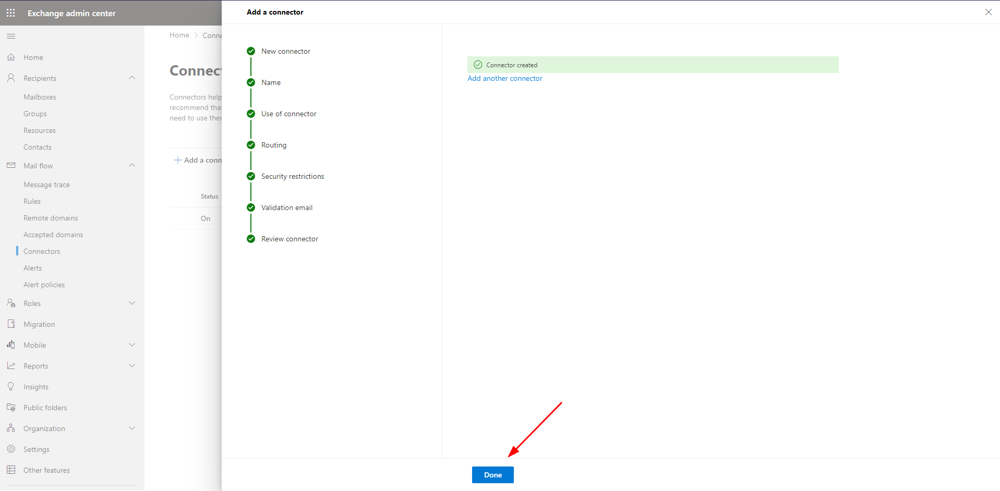

# Hướng dẫn cấu hình mail hybrid office 365 về mail server 

Bài viết này sẽ hướng dẫn bạn cấu hình mail hybrid office từ hệ thống mail office gửi về mail server đang sử dụng. Nếu bạn cần hỗ trợ, xin vui lòng liên hệ VinaHost qua **Hotline 1900 6046 ext. 3**, email về [support@vinahost.vn](mailto:support@vinahost.vn) hoặc chat với VinaHost qua livechat [https://livechat.vinahost.vn/chat.php](https://livechat.vinahost.vn/chat.php).

- Đăng nhập vào quản trị office https://admin.microsoft.com/

- ***Bước 1***: Sau khi đăng nhập chọn Exchange để chuyển sang giao diện quản trị  Exchnge Admin Center:

- ***Bước 2***: Chọn Accept domains /Interrnal relay để cấu hình gửi đến những tài khoản mail không có trên office sẽ relay sang hệ thống mail server Vinahost.

- ***Bước 3***:Chọn Mail flow / Connectors để cấu hình route từ office về mail server VinaHost.

- ***Bước 4***:Chọn connectors / add connectors

- ***Bước 5***:Đặt tên Connector name cho dễ nhớ

- ***Bước 6**:Nhập domain đang sử dụng mail vào.

- ***Bước 7***:Nhập hostname: mailxx.vinahost.vn hoặc ip server mail đang sử dụng mail tại VinaHost.

- ***Bước 8***:Chọn chọn phương thức bảo mật khi gửi mail về server chọn Next

!!! note
     Nếu mail server của bạn chưa cài đặt SSL hoặc ở bước 7 bạn nhập là IP của Mail server thì có thể thể bỏ tick các tuy chọn ở đây để khi gửi mail thì server sẽ không từ chối.
     Tuy nhiên việc này sẽ không được khuyến khích vì truyền tải dữ liệu khi không mã hoá sẽ làm cho hacker có thể bắt được gói tin và đọc được mail của bạn.
     Bạn nên cài SSL tại mail server trước khi cài đặt Hybrid để đạt hiệu suất tốt nhất.

- ***Bước 9***:Nhập 1 tài khoản mail tồn tại trên server mail Vinahost đang sử dụng, nếu có nhiều tài khoản khác với domain khác thì có thể thêm vào.

- ***Bước 10***: Sau khi nhấn vào Validate để kiểm tra lại xem kết nối và send mail có bị lỗi hay không, nếu như hình sau thì ok. Trường hợp bị lỗi, kiểm tra lại xem có có tạo nhiều connectors, off các connectors không sử dụng sau đó check lại.

- ***Bước 11***: Ta chọn Create connector để hoàn tất việc cấu hình.

- ***Bước 12***: Sau đó chọn Done để hoàn tất việc cấu hình

- Cuối cùng ta kiểm tra lại Conector đã được bật chưa trước khi trỏ domain về mail Office 365

Sau khi cấu hình xong, bạn có thể trỏ domain về mail Office 365

Chúc bạn thực hiện thành công!

> **THAM KHẢO CÁC DỊCH VỤ TẠI [VINAHOST](https://vinahost.vn/)**
> 
> **\>>** [**SERVER**](https://vinahost.vn/thue-may-chu-rieng/) **–** [**COLOCATION**](https://vinahost.vn/colocation.html) – [**CDN**](https://vinahost.vn/dich-vu-cdn-chuyen-nghiep)
> 
> **\>> [CLOUD](https://vinahost.vn/cloud-server-gia-re/) – [VPS](https://vinahost.vn/vps-ssd-chuyen-nghiep/)**
> 
> **\>> [HOSTING](https://vinahost.vn/wordpress-hosting)**
> 
> **\>> [EMAIL](https://vinahost.vn/email-hosting)**
> 
> **\>> [WEBSITE](http://vinawebsite.vn/)**
> 
> **\>> [TÊN MIỀN](https://vinahost.vn/ten-mien-gia-re/)**