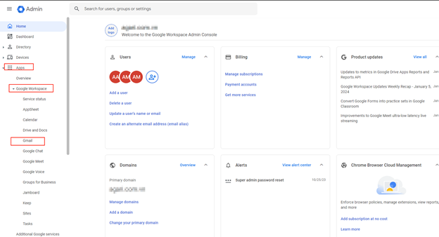
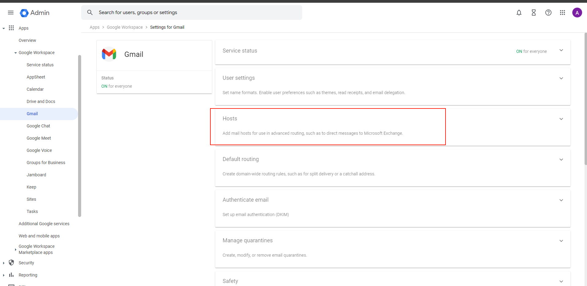
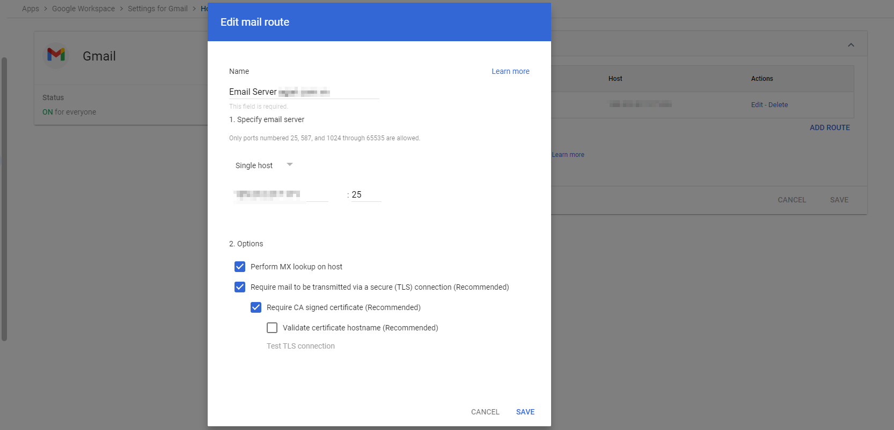
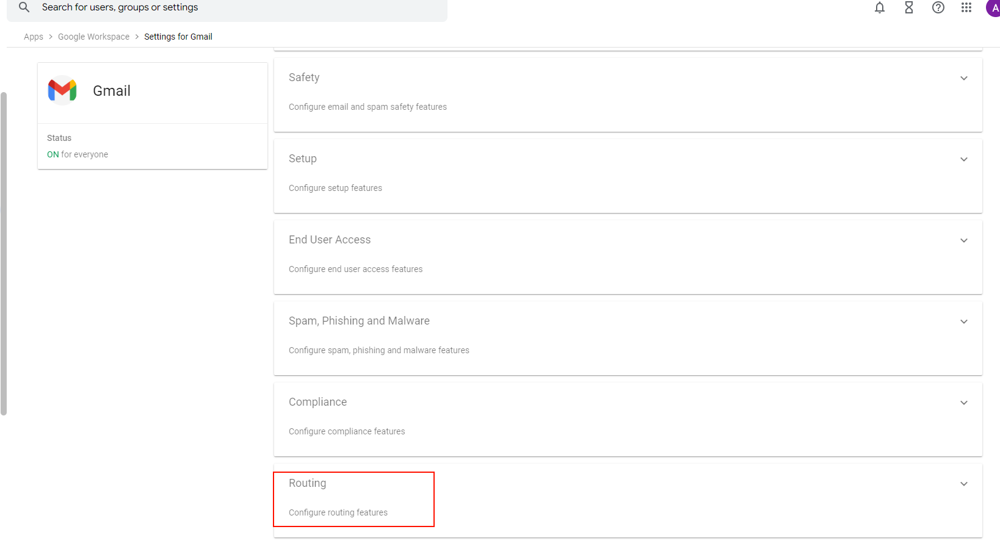
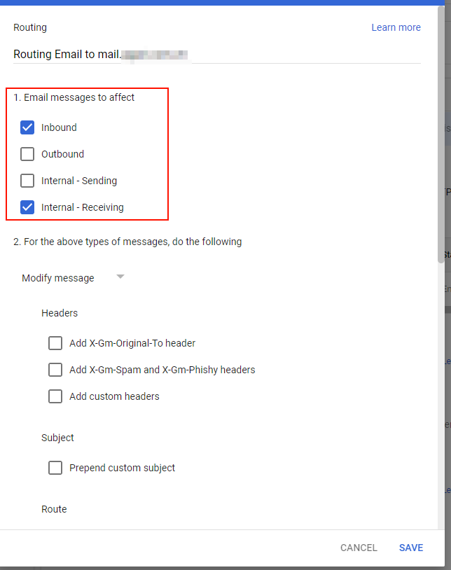
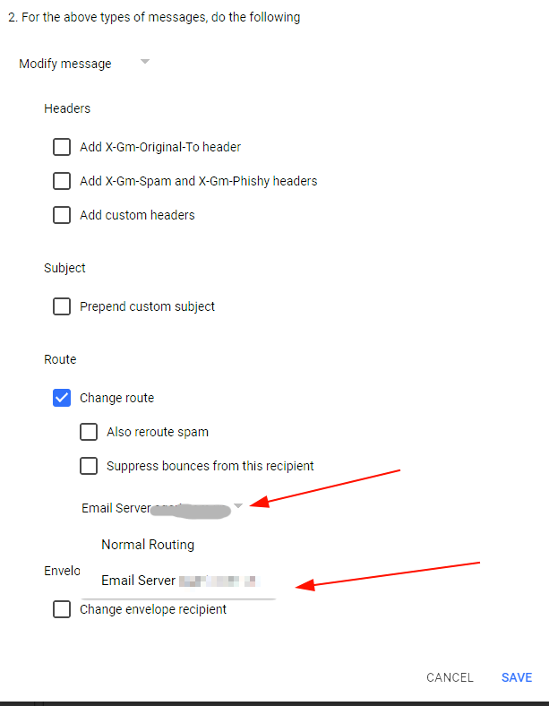
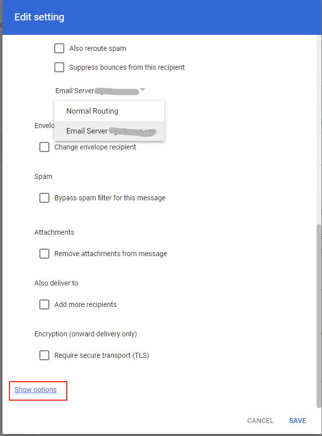
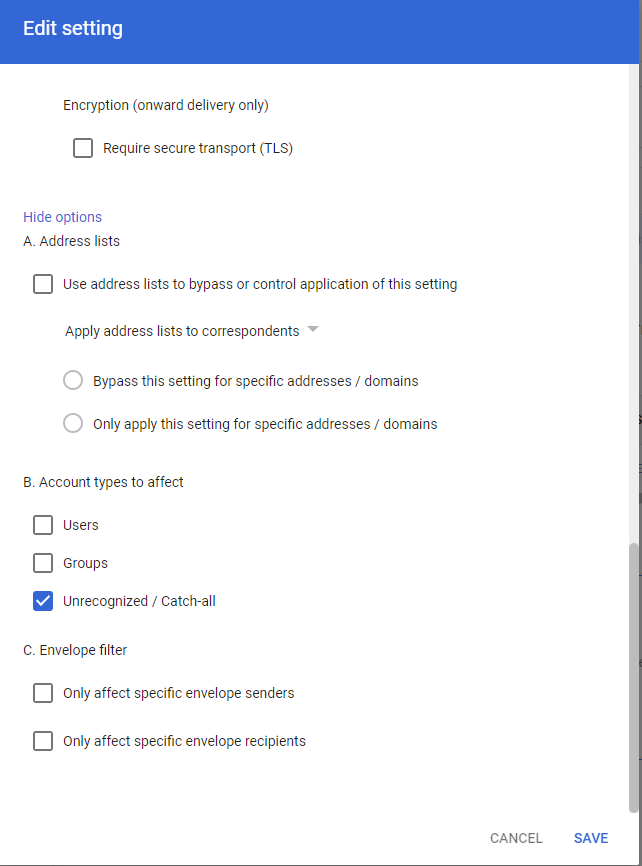

!!! info 
	Bài viết này sẽ hướng dẫn bạn cách ****cấu hình routing để sử dụng Hybrid Email trên Google Workspace****
	Nếu bạn cần hỗ trợ, xin vui lòng liên hệ VinaHost qua **Hotline 1900 6046 ext. 3**, email về [support@vinahost.vn](mailto:support@vinahost.vn) hoặc chat với VinaHost qua livechat [https://livechat.vinahost.vn](https://livechat.vinahost.vn)

## Tổng quan

Bài viết hôm nay mĩnh sẽ hướng dẫn các bạn cách cấu hình Routing dành cho các Khách hàng đã và đang sử dụng **Email Hosting** hoặc **Email Server** và muốn sử dụng hybrid email với **Google Workspace**.

Để có thể thực hiện được việc cấu hình các bạn cần phải có quyền truy cập vào tài khoản admin vào trang https://admin.google.com

Điều thứ 2 là cần có thông tin kết nối Email Hosting hoặc Email Server.

## Các bước thực hiện

## **Bước 1: Truy cập vào giao diện quản trị  Apps > Google Workspace  > Gmail**

## **Bước 2: Trong phần Seting for Gmail chọn Host để sử dụng định tuyến nâng cao dành cho Hybrid**

Chọn **Configure** hoặc **Add Route** để điền thông số cấu hình Host.

- ***Name***  : Nhập tên hoặc mô tả cho luồng routing

- ***Specify email server*** : Nhấp vào menu và điền thông tin về Mail Server cần cấu hình Hybrid.

!!! note
    Trong menu  máy chủ, nhập địa chỉ IP của máy chủ hoặc tên máy chủ:
    - Nếu đã chọn Single Host , hãy nhập tên máy chủ của máy chủ hoặc địa chỉ IP. Nhập số cổng: 25, 587. Không thể sử dụng cổng 465 cho tùy chọn Single Host.
	- Nếu bạn đã chọn  Multiple hosts , hãy chỉ định nhiều primary host và secondary host để cân bằng tải và sao lưu. Nhập tên máy chủ của máy chủ hoặc địa chỉ IP vào bảng Primary and Secondary.
Tổng tải cho các máy chủ phải đạt tổng cộng 100% trong mỗi bảng. 
Ví dụ: trong bảng Primary Host, nếu đã thêm hai máy chủ, hãy nhập 50  vào trường % tải cho mỗi máy chủ.

- ***Options*** : Chọn các tùy chọn cho đường route mới.

!!! NOTE
    Các tùy chọn được Đề xuất được bật theo mặc định cho các đường route:
    - Perform MX lookup on host : Gửi tới máy chủ được liên kết với domains đã nhập. Nếu đã nhập một miền, hãy chọn hộp này để xác minh bản ghi MX của máy chủ và gửi tới máy chủ trong bản ghi MX của miền. Nếu bạn đã nhập máy chủ email, hãy bỏ chọn hộp này.
    - Require mail to be transmitted over a secure transport (TLS) connection: Mã hóa thư giữa máy chủ gửi và máy chủ thư nhận bằng Bảo mật lớp truyền tải (TLS).
    - Require CA signed certificate: Máy chủ SMTP của khách hàng phải xuất trình chứng chỉ được Cơ quan cấp chứng chỉ ký và được Google tin cậy.
    - Validate certificate hostname :Xác minh rằng tên máy chủ nhận khớp với chứng chỉ do máy chủ SMTP xuất trình.

Sau cùng ở cuối hộp thoại ***Add Route*** chọn ***Save***

## **Bước 3: Cấu hình Routing cho hybrid Email tại Google Workspace về Email Hosting**

Sau khi hoàn thành ở bước 2, các bạn sẽ cần tiếp tục cấu hình Routing cho email về Email Hosting.

Sau khi vào giao diện Routing trong hộp Routing chọn Configure hoặc Add 
Another Rule ( nếu thêm đường route khác).
Tích chọn vào các option sau.
- **Email messages to afect.**

Trong phần này các bạn chọn Inbound cho mail nhận và Internal - Receiving cho các mail gửi nội bộ.

- **For the above types of messages, do the following**

Tại phần **change route** các bạn chọn vào host đã được cài đặt trong bước 2.

- Sau đó các bạn chọn vào **Show Options** để cài đặt thêm một số yêu cầu:

Trong phần **Account Types to affect** chọn **Catch-All** để Google sẽ nhận những mail không thuộc Google và trả về Hosting.

Đến đây **save** lại và đợi khoảng vài phút để cấu hình được nhận và kiểm tra lại bằng cách gửi mail vào một tài khoản trên Email Hosting.

Chúc các bạn thực hiện thành công!

> **THAM KHẢO CÁC DỊCH VỤ TẠI [VINAHOST](https://vinahost.vn/)**
> 
> **\>>** [**SERVER**](https://vinahost.vn/thue-may-chu-rieng/) **–** [**COLOCATION**](https://vinahost.vn/colocation.html) – [**CDN**](https://vinahost.vn/dich-vu-cdn-chuyen-nghiep)
> 
> **\>> [CLOUD](https://vinahost.vn/cloud-server-gia-re/) – [VPS](https://vinahost.vn/vps-ssd-chuyen-nghiep/)**
> 
> **\>> [HOSTING](https://vinahost.vn/wordpress-hosting)**
> 
> **\>> [EMAIL](https://vinahost.vn/email-hosting)**
> 
> **\>> [WEBSITE](http://vinawebsite.vn/)**
> 
> **\>> [TÊN MIỀN](https://vinahost.vn/ten-mien-gia-re/)**

