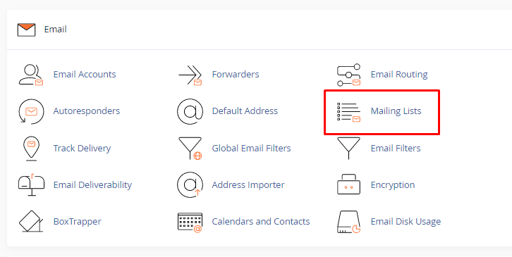
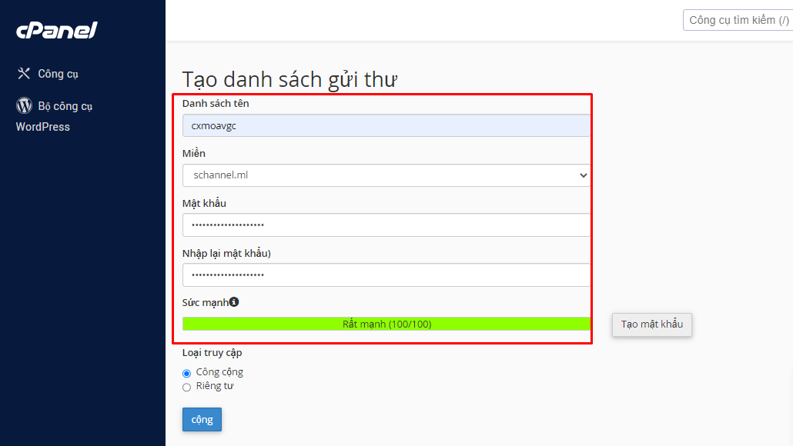
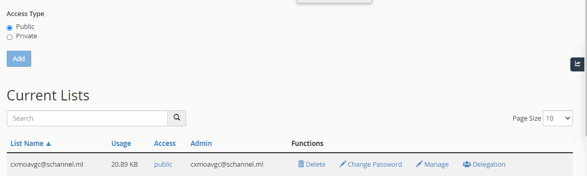
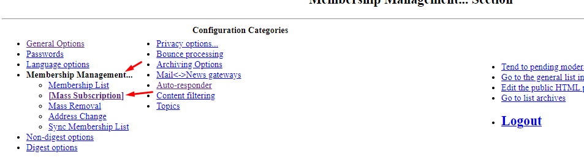
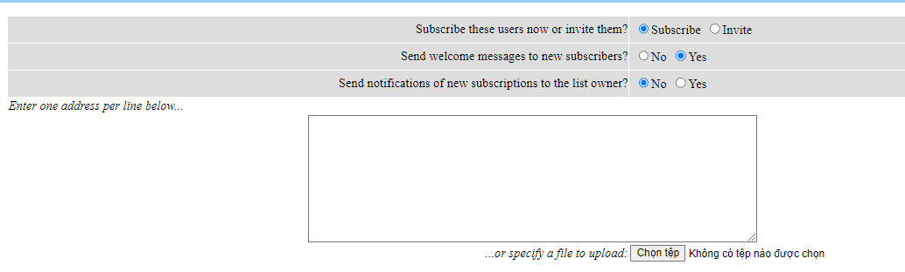
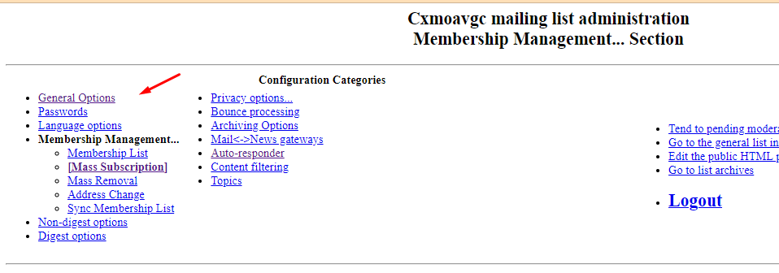
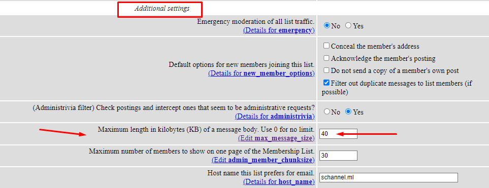

Bài viết này sẽ hướng dẫn bạn **Export Mailing List cPanel**. Nếu bạn cần hỗ trợ, xin vui lòng liên hệ VinaHost qua **Hotline 1900 6046 ext.3**, email về [support@vinahost.vn](mailto:support@vinahost.vn) hoặc chat với VinaHost qua livechat [https://livechat.vinahost.vn/chat.php](https://livechat.vinahost.vn/chat.php).

## Hướng Dẫn Hướng Dẫn Export Mailing List cPanel

Bước 1: Truy cập vào host của bạn rồi làm như hình:

Bước 2: Điền thông tin theo yêu cầu, ví dụ:

- Và chọn public

Bước 3: Tại đây, kéo xuống dưới và chọn manage:

Ở đây sẽ có 1 số tính năng như sau:

- **Membership Management**…Section cho phép quản lý user tham gia Mailing List, gửi lời mời hay chấn nhận yêu cầu tham gia của user.
- **Password**: Cho phép chỉnh sửa mật khẩu.
- **Privacy options**: Thiết lập chế độ bảo mật cho Mailing List
- **Auto-responder**: Thiết lập cấu hình tự động gửi e-mail theo yêu cầu của người sử dụng
- **Archiving Options**: Thiết lập về chế độ lưu trữ

Bước 4: thêm xóa thành viên, làm theo hình:

Các option để mặc định và nhập các thành viên bạn muốn add.

Tương tự, menbership list sẽ hiển thị danh sách các thành viên đã được add

Bước 5: Điều chỉnh dung lượng.

Làm theo hình:

Ở đây, bạn nhập dung lượng bạn muốn và save lại.

Chúc bạn thực hiện Export Mailing List cPanel thành công!

> **THAM KHẢO CÁC DỊCH VỤ TẠI [VINAHOST](https://vinahost.vn/)**
> 
> **\>>** [**SERVER**](https://vinahost.vn/thue-may-chu-rieng/) **–** [**COLOCATION**](https://vinahost.vn/colocation.html) – [**CDN**](https://vinahost.vn/dich-vu-cdn-chuyen-nghiep)
> 
> **\>> [CLOUD](https://vinahost.vn/cloud-server-gia-re/) – [VPS](https://vinahost.vn/vps-ssd-chuyen-nghiep/)**
> 
> **\>> [HOSTING](https://vinahost.vn/wordpress-hosting)**
> 
> **\>> [EMAIL](https://vinahost.vn/email-hosting)**
> 
> **\>> [WEBSITE](http://vinawebsite.vn/)**
> 
> **\>> [TÊN MIỀN](https://vinahost.vn/ten-mien-gia-re/)**
