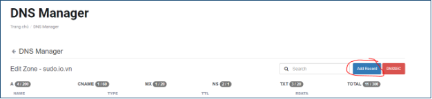

# **Hướng dẫn renew SSL Certificate thông qua VinaHost Client area**

## Thông báo gia hạn
Bạn sẽ nhận được thông báo gia hạn SSL qua email

## Reissue Certificate

Click vào **link** trên hình > **Đăng nhập** (nếu yêu cầu) > **Trang đăng ký SSL sẽ hiện ra.**

Trong giao diện SSL đã có sẵn các thông tin. Khách hàng chỉ cần ấn vào nút **Reissue Certificate** để bắt đầu quá trình tạo lại cert SSL mới:

## Chọn phương thức xác thực

**Bước tiếp theo**,

Lăn chuột xuống dưới sẽ là phần thông tin quản trị. Điền thông tin cần thiết mà hệ thống chưa điền vào

Chọn **Tiếp tục** để sang bước xác thực tên miền. Tại đây Khách hàng chọn một trong 4 phương thức để xác thực tên miền. **DNS là phương thức đơn giản nhất**. Tuy nhiên thời gian xác thực có thể sẽ lâu hơn 2 phương thức còn lại. Ở đây tôi **chọn DNS** \> **Tiếp tục.**

Đến đây hoàn tất việc khai báo cấu hình.

## Cấu hình DNS

Khách hàng nhấn nút **Quay lại trang thông tin dịch vụ** để nhận các thông tin xác thực DNS

**Name**: \_3566f5610920c5b88e8145329569056f.sudo.io.vn

**Type**: CNAME

**Value**: 13bcf9202e8a3390de523f35e4bc7bb1.7f455f86443862654feab5e548e6bcaa.t0931184001716171619.sectigo.com

## Trỏ DNS

**Trỏ DNS:**

Truy cập trang quản lý DNS nơi tên miền Quý khách mua. Tiến hành Add Record DNS Record được hiển thị ở trên. Nếu tên miền ở VinaHost Quý khách tham khảo hướng dẫn: [https://kb.vinahost.vn/huong-dan-cau-hinh-dns-domain-tai-vinahost/#22-cname](https://kb.vinahost.vn/huong-dan-cau-hinh-dns-domain-tai-vinahost/)

Với tên miền đang mua và sử dụng Nameserver tại VinaHost, Quý khách truy cập trang **quản lý dịch vụ**. Chọn tên miền

Vào nút **...** Ở cuối tên miền SSL> **Quản lý DNS**

**Add Record:**

Điền các thông tin **Record DNS hiển thị ở trên** > **Add Record**

**Save Change**

## Hoàn thành

Chờ SSL xác thực thành công đổi trạng thái **Active** (Quá trình này có thể mất một đến vài giờ do DNS cần thời gian Update)

Các thông tin về **Certificate , Private key** hệ thống sẽ hiển thị trong **Client area**. Khách hàng truy cập để xem hoặc tải về

