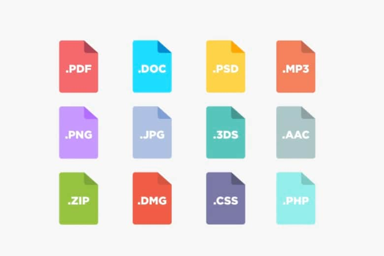
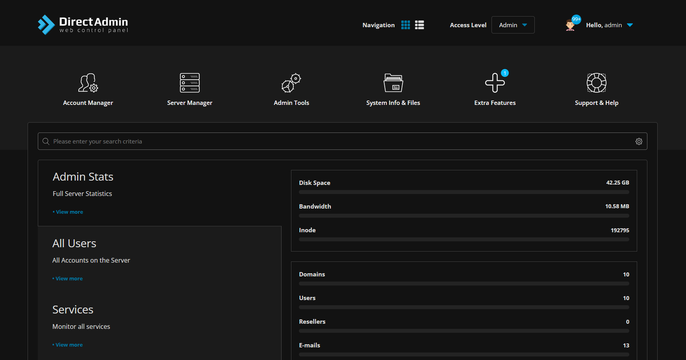
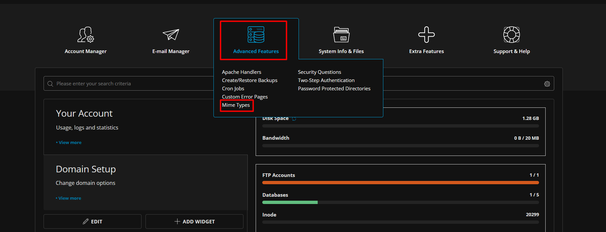
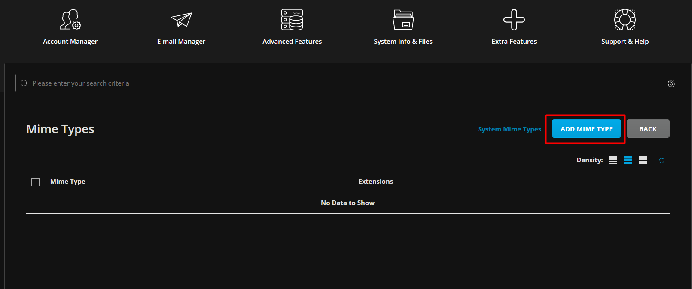
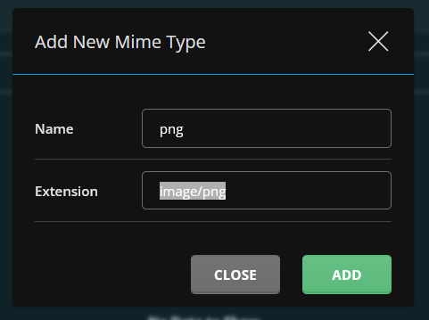

Bài viết này sẽ hướng dẫn cách **Hướng dẫn cách khai báo MIME Type cho website chi tiết Directadmin**. Nếu bạn cần hỗ trợ, xin vui lòng liên hệ [**VinaHost**](https://blog.vinahost.vn/) qua Hotline **1900 6046 ext.3**, email về **support@vinahost.vn** hoặc chat với VinaHost qua livechat **[https://livechat.vinahost.vn/chat.php](https://livechat.vinahost.vn/chat.php)**.

Bài viết dưới đây sẽ giúp mọi ngưới nắm rỏ hơn về cách kháo báo MIME Type cho website trên Directadmin.

Trước tiên để đi vào hướng dẫn chúng ta cần biết về định nghĩa MIME Type là gì.

# 1. MIME Type là gì ?

MIME - Viết tắt của cụm từ "Multipurpose Internet Mail Extensions" có nghỉa là giao thức mở rộng thư điện tử Internet đa mục đích được mô tả trong RFC 1524 và các RFC khác như: RFC 2045, RFC 2046, RFC 2047, RFC 2231.

MIME Type là tiêu chuẩn giúp phân loại các loại tệp tin được sử dụng trên Internet, đặc biệt là dùng để định dạng cho thư điện tử. Nói một cách đơn giản, lúc mới ra đời, giao thức gửi mail chỉ hỗ trợ gửi các dạng như plaintext, MIME là phần mở rộng cho phép mail có thể gửi / nhận các file có định dạng khác như: HTML, video, nhạc, ... . Hầu như mọi thư điện tử Internet đều được truyền bằng giao thức SMTP theo dạng MIME.

Hiện nay, các MIME Type không chỉ sử dụng với email, mà nó được chấp nhận bởi các máy chủ như là cách để nói cho các trình duyệt về kiểu của nguồn thông tin được gửi tới nó để có thể xử lý 1 cách chính xác.

# 2. Những loại MIME Type Phổ Biến

Bạn có thể gặp một số MIME Type phổ biến hiện nay như:

    application/javascript
    application/json
    application/x-www-form-urlencoded
    application/xml
    application/zip
    application/pdf
    application/sql
    application/graphql
    application/ld+json
    application/msword (.doc)
    application/vnd.openxmlformats-officedocument.wordprocessingml.document (.docx)
    application/vnd.ms-excel (.xls)
    application/vnd.openxmlformats-officedocument.spreadsheetml.sheet (.xlsx)
    application/vnd.ms-powerpoint (.ppt)
    application/vnd.openxmlformats-officedocument.presentationml.presentation (.pptx)
    application/vnd.oasis.opendocument.text (.odt)
    audio/mpeg
    audio/ogg
    multipart/form-data
    text/css
    text/html
    text/xml
    text/csv
    text/plain
    image/png
    image/jpeg
    image/gif 

# 3. Triển khai MIME Type trên Linux  (Directadmin)

Bước 1: Ta cần đăng nhập vào **"Giao diện Directadmin"**

Bước 2: Login vào User của bạn trên **Directadmin** hoặc có thể login vào ở **Bước 1**.

Sau đó ta chọn **Advanced Features --> Chọn Mime Type**

Bước 3: Chọn **Add MIME Type** để thêm định dạng MIME Type.

Sau đó điền Extension MIME Type mà bạn muốn Add vào.

Chúc bạn thực hiện thành công!

> **THAM KHẢO CÁC DỊCH VỤ TẠI [VINAHOST](https://vinahost.vn/)**
> 
> **\>>** [**SERVER**](https://vinahost.vn/thue-may-chu-rieng/) **–** [**COLOCATION**](https://vinahost.vn/colocation.html) – [**CDN**](https://vinahost.vn/dich-vu-cdn-chuyen-nghiep)
> 
> **\>> [CLOUD](https://vinahost.vn/cloud-server-gia-re/) – [VPS](https://vinahost.vn/vps-ssd-chuyen-nghiep/)**
> 
> **\>> [HOSTING](https://vinahost.vn/wordpress-hosting)**
> 
> **\>> [EMAIL](https://vinahost.vn/email-hosting)**
> 
> **\>> [WEBSITE](http://vinawebsite.vn/)**
> 
> **\>> [TÊN MIỀN](https://vinahost.vn/ten-mien-gia-re/)**
