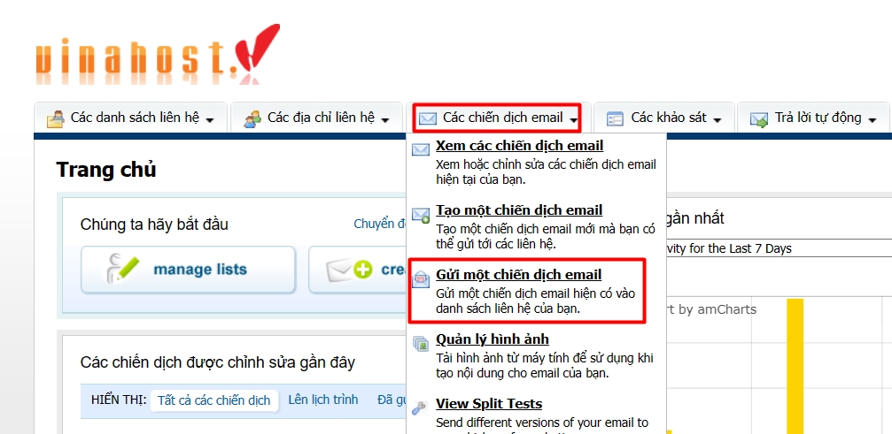
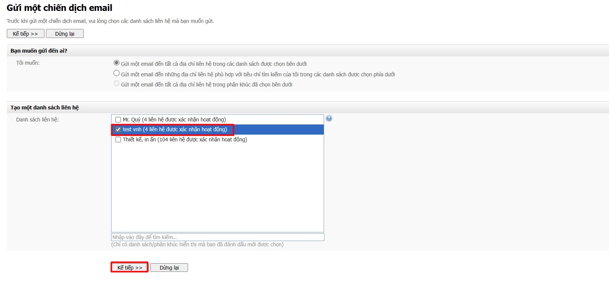
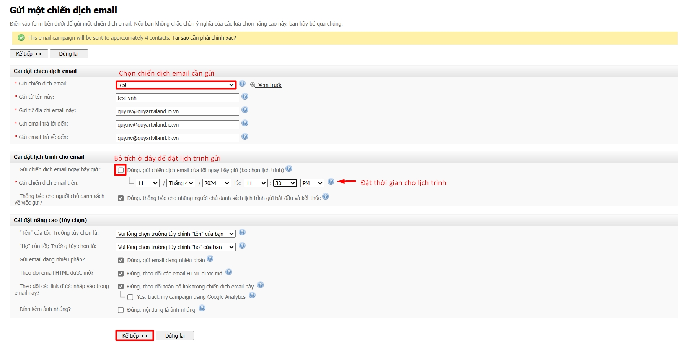
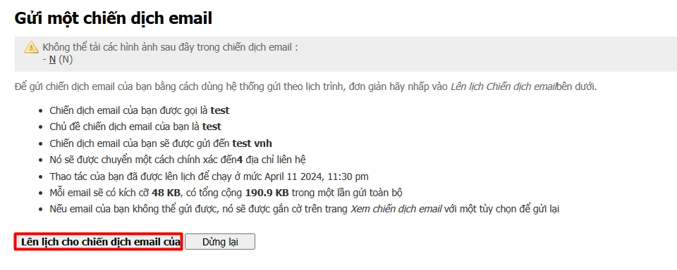
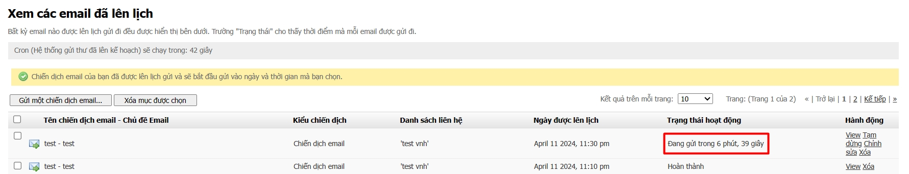
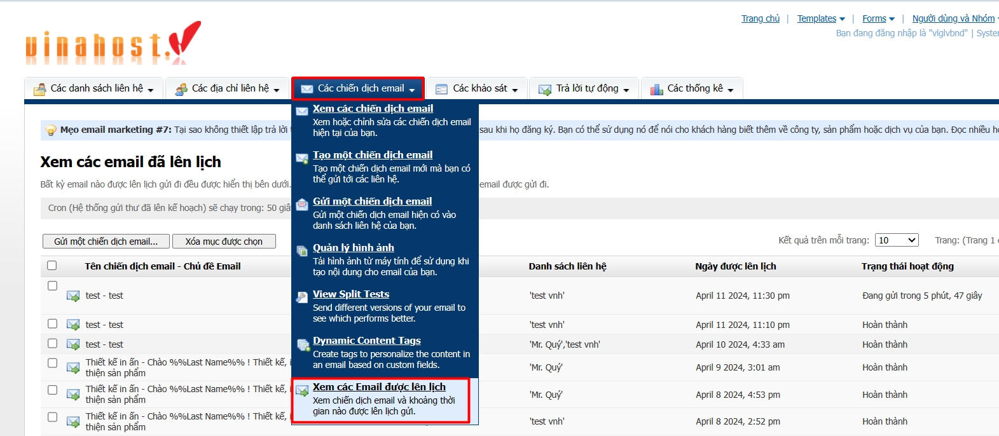
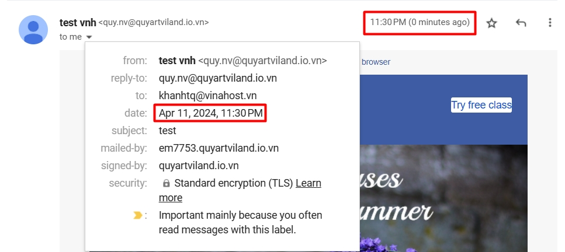

!!! info 
	Bài viết này sẽ hướng dẫn bạn **Hướng dẫn lên lịch trình để gửi email marketing** trên hệ thống của Vinahost.  
	Nếu bạn cần hỗ trợ, xin vui lòng liên hệ VinaHost qua **Hotline 1900 6046 ext. 3**, email về [support@vinahost.vn](mailto:support@vinahost.vn) hoặc chat với VinaHost qua livechat [https://livechat.vinahost.vn](https://livechat.vinahost.vn).

***Xin lưu ý:***
- Quý khách cần tạo các chiến dịch email trước mới có thể thực hiện các bước lên lịch trình cho chúng.
- Chú ý cài đặt đúng múi giờ tại **Người dùng và Nhóm > Xem tài khoản người dùng > Chỉnh sửa > Múi giờ của người dùng**

## Bước 1: Truy cập giao diện gửi chiến dịch email

Chọn **Các chiến dịch email > Gửi một chiến dịch email**.

## Bước 2: Chọn danh sách liên hệ

Tích vào danh sách liên hệ muốn gửi và nhấn **Kế tiếp**.

## Bước 3: Tuỳ chỉnh và đặt lịch trình

Thực hiện theo thứ tự:

- Chọn chiến dịch email cần gửi,
- Bỏ tích ô *Gửi chiến dịch email ngay bây giờ?*,
- Tuỳ chỉnh thời gian muốn lên lịch,
- Chỉnh các tuỳ chọn khác (nếu muốn),
- Nhấn nút **Kế tiếp** để sang bước sau.

## Bước 4: Tổng quan lịch trình

Đây là bước xem lại tổng quan các thông tin của chiến dịch email bao gồm cả thời gian gửi. Nếu các thông tin đã đúng với yêu cầu, nhấn nút **Lên lịch...** để hoàn tất.

Sau bước trên, quý khách sẽ được chuyển tới giao diện **Xem các Email đã lên lịch**. Tại đây, quý khách có thể thấy được khoảng thời gian còn lại để email được gửi đi.

Quý khách cũng có thể chủ động truy cập giao diện này bằng cách chọn **Các chiến dịch email > Xem các Email đã lên lịch**.

Khi đến đúng thời gian đã định, email sẽ được gửi đến các liên hệ trong danh sách đã chọn.

Chúc quý khách thực hiện thành công 😊.

> **THAM KHẢO CÁC DỊCH VỤ TẠI [VINAHOST](https://vinahost.vn/)**
> 
> **\>>** [**SERVER**](https://vinahost.vn/thue-may-chu-rieng/) **–** [**COLOCATION**](https://vinahost.vn/colocation.html) – [**CDN**](https://vinahost.vn/dich-vu-cdn-chuyen-nghiep)
> 
> **\>> [CLOUD](https://vinahost.vn/cloud-server-gia-re/) – [VPS](https://vinahost.vn/vps-ssd-chuyen-nghiep/)**
> 
> **\>> [HOSTING](https://vinahost.vn/wordpress-hosting)**
> 
> **\>> [EMAIL](https://vinahost.vn/email-hosting)**
> 
> **\>> [WEBSITE](http://vinawebsite.vn/)**
> 
> **\>> [TÊN MIỀN](https://vinahost.vn/ten-mien-gia-re/)**
