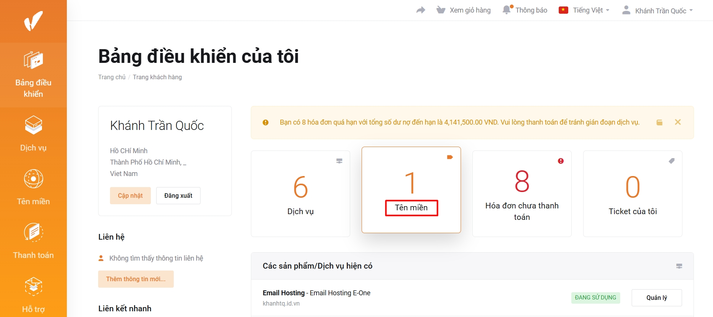
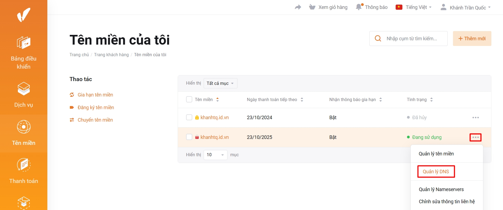
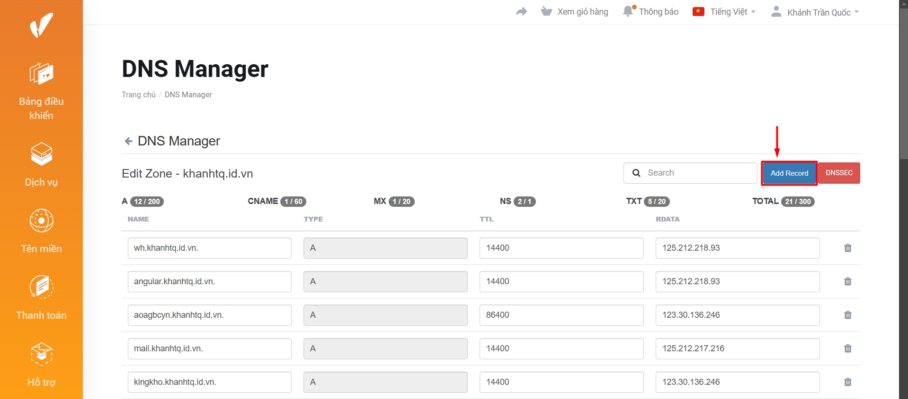
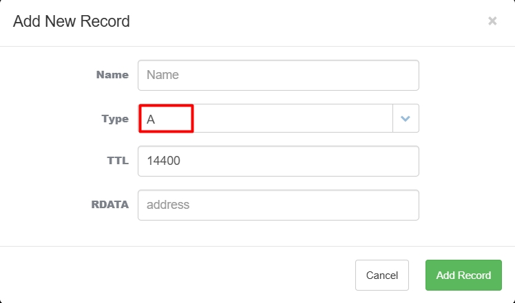
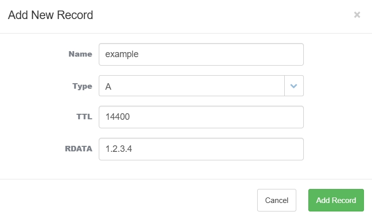
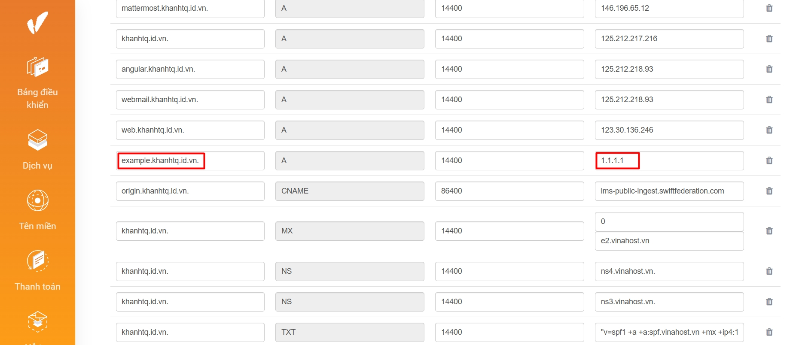

!!! info
Bài viết này sẽ hướng dẫn bạn **quản lý DNS tại trang khách hàng VinaHost**. Nếu bạn cần hỗ trợ, xin vui lòng liên hệ VinaHost qua hotline **1900 6046 nhánh số 3**, gửi email đến địa chỉ [support@vinahost.vn](mailto:support@vinahost.vn) hoặc chat trực tiếp tại [https://livechat.vinahost.vn/chat.php](https://livechat.vinahost.vn/chat.php)

**Bước 1. Truy cập trang quản lý DNS**

Sau khi đăng nhập trang khách hàng tại **[đây](https://secure.vinahost.vn/ac/clientarea.php)**, chọn phần **Tên miền**.

Chọn **dấu ba chấm** tại tên miền cần trỏ, chọn **Quản lý DNS**.

**Bước 2. Tạo bản ghi**

Trong giao diện quản lý DNS, chọn **Add record** để thêm bản ghi.

Chọn loại bản ghi tại trường **Type**, ví dụ "A".

Điền lần lượt tên và giá trị bản ghi vào trường **Name** và **Rdata**.

Ví dụ, tên miền chính "khanhtq.id.vn" cần tạo bản ghi loại A cho tên miền phụ "example.khanhtq.id.vn" trỏ đến IP 1.2.3.4.

_**Lưu ý:** Tên miền chính sẽ được tự động điền vào sau tên bản ghi. Để điền đầy đủ tên bản ghi bao gồm cả tên miền chính, đảm bảo có dấu chấm cuối cùng, ví dụ "example.khanhtq.id.vn." (có dấu chấm cuối cùng).  Nếu chỉ điền "example.khanhtq.id.vn" (không có dấu chấm cuối cùng), bản ghi thực tế sẽ là "example.khanhtq.id.vn.khanhtq.id.vn."_

Nhấn nút **Add record** để lưu.

**Bước 3. Chỉnh sửa bản ghi (nếu cần)**

_Vui lòng bỏ qua bước này nếu không cần chỉnh sửa bản ghi._

Sau khi thêm bản ghi, có thể chỉnh sửa bản ghi trực tiếp mà không cần xoá rồi thêm lại.

Ví dụ, sửa IP 1.2.3.4 của bản ghi "example.khanhtq.id.vn." vừa thêm thành 1.1.1.1.

Sau khi sửa, kéo xuống dưới cùng chọn **Save Changes**.

**Bước 4: Kiểm tra**

Có thể sử dụng các tool online như **[DNSWatch](https://www.dnswatch.info/)** để kiểm tra việc cập nhật bản ghi.

**Chúc bạn thực hiện thành công!** 🥳

> **THAM KHẢO CÁC DỊCH VỤ TẠI [VINAHOST](https://vinahost.vn/)**
>
> **\>>** [**SERVER**](https://vinahost.vn/thue-may-chu-rieng/) **–** [**COLOCATION**](https://vinahost.vn/colocation.html) – [**CDN**](https://vinahost.vn/dich-vu-cdn-chuyen-nghiep)
>
> **\>> [CLOUD](https://vinahost.vn/cloud-server-gia-re/) – [VPS](https://vinahost.vn/vps-ssd-chuyen-nghiep/)**
>
> **\>> [HOSTING](https://vinahost.vn/wordpress-hosting)**
>
> **\>> [EMAIL](https://vinahost.vn/email-hosting)**
>
> **\>> [WEBSITE](http://vinawebsite.vn/)**
>
> **\>> [TÊN MIỀN](https://vinahost.vn/ten-mien-gia-re/)**
