Bài viết này sẽ hướng dẫn bạn **Sử Dụng Alibaba Cloud Pricing Calculator.** Nếu bạn cần hỗ trợ, xin vui lòng liên hệ VinaHost qua **Hotline 1900 6046 ext. 3**, email về [support@vinahost.vn](mailto:support@vinahost.vn) hoặc chat với VinaHost qua livechat [https://livechat.vinahost.vn/chat.php](https://livechat.vinahost.vn/chat.php).

**Alibaba Cloud Pricing Calculator** là một công cụ được cung cấp bởi Alibaba Cloud, giúp người dùng dễ dàng tính được các giá ước tính của các sản phẩm và dịch vụ Alibaba Cloud.

Alibaba Cloud Pricing Calculator hỗ trợ tính giá hiện hành của đa số các sản phẩm của Alibaba Cloud như ECS (Subcription, Pay-as-you-go); RDS, ACK, MaxCompute…

Bài viết sau đây hướng dẫn sử dụng Alibaba Cloud Pricing Calculator để tính toán chi phí cho giải pháp Alibaba Cloud của bạn.

Để bắt đầu sử dụng, truy cập vào trang web của Alibaba Cloud Pricing Calculator, tại đây bạn sẽ thấy một số sản phẩm cùng với 3 tabs Pricing, Price Calculator và Optional Inventory:

- **Pricing**: Giá list niêm yết của sản phẩm (không bao gồm phần chiết khấu).
- **Price Calculator**: trình tính toán các sản phẩm. Bạn có thể tính toán nhiều sản phẩm trong gói giải pháp của mình và thêm chúng vào tab **Optional Inventory** để cho ra giá tổng cộng.

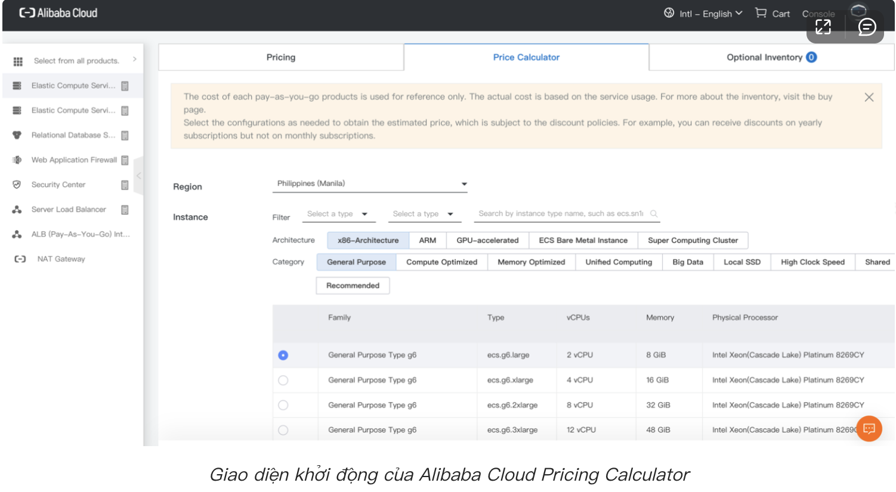

Để tiến hành sử dụng Alibaba Cloud Pricing Calculator để tính giá, hãy chuẩn bị sẵn sàng giải pháp của bạn. Trong bài viết này, giả sử bạn muốn kiểm tra giá của giải pháp của bạn sử dụng Alibaba Cloud bao gồm các sản phẩm sau:

- Elastic Compute Service (ECS)
- Server Load Balancer
- ApsaraDB RDS

Alibaba Cloud Pricing Calculator có thể giúp tính toán giá (ước tính) của giải pháp trên chỉ với 2 bước đơn giản!

## **BƯỚC 1: TÍNH GIÁ CỦA TỪNG SẢN PHẨM, DỊCH VỤ**

Alibaba Cloud Pricing Calculator hoạt động giống với các giỏ hàng trên sàn thương mại điện tử, người dùng cần tính giá theo từng loại sản phẩm của Alibaba Cloud (ECS, OSS, ACK,…) sau đó thêm vào list, giá của từng loại sản phẩm sẽ được cộng lại thành giá của giải pháp. Với giải pháp gồm các sản phẩm nêu trên, ta sẽ cần tính giá của từng sản phẩm.

### **1\. Tính giá ECS**

Từ trang chủ của Alibaba Cloud Pricing Calculator, chọn Elastic Compute Service hoặc vào mục Select from all products > Elastic Computing > Elastic Compute Services (Subscription).

Bạn cũng có thể chọn Pay-as-you-go là phương thức thanh toán, tuy nhiên mức giá Pay-as-you-go tại trang web chỉ là tham khảo, số tiền thật sự sẽ còn phụ thuộc vào dung lượng thực tế được sử dụng.

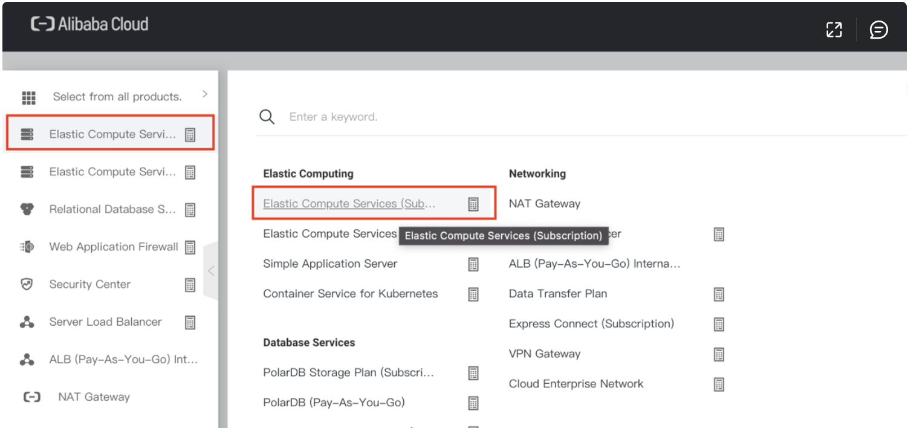

Nhập các thông số cần thiết của máy ảo để bắt đầu tính giá. Trong bài hướng dẫn này, các thông số như sau được nhập cho hai máy ảo.

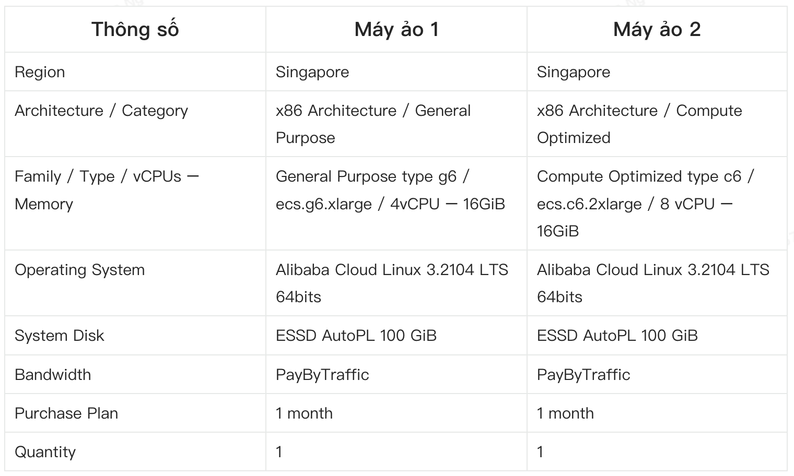

Đối với trường hợp có hai máy ảo cần tính giá, bạn cần thêm từng máy ảo một. Sau khi hoàn tất nhập thông tin cho từng máy ảo, nhấn Add to List để thêm thông tin máy ảo vào danh sách chung.

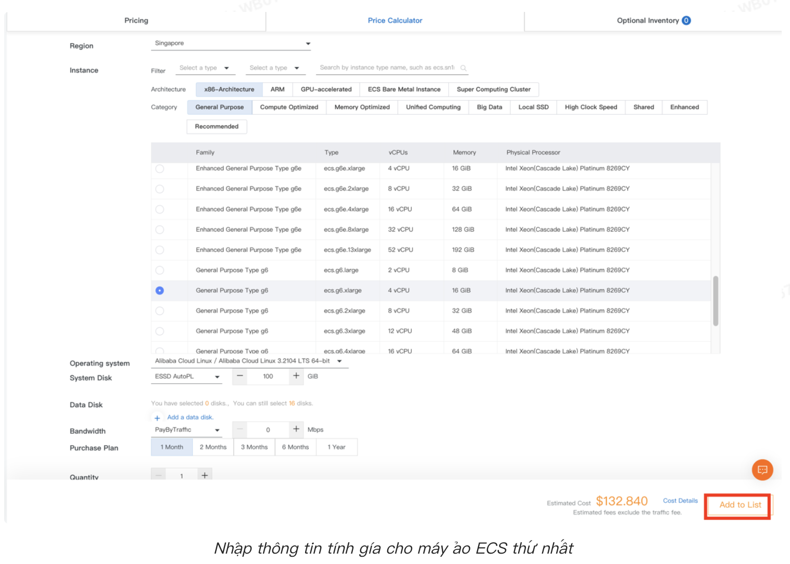

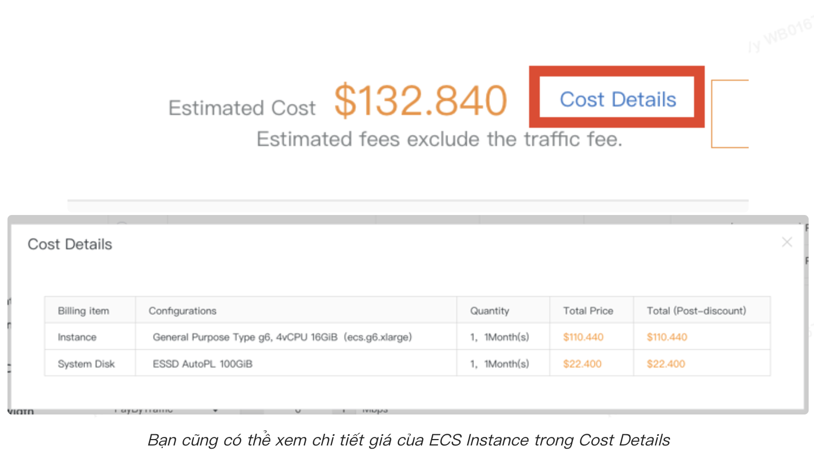

Sau khi chọn Add to List, thông tin máy ảo được nhập sẽ được thêm vào danh sách Optional Inventory, lúc này sẽ hiển thị số 1.

Ta tiếp tục nhập thông tin của máy ảo thứ hai để tính giá, sau khi nhập tiếp tục chọn Add to List.

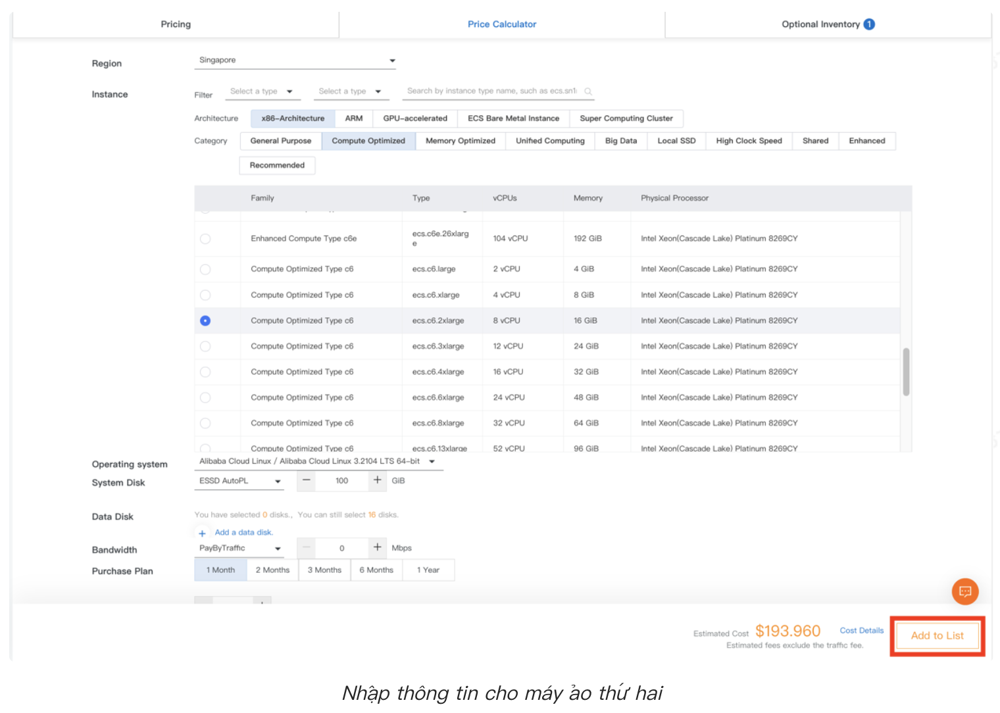

Sau khi hoàn tất, chọn vào mục Optional Inventory, bạn có thể tìm thấy tên và giá tiền cho hai máy ảo được thêm.

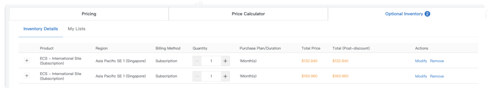

### **2\. Tính giá SLB**

Để tiến hành nhập thông tin và tính giá cho SLB, chọn vào Server Load Balancer ở mục bên trái hoặc vào Select from all products > Networking > Server Load Balancer.

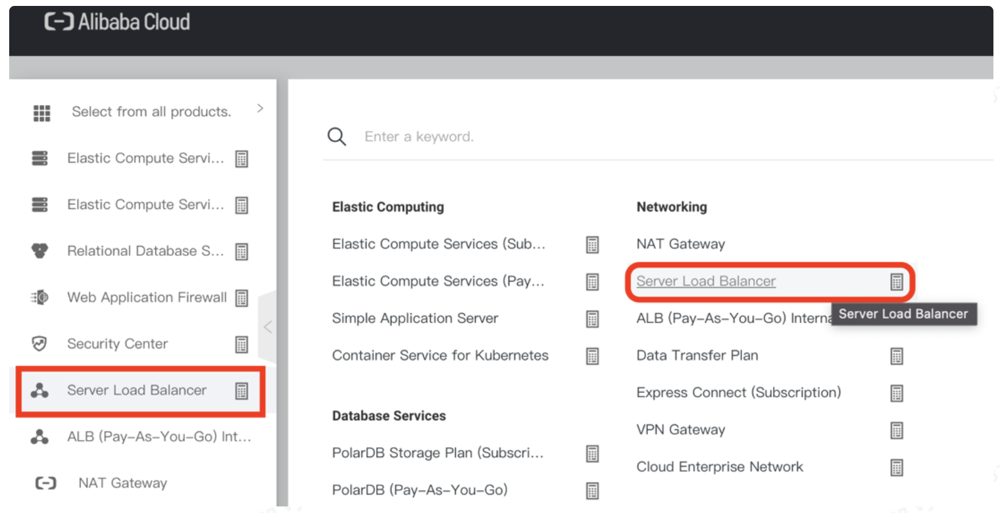

Nhập các thông tin như hình sau cho 1 instance SLB.

Sau khi hoàn tất, nhấn Add to List để thêm vào danh sách tính giá.

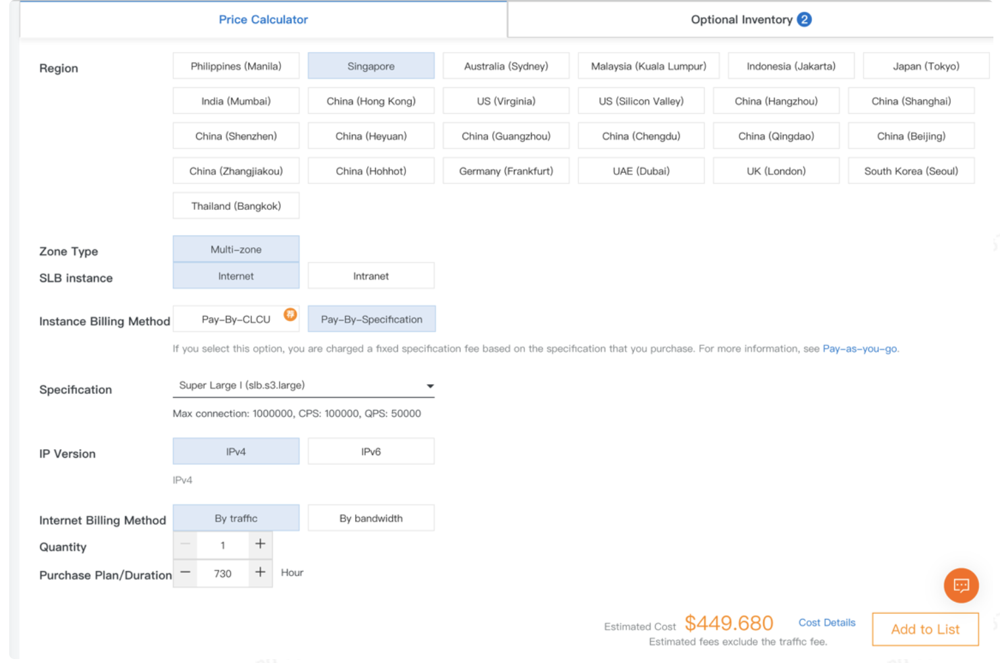

Đối với Server Load Balancer, phương thức thanh toán sẽ là Pay-as-you-go.

Instance SLB được thêm thành công sẽ được hiển thị trong danh sách Optional Inventory.

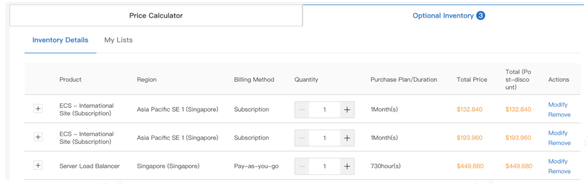

### **3\. Tính giá ApsaraDB RDS**

Để tiến hành nhập thông tin và tính giá cho ApsaraDB RDS, chọn vào Select from all products > Database Services > Relational Database Service (Pay-as-you-go).

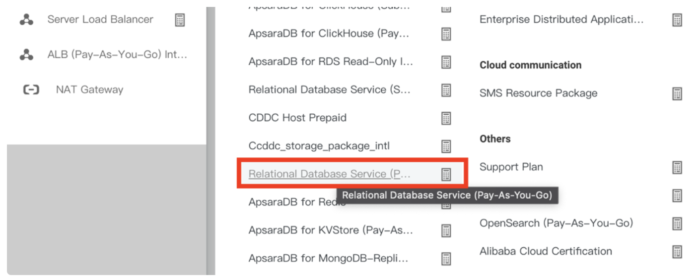

Nhập các thông số cho instance cơ sở dữ liệu, dưới đây là thông số gợi ý:

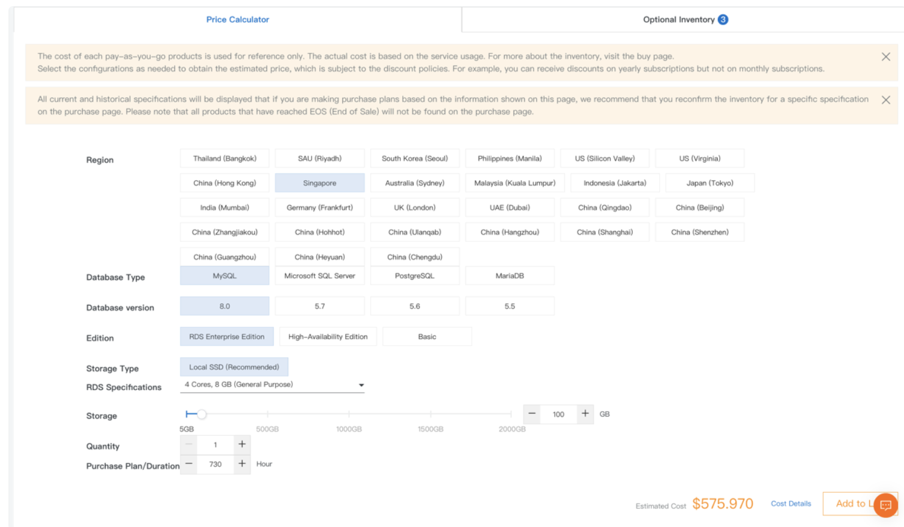

Sau khi hoàn tất, nhấn Add to List để thêm vào danh sách.

## **BƯỚC 2: KIỂM TRA TỔNG CHI PHÍ**

Sau khi đã thêm xong tất cả các sản phẩm trong giải pháp của bạn, chọn Optional Inventory để xem danh sách các sản phẩm cùng với giá tiền được ước tính cho toàn bộ giải pháp của bạn, ở đây chúng tôi chọn ước tính trong thời gian 1 tháng.

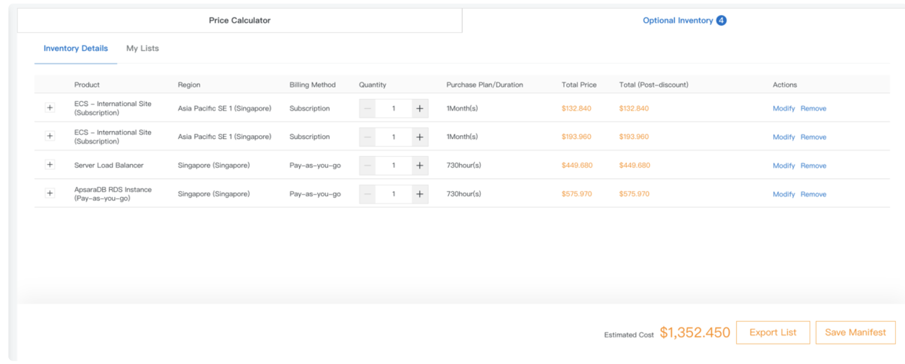

Bạn có thể nhấn Export List ở cuối trang để xuất danh sách chi tiết dưới dạng Excel.

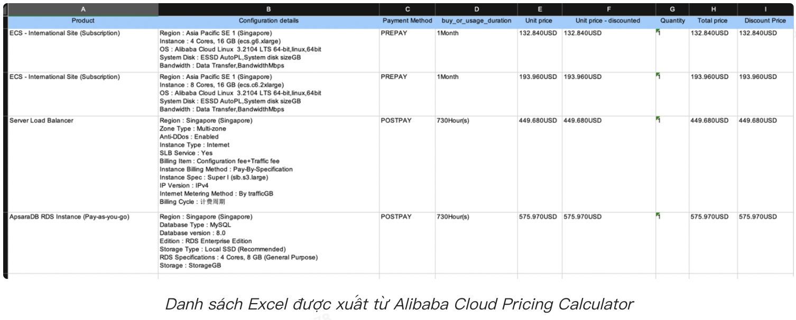

Với các bước như trên bạn đã sử dụng thành công Alibaba Cloud Pricing Calculator để tính toán chi phí cho giải pháp của mình. Và sau đây là một số lưu ý khi sử dụng Alibaba Cloud Pricing Calculator:

- Alibaba Cloud Pricing Calculator chỉ hỗ trợ tính giá đối với một số sản phẩm của Alibaba Cloud. Trong trường hợp không tìm thấy sản phẩm mong muốn, hãy liên hệ với Techinica/ Sale Team của Alibaba Cloud để được tư vấn và hỗ trợ.
- Techinica/Sale Team của Alibaba Cloud để được tư vấn và hỗ trợ.
- Alibaba Cloud Pricing Calculator cung cấp mức giá list chưa bao gồm chiết khấu.
- Các mức giá được tính toán chỉ mang tính chất tham khảo.

**\>>> Truy cập Công cụ tính giá [Alibaba Cloud Pricing Calculator](https://www.alibabacloud.com/vi/pricing-calculator#/commodity/vm_intl)**

_Nguồn: https://www.alibabacloud.com/blog/how-to-use-alibaba-cloud-pricing-calculator\_600050_

Chúc bạn thực hiện thành công!

> **THAM KHẢO CÁC DỊCH VỤ TẠI [VINAHOST](https://vinahost.vn/)**
> 
> **\>>** [**SERVER**](https://vinahost.vn/thue-may-chu-rieng/) **–** [**COLOCATION**](https://vinahost.vn/colocation.html) – [**CDN**](https://vinahost.vn/dich-vu-cdn-chuyen-nghiep)
> 
> **\>> [CLOUD](https://vinahost.vn/cloud-server-gia-re/) – [VPS](https://vinahost.vn/vps-ssd-chuyen-nghiep/)**
> 
> **\>> [HOSTING](https://vinahost.vn/wordpress-hosting)**
> 
> **\>> [EMAIL](https://vinahost.vn/email-hosting)**
> 
> **\>> [WEBSITE](http://vinawebsite.vn/)**
> 
> **\>> [TÊN MIỀN](https://vinahost.vn/ten-mien-gia-re/)**
