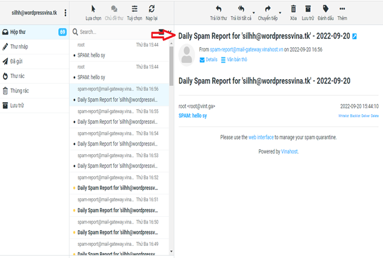
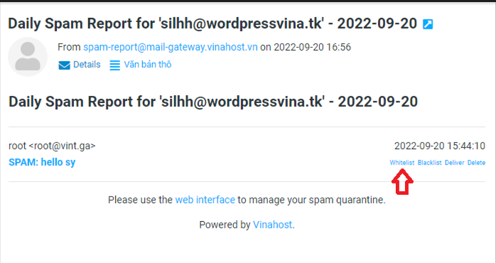
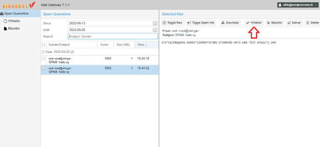
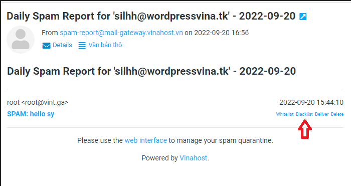
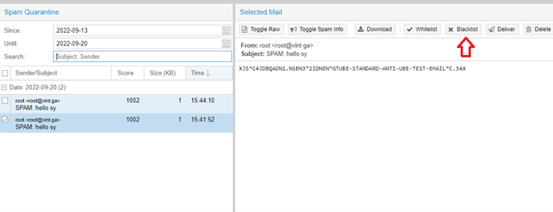
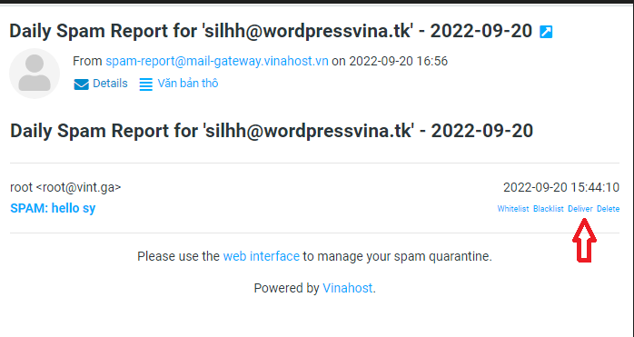
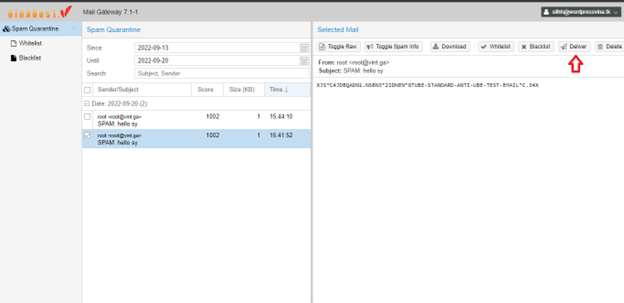
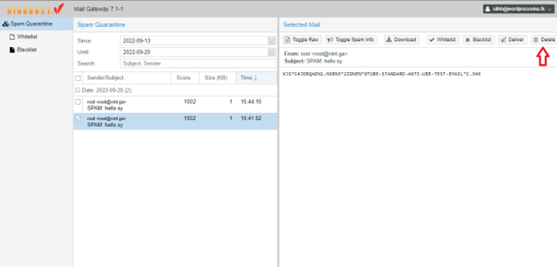
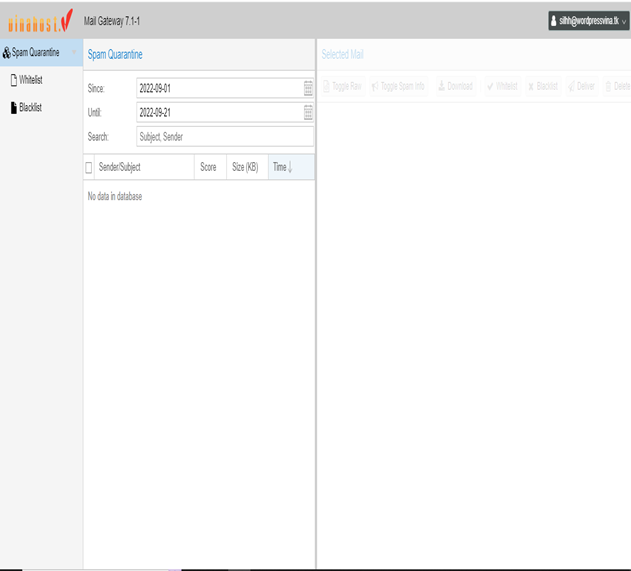
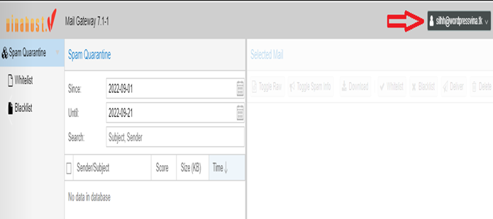

[_**Email Filter**_](https://vinahost.vn/email-filter/) là giải pháp email chuyên biệt dành cho các tổ chức, doanh nghiệp có nhu cầu **bảo mật và bảo vệ hệ thống email**, tránh các mối nguy hại bên ngoài khi sử dụng các dịch vụ email như Email Hosting, Email Server

**Email Filter** bảo vệ hệ thống email khỏi **99,99%** các mối đe dọa như thư rác (**spam)**, mạo danh lừa đảo (**Phishing**), virus/mã độc **(Malware**),… mà khách hàng thường xuyên gặp phải.

Bài viết sau đây sẽ hướng dẫn các bạn sử dụng chức năng Email Filter có phí của VinaHost.

Để nhận biết **Email Spam** quý khách kiểm tra trong hộp thư email nhìn thấy tiêu đề của mail trong hộp thư là **Daily Spam Report For...**, đây là Email Spam Report

**\- White list**: là danh sách các địa chỉ email an toàn hoặc được phê duyệt để giúp bộ lục thư rác xác định liệu nó có cho phép gửi hay không. Sau khi chọn white list thì email này sẽ đi thẳng vào hộp thư inbox

Qúy khách có thể thao thác ở hộp thư email hoặc ở trang Mail Gateway.

**\- Backlist** là tập hợp tất cả những địa chỉ IP và tên miền (domain) có hành vi spam, gửi email hàng loạt làm phiền người nhận. Đây là cơ sở dữ liệu được lập theo thời gian thực. Mục đích của Black list nhằm cung cấp thông tin cho các máy chủ email nhận diện được những kẻ nào là spammer. Sau khi chọn vào email này là Backlist thì các email của mail này sẽ bị chặn không cho vào hộp thư inbox.

**\- Deliver:** Sau khi chọn vào deliver thì email đó sẽ được chuyển thẳng vào hộp thư inbox cho email người nhận

 

**\- Delete:** Xóa thẳng luôn email đó nếu nghi vấn đó là email spam

 

**\- Spam Quarantine:** Ở đây ta có thể xem lại các email mà ta chặn nhầm, ta có thể cho email đó vào lại white list hoặc Deliver để gửi email đó vào lại hộp thư.

Các thao tác trên chỉ thao tác được trên 1 tài khoản của khách hàng, để thao tác **email filter** nhiều tài khoản cùng lúc thì liên hệ Phòng Kỹ Thuật  của Vinahost để xử lí.

\- **Lưu ý**: Để ngưng gửi các email cảnh báo ta nên chọn email đó vào white list, backlist hoặc delete để các email report không gửi vào hộp thư.

Nếu bạn cần hỗ trợ, xin vui lòng liên hệ VinaHost qua Hotline **1900 6046** **ext.3,** email về **support@vinahost.vn** hoặc chat với VinaHost qua livechat [https://livechat.vinahost.vn/chat.php](https://livechat.vinahost.vn/chat.php)

> **THAM KHẢO CÁC DỊCH VỤ TẠI [VINAHOST](https://vinahost.vn/)**
> 
> **\>>** [**SERVER**](https://vinahost.vn/thue-may-chu-rieng/) **–** [**COLOCATION**](https://vinahost.vn/colocation.html) – [**CDN**](https://vinahost.vn/dich-vu-cdn-chuyen-nghiep)
> 
> **\>> [CLOUD](https://vinahost.vn/cloud-server-gia-re/) – [VPS](https://vinahost.vn/vps-ssd-chuyen-nghiep/)**
> 
> **\>> [HOSTING](https://vinahost.vn/wordpress-hosting)**
> 
> **\>> [EMAIL](https://vinahost.vn/email-hosting)**
> 
> **\>> [WEBSITE](http://vinawebsite.vn/)**
> 
> **\>> [TÊN MIỀN](https://vinahost.vn/ten-mien-gia-re/)**
