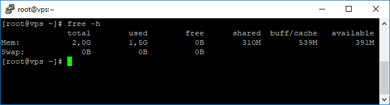
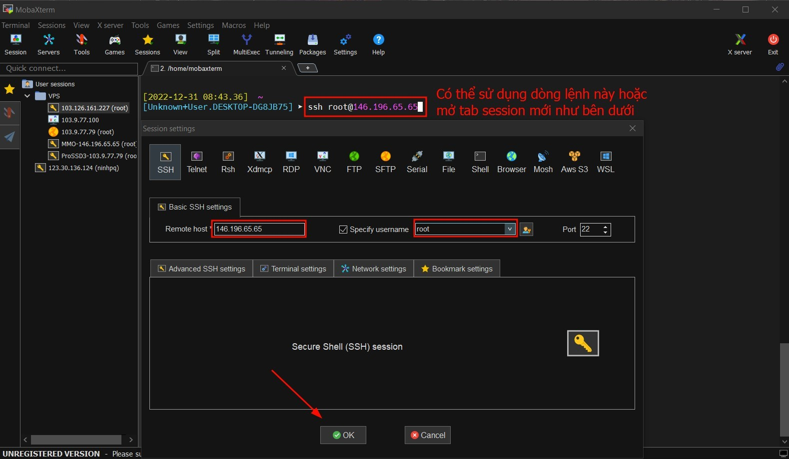
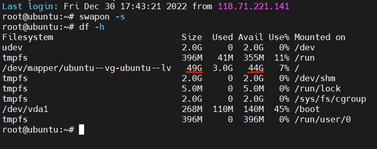
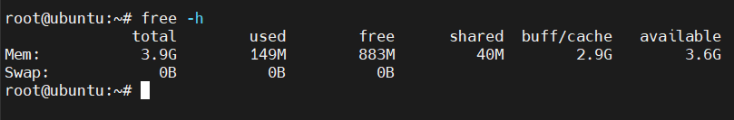
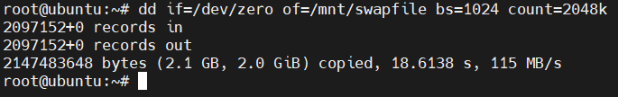
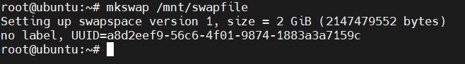
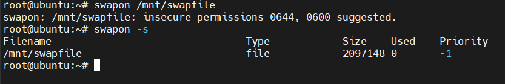
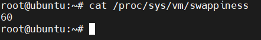
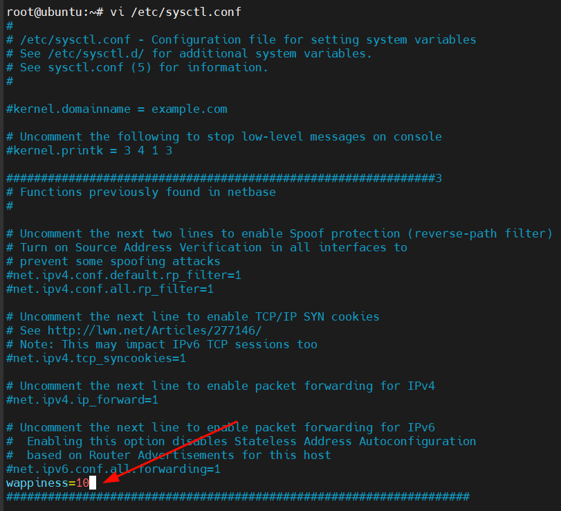
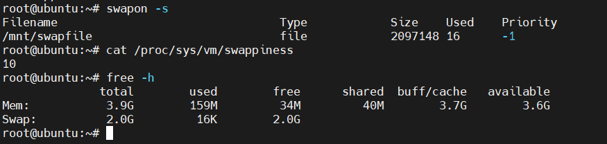

Bài viết này sẽ hướng dẫn bạn cách **Tăng Swap Trên Linux**. Nếu bạn cần hỗ trợ, xin vui lòng liên hệ VinaHost qua **Hotline 1900 6046 ext.3**, email về [support@vinahost.vn](mailto:support@vinahost.vn) hoặc chat với **VinaHost** qua livechat [https://livechat.vinahost.vn/chat.php](https://livechat.vinahost.vn/chat.php).

Trong quá trình sử dụng dịch vụ **VPS** tại **VinaHost** chắc hẳn các bạn sẽ gặp qua tình trạng **VPS** báo **full RAM**. Nguyên nhân thường là do thông số **RAM** của **VPS** thấp, không đáp ứng đủ cho các tác vụ chương trình và dịch vụ chạy trên hệ thống.

Để tạm khắc phục vấn đề trên, hôm nay mình sẽ hướng dẫn các bạn cách cấu hình **RAM** ảo trên **Linux**.

## 1\. Swap là gì?

**Swap** hay còn được gọi là **RAM** ảo, được sử dụng để hỗ trợ lưu trữ dữ liệu vào bộ nhớ đĩa cứng (**Disk**) khi **RAM** đã đầy và không còn đủ để xử lý các tác vụ. Đôi khi **Swap** cũng được dùng song song để tăng dung lượng bộ nhớ đệm (**cache**) kể cả khi **RAM** vẫn chưa sử dụng hết. **Swap** thường mặc định được dùng trên các hệ điều hành **Linux**, **Ubuntu** hoặc **CentOS**. **Swap** có thể là một phân vùng (**partition**) hoặc một **file**

**Note:** Thực ra thì **Swap** hay **RAM** ảo này chỉ là hỗ trợ thêm cho **RAM** thực khi máy tính dùng hết **RAM** thực mà thôi, và tốc độ xử lý của **RAM** ảo cũng không được cao, do đó chúng ta không nên lạm dụng vào **RAM** ảo. Nếu như **VPS** của bạn thường xuyên bị tràn bộ nhớ **RAM** và sử dụng **đến** Swap, thì các bạn nên cân nhắc nâng cấp gói dịch vụ cho phù hợp với nhu cầu công việc của các bạn.

## 2\. Hướng dẫn tạo và kích hoạt, tăng Swap trên Linux

**Bước 1: Truy cập VPS**

Để tạo và kích hoạt **Swap** trên **Linux**, đầu tiên chúng ta cần **SSH** hoặc truy cập **VPS** của bạn với quyền `root`.

Sau khi đã **SSH** thành công chúng ta tiếp tục với bước 2 kiểm tra **Swap**.

**Bước 2: Kiểm tra Swap**

Trước khi tiến hành tạo tệp tin **Swap**, chúng ta cần kiểm tra xem hiện tại hệ thống hiện tại đã kích hoạt **Swap** hay chưa bằng cách chạy lệnh sau:

    swapon -s

Nếu sau khi chạy lệnh mà không có thông tin nào hiển thị ra có nghĩa là máy chủ của chúng ta chưa kích hoạt **Swap**.

**Bước 3: Kiểm tra dung lượng đĩa trống**

Kiểm tra dung lượng đĩa trống để chúng ta cân nhắc tạo dung lương tệp tin **Swap** ở bước sau. Để kiểm tra dung lượng đĩa trống chúng ta sử dụng lệnh sau:

    df -h

Dung lượng trống của mình còn đến **44GB** nên khá thoải mái để tạo **Swap**. Vì sau khi tạo **Swap**, dung lượng máy chủ của bạn sẽ mất tương ứng mới mức dụng lượng mà bạn đã cấp cho **Swap**.

**Bước 4: Tạo tệp tin Swap**

Đối với các **VPS** có cấu hình **RAM** thấp dưới **2GB**, các bạn nên tạo phân vùng **Swap** có dung lượng gấp đôi dung lượng **RAM** hiện tại.

Đối với các **VPS** có cấu hình **RAM** lớn hơn **2GB** và nhỏ hơn **4GB**, các bạn nên tạo phân vùng Swap có dung lượng bằng dung lượng **RAM** hiện tại.

Đối với các **VPS** có cấu hình **RAM** từ **4GB** trở lên, các bạn nên tạo phân vùng **Swap** có dung lượng bằng một nửa dung lượng **RAM** hiện tại.

Đối với máy chủ của mình có **4GB RAM** nên mình sẽ tạo phân vùng **Swap** từ **1GB** đến **2GB** là phù hợp.

Ở đây mình sẽ sử dụng lệnh `dd` để tạo tệp tin **Swap** với dung lượng là **2GB**.

    dd if=/dev/zero of=/mnt/swapfile bs=1024 count=2048k

Lệnh trên sẽ tạo tệp tin **Swap** có dung lượng **2GB**. Bạn có thể thay `count=2048k` bằng `count=1024k`… để tạo **Swap** dung lượng **1GB**.

**(1GB = 1024k, 2GB2048k, 3GB=3072k, 4GB= 4096k)**

Sau khi đã tạo xong tệp tin **Swap**, chúng ta cần tạo một phân vùng cho nó ở bước 5.

**Bước 5: Tạo phân vùng Swap và kích hoạt Swap trên Linux**

Để tạo phân vùng **Swap** các bạn hãy chạy lệnh sau:

    mkswap /mnt/swapfile

Sau đó chúng ta tiếp tục kích hoạt **Swap** trên **Linux** với lệnh:

    swapon /mnt/swapfile

Kiểm tra lại trạng thái **Swap** như ở bước 2 các bạn sẽ thấy mọi thứ bây giờ đã khác.

Tiếp tục chúng ta cần thiết lập phân vùng **Swap** tự động kích hoạt sau khi khởi động lại hệ thống.

    echo /mnt/swapfile none swap defaults 0 0 >> /etc/fstab

Tiếp tục thực hiện thiết lập bảo mật cho phân vùng **Swap** với hai lệnh sau:

    chown root:root /mnt/swapfile
    chmod 0600 /mnt/swapfile

Như vậy là chúng ta đã kích hoạt **Swap** trên **Linux** thành công rồi đấy. Tuy nhiên nếu bạn cần phân chia mức độ ưu tiên sử dụng **Swap** khi mức **ram** đạt giới hạn thì hãy theo dõi tiếp phần còn lại của bài viết nhé.

## 3\. Cấu hình Swappiness

**Swappiness** là mức độ ưu tiên sử dụng **Swap** của hệ thống **Linux**. Khi lượng **RAM** trống còn lại bằng giá trị của **Swappiness** (tính theo tỷ lệ phần trăm) thì máy chủ **Linux** sẽ chuyển qua sử dụng. Ví dụ máy chủ của bạn chỉ còn trống **10% RAM** và **Swappiness** được đặt giá trị là **10** thì máy chủ sẽ chuyển sang sử dụng **Swap**.

Vì tốc độ của **RAM** nhanh hơn tốc độ đĩa cứng nhiều lần nên khi dữ liệu được ghi/đọc từ **Swap** sẽ cho tốc độ chậm hơn khi sử dụng trên **RAM** rất nhiều. Nên bạn hãy cân nhắc tinh chỉnh **Swappiness** dao động từ **5** đến **10** là phù hợp.

**Lưu ý:** Số càng cao thì máy chủ càng thường xuyên sử dụng **Swap** nhiều hơn, đồng nghĩa đĩa cứng sẽ phải đọc ghi nhiều hơn và mau chóng xuống cấp hơn.

**Swappiness sẽ có giá trị trong khoảng 0 – 100.**

Dưới đây là một số kịch bản thông thường được sử dụng `swappiness = 0`: **swap** chỉ được dùng khi **RAM** được sử dụng hết. `swappiness = 10`: swap được sử dụng khi **RAM** còn trống **10%**. `swappiness = 60`: swap được sử dụng khi **RAM** còn trống **60%**. `swappiness = 100`: **swap** được ưu tiên như là **RAM**.

Các bạn có thể kiểm tra thông số **Swappiness** bằng lệnh sau:

    cat /proc/sys/vm/swappiness

_Khi lượng RAM vật lý đạt 40% thì Linux chuyển sang sử dụng Swap. Mính sẽ thay đổi giá trị này về 10, để khi RAM vật lý đạt 90% thì mới chuyển sang sử dụng Swap._

Và để thay đổi giá trị này về 10 chúng ta sử dụng lệnh sau:

    /proc/sys/vm/swappiness

Tuy nhiên việc sử dụng lệnh này chỉ là cấu hình tạm thời. Và sau khi khởi động lại máy chủ thông số sẽ về mặc định.

Để đảm bảo giữ nguyên thông số này mỗi khi khởi động lại máy chủ bạn cần điều chỉnh tham số **vm.swappiness** ở cuối file  **/etc/sysctl.conf**, trường hợp bạn máy chủ của bạn không có dòng này các bạn hãy thêm thủ công vào.

Sau đó bạn hãy lưu lại tệp tin này và khởi động lại máy chủ của mình để nhận thông số mới. Chờ một lát để máy chủ khởi động lại các bạn có thể kiểm tra lại với các lệnh sau:

    swapon -s
    cat /proc/sys/vm/swappiness
    free -h

Dưới đây là kết quả sau khi mình khởi động lại máy chủ.

Hy vọng bài viết này sẽ giúp ích được cho các bạn. Chúc các bạn thực hiện **tăng Swap Trên Linux** thành công.

> **THAM KHẢO CÁC DỊCH VỤ TẠI [VINAHOST](https://vinahost.vn/)**
> 
> **\>>** [**SERVER**](https://vinahost.vn/thue-may-chu-rieng/) **–** [**COLOCATION**](https://vinahost.vn/colocation.html) – [**CDN**](https://vinahost.vn/dich-vu-cdn-chuyen-nghiep)
> 
> **\>> [CLOUD](https://vinahost.vn/cloud-server-gia-re/) – [VPS](https://vinahost.vn/vps-ssd-chuyen-nghiep/)**
> 
> **\>> [HOSTING](https://vinahost.vn/wordpress-hosting)**
> 
> **\>> [EMAIL](https://vinahost.vn/email-hosting)**
> 
> **\>> [WEBSITE](http://vinawebsite.vn/)**
> 
> **\>> [TÊN MIỀN](https://vinahost.vn/ten-mien-gia-re/)**
