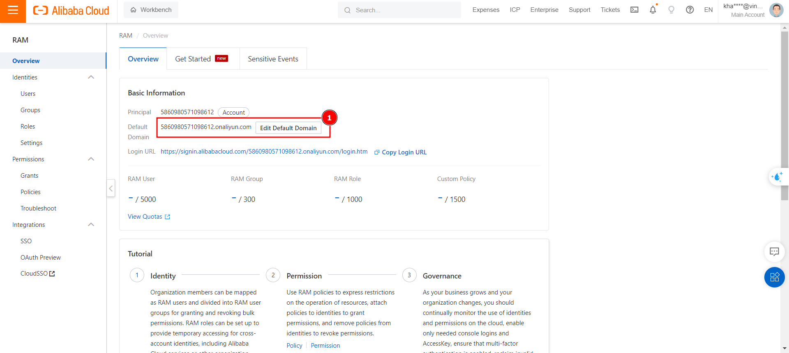
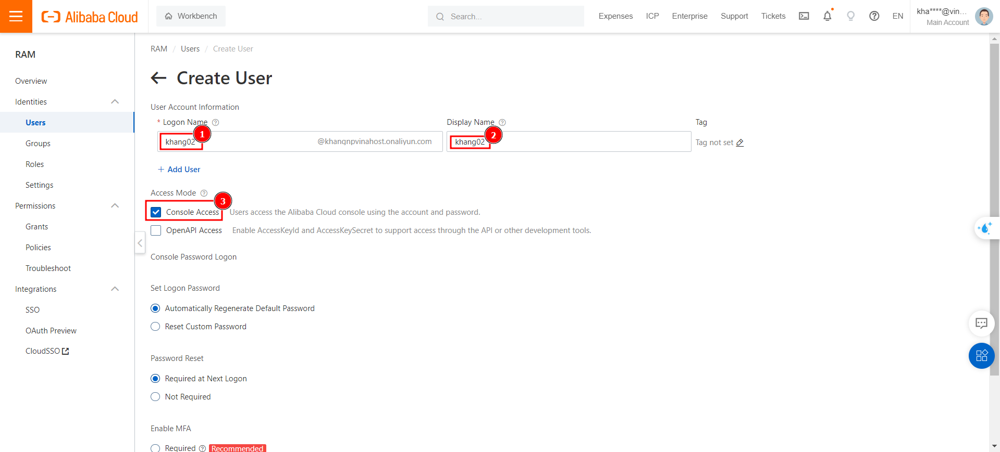
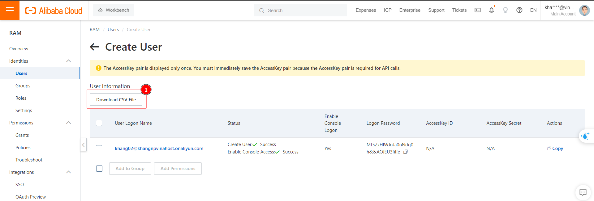
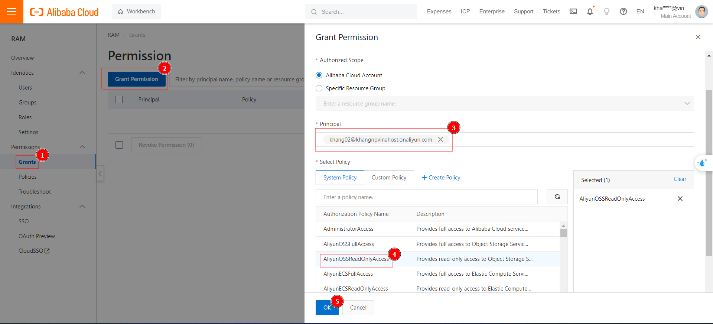

# Hướng dẫn tạo RAM User trên Alibaba Cloud
Bài viết này sẽ hướng dẫn bạn **Tạo, phân quyền và thay đổi default login domain cho RAM user trên Alibaba Cloud**. Nếu bạn cần hỗ trợ, xin vui lòng liên hệ VinaHost qua **Hotline 1900 6046 ext. 3**, email về [support@vinahost.vn](mailto:support@vinahost.vn) hoặc chat với VinaHost qua livechat [https://livechat.vinahost.vn/chat.php](https://livechat.vinahost.vn/chat.php).

1. **RAM User là gì?**

	RAM (Resource Access Management) user là các account "con" được một Alibaba Cloud Account (**Primary** hay **Root Account**) tạo ra, để dễ dàng quản lý việc truy cập tài nguyên, khi có nhiều người cần sử dụng các tài nguyên trên hệ thống. RAM user được sử dụng trong các ngữ cảnh như: quản lý account và phân quyền cho các thành viên trong nội bộ doanh nghiệp, hợp tác giữa các doanh nghiệp với nhau, cấp quyền tạm thời cho các khách hàng hoặc cấp quyền cho các application.
	
	RAM user **không sở hữu** bất kỳ tài nguyên nào trên Alibaba Cloud. Các hóa đơn, chi phí phát sinh hoặc tài nguyên mà RAM user tạo ra đều được tính cho **Primary Account** của nó. Primary Account có toàn quyền với RAM user, có thể cấp, hoặc thu hồi quyền hạn của RAM user bất kỳ lúc nào.
	
	RAM user có **UID** và các thông tin đăng nhập như **Password** và **AccessKey pair** riêng (khác RAM role).
	
	RAM user cũng có thể được tạo từ 1 RAM User hoặc RAM role khác (nếu có đủ quyền hạn).

2. **Đổi Default Domain và thêm Alias Domain **
	- **Default domain** là domain mặc định ban đầu, các RAM user dùng nó để đăng nhập trên alibaba cloud. Chúng có dạng: \<User_name>@\<UID>.onaluyun.com. Trong đó, UID (của root user) có thể thay đổi thành tên dễ nhớ hơn. Dù vậy, phần **onaluyun.com** vẫn là mặc định. Để các RAM user có thể dễ dàng truy cập với domain tự do, có thể sử dụng **domain alias**.
	 - Để tạo domain alias thì domain đó phải **thuộc sở hữu của người tạo**. Hoặc người tạo có quyền thêm các record vào đó.
	 - Thực hiện các bước sau để thay đổi **default domain** và tạo thêm domain alias:
	
	 	**Bước 1**: Đăng nhập vào giao diện Console của Aliababa Cloud [Here](https://account.alibabacloud.com), Truy cập Resource Access Management (hoặc search từ khóa trên thanh tìm kiếm).
	 	
	 	
	 	*
Bước 1: Truy cập giao diện RAM
*	 
	 	
		**Bước 2**: Đổi Domain mặc định. RAM user khi được tạo ra, sẽ login với định dạng: \<user_name\>@\<UID\>.onaliyun.com. user_name là tên user sẽ được tạo ra, UID là ID của tài khoản chính, có thể thay đổi dãy số này thành các **tên dễ nhớ** hơn do người dùng đặt. onaliyun.com là phần mặc định, không thể thay đổi.
		
				
		*
Bước 2: Đổi domain đăng nhập mặc định
*
		
		**Bước 3**: Default domain vẫn có **onaliyun.com** là mặc định, vậy nên, để tạo ra domain đăng nhập theo ý muốn, có thể dùng Domain Alias. Điều hướng đến **Identities** > **Settings**, chọn **Advanced Tab** và chọn **Create Domain Alias**.
		
		
		*
Bước 3: Tạo Domain Alias
*
		
		**Bước 4**: Domain được tạo phải thuộc sở hữu của người tạo, Alibaba sẽ xác thực điều này bằng một record TXT, khi chọn create domain alias, sau khi điền domain, sẽ có 1 bản ghi TXT xuất hiện, cần thêm bản TXT vào danh sách record, và có thể phân giải công khai, khi đó, Alibaba cloud sẽ tự động xác thực domain.
		
		
		*
Bước 4.1: Thêm domain Alias
*
		
		
		*
Bước 4.2: Lấy nội dung TXT record
*
		
		 **Bước 5**: Thêm **TXT record và đợi xác thực**, sau khi thêm TXT record trên nhà quản lý tên miền, có thể kiếm tra lại với các website kiểm tra dns online như **dnswatch.info**, **dnschecker.org**,..., sau khi có bản ghi TXT, thì kiểm tra trên alibaba cloud và đợi quá trình xác thực diễn ra.
		 
		 
		 *
Bước 5: Kiểm tra TXT record trên DNS watch
*
		 
		 **Bước 6:** Khi thêm domain alias, sẽ xuất hiện nút **Domain Ownership Verifycation** dùng để xem tình trạng xác thực. Ngay khi bản ghi TXT đã phân giải thành công, thì vẫn sẽ có thông báo lỗi Alibaba Cloud không tìm thấy TXT record, quá trình này là bình thường. Việc xác thực sẽ mất 15 - 60 phút tùy trường hợp. Sau khoảng 15-30 phút, nên kiểm tra với **Domain Ownership Verifycation** 1-2 lần.
		 
		 *
Bước 6: Kiểm tra tình trạng xác thực
*
		 
		 **Bước 7**: Domain sau khi đã xác thực thành công sẽ có status là **Normal**.
		 
		 
		 *
Bước 7: Giao diện sao khi thêm alias domain thành công
*
		 
	- Sau khi add alias domain, có thể **tạo RAM user**, và sử dụng domain này để đăng nhập, ví dụ như tạo RAM user staff01, thì có thể sử dụng default domain staff01@mycompany.onaliyun.com hoặc alias domain staff01@mycompany.com để đăng nhập.	 

3. **Tạo RAM user mới**
	- Đăng nhập vào giao diện Console của Aliababa Cloud [Here](https://account.alibabacloud.com)
	- Truy cập Resource Access Management (hoặc search từ khóa trên thanh tìm kiếm).
	
	- Điều hướng đến **Identities** > **Users**, chọn **Create User** và điền các thông tin còn thiếu. Có thể tạo User có thể login vào **Console**, hoặc **OpenAPI** cho các application được cấp quyền truy cập resource, hay gọi các API, SDK.
	
	  
	 *
Bước 1: Tạo RAM user mới
*
	
	- Khi được tạo lần đầu tiên, phải nhấn "**Download CSV file**", đây là file chứa thông tin đăng nhập gồm **username, password, AccessKey Pair**. Nút này chỉ xuất hiện **1 lần**, cần phải lưu ý để tránh bị mất Access Key Pair.
	
	*
Bước 2: Tải file chứa thông tin truy cập
*
	
5. **Phân quyền cho RAM User**
	- Khi vừa tạo User, Root Account phải phân quyền để RAM user được sử dụng, hay truy cập các tài nguyên trên Cloud. Tập hợp các "quyền hạn" được gọi là **Policy**, Alibaba Cloud có sẵn một số Policy nhất định, ngoài ra user cũng có thể tự tạo các Policy của riêng mình. Trong ví dụ dưới đây, sẽ phân quyền cho user khang02@khangnpvinahost.onaliyn.com được quyền Read trên các tài nguyên của dịch vụ Object Storage (OSS) thuộc sở hữu của Root Account trên Alibaba Cloud.
	
	
	*
Bước 1: Phân quyền cho RAM user
*
	
	- Root Account có thể thu hồi quyền đã cấp cho RAM user bất kỳ lúc nào bằng cách chọn **Revoke Permission**
	
	*
Bước 2: Thu hồi quyền đã cấp cho RAM user
*
	
1. Đọc thêm
	1. [Resource Access Manager Introduction](https://docs-aliyun.cn-hangzhou.oss.aliyun-inc.com/pdf/ram-intro-intl-en-2017-03-19.pdf)
	2. [Overview of RAM user](https://www.alibabacloud.com/help/en/ram/user-guide/overview-of-ram-users)
	3. [Create RAM user](https://www.alibabacloud.com/help/en/ram/user-guide/create-a-ram-user)
	4. [Grant Permissions to RAM user](https://www.alibabacloud.com/help/en/ram/user-guide/grant-permissions-to-the-ram-user#task-187800)
<<<<<<< Updated upstream:docs/huong-dan-tao-RAM-user-tren-AlibabaCloud.md
=======
	5. [Crate and Verify domain alias](https://www.alibabacloud.com/help/en/ram/user-guide/create-and-verify-a-domain-alias)
>>>>>>> Stashed changes:docs/huong_dan_tao_RAM_user_tren_AlibabaCloud.md
