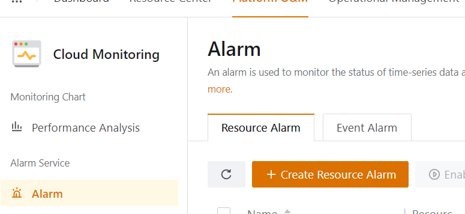
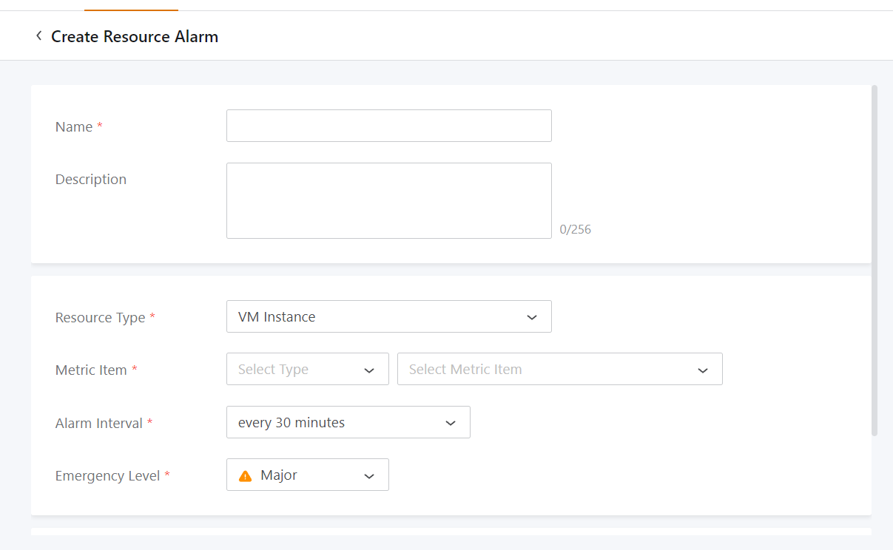
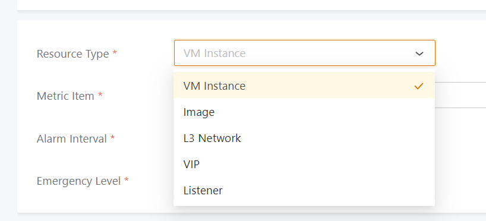
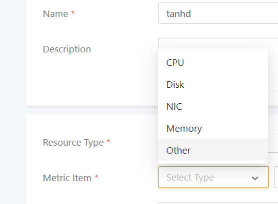
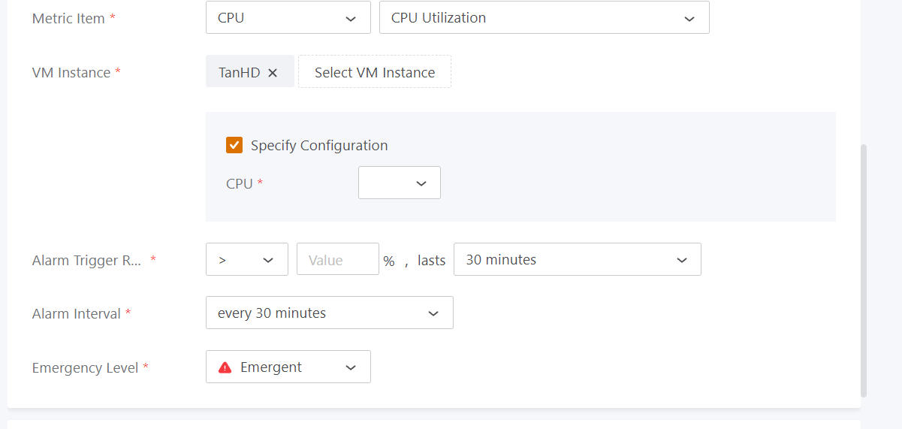
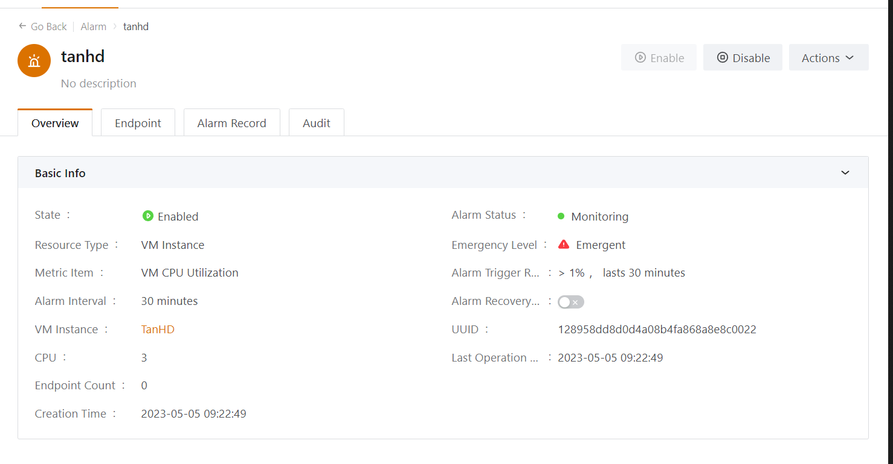

Bài viết này sẽ hướng dẫn bạn cách **Tạo Resource Alarm Trong vCloud.** Nếu bạn cần hỗ trợ, xin vui lòng liên hệ VinaHost qua **Hotline 1900 6046 ext. 3**, email về [support@vinahost.vn](mailto:support@vinahost.vn) hoặc chat với VinaHost qua livechat [https://livechat.vinahost.vn/chat.php](https://livechat.vinahost.vn/chat.php).

Tính năng thông báo "**The Monitoring and Alarm feature monitors time-series data and events**" sẽ gửi thông báo cảnh báo đến các điểm cuối được chỉ định bằng cách sử dụng SNS. Báo động tài nguyên, báo động sự kiện và báo động mở rộng được hỗ trợ. Các điểm cuối được hỗ trợ bao gồm hệ thống, email, DingTalk, ứng dụng HTTP, tin nhắn văn bản và Microsoft Teams.

**Platform O&M -> Alarm Service -> Alarm**

 **** 

**Tạo Alarm Service:**

**Create Resource Alarm**

 **+ Name**

 **+ Resource Type:** Chọn VM hoặc VLAN

**\+ Metric Item:** Chọn CPU, RAM, DISK, NIC

Tùy theo **Metric Item,** sẽ có các lựa chọn theo yêu cầu. Ví dụ: Chọn CPU sẽ có **Select Metric Item** theo yêu cầu:

****

- **Alarm Trigger Rule**: Tùy chọn cấu hình để báo động
- **Alarm Interval**: Tùy chọn thời gian để báo động
- **Emergency Level**: Mức động khẩn cấp báo động

Chúc bạn thực hiện thành công!

> **THAM KHẢO CÁC DỊCH VỤ TẠI [VINAHOST](https://vinahost.vn/)**
> 
> **\>>** [**SERVER**](https://vinahost.vn/thue-may-chu-rieng/) **–** [**COLOCATION**](https://vinahost.vn/colocation.html) – [**CDN**](https://vinahost.vn/dich-vu-cdn-chuyen-nghiep)
> 
> **\>> [CLOUD](https://vinahost.vn/cloud-server-gia-re/) – [VPS](https://vinahost.vn/vps-ssd-chuyen-nghiep/)**
> 
> **\>> [HOSTING](https://vinahost.vn/wordpress-hosting)**
> 
> **\>> [EMAIL](https://vinahost.vn/email-hosting)**
> 
> **\>> [WEBSITE](http://vinawebsite.vn/)**
> 
> **\>> [TÊN MIỀN](https://vinahost.vn/ten-mien-gia-re/)**
